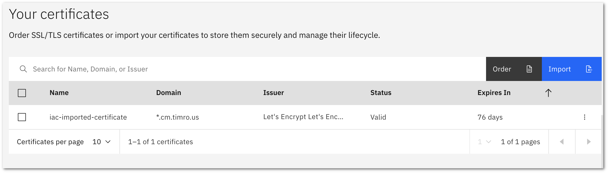
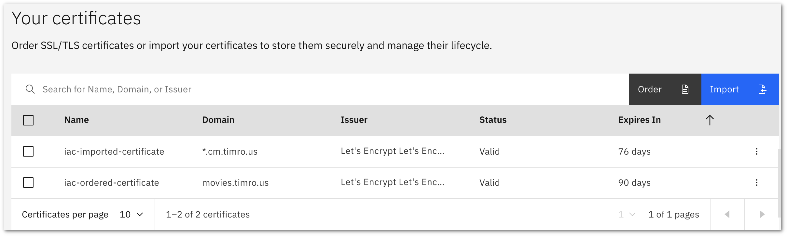

<!--

The pattern to document the resources is like follow:
- Introduce the resource with an example
- List all or the most important input parameters
- If will be used, list the most important output parameters
- Provide instructions to get the value of the input parameters, either using `ibmcloud`, API or the Web console.
- If needed, instructions to execute the code either with Terraform or Schematics

-->

<PageDescription>

Using the IBM Cloud Certificate Manager service

</PageDescription>

Transport Layer Security (TLS) created by the Internet Engineering Task Force (IETF) is a standardized protocol used to protect application data in flight. TLS supports the establishment of trust of the parties in the connection through the use of digital certificates. Secure handling of digital certificates, which are validated (by a Certificate Authority) public keys and their corresponding private keys is an essential capability for a cloud provider platform.

The IBM Cloud [Certificate Manager](https://cloud.ibm.com/catalog/services/certificate-manager) is a free service to help you manage digital certificates used for SSL/TLS connections. This guide will show how to create a Certificate Manager instance, import an existing certificate signed by a public Certificate Authority (CA) and request a new singed certificate from the [Let's Encrypt](https://letsencrypt.org/) CA. Related guides will show how to deploy certificates stored in Certificate Manager to the [VPC Load Balancer](/certificate-management/deploy-to-vpclb) and [Kubernetes Ingress](/certificate-management/deploy-to-iks).

Certificate Manager can order certificates from Let's Encrypt for both individual domain names and wildcard domain names. Certificate Manager provides integration with IBM Cloud Internet Services for automatically configuring responses for domain challenges using the [Automatic Certificate Management Environment](https://tools.ietf.org/html/rfc8555) (ACME) protocol. Additionally, Certificate Manager supports the use of any DNS provider through a Callback URL notification process. This guide will provide an example Cloud Function for processing the notification which can be used as is or further integrated with a DNS provider's API as needed.

The code to manage the Certificate Manager and certificates can be downloaded from the GitHub repository https://github.com/IBM/cloud-enterprise-examples/ in the directory [14-certificate-management/certificate-management](https://github.com/IBM/cloud-enterprise-examples/tree/master/iac/14-certificate-management/certificate-management).

<AnchorLinks small>
  <AnchorLink>Certificate Manager</AnchorLink>
  <AnchorLink>Importing an existing certificate</AnchorLink>
  <AnchorLink>Configuring a certificate notification endpoint</AnchorLink>
  <AnchorLink>Requesting a new certificate</AnchorLink>
</AnchorLinks>

<InlineNotification>

**Requirements**

To be able to execute and complete the instructions in this page, make sure you have an **IBM Cloud account**: if you don't have one yet, you can [create a Lite account](https://cloud.ibm.com/docs/overview?topic=overview-quickstart_lite#prereqs-lite) for free.

These examples will require an internet DNS domain that is managed by the user or can be used with a domain managed by the IBM Cloud Internet Services service.

Also make sure you have the environment setup as explained in the [Setup Environment](/iac/setup-environment) page to have installed the IBM Cloud CLI, logged in to your account with the IBM Cloud CLI and set the `IC_API_KEY` environment variable to a key which has the ability to manage IAM configuration.

</InlineNotification>

## Certificate Manager

The [Certificate Manager](https://cloud.ibm.com/docs/certificate-manager?topic=certificate-manager-getting-started) service instance can be created from the IBM Cloud dashboard or CLI. After the instance is created, it can be fully managed through a dashboard web interface. After the service instance is created, this guide will provide examples of managing certificate import and new certificate ordering using terraform.

Before you run through this example, make sure your Terraform environment is setup correctly as documented in the [environment setup](/iac/setup-environment).

Create a Certificate Manager instance. Begin by logging in to IBM Cloud using the CLI and set the desired resource group and region 

```bash
ibmcloud login
ibmcloud target -g Default -r us-south
ibmcloud resource service-instance-create "iac-certificate-manager" cloudcerts free us-south
```

Make a note of the `ID` returned by the command. It will be of the form `crn:v1:bluemix:public:cloudcerts:us-south:a/{account-id}:{instance-guid}::` Assign this to an envrionment variable `CMID` for later use. This command will work as well if you have `jq` installed.

```bash
CMID=$(ibmcloud resource service-instance iac-certificate-manager --output JSON | jq .[].id | tr -d \")
echo $CMID
```

Alternatively, the certificate manager instance can be created using terraform by creating an `ibm_resource_instance` resource using the service name `cloudcerts` and the `free` plan.

## Importing an existing certificate

Certificate manager can import signed certificates for storage. Either the certificate alone can be imported, or the certificate and the associated private key can be imported. To be able to deploy the certificate to other services, such as the VPC Load Balancer or Kubernetes ingress, the certificate and private key should both be imported. If your certificate requires an intermediate signing certificate, that can be imported at the same time.

Example code to import a certificate, private key and intermediate certificate can be found in the repo in the `14-certificate-managment/import-certificate` folder.

```hcl path=certificate.tf
data "ibm_resource_instance" "cm" {
    name     = "iac-certificate-manager"
    service  = "cloudcerts"
}

resource "ibm_certificate_manager_import" "cert" {
  certificate_manager_instance_id = data.ibm_resource_instance.cm.id
  name                            = "iac-imported-certificate"
  description="Certificate signed by public CA and imported to Certificate Manager"
  data = {
    content = file(var.certfile_path)
    priv_key = file(var.private_keyfile_path)
    intermediate = file(var.intermediate_certfile_path)
  }
}

output "imported-certificate-id" {
  value = ibm_certificate_manager_import.cert.id
}

output "imported-certificate-issuer" {
  value = ibm_certificate_manager_import.cert.issuer
}

output "imported-certificate-expires-on" {
  value = ibm_certificate_manager_import.cert.expires_on
}
```

To use this code, update the file paths in the `variables.tf` file with the local path on the system running terraform to the certificate, key, and intermediate certificate files. Example values are shown for a wildcard certificate on the `cm.timro.us` domain:

```hcl path=variables.tf
variable "certfile_path" { 
  default = "~/certs/PublicCA-demo/wc_cm_timro_us.pem" 
}
variable "private_keyfile_path" { 
  default = "~/certs/PublicCA-demo/wc_cm_timro_us.key"
}
variable "intermediate_certfile_path" { 
  default = "~/certs/PublicCA-demo/wc_cm_timro_us_intermediate.pem" 
}
variable "resource_group" {
  default = "Default"
}
variable "region" {
  default = "us-south"
}
```

<InlineNotification>

To only import the certificate, leave the keyfile and intermediate certificate blank in `variables.tf` and comment the `priv_key` and `intermediate` properties in the `certificate.tf` file.

</InlineNotification>

Import the certificate using Terraform:

```bash
terraform init 
terraform plan 
terraform apply
```

After the certificate is uploaded, you can verify the status by viewing the certificate from the Certificate Manager dashboard:



## Configuring a certificate notification endpoint

The Certificate Manager automates the support lifecycle of certifications through [notifications](https://cloud.ibm.com/docs/certificate-manager?topic=certificate-manager-configuring-notifications). Notifications include messages related to certificate activity like certificate imports, domain requests for new certificates, upcoming certificate expirations, automatic renewals and more. Supported notification integrations are through Slack webhooks and a generic Callback URL.

When setting up [certificate ordering](https://cloud.ibm.com/docs/certificate-manager?topic=certificate-manager-ordering-certificates), Certificate Manager supports two approaches to confirming domain ownership. If you are managing domains using IBM Cloud Internet Services, the service can be [configured to automate](https://cloud.ibm.com/docs/certificate-manager?topic=certificate-manager-ordering-certificates#cis) the domain confirmation process.

For a generic DNS provider, confirming domain ownership is handled through Callback URL notifications. The file `14-certificate-management/functions/cm-callback.js` provides a node.js function that will implement an endpoint to receive the domain request and log the necessary information to implement an ACME `dns-01` style challenge. This code is a simplified version of [example code](https://github.com/ibm-cloud-security/certificate-manager-domain-validation-cloud-function-sample) for integration with the SoftLayer DNS provider.

This code can be deployed as a Cloud Function using the following steps in the IBM Cloud CLI. Begin by installing the cloud functions plugin and then create an IAM namespace for the function.

```bash
ibmcloud plugin install cloud-functions
ibmcloud cloud-functions namespace create iac-functions-01
ibmcloud fn property set --namespace iac-functions-01
```

If you have not already, change to the folder with the `cm-callback.js` file and install it as an action in the namespace and verify that it is installed:

```bash
ibmcloud fn action create cm-callback cm-callback.js --kind nodejs:10 --web true
```

```bash
$ ibmcloud fn action list
actions
/4c87f7d9-ffc9-4d25-863c-8e47d6be4e24/cm-callback                      private nodejs:10
```

Next, add parameters to the action that will specify the allowed Certificate Manager instances that will be allowed to post notifications for domain events and also the region of the Certificate Manager instance for request validation.

```bash
ibmcloud fn action update cm-callback --param allowedCertificateManagerCRNs "{\"$CMID\":true}" --param cmRegion "us-south"
```

Obtain the web endpoint for the action and set this to an envrionment variable CALLBACK_URL

```bash
CALLBACK_URL=$(ibmcloud fn action get cm-callback --url | grep http)
echo $CALLBACK_URL
```

This URL endpoint can be added to the Certificate Manager using the dashboard by navigating to the **Notifications** page and clicking on the **Create** button. Select the "Callback URL" channel type and paste in the URL and save. Note, this step can also be performed [using the api](https://cloud.ibm.com/apidocs/certificate-manager#create-notification-channel).

Verify that your cloud function received the test notification from service (you can re-trigger a notification by clicking on the three vertical dots on the right side of the channel entry and selecting **Test Connection**)

```bash
$ ibmcloud fn activation logs --last
2020-05-30T18:03:56.055864Z    stdout: Cloud function invoked.
2020-05-30T18:03:56.056185Z    stdout: Get public key for instance crn:v1:bluemix:public:cloudcerts:us-south:a06788ee4fd5a4d779f236bbe43f09b4b:d6cad342-cf54-49d3-b5f9-42e842e43c40::
```

With your Callback URL in operation, you can now use Certificate Manager to order a certificate.

## Requesting a new certificate

When using a DNS provider other than IBM Cloud Internet Services, the requested domain challenge must be added to the DNS domain *within 10 minutes* of the certificate order. It's good to verify that you have configured a process that will allow you to add TXT records to the planned domain for the certificate in advance.

Code for ordering a certificate is located in the `14-certificate-management/order-certifcate` folder.

Example code to create a certificate request for the domain name `movies.timro.us` is provided as an example. Edit the `certificate.tf` file to provide a domain name that you can manage.

```hcl path=certificate.tf
data "ibm_resource_instance" "cm" {
    name     = "iac-certificate-manager"
    service  = "cloudcerts"
}

resource "ibm_certificate_manager_order" "cert" {
  certificate_manager_instance_id = data.ibm_resource_instance.cm.id
  name                            = "iac-ordered-certificate"
  description                     = "Certificate ordered using alternate DNS provider"
  domains                         = ["movies.timro.us"]
  rotate_keys                     = false
  domain_validation_method        = "dns-01"
  # dns_provider_instance_crn       = ibm_cis.instance.id  // if not provided CM will use callback
}

output "ordered-certificate-id" {
  value = ibm_certificate_manager_order.cert.id
}

output "ordered-certificate-status" {
  value = ibm_certificate_manager_order.cert.status
}

output "ordered-certificate-expires-on" {
  value = ibm_certificate_manager_order.cert.expires_on
}
```

Configure terraform in the directory and request the certificate. Note, if the Certificate Manager is not able to verify the status of the ACME `dns-01` challenge, the certificate status will stay as **Pending** until the 10 minute period expires.

```bash
terraform init 
terraform plan 
terraform apply
```

From another terminal (the terraform apply request will block) Check the output log from the cloud function (example output shown)

```bash 
$ ibmcloud fn activation logs --last
2020-05-30T18:32:30.830748Z    stdout: Cloud function invoked.
2020-05-30T18:32:30.830893Z    stdout: Get public key for instance crn:v1:bluemix:public:cloudcerts:us-south:a06788ee4fd5a4d779f236bbe43f09b4b:d6cad342-cf54-49d3-b5f9-42e842e43c40::
2020-05-30T18:32:31.037939Z    stdout: Validation requested for domain: movies.timro.us
2020-05-30T18:32:31.037973Z    stdout: TXT record name: _acme-challenge, TXT value: x5_fFA2-dweRRjq5bw4hjGVloS2S6I3-mrkB5pHkHlk
```

At this point, update your DNS domain with the requested record, use a very short TTL (300-600s). Verify the entry:

```bash
$ dig -t TXT +short _acme-challenge.movies.timro.us
"x5_fFA2-dweRRjq5bw4hjGVloS2S6I3-mrkB5pHkHlk"
```

This update will be used for a dry-run verification by Certificate Manager. This will be validated in one or two minutes and a second notification will be sent with a new challenge. Update the domain entry to the new value that is shown in the log for the Cloud Function. This second challenge will be used with Let's Encrypt to create the certificate which usually takes another 2-4 minutes to complete. Retun to monitoring the terraform terminal for status updates.

If the creation of the certificate is successful, the following will be displayed from the terminal with the terraform cli:

```text
Apply complete! Resources: 1 added, 0 changed, 0 destroyed.

Outputs:

ordered-certificate-expires-on = 1598637993000
ordered-certificate-id = crn:v1:bluemix:public:cloudcerts:us-south:a/06788ee4fd5a4d779f236bbe43f09b4b:d6cad342-cf54-49d3-b5f9-42e842e43c40:certificate:df56720b1dab1db089f73d0fd8d6ad20
ordered-certificate-status = valid
```

When this message appears, you may remove the TXT record for your domain. The certificate is ready for deployment from Certificate Manager. Both certificates are now visible in the service dashboard.



Although these certificates could be removed at this point using `terraform destroy`, do not perform this action if you plan to continue with the other deployment examples to [VPC Load Balancer](/certificate-management/deploy-to-vpclb) and [Kubernetes Ingress](/certificate-management/deploy-to-iks).
