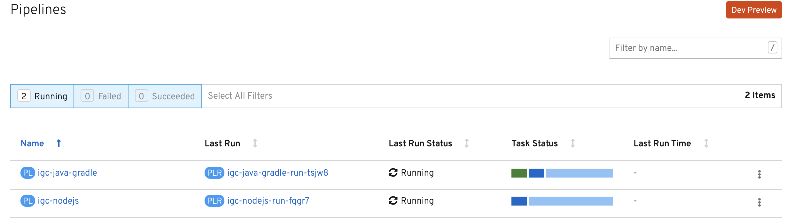
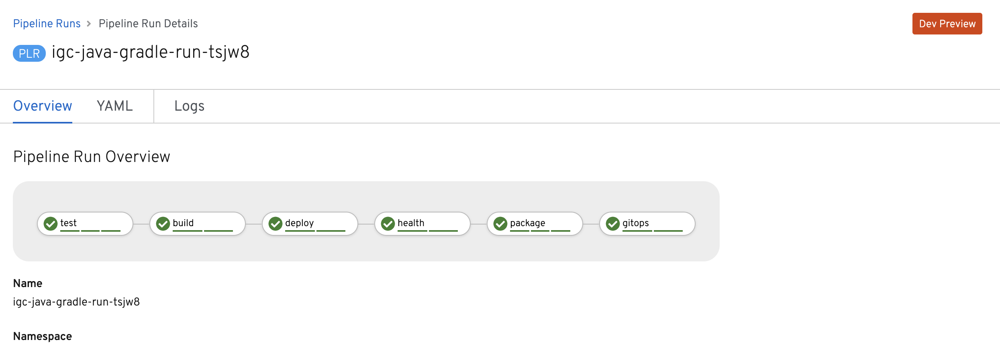
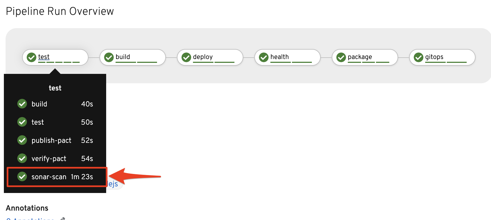
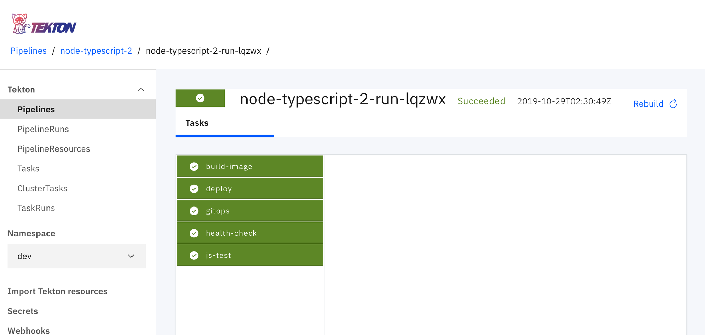

import Globals from 'gatsby-theme-carbon/src/templates/Globals';

<PageDescription>

Use Jenkins or Tekton to automate your continuous integration build process for your code

</PageDescription>

In IBM Garage Method, one of the Develop practices is [continuous integration](https://www.ibm.com/garage/method/practices/code/practice_continuous_integration/). The <Globals name="env" /> uses a Jenkins or Tekton pipeline to automate continuous integration.

## What is continuous integration

Continuous integration is a software development technique where software is built regularly by a team in an automated fashion.
This quote helps explain it:

> Continuous Integration is a software development practice where members of a team integrate their work frequently,
> usually each person integrates at least daily - leading to multiple integrations per day.
> Each integration is verified by an automated build (including test) to
> detect integration errors as quickly as possible. Many teams find that this approach leads to significantly
> reduced integration problems and allows a team to develop cohesive software more rapidly
> <cite>– Martin Fowler</cite>


<Tabs>

<Tab label="What is Jenkins">

## What is Jenkins

[Jenkins](https://jenkins.io/) is a self-contained, open source automation server that can be used to automate all sorts of tasks related to building, testing, and delivering or deploying software.
It is a perfect tool for helping manage continuous integration tasks for a wide range of software components.

Jenkins Pipeline (or simply "Pipeline") is a suite of plugins that supports implementing and integrating continuous delivery pipelines into Jenkins.

A continuous delivery pipeline is an automated expression of your process for getting software from version control right through to your users and customers.

Jenkins Pipeline provides an extensible set of tools for modeling simple-to-complex delivery pipelines "as code." The definition of a Jenkins Pipeline is typically written into a text file (called a [Jenkinsfile](https://jenkins.io/doc/pipeline/tour/hello-world/)) that in turn is checked into a project’s source control repository.

### Pipelines

Pipelines offer a set of stages or steps that can be chained together to allow a level of software
automation. This automation can be tailored to the specific project requirements.

You can read more information about Jenkins Pipelines [here](https://jenkins.io/doc/book/pipeline/)

### Stages

Pipelines are defined in a `Jenkinsfile` that sits in the root of your application code. It defines a number of stages. Each of the [<Globals name="templates" />](/codepatterns/overview) includes a `Jenkinsfile` that offers a number of stages. The stages have been configured to complete the build, test, package, and deploy of the application code. Each stage can use the defined defined `secrets` and `config maps` that were previously configured during the installation of Development cluster setup.

## Developer Tools Pipeline

To enable application compatibility between Kubernetes and OpenShift, the `Jenkinsfile` is consistent between pipeline registration with
both platforms. Also, the Docker images are built from
[UBI images](https://www.redhat.com/en/blog/introducing-red-hat-universal-base-image)
so that their containers can run on both platforms.

These are the stages in the pipeline and a description of what each stage does. The **bold stage names** indicate
the stages that are required; the ***italics stage names*** indicate optional stages that can be deleted or will be ignored if the tool
supporting the stage is not installed. These stages represent a typical production pipeline flow for a cloud-native application.
- **Setup**: Clones the code into the pipeline
- **Build**: Runs the build commands for the code
- **Test**:	Validates the unit tests for the code
- ***Publish pacts***:	Publishes any pact contracts that have been defined
- ***Sonar scan***: Runs a sonar code scan of the source code and publishes the results to SonarQube
- **Verify environment**: Validates the OpenShift or IKS environment configuration is valid
- **Build image**: Builds the code into a Docker images and stores it in the IBM Cloud Image registry
- **Deploy to DEV env**:	Deploys the Docker image tagged version to `dev` namespace using Helm Chart
- **Health Check**: Validates the Health Endpoint of the deployed application
- ***Package Helm Chart***: Stores the tagged version of the Helm chart in Artifactory
- ***Trigger CD Pipeline***: This is a GitOps stage that will update the build number in designated git repo and trigger ArgoCD for deployment to **test**

## Registering Pipelines

- The [<Globals name="templates" />](/ci-cd/cloud-native-codepatterns) are a good place to start to see how `Jenkinsfile` and `Dockerfile` should be configured for use in a Jenkins CI pipeline. To register your git repo, use the CLI. The CLI tools adds a new command called `kubectl pipeline`, This command automates a number of manual steps you would have to do with Jenkins, including: managing secrets, webhooks, and pipeline registration in the Jenkins tools.

- By default, the pipeline will register into the current namespace and will copy all the `configMaps` and `secrets` from the `tools` namespace to this namespace. This means the pipeline can execute, knowing it has access to the key information that enables it to integrate with both the cloud platform and the various development tools.

### Registering Pipeline in new namespace

- You can use any namespace you want to register a pipeline. Using the `kubcectl sync` command it will created you a new namespace for your team. It will copy the necessary `secrets` and `configMaps` into that namespace and configure the build agents pods to run in that namespace.
    ```bash
    kubectl sync dev-team-one --dev
    ```
- You can structure multi teams squads, teams, pairs or students working in the same Development cluster given them their own namespace to work in for CI activities.

- Create a template app and clone it to your Cloud Shell environment
- Then register the code with the Jenkins environment using the following command
    ```bash
    kubectl pipeline
    ```
- You will be prompted for you Git Hub Personal Access token

- It will complete with the registration of the application code in a Jenkins pipeline

## Continuous deployment

In addition to continuous integration, the <Globals name="env" /> also supports continuous delivery
using Artifactory and ArgoCD.

</Tab>

<Tab label="What is Tekton">

## What is Tekton

Tekton is a new emerging CI tool that has been built to support Kubernetes and OpenShift from the ground up.

[Tekton](https://tekton.dev/) is a powerful yet flexible Kubernetes-native open-source framework for creating continuous integration and delivery (CI/CD) systems. It lets you build, test, and deploy across multiple cloud providers or on-premises systems by abstracting away the underlying implementation details.

### Tekton 101

<iframe width="80%" height="315" src="https://www.youtube.com/embed/TWxKD9dLpmk" frameborder="0" allow="accelerometer; autoplay; encrypted-media; gyroscope; picture-in-picture" allowfullscreen></iframe>

Tekton provides open-source components to help you standardize your CI/CD tooling and processes across vendors, languages, and deployment environments. Industry specifications around pipelines, releases, workflows, and other CI/CD components available with Tekton will work well with existing CI/CD tools such as Jenkins, Jenkins X, Skaffold, and Knative, among others.

- Read the this this [Overview of Tekton](/guides/continuous-integration-tekton-crc#what-is-tekton)

- For more information read up about it [Tekton Tutorial](https://developer.ibm.com/tutorials/knative-build-app-development-with-tekton/)

- For more information read up about it [App Build Tutorial with Tekton](https://developer.ibm.com/tutorials/knative-build-app-development-with-tekton/)

The IBM Cloud is standardizing on using Tekton in both IBM Cloud DevOps
 service and IBM Cloud Pak for Applications. OpenShift 4.x will also natively
  support it.

This guide will focus on using Tekton when the Development tools have been
 installed in Red Hat OpenShift, IBM Kubernetes Managed services and **Red Hat
  Code Ready Containers** to give you choice for you Continuous Integration
   cloud native development toolset.

<InlineNotification>

**Note:** This guide will help you set up the [<Globals name="templates" />](/codepatterns/overview) with  **Tekton** and requires that you have installed Tekton with **Red Hat Code Ready Containers 4.2** or have installed open source Tekton into the The IBM Kubernetes Cluster.

</InlineNotification>

### Common App Tasks

The following gives a description of each `Task` that is commonly used in a
 `Pipeline`. The *Optional* stages can be deleted or ignored if the tool support it is not installed. These stages represent a typical production pipeline flow for a Cloud Native application.

- **Setup** clones the code into the pipeline
- **Build** runs the build commands for the code
- **Test**	validates the unit tests for the code
- **Publish pacts**	(*optional*) publishes any pact contracts that have been defined
- **Verify pact** (*optional*) verifies the pact contracts
- **Sonar scan** (*optional*) runs a sonar code scan of the source code and publishes the results to SonarQube
- **Build image** Builds the code into a Docker images and stores it in the IBM Cloud Image registry
- **Deploy to DEV env**	Deploys the Docker image tagged version to `dev` namespace using Helm Chart
- **Health Check** Validates the Health Endpoint of the deployed application
- **Package Helm Chart** (*optional*) Stores the tagged version of the Helm chart into Artifactory
- **Trigger CD Pipeline** (*optional*) This is a GitOps stage that will
 update the build number in designated git repo and trigger ArgoCD for
  deployment to **test** namespace

### Install Tekton

Tekton can be installed in both Red Hat OpenShift and IBM Kubernetes manage
 clusters and RedHat Code Ready Containers. To install the necessary
  components follow the steps below.

<Tabs>


<Tab label="OpenShift 4.x">

### Install on OpenShift 4.x

- If you have installed the CNCF Cloud Native Toolkit with Schematics this will install the Tekton Pipeline operator into your cluster this will automatically for you.

</Tab>

<Tab label="Kubernetes">

### Install Tekton on IBM Kubernetes Managed Service
- Install Tekton via Knative add-on (can be found in the **Add On** tab in
 the Kubernetes managed service dashboard)
, it includes
 Tekton support by default and the Webhook extension.
- Install [Tekton Dashboard](https://github.com/tektoncd/dashboard#install-dashboard) follow the instructions in the `README.md`
- Add Ingress endpoint for the **Tekton Dashboard** add a host name that uses
 the IKS cluster subdomain
    ```yaml
      apiVersion: extensions/v1beta1
      kind: Ingress
      metadata:
        name: tekton-dashboard
        namespace: tekton-pipelines
      spec:
        rules:
        - host: tekton-dashboard.showcase-dev-iks-cluster.us-south.containers.appdomain.cloud
          http:
            paths:
            - backend:
                serviceName: tekton-dashboard
                servicePort: 9097
    ```

- Install [Tekton Webhook Extension](https://github.com/tektoncd/experimental/tree/master/webhooks-extension#install-webhook-extension)

</Tab>

</Tabs>

### Setup Tekton

- Install Tekton pipelines and tasks into the `dev` namespace following the
 instructions in the repository [ibm-garage-tekton-tasks](https://github.com/IBM/ibm-garage-tekton-tasks)
- Install the `Tasks`
    ```bash
    kubectl create -f ibm-garage-tekton-tasks/tasks/ -n dev
    ```
- Install the `Pipelines`
    ```bash
    kubectl create -f ibm-garage-tekton-tasks/pipelines/ -n dev
    ```

### Configure namespace for development

- Install the Tekton CLI `tkn` https://github.com/tektoncd/cli

- Create a new namespace (ie `dev-{initials}`) and copy all config and secrets
  ```
  oc sync dev-team-one --dev
  ```
- Set your `new-namespace` the current namespace context
  ```
  oc project dev-team-one
  ```

- The template `Pipelines` provided support for `Java` or `Node.js` based apps. You can configure your own custom `Tasks` for other runtimes. There are a number of default `Tasks` to get you started they are detailed above. To create an application use one of the provided [<Globals name="templates" />](/cloud-native-codepatterns) these templates work seamlessly with the `Tasks` and `Pipelines` provided.

### Register the App with Tekton

With Tetkon enabled and your default `Tasks` and `Pipelines` installed into
 the `dev` namespace. You can now configure your applications to be built, packaged, tested and deployed to your OpenShift or Kubernetes development cluster.

- Create to the pipeline.  for details about how the `pipeline` command works.)

    ```bash
    oc pipeline
    ```

### Verify the pipeline

To validate your pipeline have been correctly configured, and has triggered a
 `PipelineRun`
 use the following **Tekton** dashboards or `tkn` CLI to validate it ran
  correctly without errors.

<Tabs>
<Tab label="OpenShift 4.x">

- Review you **Pipeline** in the OpenShift 4.x Console

    

- Review your **Tasks**

    

- Review your **Steps**

    

</Tab>
<Tab label="Opensource Tekton Dashboard">

If you are running Tekton with IBM Cloud Pak for Applications or Knative with
 Kubernetes managed service your dashboard view will look similar to below.

- Review your **Pipeline**

    

</Tab>

<Tab label="Tekton CLI">

If you are running **Tekton** with IBM Cloud Pak for Applications or Knative
 with Kubernetes managed service your dashboard view will look similar to below.

- Review your **Pipeline**
    ```bash
    tkn pipelinerun list
    ```
- Review **Pipeline** details
    ```bash
    tkn pipelinerun describe {pipeline-name}
    ```

</Tab>
</Tabs>


</Tab>

</Tabs>

### Running Application

Once the **Jenkins** or **Tekton** pipeline has successfully completed you can validate your
 app has been successfully deployed.

- Open the Kubernetes Dashboard or OpenShift Console and select the {new-namespace} project

- Get the hostname for the application from ingress
    ```bash
    kubectl endpoints -n {new-namespace}
    ```
- You can use the the `oc` command to get the name of the deployed application
    ```bash
    oc endpoints -n {new-project}
    ```

- Use the application URL to open it your browser for testing

- For more information read the [Pipeline Test Instructions](cloud-native-deploy)

Once you become familiar with deploying code into OpenShift using **Tekton**, read up about how you can manage code deployment with **Continuous Delivery** with [ArgoCD and Artifactory](cloud-native-cd)
