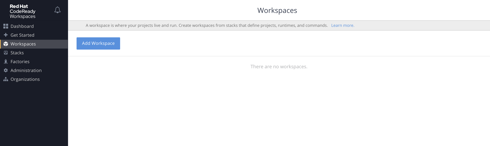
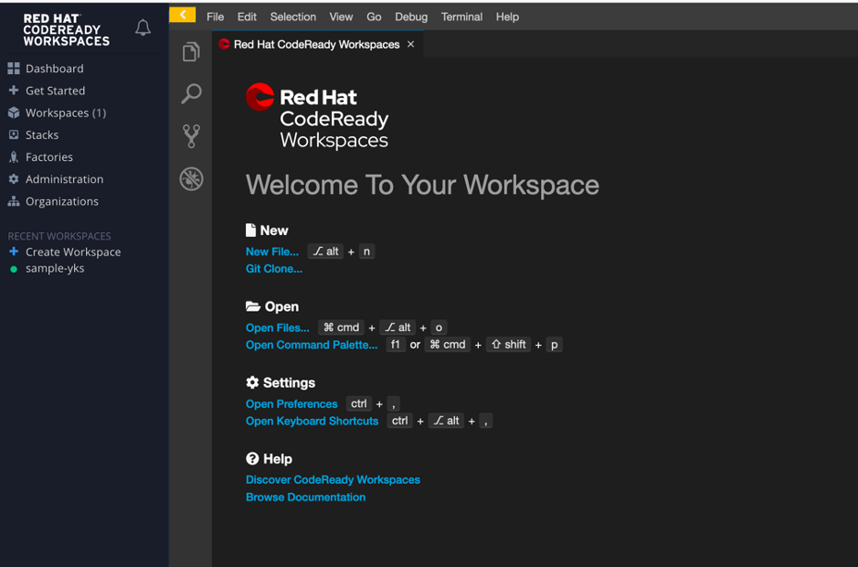
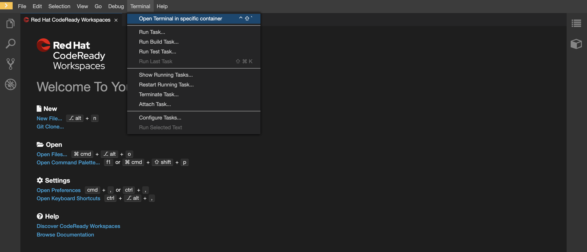
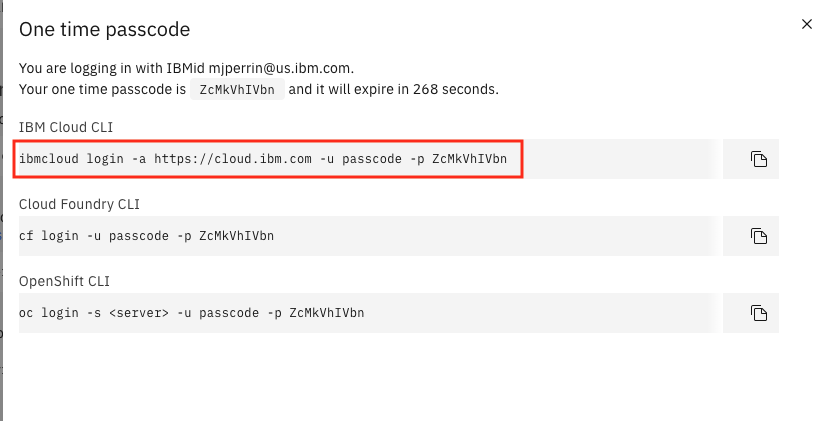
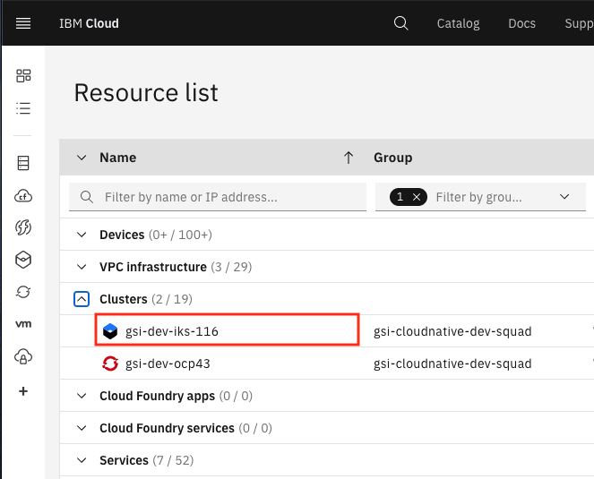
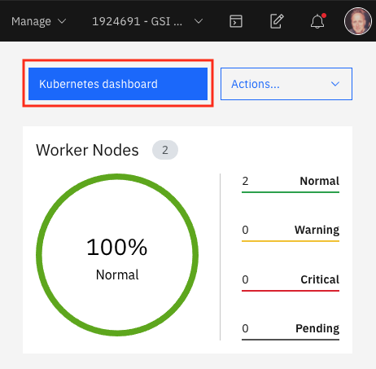
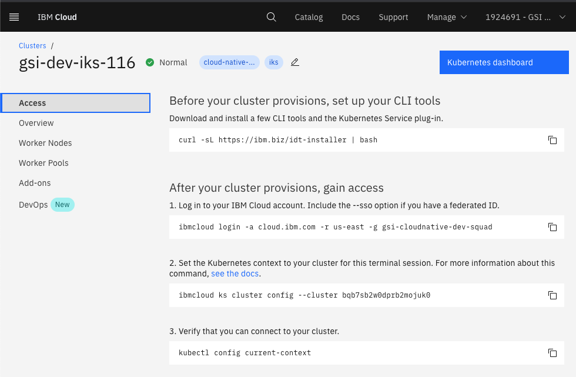
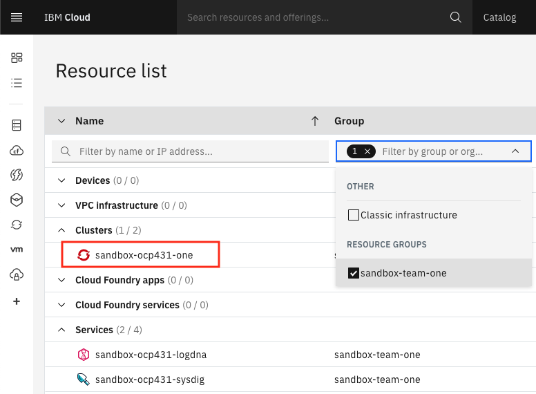
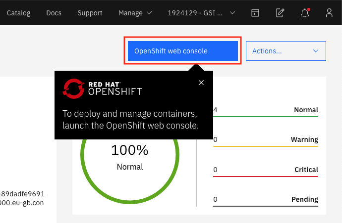
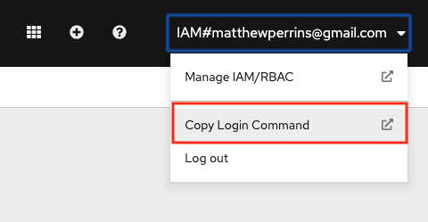

To prepare to use the CNCF DevOps tools you need to prepare a development client. This can be either your desktop, the IBM Cloud Shell or when using OpenShift you can use Cloud Ready Workspaces.

- If you are going to use your desktop/laptop follow
 the instructions in Desktop/Laptop tab. You will require a modern MacOS or
  Windows 10 operating systems for he Desktop/Laptop option
- If you cannot install tools on your desktop/laptop, follow the Cloud Shell
 instructions
- If you want to try the full web IDE experience, then follow the Code Ready
 Workspaces setup instructions

Once you have completed these setup requirements you will be ready to
 deploy you first application with a CI/CD pipeline that supports Code scanning.

<Tabs>

<Tab label="Cloud Shell">

## Config Cloud Shell

IBM Cloud Shell is instantly accessible from your IBM Cloud account — no other installation is needed.

IBM Cloud Shell is a free service from IBM which gives you complete control of your cloud resources, applications and infrastructure, from any web browser.

Features of IBM Cloud Shell include:

- Preconfigured environment
IBM Cloud Shell provides a curated, cloud-based workspace with dozens of preinstalled tools and programming languages. It automatically authenticates to your IBM Cloud account so you can get right to work.

- File upload/download
Utilize file upload/download functionality to import files to IBM Cloud Shell, or pull down data to your local machine.

- Multiple sessions
Use up to five shell sessions at a time to maximize your productivity. Mirror workflows on your local machine, or view logs on one session while editing a file in another

### Set up Cloud Shell
- Login to IBM Cloud console (cloud.ibm.com), if not already done

- Invoke Cloud shell by clicking on the button at the top right hand corner of the browser window
    

- Install [IBM Garage Cloud Toolkit CLI](https://cloudnativetoolkit.dev/getting-started/cli) by running the following commands on the just newly opened terminal:
    ```bash
    git clone https://github.com/ibm-garage-cloud/cloud-shell-commands.git
    export PATH=~/cloud-shell-commands:$PATH
    source ./cloud-shell-commands/install-igc
    ```
- This CLI adds a number of alias commands to `kubectl` and `oc` including `sync`,`pipeline` and `endpoints`

- Successful execution will look like this.
    ```bash
    $ git clone https://github.com/ibm-garage-cloud/cloud-shell-commands.git
    Cloning into 'cloud-shell-commands'...
    remote: Enumerating objects: 50, done.
    remote: Counting objects: 100% (50/50), done.
    remote: Compressing objects: 100% (44/44), done.
    remote: Total 50 (delta 23), reused 14 (delta 4), pack-reused 0
        Unpacking objects: 100% (50/50), done.
    Checking connectivity... done.
    $ export PATH=~/cloud-shell-commands:$PATH
    $ source ./cloud-shell-commands/install-igc
    npm WARN deprecated request@2.88.2: request has been deprecated, see https://github.com/request/request/issues/3142
    /home/abalasu1/.npm/bin/kubectl-dashboard -> /home/abalasu1/.npm/lib/node_modules/@ibmgaragecloud/cloud-native-toolkit-cli/dist/script-dashboard.js
    /home/abalasu1/.npm/bin/kubectl-enable -> /home/abalasu1/.npm/lib/node_modules/@ibmgaragecloud/cloud-native-toolkit-cli/dist/script-enable.js
    /home/abalasu1/.npm/bin/kubectl-credentials -> /home/abalasu1/.npm/lib/node_modules/@ibmgaragecloud/cloud-native-toolkit-cli/dist/script-credentials.js
    /home/abalasu1/.npm/bin/igc -> /home/abalasu1/.npm/lib/node_modules/@ibmgaragecloud/cloud-native-toolkit-cli/dist/script.js
    /home/abalasu1/.npm/bin/kubectl-endpoints -> /home/abalasu1/.npm/lib/node_modules/@ibmgaragecloud/cloud-native-toolkit-cli/dist/script-endpoints.js
    /home/abalasu1/.npm/bin/kubectl-git-secret -> /home/abalasu1/.npm/lib/node_modules/@ibmgaragecloud/cloud-native-toolkit-cli/dist/script-git-secret.js
    /home/abalasu1/.npm/bin/kubectl-igc -> /home/abalasu1/.npm/lib/node_modules/@ibmgaragecloud/cloud-native-toolkit-cli/dist/script.js
    /home/abalasu1/.npm/bin/kubectl-pipeline -> /home/abalasu1/.npm/lib/node_modules/@ibmgaragecloud/cloud-native-toolkit-cli/dist/script-pipeline.js
    /home/abalasu1/.npm/bin/kubectl-sync -> /home/abalasu1/.npm/lib/node_modules/@ibmgaragecloud/cloud-native-toolkit-cli/dist/script-namespace.js
    /home/abalasu1/.npm/bin/kubectl-tool-config -> /home/abalasu1/.npm/lib/node_modules/@ibmgaragecloud/cloud-native-toolkit-cli/dist/script-tool-config.js

    > jsonpath@1.0.2 postinstall /home/abalasu1/.npm/lib/node_modules/@ibmgaragecloud/cloud-native-toolkit-cli/node_modules/jsonpath
    > node lib/aesprim.js > generated/aesprim-browser.js

    npm WARN ws@7.2.5 requires a peer of bufferutil@^4.0.1 but none is installed. You must install peer dependencies yourself.
    npm WARN ws@7.2.5 requires a peer of utf-8-validate@^5.0.2 but none is installed. You must install peer dependencies yourself.

    + @ibmgaragecloud/cloud-native-toolkit-cli@0.5.3
    added 311 packages from 358 contributors in 50.079s
    ```
- Check the version of the CLI commands
    ```bash
    $ kubectl sync --version
    0.5.3
    ```

</Tab>

<Tab label="Desktop/Laptop">

## Install CLIs and tools

The following is a list of desktop tools required to help with installation and development.

- [Git Client](https://git-scm.com/): Needs to be installed in your development operating system, it comes as standard for Mac OS

- [IBM Cloud CLI](https://cloud.ibm.com/docs/cli?topic=cloud-cli-getting-started): Required for management of IBM Cloud Account and management of your managed IBM Kubernetes and Red Hat OpenShift clusters
    - Don't install just the [IBM Cloud CLI](https://cloud.ibm.com/docs/cli?topic=cloud-cli-install-ibmcloud-cli), install the [IBM Cloud CLI and Developer Tools](https://cloud.ibm.com/docs/cli?topic=cloud-cli-getting-started#step1-install-idt)
    ```
    curl -sL https://ibm.biz/idt-installer | bash
    ```
    - Note: If you log in to the web UI using SSO, you'll need to [create an API key](https://cloud.ibm.com/docs/iam?topic=iam-federated_id) for logging into the CLI. (You can also use this API key for [installing the Developer Tools environment](/admin/installation-ibm-cloud).)

- [OpenShift OC CLI](https://www.okd.io/download.html): Required for Red Hat OpenShift management and development
    - Place `oc` and `kubectl` in your Terminal `PATH`

    - #### MacOS/Linux
    - Once downloaded navigate to Download folder
    ```
    cd ~/Downloads/openshift-origin-client-tools-v3/
    ```
    - Then copy `oc` and `kubectl` to the system-wide available scripts folder (which is already in your PATH)
    ```
    cp kubectl /usr/local/bin/kubectl
    cp oc /usr/local/bin/oc
    ```

    <InlineNotification >

     Depending on your MacOS security settings you may need to allow access to `oc` and `kubectl`, go to `System Preferences`=>`Security & Privacy` and press `Allow Anyway`*

    </InlineNotification>

- [Docker Desktop](https://www.docker.com/products/docker-desktop): Required for running common tools and [Developer Tools Image](https://ibm-garage-cloud.github.io/ibm-garage-developer-guide/guides/tools-image)
    - Installed and running on your local machine

- [Node](https://nodejs.org/en/): Required for running the [IBM Garage for Cloud CLI](https://ibm-garage-cloud.github.io/ibm-garage-developer-guide/getting-started/cli)
    - Installed on your local machine
    - Recommended `v12.x LTS`

- [IBM Garage for Cloud CLI](https://ibm-garage-cloud.github.io/ibm-garage-developer-guide/getting-started/cli): Used to help make working with the development tools as easy as possible
    ```
    npm i -g @ibmgaragecloud/cloud-native-toolkit-cli
    ```
    - This will install a number of alias functions into `kubectl` and `oc` CLI tools including `sync`,`pipeline` and `endpoints`

- [Tekton CLI](https://github.com/tektoncd/cli): Used to help control Tekton
 pipelines from the command line.
    ```
    brew tap tektoncd/tools
    brew install tektoncd/tools/tektoncd-cli
  ```

- [Visual Studio Code](https://code.visualstudio.com/download): A popular code editor
    - You will be required to edit some files, having a good quality editor is always best practice
    - Enabling [launching VSCode from a terminal](https://code.visualstudio.com/docs/setup/mac#_launching-from-the-command-line)

- [JDK 11](https://www.oracle.com/technetwork/java/javase/downloads/jdk11-downloads-5066655.html): _Optional_ installed on your local machine
    - Used for SpringBoot content

</Tab>

<Tab label="Cloud Ready Workspaces">

## Code Ready Workspace
CodeReady Workspaces is a developer workspace server and cloud IDE. Workspaces are defined as project
code files and all of their dependencies necessary to edit, build, run, and debug them. Each workspace
has its own private IDE hosted within it. The IDE is accessible through a browser. The browser downloads
the IDE as a single-page web application.
CodeReady Workspaces will enable a 100% developer experience to
be delivered from a users browser.

 Red Hat CodeReady Workspaces provides:
 - Workspaces that include runtimes and IDEs
 - RESTful workspace server
 - A browser-based IDE
 - Plugins for languages, framework, and tools
 - An SDK for creating plugins and assemblies

### CRW in Workshop
CodeReady Workspaces includes a powerful in-browser IDE with support for Microsoft Visual Studio Code
extensions. As part of the workshop, we need only a machine capable of running a web browser through
which CRW will provide an integrated environment to access the code repo, and the build environment to
develop the code and then  test, and deploy on an OpenShift environment

### Setting up your Workspace on CRW

- Login to the Openshift Cluster through the Web console, where the Code ready workspace is setup.

- Access the Code Ready Workspace through the appropriate Code ready workspace URL that would have been shared.
**Note**:If the code ready workspace is configured through openshiftoAuth, You can access the above URL, once you have logged into the Openshift Cluster

- If you are accessing it for the first time you need register as the registration page will be shown. User name can contain only these characters (0-9, a-z and hypen in between).
Ensure you provide details regarding username, Email, First name and Last name (If SSO is not configured, you need to provide the password as well.

- Navigate to  the default Code Ready Workspace link  on your browser as shown in below picture.

  


- You can create the workspace by selecting one of the template stacks as shown in Step 4. Alternatively, navigate to the Workspace and click on the "Add Workspace" button.

  


- Provide the workspace as part of the Name field. Click on "Remove" button in the Projects section to remove the project template.
Basically, we are going to create an empty project.

  

- Click on "Create and Open" button to create and load the workspace. Workspace will start loading. This may take a few minutes as the Container and plug-ins related to the stack has to be created and deployed.

- Once the workspace is  created and loaded, you can see a vscode editor.

  


- Go to "Terminal" menu and select "Open Terminal in specific container".

  


- Select the "Developer Container".

- Install igc by running the following commands on the just newly opened terminal:
    ```bash
    git clone https://github.com/ibm-garage-cloud/cloud-shell-commands.git
    export PATH=~/cloud-shell-commands:$PATH
    source ./cloud-shell-commands/install-igc
    ```
    Successful installation will look something like this.

    

</Tab>


</Tabs>

## Log into IBM Cloud

- Use `ibmcloud` CLI command line to log into the cloud account. Replace the user_id, password and team name in the sandbox name
    ```bash
    ibmcloud login -u <user_id> -p <password> -g <resource group>.. -r <region>
    ```
- The fastest way to login the IBM Cloud is to select the **Log in to CLI and API** menu

    

- Use the command for **IBM Cloud**

    

## Access the Cluster

The follow steps enable you to operate the IBM managed cluster using IBM Cloud Shell

<Tabs>

<Tab label="Kubernetes">

## Log into Kubernetes Cluster

- Log into the Kubernetes cluster from the cloud console

    

- Access the Kubernetes dashboard by clicking on the button

    

- Follow the steps to log in Kubernetes cluster

    

</Tab>

<Tab label="OpenShift">

## Log into OpenShift Cluster

- Log into the openshift cluster from the cloud console

    

- Access the openshift console by clicking on the button

    

- Get the login command with token to login to the openshift from command line

    

- Execute the login command copied in the last step in the terminal
    ```bash
    $ oc login --token=qvARHflZDlOYfjJZRJUEs53Yfy4F8aa6_L3ezoagQFM --server=https://c103-e.us-south.containers.cloud.ibm.com:30979
    Logged into "https://c103-e.us-south.containers.cloud.ibm.com:30979" as "IAM#email@company" using the token provided.

    You have access to 71 projects, the list has been suppressed. You can list all projects with 'oc projects'

    Using project "dev-ab".
    $
    ```

</Tab>

</Tabs>


## Configure git

You need to configure your get identity so you are able to clone code into your cloud shell.

- Execute the following commands

  ```
  git config --global user.email "<email>"
  git config --global user.name "<short_name>"
  ```
