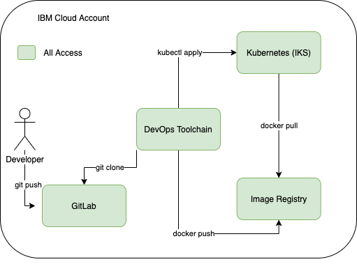
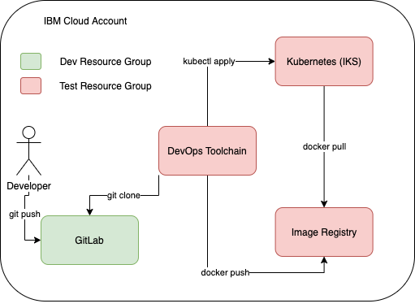
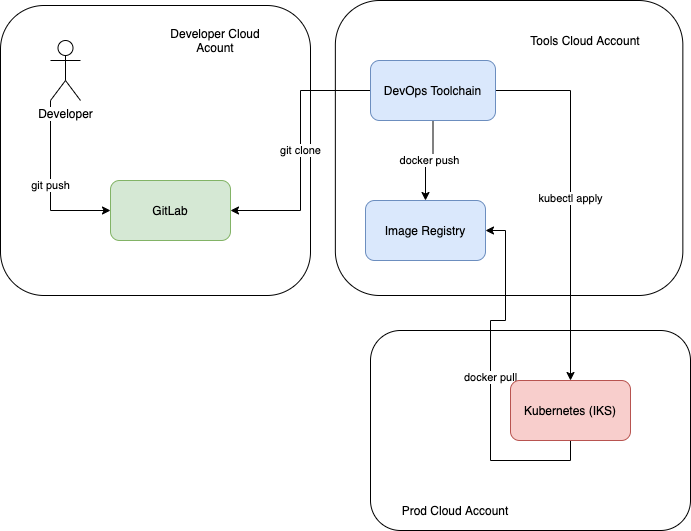
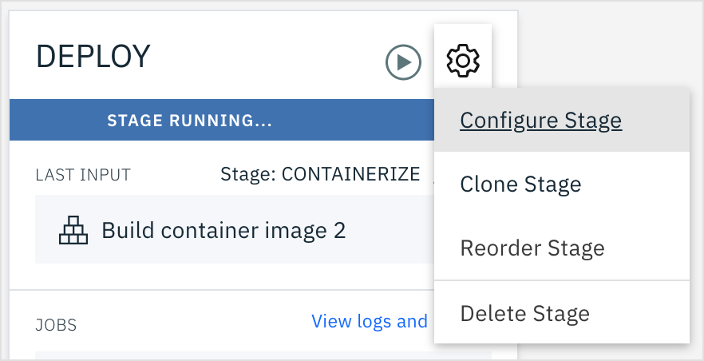
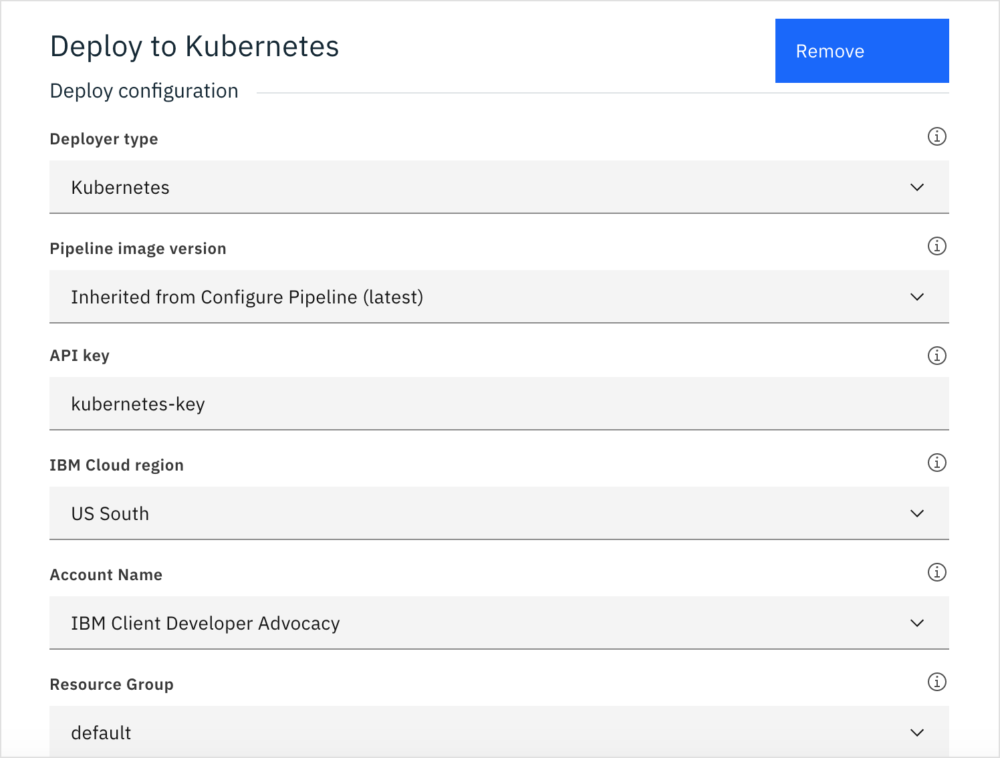

<PageDescription>

Cross Account Pipelines with IBM Cloud Toolchain

</PageDescription>

<AnchorLinks small>
  <AnchorLink>Overview</AnchorLink>
  <AnchorLink>Setting up access to production kubernetes cluster</AnchorLink>
</AnchorLinks>


## Overview
The toolchain brings together many resources. A git repo, the Docker Registry, a Kubernetes Cluster and the toolchain itself.

Everything created in the environment setup so far was done using a single IAM role, in a single resource group, in a single IBM Cloud Account. 


    

A powerful way to organize access is to put different IBM Cloud Resources into different **Resource Groups**.  


       

For admin level or a higher level of isolation, it is common to put a production cluster in a different IBM Cloud Account from all other environments.

    

## Setting up access to production kubernetes cluster
- Login into a second IBM Cloud Account, this will be "Production". 
You will need to configure and create a k8s cluster by following [these instructions](../deploy-iks/setup-environment).
As a quick reference you can run the following command to create a cluster on VPC Gen 2.

```bash
$ ibmcloud ks cluster create vpc-gen2 --flavor FLAVOR --name NAME --subnet-id ID --vpc-id ID --zone ZONE
``` 

- Create an API Key to access your cluster

```bash
$ ibmcloud iam api-key-create kubernetes-key
Creating API key kubernetes-key under e65910fa61ce9072d64902d03f3d4774 as John.Zaccone@ibm.com...
OK
API key kubernetes-key was created

Please preserve the API key! It cannot be retrieved after it's created.
                 
ID            ApiKey-0159e477-07d7-409d-ac84-c366528b6c65   
Name          kubernetes-key   
Description      
Created At    2020-05-12T17:44+0000   
API Key       XXXXXXXXXXXX   
Locked        false
```

<InlineNotification>
This will create a new API key that allows anyone who has it the ability to do anything you could do. 
To make things more secure, you will want to create a service ID API key that limits access to only what your pipeline requires.
The following steps apply for any API key you create that has access to the Kubernetes cluster that you want to deploy to.
</InlineNotification>

- Log into the first account. This will be our "Tools" environment, where our pipeline lives, and where we will use the key to our Kubernetes cluster.

- Find the **DevOps** page from the upper-left handside menu. Open the Toolchain you created earlier

- Next to the **Deploy**, click the **Configure** icon

    

- Change the **API Key** to the value you generated for your production cluster

    

- Save the values and rerun the Deploy stage to see the app deployed to your production cluster in your other account.