<PageDescription>

IBM Cloud Toolchain: Managed Devops for Schematics/Terraform

</PageDescription>

IBM Cloud Schematics uses the open source Terraform provisioning engine to do Infrastructure as Code (IaC).
One of the features of IBM Cloud Schematics is the ability to link an IBM Cloud Toolchain to the Schematics workspace which will enable continious delivery.
By enabling continious delivery we enable a **GitOps** workflow- 
the git source repository which holds our terraform code defines the desired state of our infrastructure/applications. 
Changes to this repository will trigger immediate action to adjust the actual state of our infrastructure/applications to match the 
updated desired state in our git repository.

For more information on Schematics workspace on IBM Cloud, visit the [IBM Cloud Schematics](../iac/schematics) section.


In this section we will outline the process to enable continuous delivery and GitOps for an IBM Cloud Schematics workspace.


<AnchorLinks small>
  <AnchorLink>Fork Terraform Scripts</AnchorLink>
  <AnchorLink>Create Schematics Workspace</AnchorLink>
  <AnchorLink>Enable Continuous Delivery for Schematics</AnchorLink>
  <AnchorLink>Triggering a Change</AnchorLink>
</AnchorLinks>

## Fork Terraform Scripts

- Fork a copy of `https://github.com/jzaccone/iac-pattern-guide/` to your own github account. You will edit this code later to trigger a kickoff of the CD pipeline

## Create Schematics Workspace

- From the upper lefthand menu, go to **Schematics**


- On the Workspaces page, click **Create workspace**

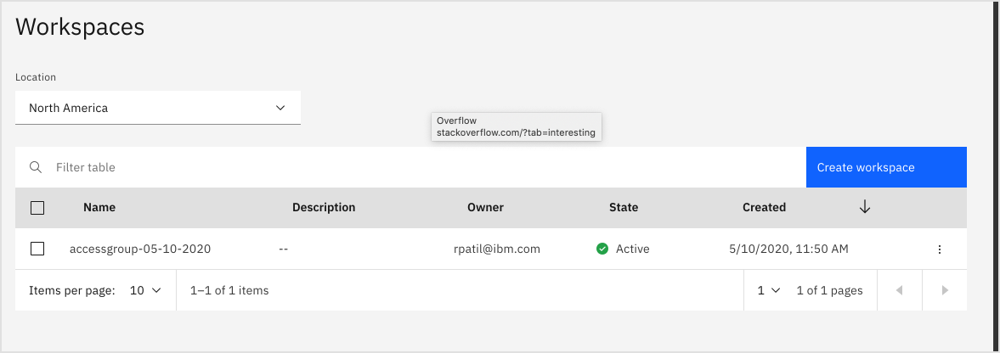

-  Fill out values for **Workspace name**, **Resource group**, and **Location**. Then click **Create**


- Once you create your schematics workspace, you will be redirected to the settings page. 
Scroll down to the **Import your Terraform Template** section.
- Provide the fork you created earlier for the **Github or Gitlab repository URL**.
- Select **terraform_v0.12** for **Terraform version**
- Click **Save template information**

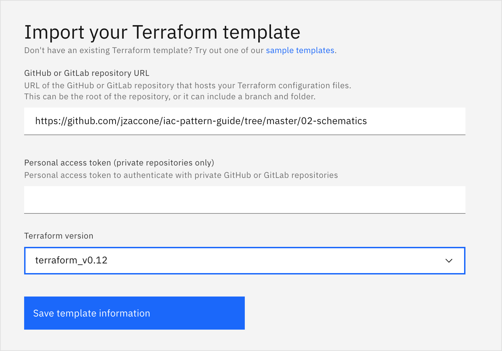

Once the page refreshes, you should see a **Variables** section. You will need to provide values for each of these.
- For **environment**, put any value
- For **public_key**, copy and paste a ssh public key that you will use to access your VSIs. For mac:
```bash
ssh-keygen -t rsa # If you need a new key
cat ~/.ssh/id_rsa.pub # Copy and paste this value
```
- Select **Sensitive** box next to the **public_key** field to treat that data as Sensitive
- Leave **port** blank to keep the default 8080 port
- Set any value for **project_name**
- Click **Save changes**


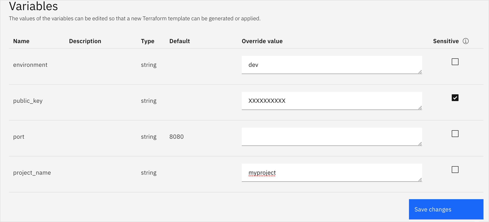

To test your Schematics workspace, click on the **Apply Plan** button 


You should see an update to your workspace **Activity** page with a new entry for **Applying plan**

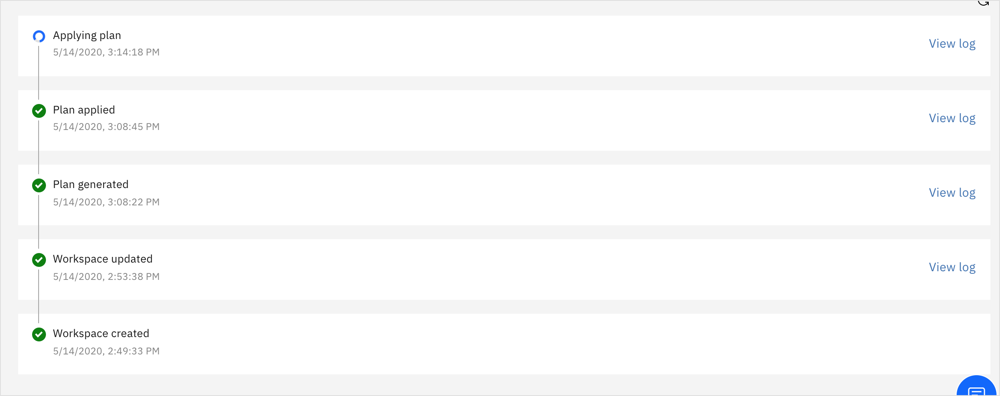

Click **View log** to see the progress. Once the plan has been successfully applied, find the **entrypoint** to the hello world application this terraform deploys.

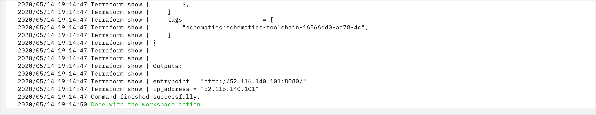

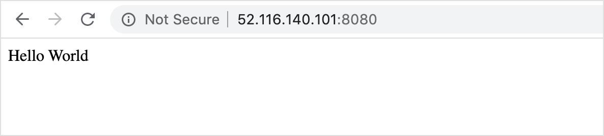

## Enable Continuous Delivery for Schematics

Next we will enable **GitOps** for our schematics/terraform by enabling Continuous delivery for our workspace. 
GitOps is a practice that uses git source repository as the declarative source of truth for the state of our applications. 
Meaning that if change something in the code and commit it, a terraform apply will be triggered, and our application state will be updated.

- To enable continious delivery for our Schematics workspace, from the workspace page, go to **Settings**

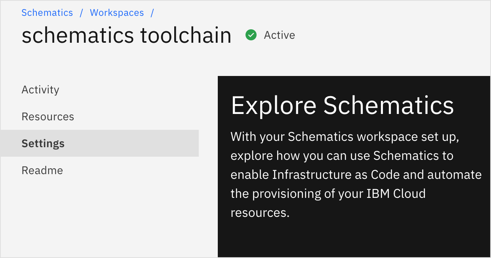

- Scroll down to **Details** and click the link that says **Enable continuous delivery**

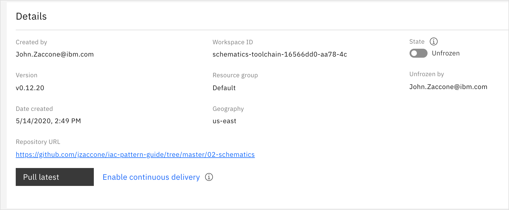

- Name your toolchain, and accept the default values for everything in the **GitHub** section
- Under **Delivery Pipeline**, add the **IBM Cloud API Key** you created before, or click **New** to generate a new one.
- Click **Create**

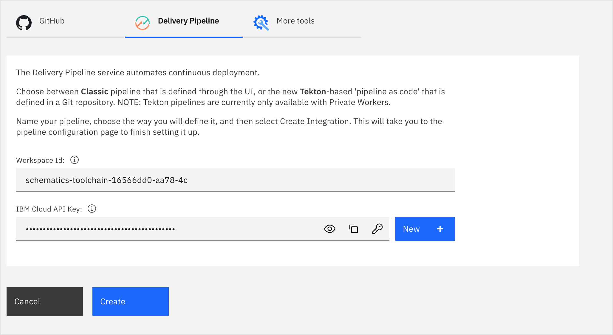

Voila! You have a pipeline for your Schematics project. Click on **Delivery Pipeline** to see the different stages created for your project.

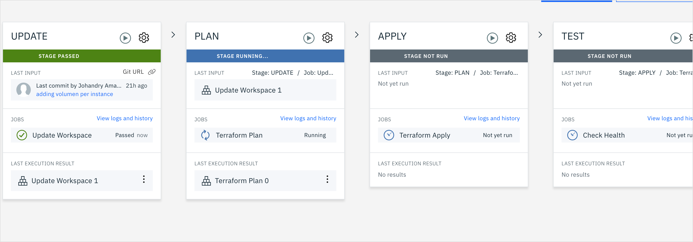 

 - Once finished, click on the **Apply Plan** stage to find the logs and entrypoint to the application just as before.


## Triggering a Change
Now we will change our source code to trigger a pipeline execution. 

<InlineNotification>
These steps assume that you have followed the fork steps above, or have write permission to your repository. 
</InlineNotification>

- Find your source control repo and navigate to `02-schematics/main.tf`
- Edit "Hello World" text to say something different. Like "Hello beautiful world"
- Commit the change

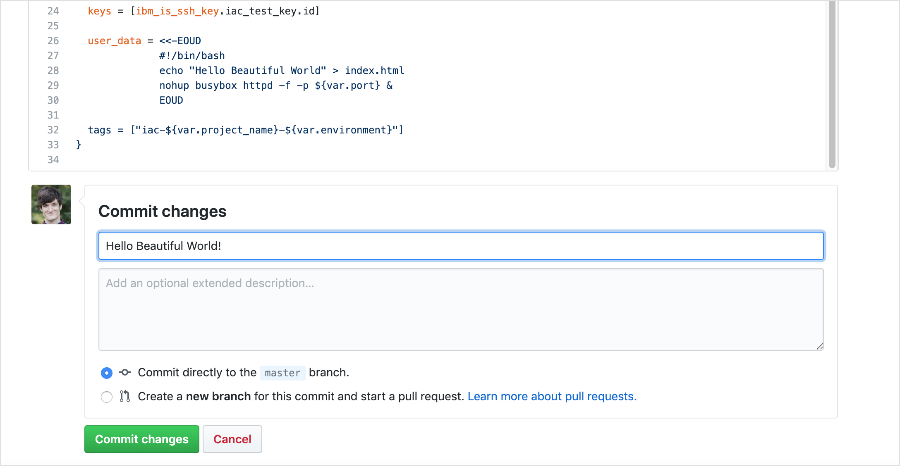 

- Navigate back to your pipeline to see your changes taking place. You should be able to see your commit under **Last Input** in the **Update** stage.

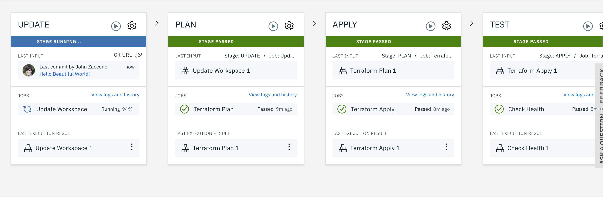  

- Once the **Apply** stage has finished, refresh the page for your app to see the deployed changes

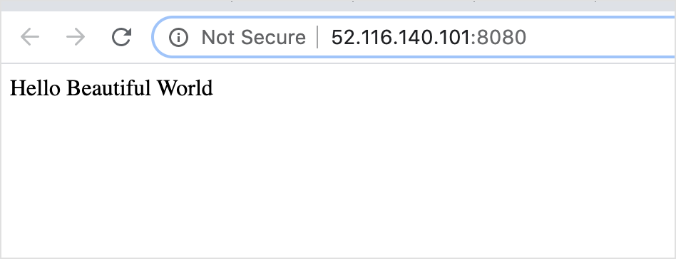  

