<PageDescription>

IBM Cloud Toolchain Testing/SDLC

</PageDescription>

<AnchorLinks small>
  <AnchorLink>After Initial Setup...</AnchorLink>
  <AnchorLink>Link SonarQube Instance to Toolchain</AnchorLink>
  <AnchorLink>Create SonarQube Scan Stage</AnchorLink>
  <AnchorLink>View Scan Results</AnchorLink>
  <AnchorLink>SDLC</AnchorLink>
  <AnchorLink>IBM Devops Insights</AnchorLink>
</AnchorLinks>

## After Initial Setup...

After completing the steps on the [Cloud Toolchain Setup Page](../cloud-toolchain-setup) we have a pipeline with 3 stages: **Build**, **Containerize**, and **Deploy**. 

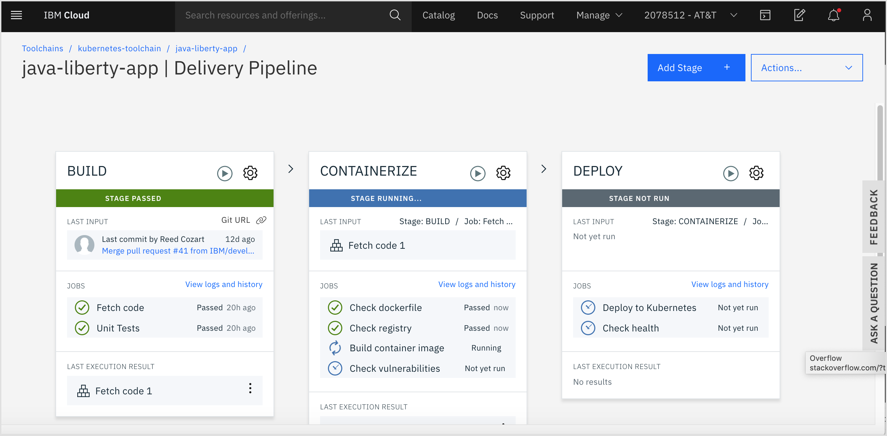  

We can add additional stages to add more steps for testing such as executing static anaylsis on our code. 
In the following instructions, we will create a new stage to add a Sonar scan to find common bugs and code smells in our code. 
We will also link an instance of SonarQube in our toolchain, and upload the results of the scans to SonarQube for easier anaylsis.

The following instructions assume you have a SonarQube instance installed somewhere that is accessible by your pipeline.

## Link SonarQube Instance to Toolchain

- Navigate to the homepage of your toolchain by selecting **Devops** in the upper lefthand menu of IBM Cloud and select the name of your toolchain.


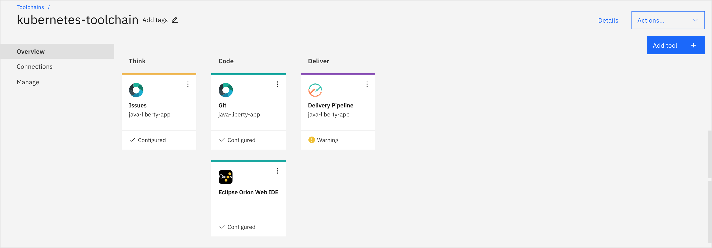  

- Click the **Add tool** button 
- Filter for **SonarQube** and select the matching tool integration.

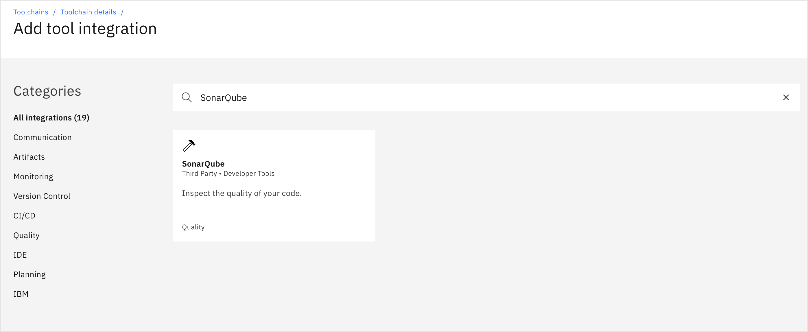  

- Configure the SonarQube integration with **Name**, **SonarQube URL**, **SonarQube user name** and **SonarQube password or authentication token**

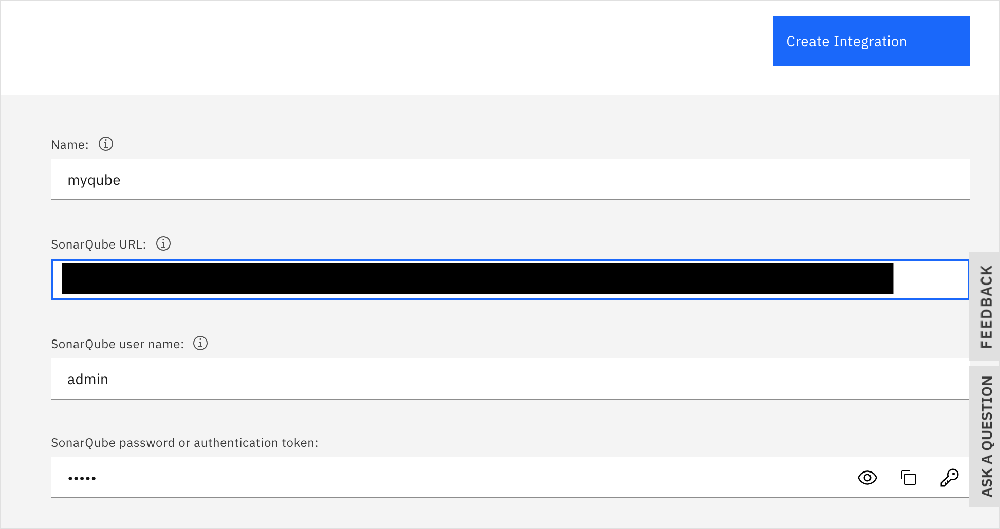  

- Click **Create Integration**

Now you should see a **SonarQube** box under **Learn** on the homepage of your toolchain. 
Clicking this box will redirect you to your SonarQube instance. 
By adding the tool integration, we created environment variables for the SonarQube URL, user and password information that are available across the pipeline.
We will use these variables in the next step when we create a stage to execute code static anaylsis.

  

## Create SonarQube Scan Stage

- From the toolchain homepage, click on **Delivery Pipeline**
- Click **Add Stage** button

  

- Name your stage **SonarQube Scan**. Leave the default values under the **Input** tab. 

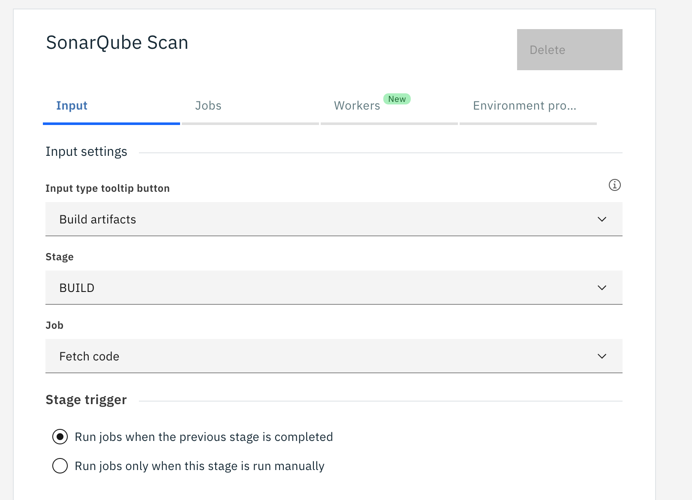  

- Select the **Jobs** tab.
- Click **Add Job** and choose **Build** as the type

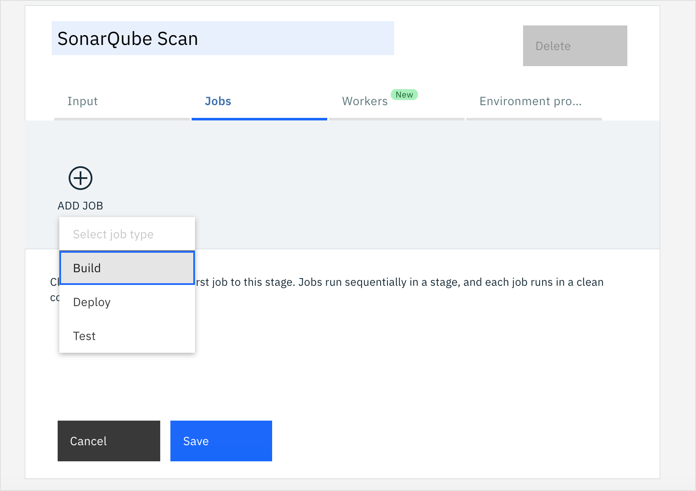  

- Select **Maven (Artifactory, Nexus, or SonarQube)** as the **Builder Type**

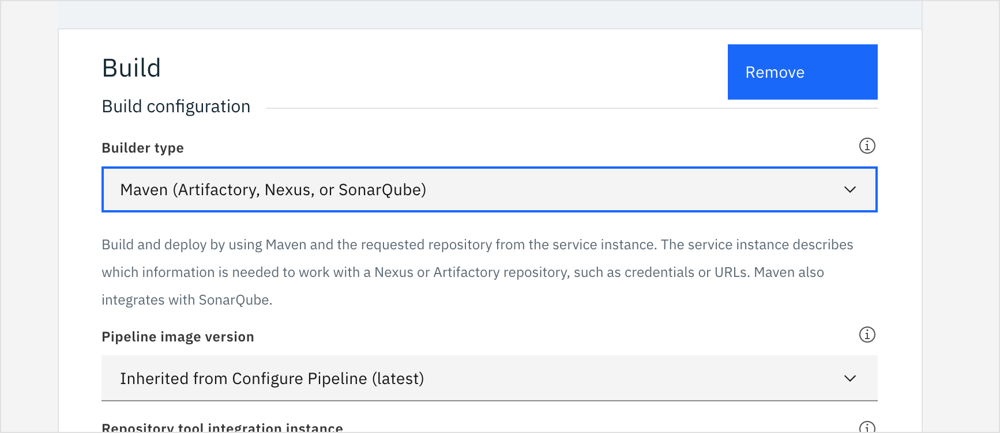  

- In the **Build command** text field, remove all of the code and replace with the following `mvn` command

```bash
mvn -B -e package sonar:sonar -Dsonar.host.url=$SONAR_SERVER_URL -Dsonar.scm.disabled=true
```

<InlineNotification>
In this command we refrence the "$SONAR_SERVER_URL" environment variable that is available after we added the SonarQube tool integration
</InlineNotification>

- Click **Save**

- Back on the pipeline screen, drag and drop the **SonarQube Scan** stage so that it follows the **Build** stage.

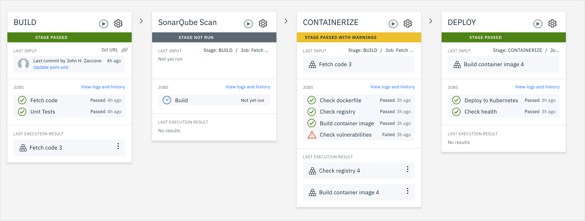   


## View Scan Results

- To manually trigger your newly create stage to run, click on the play button icon next to the stage name. You can also trigger it automatically by making a code change.

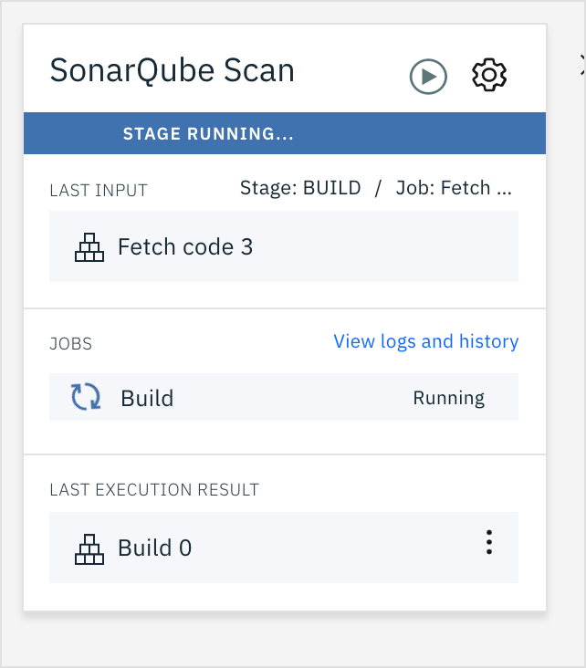   

- Click **View logs and history** to check the progress. Once the job finishes successfully, you will see a link printed at the bottom of the logs.

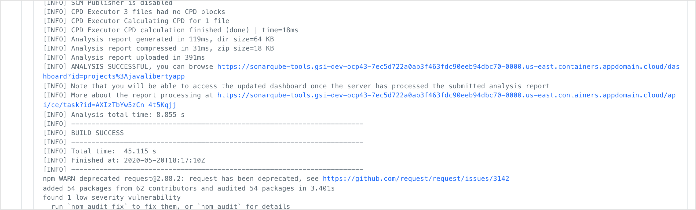  

- Click the link to be redirected to the SonarQube instance to see details for the report.

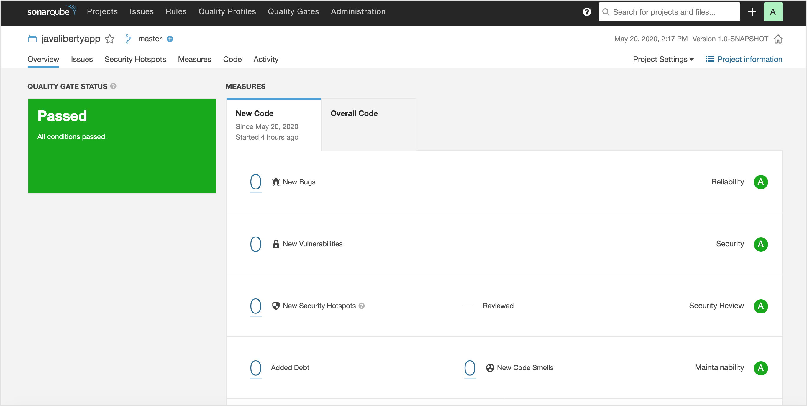  

This app is really simple and passes the SonarQube scan easily.
In the event of a code change that fails static code anaylsis, the scan would return an error and stop the pipeline from proceeding.
This follows best practices for implementing quality gates in your pipeline- making sure that code meets certain quality levels before continuing to a deployment stage.
To configure a stage in the pipeline to "fail fast", select the checkbox on the stage configuration screen.

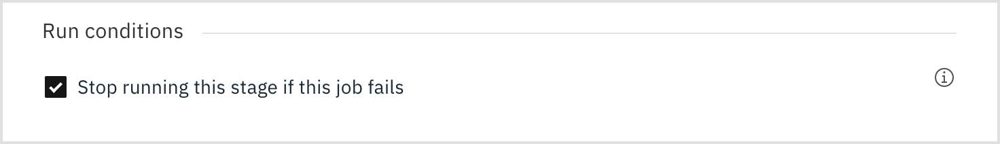  


## SDLC   

The IBM Cloud toolchain provides flexible mechanisms through Jobs and Stages to easily handle any type of testing such as running unit tests, 
functional tests, or to integrate with testing tools such as SonarQuber. 
Pipeline Stages should be applied to any step within the SDLC model, whether it is building, testing or deployment related.

The pipeline also provides you with tracability. 
Each execution of a stage records a trigger source and, at the start of the pipeline, a specific code commit, so that you can trace each pipeline execution back to a single change in the code.


## IBM Devops Insights

One testing tool that is provided native on IBM Cloud to help multiple testing scenarios is Devops Insights.
IBM Cloud DevOps Insights is a tool that aggregates code, test, build, and deployment data to provide visibility of quality for all of your teams.
With DevOps Insights, you can maintain and improve the quality of your code in IBM Cloud. 
You can monitor your deployments to identify risks before they are released, analyze development changes for error probability, and improve the interactions of your team.

Follow [this tutorial](https://cloud.ibm.com/docs/ContinuousDelivery?topic=ContinuousDelivery-di_working) for a detailed step by step tutorial to add devops insights into your pipeline.


