<PageDescription>

IBM Cloud Toolchain Setup

</PageDescription>

<AnchorLinks small>
  <AnchorLink>Create Kubernetes Deployment Target</AnchorLink>
  <AnchorLink>Setup Image Registry</AnchorLink> 
  <AnchorLink>Create the Toolchain</AnchorLink>
  <AnchorLink>Results</AnchorLink>
  <AnchorLink>Trigger a Change</AnchorLink>
</AnchorLinks>


## Create Kubernetes Deployment Target

For this pattern, we will create an instance of the IBM Cloud Kubernetes Service (IKS) on VPC Gen 2. 
The following will work similar to Red Hat OpenShift Kubernetes Service (ROKS), as well as any Kubernetes service outside of IBM Cloud that you may have access to.

- From the IBM Cloud console, select **Kubernetes** from the top left navigation menu in IBM Cloud

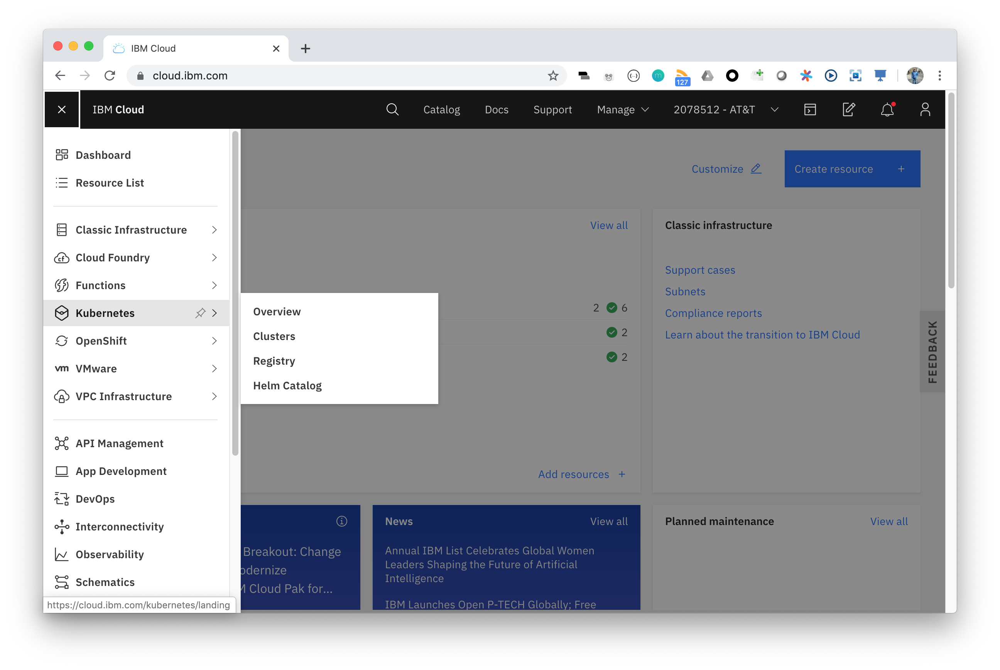

- Click **Create Cluster** 

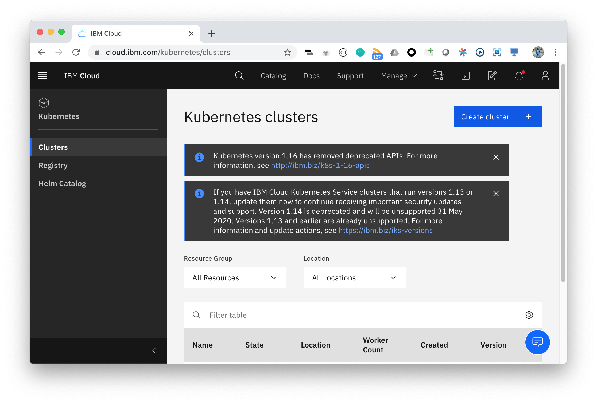

- Select Kubernetes version **Latest** which is required for VPC Gen 2

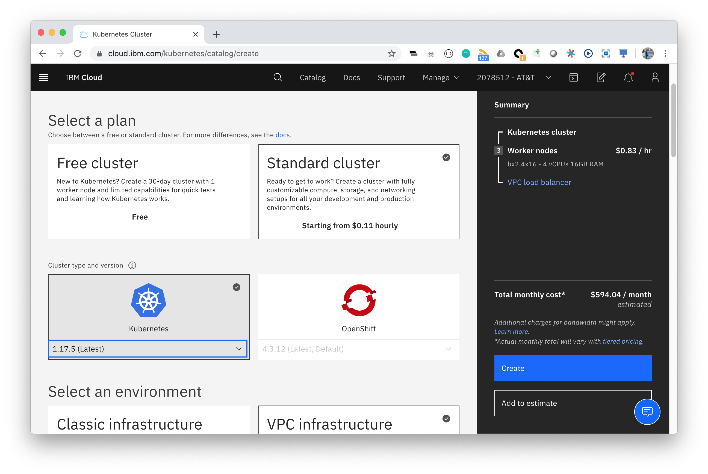

- Select VPC Gen 2 Infrastructure (Assumes VPC Gen 2 has already been created) 

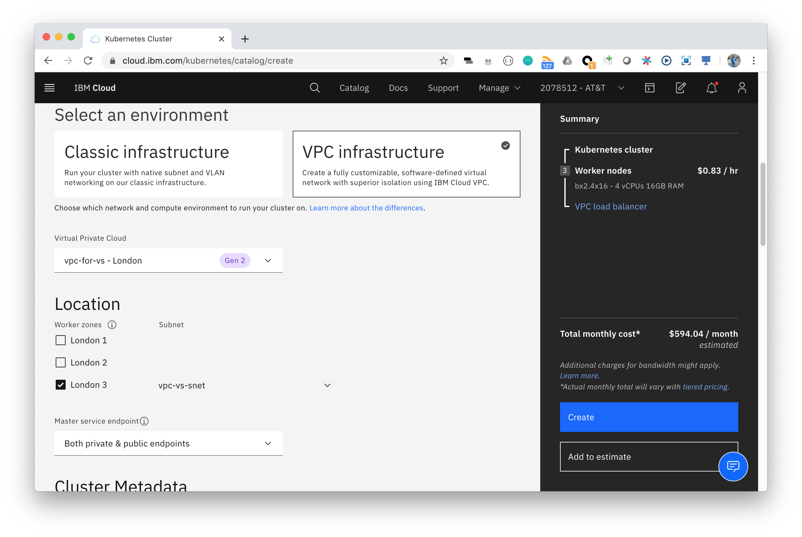

- Scroll down and complete and select other options such as type and number of nodes and hit **Create**. 
Wait a few minutes for your cluster to finish provisioning before proceeding to the next step.

## Setup Image Registry

- Add a Namespace to the registry on IBM Cloud
```bash
$ ibmcloud cr namespace-add attworkshoptest
Adding namespace 'attworkshoptest'...

Successfully added namespace 'attworkshoptest'

OK
```

- Upgrade the plan, if needed, to unlock unlimited storage for the registry.

<InlineNotification>
The registry will be need to be a "Standard" plan to increase registry storage limits past the 5MB 
</InlineNotification>

```bash
$ ibmcloud cr plan-upgrade

You agree to the terms and conditions of the 'Standard' pricing plan when you upgrade: https://www.ibm.com/software/sla/sladb.nsf/sla/bm-7670-03
You cannot undo this operation.
Do you want to continue to upgrade your pricing plan? [y/N]> y
Setting pricing plan: 'Standard'...

OK
```


## Create the Toolchain

- From the IBM Cloud console, select **Devops** from the top left navigation menu in IBM Cloud

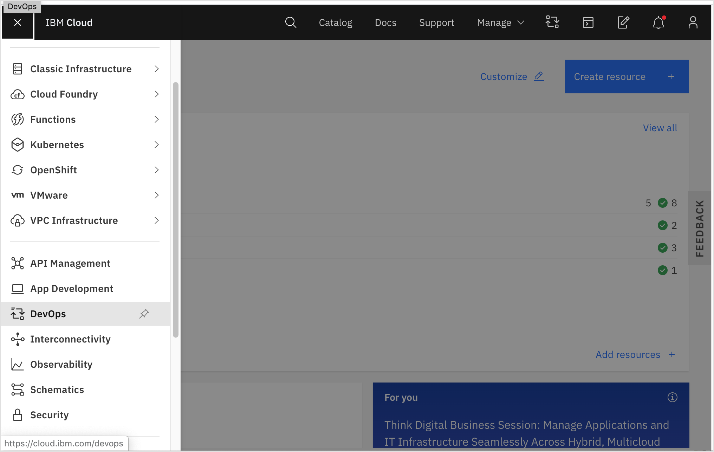 

- Click the **Create toolchain** button

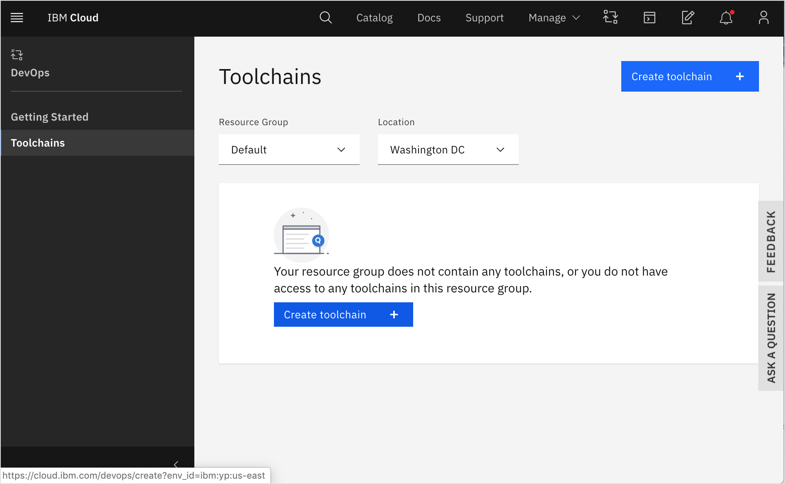 

- Select the **Develop a Kubernetes app** tile as your template. 

<InlineNotification>
This "Develop a Kubernetes app" tile is a template which provides the fastest way to setup a CI/CD pipeline to K8s. All individual parts of the template can be modified later.
</InlineNotification>

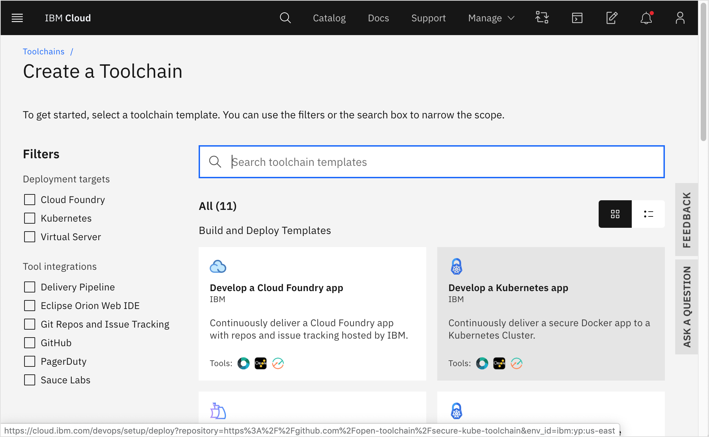 

- Define the **Toolchain Name**, **Region** and **Resource Group** for the toolchain. 


<InlineNotification>
The resource group defines the group for access control that is explained in detail in the IAM section. 
You will want to select the appropriate resource group, such as "development" or "production" to control access to the toolchain.
</InlineNotification>

- For **Source Provider**, select **Git Repos and Issue Tracking** which will create a git repo space using the IBM Cloud gitlab environment

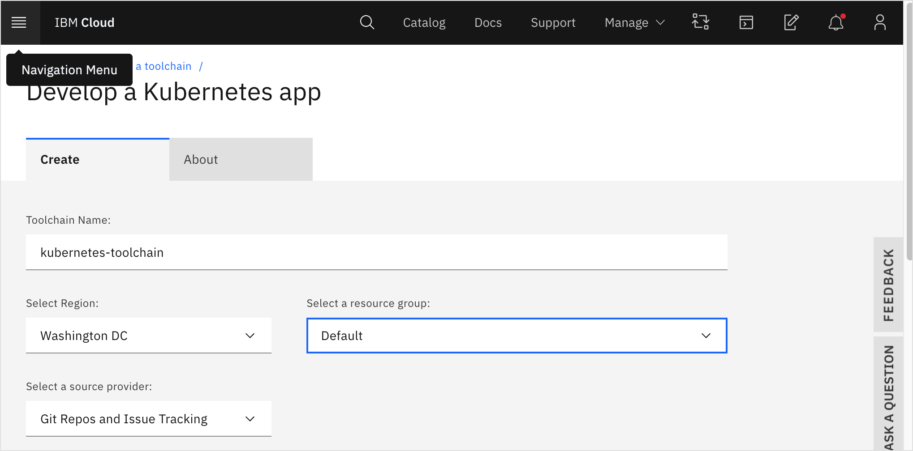

- Next, configure the git repo. Select **US East** for the **Server**, select **Clone** as the **Repository Type**  and
use `https://github.com/jzaccone/java-liberty-app` for the **Source repository URL**. 


<InlineNotification>
This will clone a sample liberty application from GitHub and push it to our GitLab environment hosted on IBM Cloud. 
You can also link directly to GitHub or any git repo you can access
</InlineNotification>

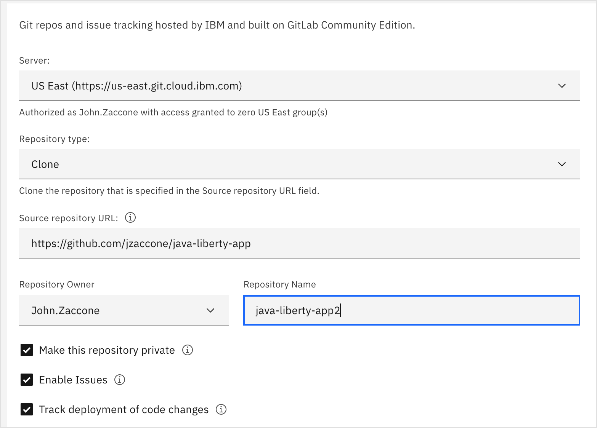  

Configure the Delivery Pipeline:
- Select from the dropdowns to find the container registry namespace you created earlier by selecting the appropriate **Container registry region** and **Container registry namespace**.
- Click the blue button to generate a **IBM Cloud API Key** based on your current logged in user.
- Use the dropdowns again to find your clustser by selecting the correct **Cluster region**, **Resource Group**, and **Cluster name**.
- Write in **default** for **Cluster namespace**.

<InlineNotification>
The blue button will create a new API key that allows anyone who has it the ability to do anything you could do. 
To make things more secure, you will want to create a service ID API key that can be created for a singular purpose and would provide limited access to only what your pipeline requires.
</InlineNotification>

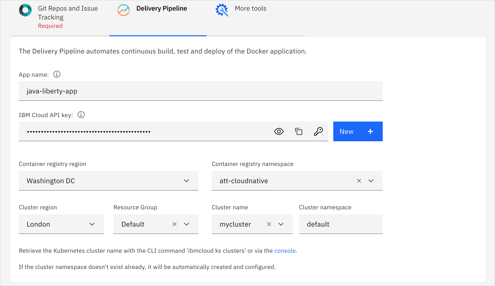  

- Select **Create** to create your Toolchain

<InlineNotification>

A toolchain brings together many resources. A git repo, the Docker Registry, a Kubernetes Cluster and the toolchain itself.

Everything created in this example was done using a single IAM role. In the "Cross-Account" section, 
we will examine breaking down those roles and accounts in order to isolate the production environment.

</InlineNotification>

### Results

One you create the Toolchain, you should see the following screen

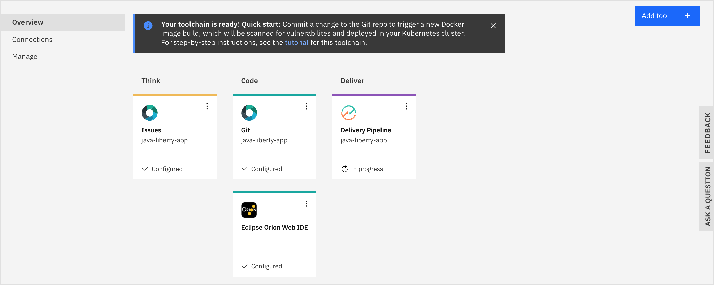  

Using the **Deploy to Kubernetes** template, we configure a few things to the toolchain out of the box.

- **Git** which links to a the GitLab environment hosted on IBM Cloud and protected by IAM for your accounts
- **Eclipse Orion Web IDE** which is a web IDE allowing you to browse and make quick edits to your code
- **Issues** which links to the Issues page in your source control repository
- **Delivery Pipeline** which includes all the stages and jobs for building, testing and deploying your application. 
The pipeline should have been triggered to run automatically when you created the pipeline

You can add a new tool to your tool chain by pressing the **Add Tool** button. 
Options for tools include integrations with Artifactory, Nexus, SonarQube, Slack or you can create a custom integration with any tool

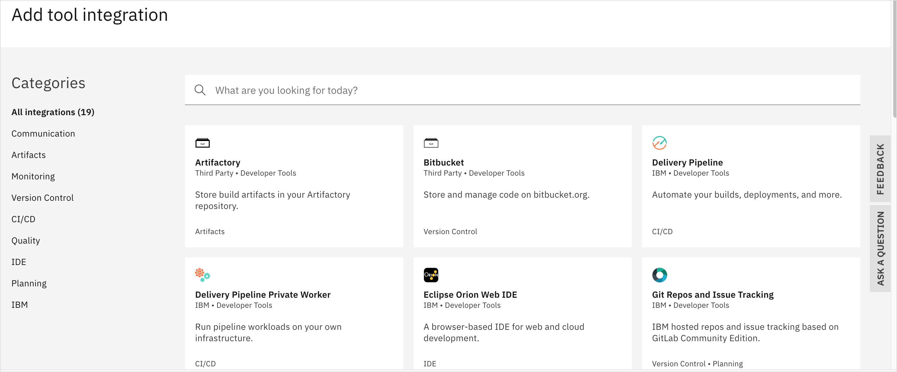   

Select the **Delivery Pipeline** tile to check the progress of your pipeline execution. Once it completes, you should see that all stages pass successfully.


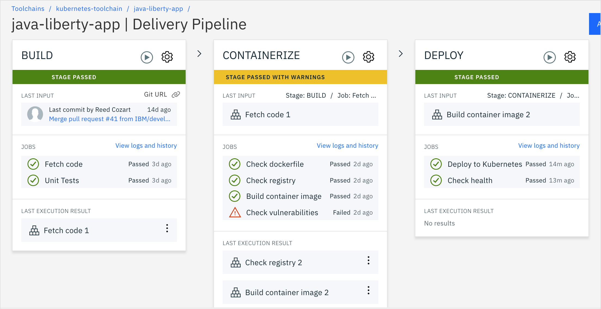 

You might notice that the **Containerize** stage passed with warnings. That is because vulnerabilities were found from the IBM Cloud Vurnerability Advisor. 
You can click through to see logs to see details of what vulnerabilities were discovered.


<InlineNotification>

The IBM Cloud Vurnerability Advisor scans images uploaded to the IBM Cloud Registry automatically.
For development it is OK to allow the images to go through and be deployed to a development environment, 
but for production, you will want to configure this stage to stop on failure unless an exception has been explicitly made for that vurnerability.
For a detailed view on vurnerabilities for all images in the registry go to Kubernetes->Registry.

</InlineNotification>

Click the **Deploy to Kubernetes** job in the **Deploy** stage. This should take you to the logs output for that job.

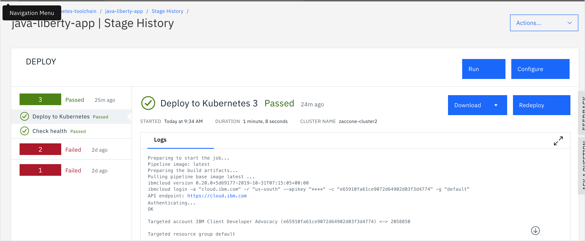 

Near the bottom of the logs you should see a print of the address for your application.  

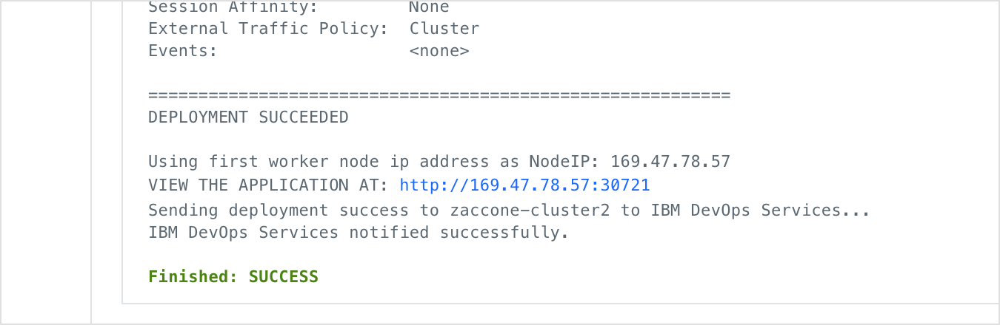 

Click on the link to see your application running on the Kubernetes Cluster on IBM Cloud

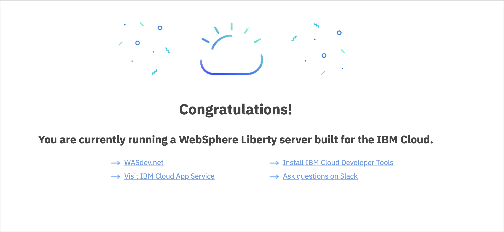  


<InlineNotification>

Since this cluster is running on VPC Gen 2, this may not work depending on how how you configure incoming traffic into the private cloud. 
See the appropriate sections in this guide for setting up and configuring VPC Gen 2. 
You can also verify the app is running by running `kubectl get pods` when connected to the IKS cluster.

</InlineNotification>

## Trigger a Change

This IBM Cloud Toolchain is automatically configured to run whenever a code change is committed to the linked git repository. 
To see what change triggered a particular pipeline run, check the **Last Input** in the build stage.

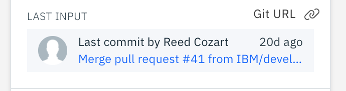   

Within that box, there is a link that will take you to the exact commit in the git repo where you can view what files were changed.

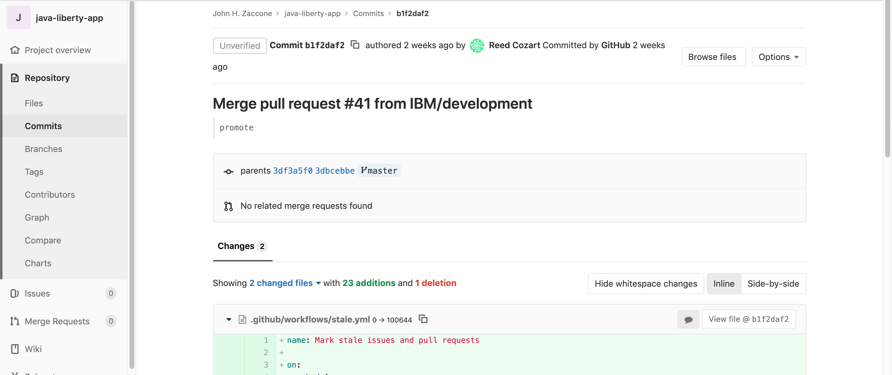     

Once the pipeline is run multiple times, a history is created. Click on **View logs and history** for any stage to see a detailed history and logs for each stage execution.


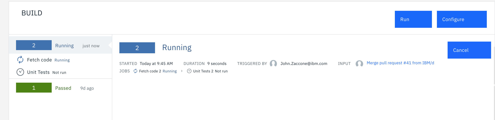     
