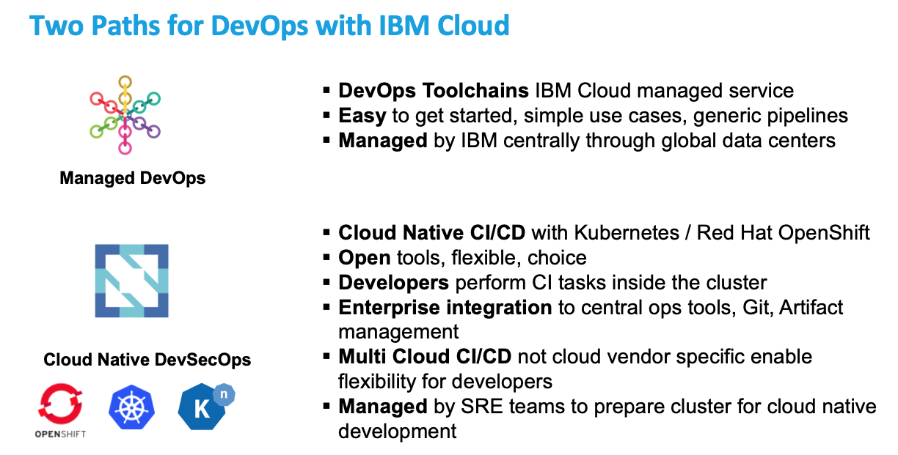
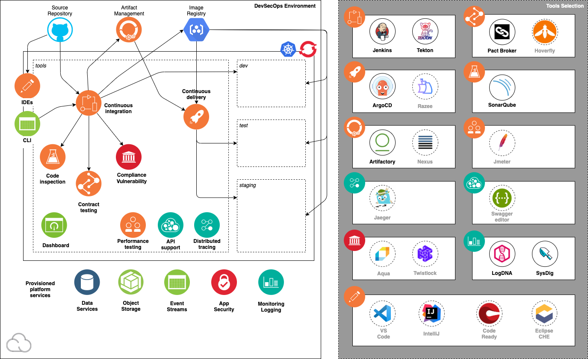

import Globals from 'gatsby-theme-carbon/src/templates/Globals';

<PageDescription>

CI/CD Content Overview

</PageDescription>

<AnchorLinks small>
  <AnchorLink>IBM Cloud Toolchain for IBM Cloud Schematics</AnchorLink>
  <AnchorLink>CI/CD to Kubernetes Using IBM Cloud Toolchains</AnchorLink>
  <AnchorLink>Cloud Native CI/CD with Kubernetes and OpenShift</AnchorLink>
</AnchorLinks>

There are multiple options for CI and CD tooling that work with IBM Cloud. A CI/CD solution MUST
- Deploy to multiple kinds of infrastructure, including bare metal, VSIs, or container based such as Kubernetes or OpenShift
- Be built around different types of code bases, including infrastructure as code or applications that expose some business function to users.
- Must integrate with third-party tools for building, testing and artifact storing such as SonarQube, Maven and Artifactory.
- Must be designed to handle all aspects of the SDLC lifecycle. Failing fast being a key best practice to follow.
- Must deploy across multiple environments located in different regions and accounts and must integrate with RBAC to protect access to the resources it talks to.

In this overview and the following CI/CD sections, we will introduce a subset of tooling that run on IBM Cloud.
This is not to be considered an all-inclusive list, but we will demonstrate the flexiblity and patterns of the tools to solve the requirements of the above list.

We will show two options for CI/CD tooling: IBM Cloud Toolchain and open-source cloud-native CI/CD tools that run on top of Kubernetes or OpenShift.
Both are options that can be used for your IBM Cloud deployments, and there are pros and cons to each approach.

## IBM Cloud Toolchain for IBM Cloud Schematics

Use CI/CD for IBM Cloud Schematics to enable a GitOps workflow for your Infrastructure as Code Terraform scripts.
Get started by following the instructions in [this pattern](/ci-cd/cloud-toolchain-schematics).

## CI/CD to Kubernetes Using IBM Cloud Toolchains
IBM Cloud Public is an open-standards, cloud-based platform where you can build, run, and manage applications that are accessed by http://cloud.ibm.com.
The advantage of using IBM Cloud Toolchain is that it integrates seamlessly with all resources already deployed on IBM Cloud while providing full
DevOps capabilities provided by the Open Toolchain. There are some built-in features as well such as enabling DevOps Insights to give you aggregate view of all
tests that are running in your pipeline.

Included in the core set of tools for any DevOps toolchain on IBM Cloud: Git Repos and Issue Tracking, Delivery Pipeline, and Eclipse Orion Web IDE.
Git Repos and Issue Tracking is based on the GitLab Community Edition, and offers planning boards and source code collaboration through merge requests.
The Delivery Pipeline orchestrates build, test, and deployment jobs across multiple environments as changes progress from the Developer to production.
Applications can be deployed in minutes to the Cloud Foundry environment or to a Kubernetes cluster on IBM Cloud, to either public or private clouds.
The Eclipse Orion Web IDE gives Developers quick access to the code from any browser.

Open toolchain integrates more tools around Continuous Delivery such as Slack, Atlassian JIRA, Sonatype Nexus, JFrog Artifactory, Sauce Labs, PagerDuty,
BM Cloud Availability Monitoring, IBM Vulnerability Advisor, and IBM Globalization Pipeline. You can also substitute other tools for the Continuous Delivery capabilities,
including GitHub, GitHub Enterprise, and Jenkins. Developers can also use their favorite IDEs and editors, such as Visual Studio Code, Eclipse, and more.

IBM Cloud DevOps provides concrete practices and architectures for cloud development.
It enables Developers to get started quickly with new projects that employ the rich catalog of services on the IBM Cloud.
IBM Cloud DevOps also provides Developers an open and integrated set of tools for automating delivery with speed and control.

Go here to learn more about [Continuous Delivery](https://www.ibm.com/cloud/learn/continuous-delivery)
or to learn more about [IBM Cloud Continuous Dlelivery](https://www.ibm.com/cloud/continuous-delivery).

Ready to get started? Go [here](/ci-cd/cloud-toolchain-setup) to get started with setting up a IBM Cloud Toolchain that deploys an application to Kubernetes.

## Cloud Native CI/CD with Kubernetes and OpenShift

An Overview of what DevSecOps is, and how it can help you
 speed up you cloud native solution delivery

One of the patterns emerging with development teams is the ability to use [CNCF Tools](https://landscape.cncf.io/) as part of a more open multi cloud CI/CD strategy. This approach is aligning around the Kubernetes platform. The IBM Cloud supports both upstream Kubernetes for advanced cutting edge workloads and Red Hat OpenShift the proven mutli cloud distribution of Kubernetes that can install on IBM Cloud, Azure, AWS, VMWare and on Premise and many more places. This approach removes cloud vendor lock in around CI/CD tools and enables development teams to be more flexible and the target cloud they focus on deploying and developing with.

There are two patterns from this approach:

- There are a core set of Development Tools that are installed inside the Kubernetes environment with the use of Operators the management and support of these tools can be controlled with centralized operations teams
- Integration of centralized operations tools like Source Code Management, Artifact Management, Image Management, Logging and Monitoring

This model enables agile cloud native development teams to execute quickly while also conforming to the enterprise standards required for CI/CD. This pattern also enable the reduction of costs of managing expensive centralized multi tenant CI services and enables the development teams to use a percentage of their development cluster to support CI activities. This approach with Tekton enable the centralized operations teams to impose specific pipeline tasks that need to be supported by development teams without the complex

### Overview

This short video introduces the cloud native concepts of CI/CD DevOps with <Globals name="ocp" />:
<iframe width="80%" height="500" src="https://www.youtube.com/embed/GOPWObjFTsI" frameborder="0" allow="accelerometer; autoplay; encrypted-media; gyroscope; picture-in-picture" allowfullscreen></iframe>

Each Cluster can have a selection of CNCF DevSecOps tools installed using IasC(Infrastrcture As Code) using Terraform. The cluster then turns from a production state cluster into a cluster that is used for multi tenant development teams.

The following describes the requirements:

- **Installation**: Install the CNCF Tools using Terraform this create a new <Globals name="env" />
- **Cluster**: A <Globals name="kube" /> or <Globals name="ocp" /> cluster that both hosts the tools and itself is a deployment target for application builds
- **Software Delivery Lifecycle**: Deployment target environments that support the application development lifecycle: *dev*, *test*, and *staging*
- **Backend services**: Cloud services commonly required by cloud-native applications for monitoring, security, and persistence
- **CI/CD**: A prebuilt, ready-to-run continuous delivery pipeline incorporating best-of-breed open source software tools supporting `Jenkins`, `Tekton` for CI and `ArgoCD` for CD
- **<Globals name="templates" />**: Prebuilt code templates for common application components and tasks incorporating best practices that developers can add to their codebase as needed
- **Dashboard**: Integration of the tools into the OpenShift dashboard, and a centralized developer dashboard to help developers use the environment's capabilities

A core set of tools are sourced from the [IBM Cloud Catalog](https://cloud.ibm.com/catalog?search=label%3Ahelm#software) that can be found in the <Globals name="ic" />. This approach helps assemble these reliable open source development tools into an end-to-end developer experience that is fully integrated with <Globals name="ic" />'s managed container orchestration services.

the tools can also be source from the [Operator Hub](https://operatorhub.io/) and the [Redhat Marketplace](https://marketplace.redhat.com/en-us). The Operations team that owns the IasC can decide the best approach to install the tools either using **Helm3** or **Operators**

Typically a **Cloud System Admin** installs and sets up a new <Globals name="env" />, providing a place for the developers to start developing the [minimum viable product (MVP)](https://www.ibm.com/garage/method/practices/think/inception/practice_minimum_viable_product). The objective is to reduce the time required for a team to configure and prepare their development environment. The key benefit is to make the end-to-end [CI/CD development lifecycle](https://www.ibm.com/garage/method/practices/deliver/practice_continuous_delivery/) consistent across each platform and make the out-of-the-box developer experience as simple as possible.

The installation is performed using [Terraform](https://cloud.ibm.com/docs/terraform), driven by scripts with a [modular configuration](https://github.com/ibm-garage-cloud/garage-terraform-modules) so unneeded tools can be easily disabled or new tools added. The combination of tools selected are proven in the industry to deliver real value for modern cloud-native development.

### Environment components

After installation, the <Globals name="env" /> consists of a set of CNCF tools installed into your nominated kubernetes cluster.

This diagram illustrates the <Globals name="env" />:

The diagram shows the components in the environment: the cluster, the deployment target environments, the cloud services, and the tools.

- An [<Globals key="iks" />](https://www.ibm.com/cloud/container-service)
or [<Globals key="roks" />](https://www.ibm.com/cloud/openshift) 3-node cluster
- Cluster namespace that encapsulates the tooling installed in the cluster: *tools*
- Cluster namespaces for deployment target environments: *dev*, *test*, and *staging*

#### CNCF DevOps Tools

The following best-of-breed open source software tools are installed in the cluster's *tools* namespace:

| Capability                  | Tool                                         | Bitnami   |Description |
| --------------------------- |:--------------                               | -------   |------------|
| Continuous Integration      | [Jenkins CI](https://jenkins.io/)            |  Yes      | Jenkins is a common tool for Continuous Integration   |
| Continuous Integration      | [Tekton CI](https://tekton.dev/)             |           | Tekton is an emerging tool for Continuous Integration with Kubernetes and OpenShift  |
| Code Analysis               | [SonarQube](https://www.sonarqube.org/)      |  Yes      | SonarQube can scan code and display the results in a dashboard |
| Artifact and Helm Storage   | [Artifactory](https://jfrog.com/open-source/)|  Yes      | Artifactory is an artifact storage and Helm chart repository  |
| Continuous Deployment       | [Argo CD](https://argoproj.github.io/argo-cd/)|           | ArgoCD support Continuous Delivery with GitOps |
| Contract API Testing        | [Pact](https://docs.pact.io/)                |           | Pact enables API contract testing |
| End to End Tracing          | [Jeager](https://www.jaegertracing.io/)                |           | Monitor and troubleshoot transactions in complex distributed system |

<Tabs>

<Tab label="Setup">

## Configuration Instructions

To install the CNCF tools into your nominated kubernetes cluster follow the steps below:

| Task                            | Description         | Link        | Time    |
| --------------------------------| ------------------  |:----------- |---------|
| Software Delivery Lifecycle | Overview of the Tools you will be using with the Sandbox |  <a href="https://www.youtube.com/watch?v=LcWboN1T7Zk" target="_newwindow">Video</a>| 30 min |
| Install Tools | Install CNCF DevOps tools with Schematics  | [Schematics Install](/ci-cd/cloud-native-setup) | 15 mins |
| Install Dev Tools | Install Pre Prerequisites Client Developer Tools | [Install Dev Tools](/ci-cd/cloud-native-setup-tools) | 30 mins |
| Continuous Integration | Understand how Jenkins and Tekton support Continuous Integration  | [CI Tools](/ci-cd/cloud-native-ci-tools) | 15 mins |
| Deploy Application | Understand how to Deploy an App with CI pipeline that enables testing  | [Deploy App](/ci-cd/cloud-native-deploy) | 15 mins |
| Continuous Delivery | Understand how to enable Continuous Delivery | [CD Tools](/ci-cd/cloud-native-cd) | 15 mins |
| Code Patterns | Starter code to enable fast on ramp for developers | [Code Patterns](/ci-cd/cloud-native-codepatterns) |

</Tab>
</Tabs>

