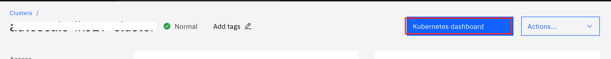
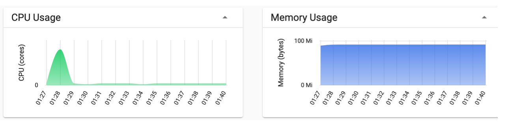

For this pattern, we have created IKS on VPC which has worker pool (2vCPU and 4GB RAM) with three worker nodes and will configure autoscale on it. A sample Java application is built which uses WebSphere Liberty as its runtime and perform calculations to increase CPU load. We will build a container image for this application and push the image to IBM Cloud container registry. Then the application will be deployed to IKS using configuration (.yaml) files using the built image.
Follow the instructions given below to deploy the application.

## Create/Get namespace on IBM Cloud container registry

IBM Cloud Container Registry is used to store and access private container images. To access Cloud Container Registry through Cloud dashboard, click `Navigation > Kubernetes > Registry`

If you have not created namespace before or you want to use different namespace than existing one then need to create a new namespace. You can create a namespace through interface or using the following commands.

```bash
$ ibmcloud cr namespace-add <YOUR_NAMESPACE>
 
# To verify that namespace is created
$ ibmcloud cr namespace-list
```

## Prepare deploy target for your container image

You need to set the correct deploy target for the container image to upload to the accessible container registry. Depending on the region you created your cluster in, your image URL will be in the following format:

```
<REGION_ABBREVIATION>.icr.io/<YOUR_NAMESPACE>/<YOUR_IMAGE_NAME>:<VERSION>
```

The following command tells you the Registry API endpoint for your cluster. You can get region abbreviation from the output.

```bash
ibmcloud cr api
```

To get namespace use the following command.

```bash
ibmcloud cr namespaces
```

You can choose any name for image and any version. For example, the deploy target for US-South region will be `us.icr.io/my_namespace/scaleapp:1.0`


## Deploy an application

Perform the following steps to build an image and push the image to IBM Cloud Container Registry.

```bash
git clone https://github.com/IBM/cloud-enterprise-examples.git

cd cloud-enterprise-examples/artifacts/auto-scale/iks-vpc

# Build the image using Dockerfile and push to IBM Cloud Container registry
ibmcloud cr build --tag <YOUR_DEPLOY_TARGET> .

# Verify whether the image is uploaded to the container registry
ibmcloud cr image-list
```

The public Ingress application load balancers(ALBs) gets created by default with IBM Kubernetes Service. Ingress is a Kubernetes service that balances network traffic workloads in your cluster by forwarding requests to your apps. To expose an app by using Ingress, you need to register the service of your application with Ingress by defining an Ingress resource. The Ingress resource is a Kubernetes resource that defines the rules for how to route incoming requests for apps.

Run the following command and make a note of the Ingress Subdomain and its secret to be used in Ingress Resource definition as explained further.

```bash
# To get the cluster name or ID to be used in next command
ibmcloud ks cluster ls
ibmcloud ks cluster get --cluster <your-cluster-name> |grep -i ingres
```

Now, need to modify `deploy.yaml` as shown below.

- image location for Deployment resource. Use your deploy target used in above step.

```bash 
## macOS
$ sed -i '' s#IMAGE#<YOUR_DEPLOY_TARGET># deploy.yaml

## Linux
$ sed -i s#IMAGE#<YOUR_DEPLOY_TARGET># deploy.yaml
```

- ingress subdomain and secret name (noted before) for Ingress resource
```bash
## macOS
$ sed -i '' s#HOST#<YOUR_INGRESS_SUBDOMAIN># deploy.yaml
$ sed -i '' s#SECRET#<YOUR_INGRESS_SUBDOMAIN_SECRET># deploy.yaml

## Linux
$ sed -i s#HOST#<YOUR_INGRESS_SUBDOMAIN># deploy.yaml
$ sed -i s#SECRET#<YOUR_INGRESS_SUBDOMAIN_SECRET># deploy.yaml
```

We are ready to deploy the application now. Run the following command.

```bash
kubectl create -f deploy.yaml
```

You can check the pod status using `kubectl get pods` and its logs using `kubectl logs <pod-name>` command. 
Wait for 1-2 minutes as server takes sometime to start and then access the application.

## Access the application

You can access your application using the Ingress subdomain URL. The paths to your app services are appended to the public route to form a unique app URL. Access the url `https://<YOUR_INGRESS_SUBDOMAIN>/autoscale-webapp`, you will get the following output on your screen.


The compute-intensive operation you can execute by accessing this `http://<YOUR_INGRESS_SUBDOMAIN>/autoscale-webapp/LoadCPUSquareRoot?count=1`.
The browser will show the following on your screen.


The usage of Kubernetes cluster resources can be checked using the Kubernetes dashboard as well.

Navigate to `IBM Cloud Dashboard > Clusters > <YOUR_KUBERNETES_CLUSTER>` and then click on Kubernetes Dashboard as shown.



The Kubernetes Dashboard will show workloads, resources, their usage and so on. If you have run the compute-intensive operation, then dashboard would show resources usage like the below snapshot.

