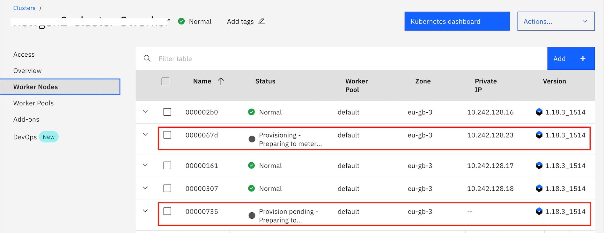
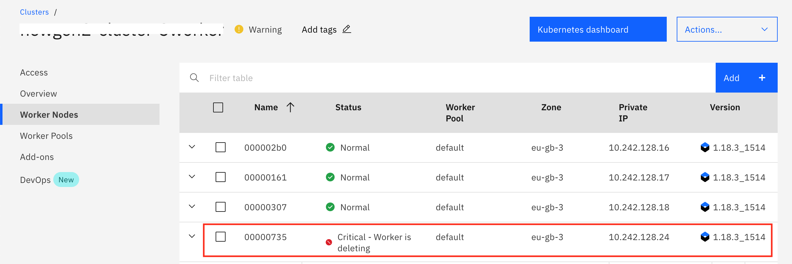
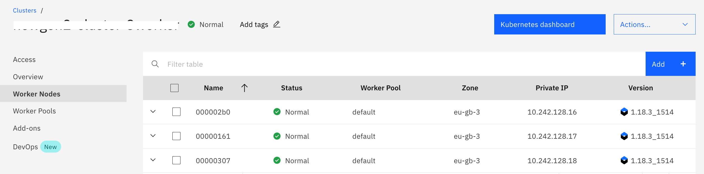

The cluster autoscaler is available for standard clusters that are set up with public network connectivity. With the `ibm-iks-cluster-autoscaler` plug-in, you can scale the worker pools in your IBM Cloud Kubernetes Service cluster automatically to increase or decrease the number of worker nodes in the worker pool based on the sizing needs of your scheduled workloads.

## Install the cluster autoscaler plug-in using Helm Chart

The environment should be set for the cluster which you want to autoscale as explined in `Environment Setup` section.
Once environment is ready, follow the below steps:

- Confirm that your IBM Cloud Identity and Access Management credentials are stored in the cluster.

  ```bash
  kubectl get secrets -n kube-system | grep storage-secret-store
  ```

- The cluster autoscaler can scale only worker pools that have the `ibm-cloud.kubernetes.io/worker-pool-id`label. Check whether your worker pool has the required label.

  ```bash

  # To get Cluster name or ID
  ibmcloud ks cluster ls

  # To get Worker-Pool name or ID for your cluster
  ibmcloud ks worker-pool ls -c <cluster_name_or_ID>

  # To check Label of the worker-pool
  ibmcloud ks worker-pool get --cluster <cluster_name_or_ID> --worker-pool <worker_pool_name_or_ID> | grep Labels
  ```

- Install `Helm v3` by following the [instructions](https://cloud.ibm.com/docs/containers?topic=containers-helm#install_v3). You can skip this step if you already have helmv3 installed.

- Add and update the Helm repo where the cluster autoscaler Helm chart is.

  ```bash
  helm repo add iks-charts https://icr.io/helm/iks-charts
  helm repo update
  ```

- Install the cluster autoscaler Helm chart in the `kube-system` namespace of your cluster. In the example command, the default worker pool is enabled for autoscaling with the Helm chart installation.

  ```bash
  helm install ibm-iks-cluster-autoscaler iks-charts/ibm-iks-cluster-autoscaler --namespace kube-system --set workerpools[0].default.max=5,workerpools[0].default.min=3,workerpools[0].default.enabled=true
  ```
  
  Here, the first workerpool named as default is enabled for autoscaling with maximum number of nodes as 5 and 3 minimum number of worker nodes. To customize and understand more `--set workerpools` options, please refer this [link](https://cloud.ibm.com/docs/containers?topic=containers-ca#ca_helm).
  In case, if you have more than one workerpool in default resource group then you should use worker-pool ID instead of its name in the above command.

- Verify that the installation is successful.
  - Check that the cluster autoscaler pod is in a Running state.
    ```bash
    kubectl get pods --namespace=kube-system | grep ibm-iks-cluster-autoscaler
    ```

  - Check that the cluster autoscaler service is created.
    ```bash
    kubectl get service --namespace=kube-system | grep ibm-iks-cluster-autoscaler
    ```

  - The worker pool details are added to the cluster autoscaler config map. Verify that the config map is correct by checking that the `workerPoolsConfig.json` field is updated and that the `workerPoolsConfigStatus` field shows a success message.
    ```bash
    kubectl get cm iks-ca-configmap -n kube-system -o yaml
    ```

<InlineNotification>
  
The more detailed instructions are provided at https://cloud.ibm.com/docs/containers?topic=containers-ca#ca_helm . Please follow the link to get more details of each step and to customize the cluster autoscaler settings.

</InlineNotification>

## Scaling up Worker nodes

A pod is considered pending when insufficient compute resources exist to schedule the pod on a worker node. When the cluster autoscaler detects pending pods, the autoscaler scales up your worker nodes to meet the workload resource requests.

- Deploy the application as explained in `Deploy Application to IKS` section.

- Create a deployment such that the worker pool runs out of resources and some of the pods will be in pending state which then triggers the cluster autoscaler to scale up the worker pool. Execute the following steps to increase load using `hpa` resource.
  
  ```bash
  # configure hpa
  kubectl autoscale deployment test --cpu-percent=25 --min=1 --max=30
  
  # modify yaml for ingress subdomain
  sed -i '' s#HOST#<YOUR_INGRESS_SUBDOMAIN># generate-load-ca.yaml  //mac
  OR
  sed -i s#HOST#<YOUR_INGRESS_SUBDOMAIN># generate-load-ca.yaml     //linux
  
  kubectl create -f generate-load-ca.yaml
  ```

  <InlineNotification>

  Check out the **Horizontal Pod AutoScaling** section to understand more about **hpa**.

  </InlineNotification>

- The above step should result some of the pods in `pending` state in sometime. Keep checking the following command. 

  ```bash
  # to check pods and their state
  kubectl get pods

  # to check the number of replicas
  kubectl get hpa
  ```

- Once some of the pods are in pending state, you can verify if cluster autoscaler has triggered addition of more worker nodes using the following command.

  ```bash
  # if it shows Workers > 3 then Cluster Autoscaler has been triggered successfully
  ibmcloud ks worker-pool ls --cluster <cluster_name_or_ID>
  ```

  You can check the IBM Cloud Dashboard to confirm if worker nodes are created to meet the current demand. The dashboard will show something like this snapshot.
  
  

  It will take few minutes for a new worker node to get ready. You can also follow along with the pod deployment from the command line. You should see the pods transition from pending to running as nodes are scaled up. After sometime all five worker nodes will be up and running. 

## Scaling down Worker nodes

The cluster autoscaler periodically scans the cluster to adjust the number of worker nodes within the worker pools. If the cluster autoscaler detects underutilized worker nodes, it scales down your worker nodes one at a time so that you have only the compute resources that you need.

Decrease the load using the following command.

```bash
kubectl delete -f generate-load-ca.yaml
```

When the load decreases, the number of pods will also decrease which internally freed up the worker nodes. After a short period of time, the cluster autoscaler detects that your cluster no longer needs all its compute resources and scales down the worker nodes one at a time.
If you check the kubernetes dashboard after sometime, you might see that node is being stopped.


Check the Kubernetes dashboard after sometime, you can see the that nodes are getting deleted.



We setup 3 as minimum number of worker nodes, it means that the cluster autoscaler does not scale down below three worker nodes even if you remove the workload that requests the amount. Hence check the dashboard after sometime, it will show as below snapshot.

