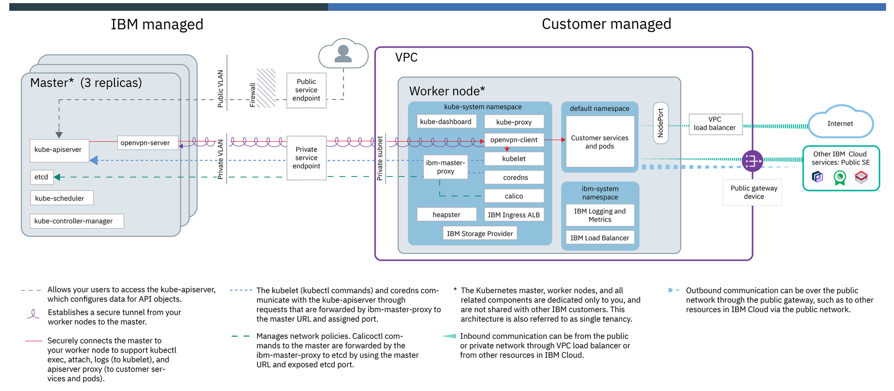
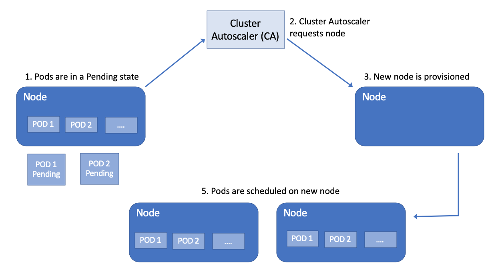

<!-- ## What is Kubernetes?

Containers are a good way to bundle and run your applications. In a production environment, you need to manage the containers that run the applications and ensure that there is no downtime. That’s how Kubernetes comes to the rescue! 

Kubernetes is an open source platform for managing containerized workloads and services across multiple hosts, and offers management tools for deploying, automating, monitoring, and scaling containerized apps. For an overview of Kubernetes, check [Kubernetes Clusters](https://cloud.ibm.com/docs/containers?topic=containers-overview#kubernetes_basics).
-->

## What is IBM Cloud Kubernetes Service (IKS)?

IBM Cloud Kubernetes Service is a managed offering to create your own Kubernetes cluster of compute hosts to deploy and manage containerized apps on IBM Cloud. As a certified Kubernetes provider, IBM Cloud Kubernetes Service provides intelligent scheduling, self-healing, horizontal scaling, service discovery and load balancing, automated rollouts and rollbacks, and secret and configuration management for your apps.

## IKS on VPC

To understand the sample cluster architectures and the components that are created in an IBM Cloud Kubernetes Service VPC cluster architecture, kindly refer this [link](https://cloud.ibm.com/docs/containers?topic=containers-service-arch#architecture_vpc).
It describes the default components that are setup and how they interact with each other. 

<!--
The following diagram describes the default components that are set up in an IBM Cloud Kubernetes Service VPC cluster architecture.

 
*Source:[IBM Cloud Kubernetes Service architecture](https://cloud.ibm.com/docs/containers?topic=containers-service-arch)*
-->
## Auto scaling of IKS

Automatic scaling in Kubernetes comes in two forms:

  - **Horizontal Pod Autoscaler (HPA)** scales the pods in a deployment or replica set. It is autoscaling at pod level. 
  
   

  It is implemented as a Kubernetes API resource and a controller. The controller manager queries the resource utilization against the metrics specified in each HorizontalPodAutoscaler definition. For more details, please refer [this](https://kubernetes.io/docs/tasks/run-application/horizontal-pod-autoscale-walkthrough/).

  - **Cluster Autoscaler (CA)** is the Kubernetes component that can be used to perform scaling nodes in a cluster. It periodically scans the cluster to adjust the number of worker nodes within the worker pools for pending pods to scales-up and to scale down underutilized worker nodes. The following diagram depicts the flow it works.
  
   

  To know more in detail, you can read [here](https://cloud.ibm.com/docs/containers?topic=containers-ca).