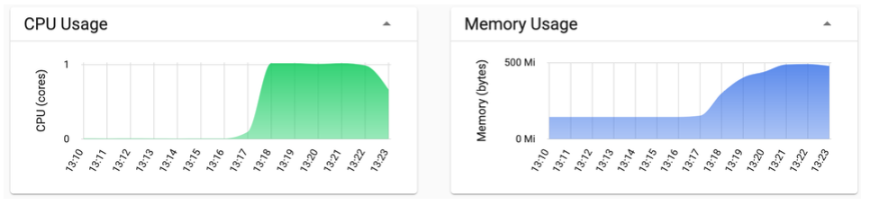
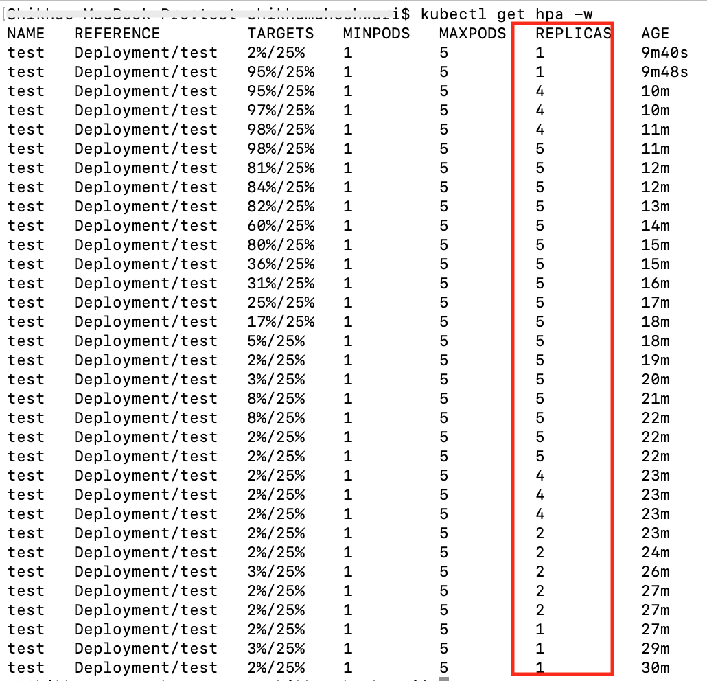

Before configuring `hpa`, please make sure you have deployed the application as explained in section `Deploy Application to IKS`.

## Configure a HPA resource

Run the following command to configure HPA.

```bash
kubectl autoscale deployment test --cpu-percent=25 --min=1 --max=5
```

This HPA scales up when CPU exceeds 25% of the allocated container resource.

You can view the HPA using kubectl. You probably will see `<unknown>/25%` for 1-2 minutes and then you should be able to see 0%/25%.

```bash
kubectl get hpa
```

## Generate load to trigger scaling

In the code repository, `generate-load-hpa.yml` is provided, which is used to increase the load on CPU. It creates 10 replicas of a container where each container calls CPU intensive operation in a loop.

- Modify `Ingress subdomain` in `generate-load-hpa.yaml` as shown.
  ```bash
  ## macOS
  $ sed -i '' s#HOST#<YOUR_INGRESS_SUBDOMAIN># generate-load-hpa.yaml

  ## Linux
  $ sed -i s#HOST#<YOUR_INGRESS_SUBDOMAIN># generate-load-hpa.yaml
  ```
- Run the following command from the terminal to increase load.

  ```bash
  kubectl create -f generate-load-hpa.yaml
  ```

## Monitor HPA

In a terminal, you can check the number of pods created.

```bash
kubectl get pods
```

In the another tab, watch the HPA with the following command:

```bash
kubectl get hpa -w
```

You will see HPA scale the pods from 1 up to our configured maximum (5).

The resource usage can also be checked through Kubernetes dashboard. Access the dashboard, it will show something like this.



You can now stop load using the following command.

```bash
kubectl delete deployment load-generator
```
You will notice that HPA will slowly bring the replica count to min number based on its configuration.



Once the replica count reaches to 1, it means it has scaled-down properly after decreasing load on CPU. Then we can clean-up the hpa configuration using the following command.

```bash
kubectl delete hpa test
```