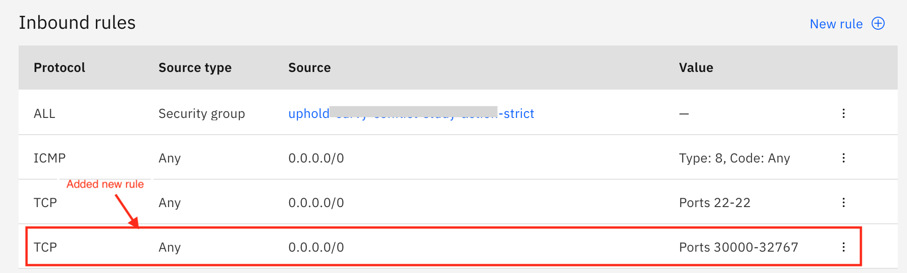
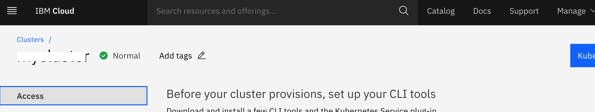

<AnchorLinks small>
  <AnchorLink>Create an instance of VPC Gen2</AnchorLink>
  <AnchorLink>Create IKS on VPC Infrastructure</AnchorLink>
  <AnchorLink>Install the IBM Cloud CLI and plug-ins</AnchorLink>
  <AnchorLink>Install Kubernetes CLI</AnchorLink>
  <AnchorLink>Gain access to your cluster</AnchorLink>
</AnchorLinks>

## Create an instance of VPC Gen2

Create a Virtual Private Cloud (VPC) on generation 2 compute with a subnet that is located in the zone where you want to create the cluster. Make sure to attach a public gateway to your subnet so that you can access public endpoints from your cluster.

Create a standard VPC Generation 2 compute cluster by using the IBM Cloud console. For more detailed information, please refer 
[here](https://cloud.ibm.com/docs/vpc?topic=vpc-creating-a-vpc-using-the-ibm-cloud-console). 

Once VPC is created, you need to edit the default security group to allow incoming network traffic from the VPC load balancers. Follow the steps given [here](https://cloud.ibm.com/docs/containers?topic=containers-vpc-firewall#security_groups_ui)
for opening security group ports via console. 
After editing, the Default Security Group of your VPC will show Inbound rules as shown in snapshot below.

 

## Create IKS on VPC Infrastructure

Follow the instructions given [here](https://cloud.ibm.com/docs/containers?topic=containers-getting-started#vpc-classic-gs) and create an IKS instance on VPC. For this pattern, we have created IKS which has worker pool (2vCPU and 4GB RAM) with three worker nodes. Once created, wait for some time (~40 minutes) for the cluster to get ready. 

## Install the IBM Cloud CLI and plug-ins

It includes the installation of these CLIs and plug-ins:

  1. IBM Cloud CLI (ibmcloud)
  2. IBM Cloud Kubernetes Service plug-in (ibmcloud ks)
  3. IBM Cloud Container Registry plug-in (ibmcloud cr)

Refer to the [link](https://cloud.ibm.com/docs/containers?topic=containers-cs_cli_install#cs_cli_install_steps) to install these.

## Install Kubernetes CLI

To work with your cluster, you need to install the Kubernetes CLI. Please refer this [link](https://cloud.ibm.com/docs/containers?topic=containers-cs_cli_install#kubectl). 

## Gain access to your cluster

Go to IBM Cloud dashboard and navigate to your Kubernetes cluster. Click on the `Access` tab as shown below.

 

Perform the steps given in `access` tab.

<InlineNotification>

**NOTE:**
Need to complete these configuration steps every time that you work with your cluster.

</InlineNotification>

Verify the environment using the following command.

```bash
kubectl config current-context
```

It should return the details of the cluster that you are planning to work with.

