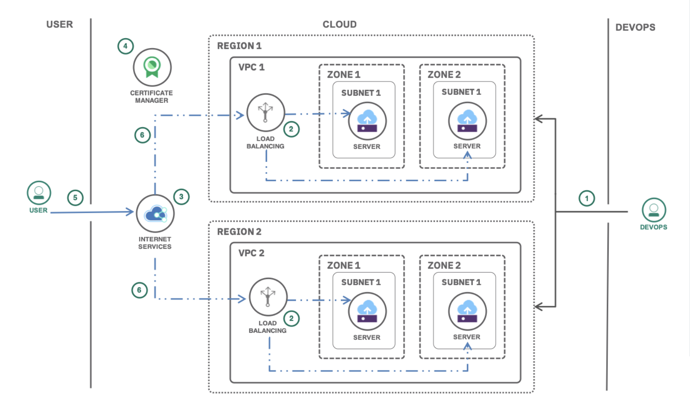
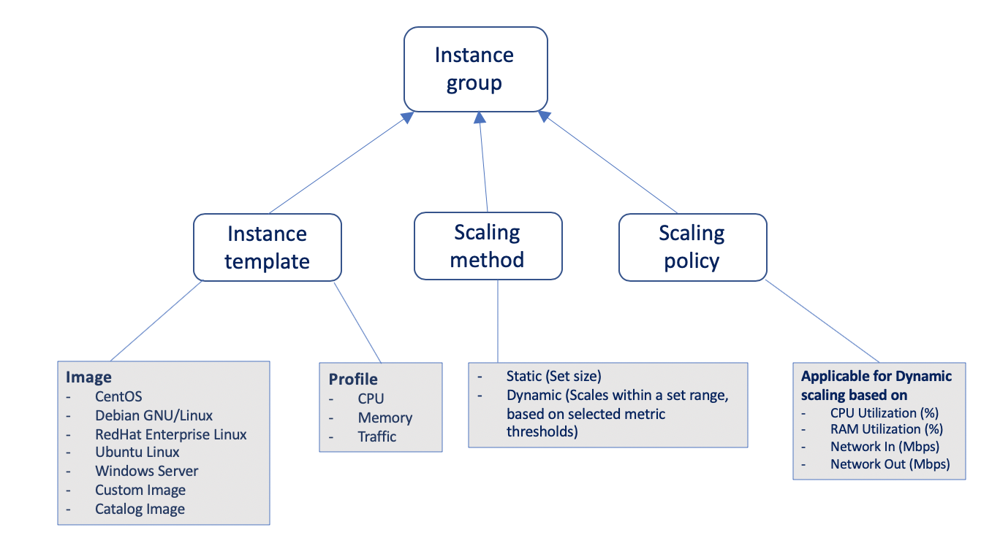

### What is a Virtual Private Cloud(VPC)?

A virtual private cloud (VPC) is a public cloud offering that lets an enterprise establish its own private cloud-like computing environment on shared public cloud infrastructure. A VPC gives an enterprise the ability to define and control a virtual network that is logically isolated from all other public cloud tenants, creating a private, secure place on the public cloud.
Imagine that a cloud provider’s infrastructure is a residential apartment building with multiple families living inside. Being a public cloud tenant is akin to sharing an apartment with a few roommates. In contrast, having a VPC is like having your own private condominium—no one else has the key, and no one can enter the space without your permission.
A VPC’s logical isolation is implemented using virtual network functions and security features that give an enterprise customer granular control over which IP addresses or applications can access particular resources. It is analogous to the “friends-only” or “public/private” controls on social media accounts used to restrict who can or can’t see your otherwise public posts.

### What is a Virtual Server Instance(VSI)?

IBM Cloud™ Virtual Servers are scalable virtual servers that are purchased with cores and memory allocations. They are a great option if you are looking for compute resources, that can be added in minutes, with access to features like image templates. With virtual server instances for VPC, you can quickly provision instances with high network performance. When you provision an instance, you select a profile that matches the amount of memory and compute power that you need for the application that you plan to run on the instance. Instances are available on both x86 and POWER architectures. After you provision an instance, you control and manage those infrastructure resources. 

Virtual server instances for VPC give you access to all of the benefits of IBM Cloud VPC, including network isolation, security, and flexibility. 

You can deploy isolated workloads across multiple locations and zones. Below is a sample deployment architecture.

  

### Auto-scaling on VPC

With auto scale for VPC, you can improve performance and costs by dynamically creating virtual server instances to meet the demands of your environment. You set scaling policies that define your desired average utilization for metrics like CPU, memory, and network usage. You can create an instance group in your IBM Cloud VPC to auto scale according to your requirements by using the IBM Cloud console. Based on the target utilization metrics that you define, the instance group can dynamically add or remove instances to achieve your specified instance availability. 

  

### Monitoring and Billing

The number of Virtual Server instances can be monitored on the IBM Cloud Dashboard. The resource usage such as CPU, memory or disk for the individual Virtual Server can also be monitored on the IBM Cloud Dashboard.

<InlineNotification>

###### Instructions to set up and test auto scale of VSI on VPC

In the next couple of sections we will see how to set up auto scale of VSI on VPC, and see the auto-scale in action.  

</InlineNotification>

