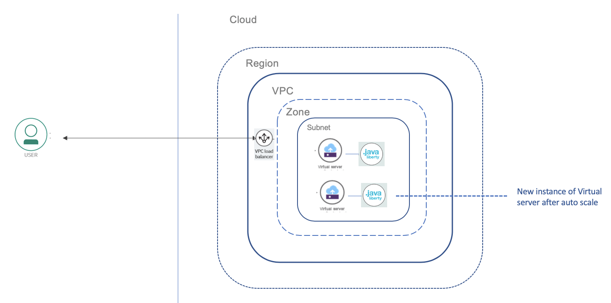
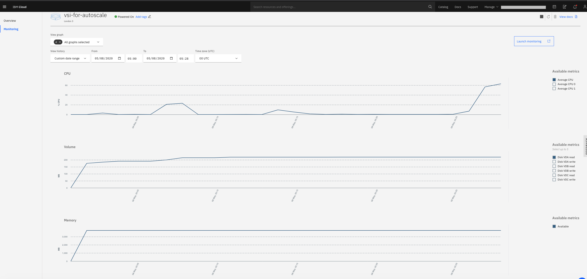

## Run application

You can choose between the below two algorithms to load the CPU. Invoke the endpoint to load the VSI.

- Computes Fibonacci series upto 1000000000. The count specifies the number of times the algorithm will run.
```
http://[IP address]:9080/autoscale-webapp/LoadCPUFibonacci?count=100
```

- Computes square roots for all numbers less than 1000000. The count specifies the number of times the algorithm will run.
```
http://[IP address]:9080/autoscale-webapp/LoadCPUSquareRoot?count=100
```

The application will increase CPU usage and trigger an auto scale. After the auto scale completes, there will be a new instance of the Virtual Server created.

  


## Monitor

The number of Virtual server instances can be monitored on the IBM Cloud console.
   

The resource usage can be monitored on the VSI console.

   

