### Test architecture

For our auto scale test, we will create one instance of VPC and configure autoscale on it. The minimum number of virtual server instance will be one. A WAS Liberty server with a J2EE application  will be deployed on the Virtual Server through a user data script that we will specify in the auto scale instance template configuration.

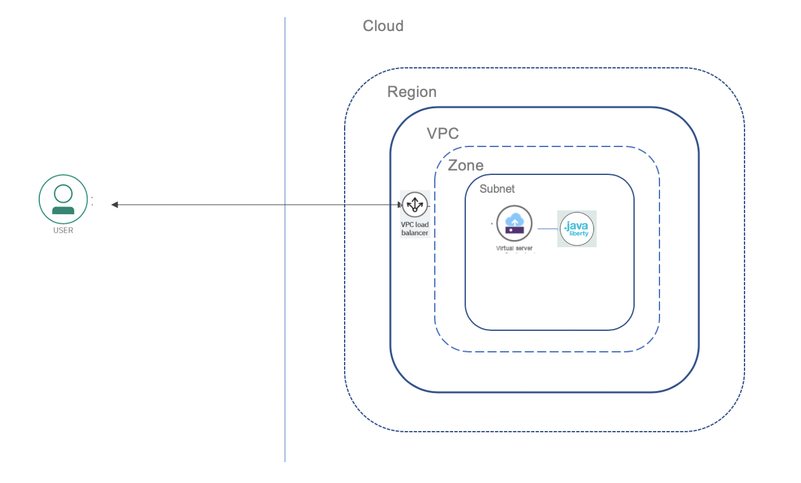   

### Create an instance of Virtual Private Cloud

Click [here](https://cloud.ibm.com/vpc-ext/provision/vpc) to create an instance of VPC from the catalog.

Configure as shown below. Please make sure you specify `Name` for VPC,`Name` for subnet and enable `Public gateway`. Click `Create Virtual Private Cloud` to create a VPC instance.

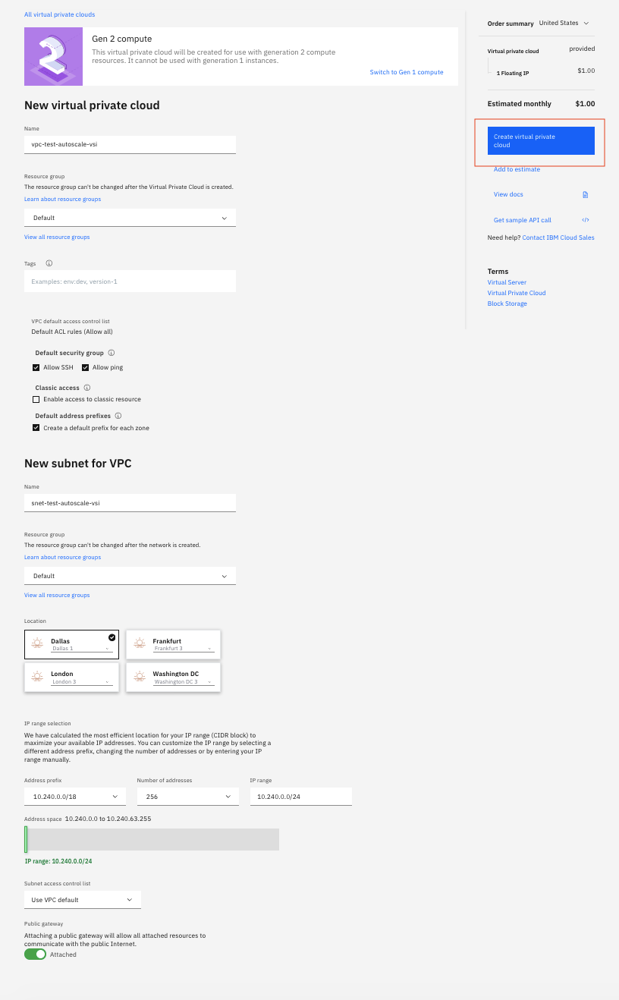   


### Create an Instance template

Select `Instance templates` in the menu.

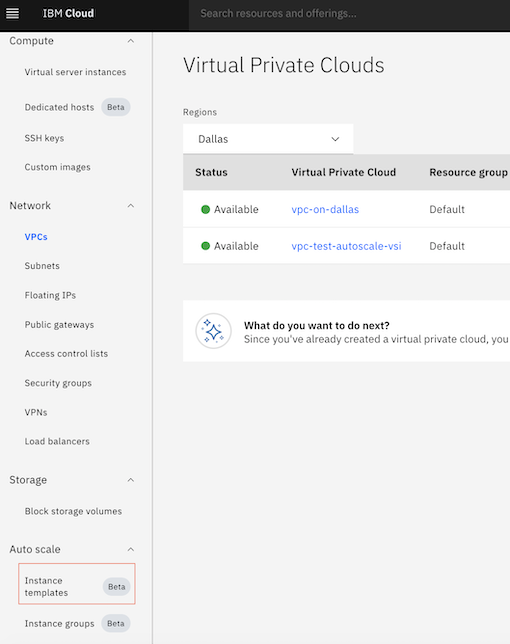   

Select `New instance template`.

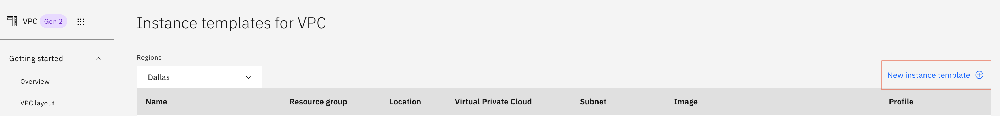 

Please configure as shown below. Please ensure that you specify `Name` for instance, `Virtual Private Cloud` we created earlier, `Location`(Dallas), `Image`(Ubuntu),`Profile`(4 vCPU, 4GB RAM, 4Gbps), `SSH keys`(Create one if not done before) and `User data`(please see next image for specifying user script).

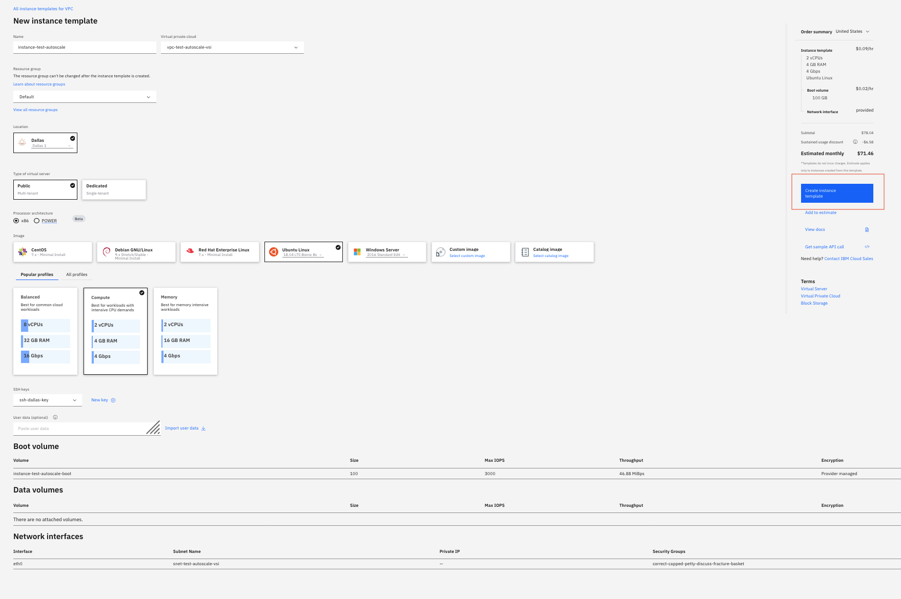 


Enter user data for application deployment. 

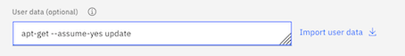 

```
#!/bin/sh
wget https://raw.githubusercontent.com/IBM/cloud-enterprise-examples/master/artifacts/auto-scale/vsi-vpc/scripts/install-script
chmod +x install-script
./install-script
```

Click `Create instance template`.

### Create a load balancer

Select `Load balancers` from the menu.

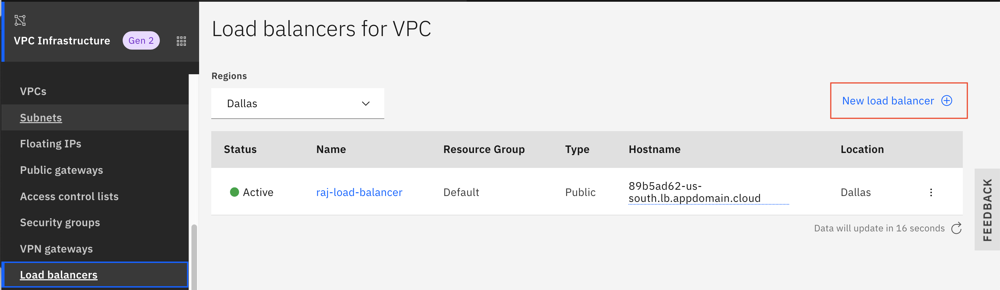 

Click on `New load balancer`. Configure the load balancer as shown below. Please make sure you specify `Name` for load balancer, `Virtual Private Cloud` we created earlier, `Location` and `subnet` we specified during VPC creation.

Click `Create load balancer`.

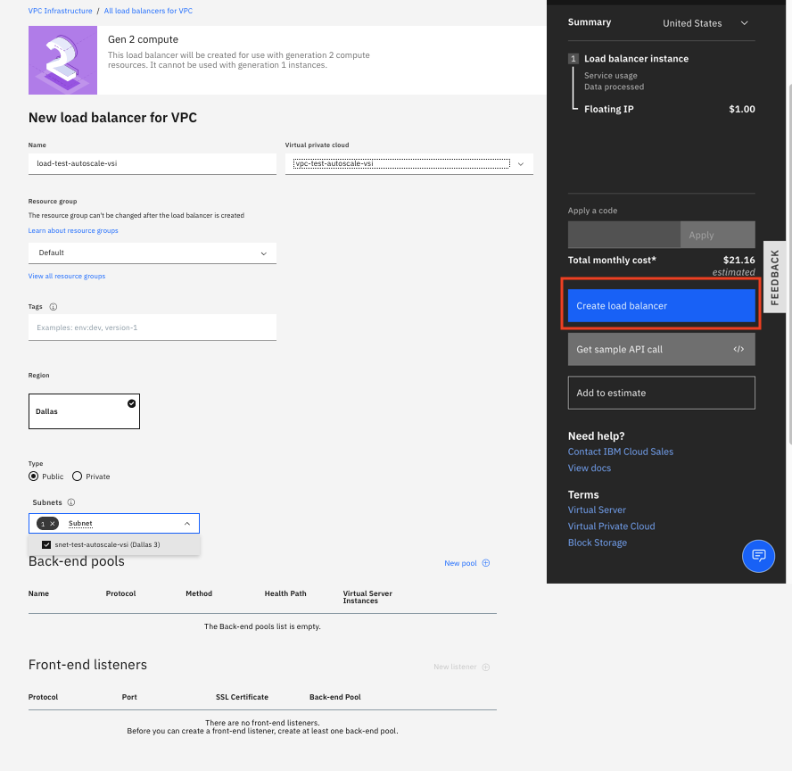 


#### Create a back end pool

Click on the newly created load balancer. Select `Back-end pools` on the menu and select `New Pool`.

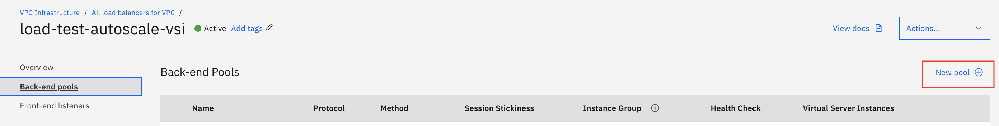 

Please specify details as shown below and click `Save`.

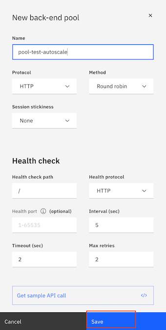 


#### Create a front end listener

Next, select `Front-end listeners` on the menu and select `New listener`.

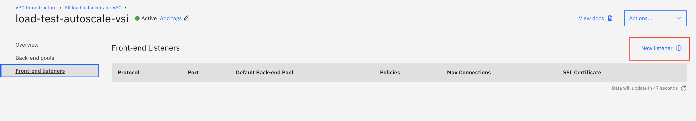 

Please specify details as shown below and click `Save`.

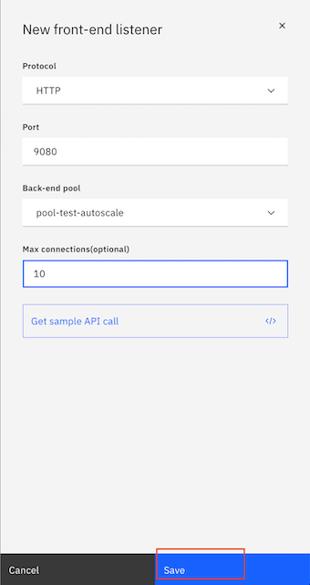 

### Create an Instance group

Select `Instance groups` from the menu.

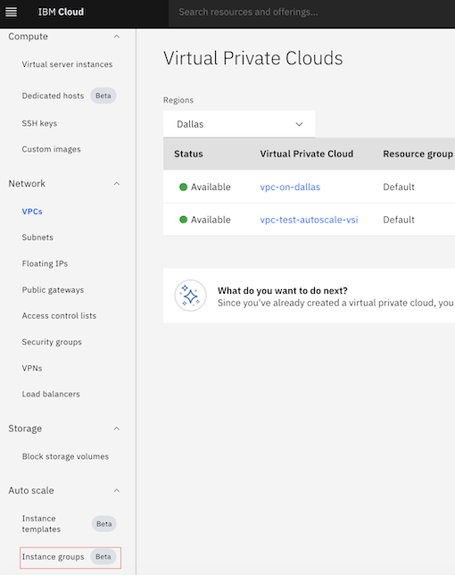 

Click on `New instance group`. Configure the instance group as shown below. Please make sure you specify `Name` for group, `Virtual Private Cloud` we created earlier, `Location`,`subnet` we specified during VPC creation, `load balancer` we created earlier, `Select instance template` we created earlier, `Choose Scaling method`(Select method as Dynamic),`Set instance group size`(Minimum:1, Maximum:3,Aggregation Window:90, Cooldown period(120) and `Create scaling policies`. We have set the target utilization in the scaling policy as 20%. 

Click `Create instance group`.

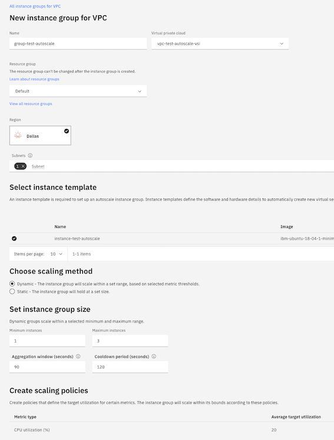 


### Test application 

View the created VSI on the console:

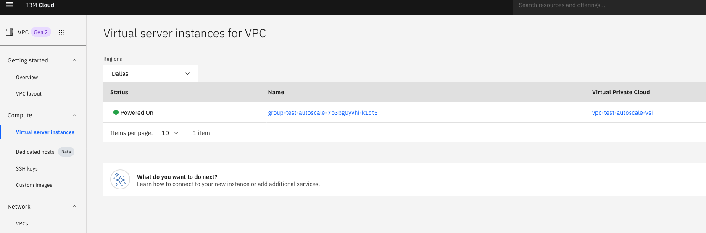 

Reserve IP:

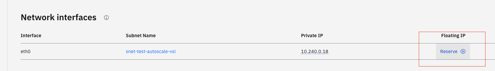 

Copy IP:
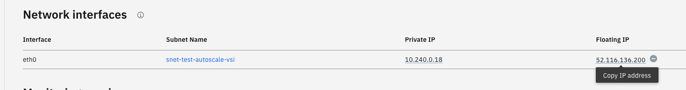 

Invoke the below endpoint to test deployment
```
http://[IP address]:9080/autoscale-webapp/HelloWorldServlet
```
This endpoint returns "Hello World" string. This can be used to test if the application deployed successfully.

