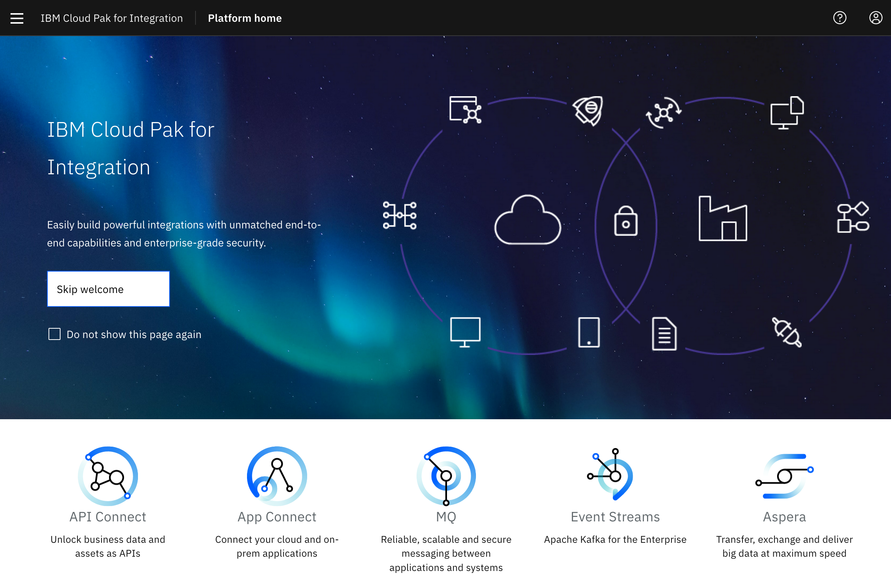

<PageDescription>

Learning tasks for developers working with Cloud Pak for Integration

</PageDescription>

<InlineNotification>

Before you proceed, make sure you have an IBM GSI Sandbox invite. It enables you to access an IBM Cloud account with the <a target="_blank" href="https://ibm-garage-cloud.github.io/ibm-garage-developer-guide/overview">Developer Tools environment</a> already installed and ready for you to use, including both a Kubernetes cluster and an OpenShift cluster. (The environment is locked down to prevent creating any new services.) Also, before proceeding:
- Install the <a target="_blank" href="https://ibm-garage-cloud.github.io/ibm-garage-developer-guide/getting-started/cli">IBM Garage for Cloud CLI</a> (again) to ensure you have the latest version

</InlineNotification>

This learning journey focuses on Cloud Pak for Integration (CP4I) and it has been installed with single sign on in the IBM Cloud in the same way a client
  would have it configured for their account. This gives you access to all the software that is included in the
   **CP4I** offering, see the welcome screen below.   
   

   
This learning tasks assumes that you have:
 - Reviewed the content from the Agenda: [IBM Cloud Pak for Integration](/enablement/agenda#ibm-cloud-pak-for-integration)
 - Seen a demo of each of the tasks below from the Video Presentation

### Learning Tasks

The learning tasks help you get a good understanding of the key usecases for Cloud Pak for Integration. 

| Task                            | Description         | Link        | Time    |
| ---------------| -------------------------------  |:----------- |---------|
| Introduction | Introduction to IBM Cloud Pak for Integration  |  [Introduction](https://www.ibm.com/cloud/cloud-pak-for-integration)  | 1 hour |
| Review | IBM Garage Reference Architecture for Integration  | [Reference Architecture](https://www.ibm.com/cloud/garage/architectures/modern-integration) | 1 Hour |
| Integration Modernization |  Agile Integration Architecture | [Agile Architecture](https://www.ibm.com/cloud/integration/agile-integration) | 1 Hour |
| Videos | Product Tours and Hands on lab for Cloud Pak for Integration | [Product Tours](https://www.ibm.com/demos/collection/Cloud-Pak-for-Integration/)  | 4 hours |
| Review Asset Repository | Review the IBM Garage and Solution Engineering teams Asset repository | [Asset Repository](https://ibm-cloud-architecture.github.io/deliverables/integration.html) | 4 hours |
| Labs 1 | Enable order processing flow using Event Streams, App Connect, MQ , API Connect and Asset Repository | [Lab](https://github.ibm.com/rsundara/cp4i-labs/tree/master/lab1) | 2 Hours |
| Product Education | Education for products contained in the Cloud Pak for Integration | [Product Education](https://www.ibm.com/services/learning/ites.wss/zz-en?pageType=journey_category&c=&tag=o-itns-01-02) | Self Paced |

Once you have completed these tasks, you will have completed these learning tasks. You will now have an understanding of the IBM Cloud 
  approach to using **CP4I** in Integration Solutions.

### Review Learning Tasks

Working with colleagues review your learning tasks. The GSI team is looking for feedback from three perspectives:

- **What went well?**
- **What needs improvement?**
- **Next steps?**