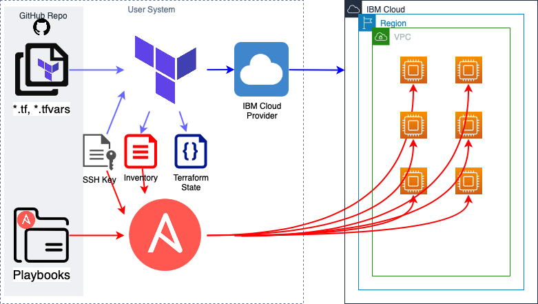
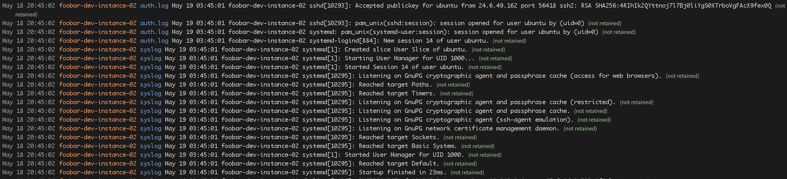
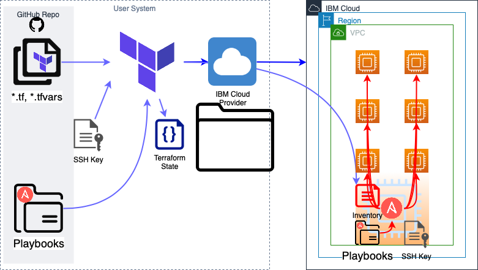

<PageDescription>

Configure the provisioned instance using Ansible

</PageDescription>

<AnchorLinks small>
  <AnchorLink>Ansible Introduction</AnchorLink>
  <AnchorLink>Ansible and Terraform Integration</AnchorLink>
  <AnchorLink>Final Terraform and Ansible Code</AnchorLink>
  <AnchorLink>Ansible from a Bastion Host</AnchorLink>
  <AnchorLink>Clean up</AnchorLink>
</AnchorLinks>

Terraform is great for infrastructure provisioning but it's not a configuration management tool. That's where Ansible comes in. After Terraform finishes the provisioning of an instance, control goes to Ansible to finish up the configuration of the instance system and applications.

<InlineNotification>

**Other Configuration Management Tools**

Ansible is a Configuration Management Tool but is not the only one. There are others such as [Puppet](https://puppet.com), [Chef](https://www.chef.io) and [SaltStack](https://www.saltstack.com). This pattern explains how to use Ansible for Configuration Management after Terraform finishes the Provisioning and creates the input data for Ansible. In a similar way you can setup the input data for Puppet, Chef, SaltStack or other configuration management tools.

</InlineNotification>

## Ansible Introduction

Ansible is one of the most used Configuration Management tools, it's simple and easy to learn. Ansible use SSH to connect to the servers or instances to execute the configuration tasks defined in YAML files or playbooks. Ansible tasks are idempotent, this means that they can be applied multiple times without changing the result beyond the initial application, this is what makes Ansible reliable and differentiates it from some other configuration management tools.

To use Ansible we need one host with Ansible, the playbooks and all the Ansible configuration files. There are different designs, the one shown in this example is to use Ansible from the same host where Terraform is executed. The Terraform and Ansible example code is in the GitHub repository https://github.com/IBM/cloud-enterprise-examples/ in the directory [12-ansible](https://github.com/IBM/cloud-enterprise-examples/tree/master/iac/12-ansible).



### Install Ansible

Install Ansible in the same host where Terraform is installed. Follow these [instructions](https://docs.ansible.com/ansible/latest/installation_guide/intro_installation.html) to install Ansible on your platform. However, the most generic way to install Ansible is using `pip` (Python package manager).

```bash
pip install --user ansible
```

If you are on MacOS, other option to install Ansible is using `brew`, it'll install Ansible and its dependencies.

```bash
brew install ansible
```

To verify Ansible is correctly installed, just execute `ansible --version` and you should get the latest version, at the time this document is written, it's version `2.9.7`.

The use case exposed in this section is to install to the LogDNA agent on the instance for log analysis. All the hosts require the LogDNA agent to send the logs to the LogDNA service.

### Infrastructure Setup

Clone the example project and go to the `12-user-data/start` folder. You will already need to have set up the terraform cli and the API key for terraform as described in [Setup Environment](/iac/setup-environment). Run these commands to initially deploy the virtual machines for the Ansible examples.

```bash
terraform init
terraform plan
terraform apply
```

### Inventory File

The first file used by Ansible is the inventory file with the list of hosts to configure. The [inventory file documentation](https://docs.ansible.com/ansible/latest/user_guide/intro_inventory.html) shows all the possible parameters and variables you can set. Create a `inventory.yaml` file in the `12-ansible/start` folder with the content below, but update with the IP addresses output from `terraform apply`.

```yaml path=inventory.yaml
all:
  vars:
    ansible_user: ubuntu
    ansible_ssh_private_key_file: ~/.ssh/id_rsa
    ansible_ssh_common_args: "-o StrictHostKeyChecking=no"
  children:
    appservers:
      hosts:
        52.116.136.206:
        52.116.132.187:
        52.116.136.220:

```

As the example progresses, we will add more information into this file such as variables and the hostnames, for now we just need the IP addresses grouped by server tier (`appserver`) and the following ansible variables:

- `ansible_user` defines the user to login into the hosts, in this case is `ubuntu` user
- `ansible_ssh_private_key_file` path to the private SSH key used to login to the hosts, if you [used the public key](/iac-resources/compute) `~/.ssh/id_rsa.pub` then provide the private key `~/.ssh/id_rsa` pair
- `ansible_ssh_common_args` this variable set extra parameters to the SSH command used by Ansible to connect to the hosts. With no extra arguments SSH will ask confirmation to the user to add the keys to the `known_hosts` file. Add the parameter `-o StrictHostKeyChecking=no` to make this process non-interactive. This can also be achieved with the setting `host_key_checking = False` into the `ansible.cfg` file in the same directory.

To verify we can reach the hosts we execute Ansible using the `ping` module.

```bash
ansible all -m ping -i inventory.yaml
```

### Playbook and Roles

A [Playbook](http://docs.ansible.com/playbooks_intro.html) is yaml files with a set of tasks or roles to be executed. A [Role](https://docs.ansible.com/ansible/latest/user_guide/playbooks_reuse_roles.html) is a collection of related tasks and handlers, to encapsulate data such as variables, files, templates and metadata, to execute one specific macro-task. For example, our (macro) task is to get LogDNA up and running on a given host, to execute this task we need to execute (atomic) tasks to install packages, execute configuration commands and start services, using the given configuration parameters (data in form of variables). We can use any of the open sourced [Ansible Galaxy Roles](https://galaxy.ansible.com) but in this example we'll create a simple role.

Still working in the `start` directory, create the directory path `roles/logdna` and inside the directory a `tasks` sub-directory with the file `main.yaml`. Normal convention with Ansible will often add directories such as `handlers`, `defaults`, `vars`, `files`, `templates` and `meta` but they are not needed and are out of the scope of this article.

```bash
mkdir -p roles/logdna/tasks
```

This example only covers the installation of LogDNA. If you'd like to install or configure something else such as deploing the API application or deploying the initial database, then you would create more roles under the directory `roles` for those tasks.

Inside the file `roles/logdna/tasks/main.yaml`

```yaml path=roles/logdna/tasks/main.yaml
- debug:
    msg: "Checking Ansible is working!"
```

We'll develop the tasks role more, but for now let's have a debug message just to verify it's working.

To tell Ansible which roles to execute, create the following playbook file named `playbook.yaml`.

```yaml path=playbook.yaml
- hosts: all
  become: yes
  roles:
    - role: logdna
```

This playbook file instructs Ansible to execute the instructions on `all` hosts. The instructions should be executed as root, so the `become: yes` is used. And finally, we list all the roles to run on every host. You may have a list of roles per host groups such as `appservers` or `dbservers`. Then execute the playbook with the `ansible-playbook` command, like so.

```bash
ansible-playbook -i inventory.yaml ./playbook.yaml
```

You should see, among a bunch of lines, the following lines starting with `ok` and at the end a report summary like the following.

```text
ok: [52.116.136.206] => {
    "msg": "Checking Ansible is working!"
}
ok: [52.116.132.187] => {
    "msg": "Checking Ansible is working!"
}
ok: [52.116.136.220] => {
    "msg": "Checking Ansible is working!"
}

52.116.132.187             : ok=2    changed=0    unreachable=0    failed=0    skipped=0    rescued=0    ignored=0
52.116.136.206             : ok=2    changed=0    unreachable=0    failed=0    skipped=0    rescued=0    ignored=0
52.116.136.220             : ok=2    changed=0    unreachable=0    failed=0    skipped=0    rescued=0    ignored=0
```

### Modules

Ansible uses [modules](http://docs.ansible.com/modules_by_category.html) to perform most tasks. In this example we'll use a few modules to install packages for Ubuntu, executing commands, writing files, and handling the services.

<InlineNotification>

**Running a single module**

It's possible to just execute a single module or task with the `ansible` command. This is very handy when you need to execute a command for a group of hosts. However, excessive use of this approach is a bad practice, if this command is required frequently then it should be in a role or playbook.

An example of a single task or module execution is the previous ansible line using `ping` to verify the hosts are accessible. Another example may be using the `apt` module to install a package:

```bash
ansible all -s -m apt -a 'pkg=nginx state=installed update_cache=true'
```

</InlineNotification>

In the `logdna/tasks/install.yaml` file use the following modules to install the LogDNA packages.

```yaml path=logdna/tasks/install.yaml
- name: LogDNA Agent Package Public Key
  apt_key:
    url: https://repo.logdna.com/logdna.gpg

- name: LogDNA Agent Repository
  apt_repository:
    repo: deb https://repo.logdna.com stable main

- name: Install LogDNA Agent
  apt:
    state: present
    name: logdna-agent
    allow_unauthenticated: true
    update_cache: true
```

Every task can start with the key `name` to document or describe the task, this text is printed on the console when it's executed. All the modules in this file deal with `apt`, the package manager of Debian and Ubuntu. Here are links to the documentation of each module to know the different parameters that can be used.

- [apt_key](https://docs.ansible.com/ansible/latest/modules/apt_key_module.html) is used to add, remove or download apt keys
- [apt_repository](https://docs.ansible.com/ansible/latest/modules/apt_repository_module.html) to add or remove APT repositories
- [apt](https://docs.ansible.com/ansible/latest/modules/apt_module.html) to install, remove, upgrade, update and manage in general APT packages on Debian and Ubuntu

Create the file `logdna/tasks/configure.yaml` to execute the tasks to configure LogDNA.

```yaml path=logdna/tasks/configure.yaml
- name: Setting LogDNA Ingestion Key
  shell: "logdna-agent -k {{ conf_key }}"
  when: conf_key != ""

- name: Adding Log Directories
  shell: "logdna-agent -d {{ conf_logdir }}"
  when: conf_logdir != ""

- name: Adding API Host
  shell: "logdna-agent -s LOGDNA_APIHOST={{ logdna_api_host }}"
  when: logdna_api_host != ""

- name: Adding Log Host
  shell: "logdna-agent -s LOGDNA_LOGHOST={{ logdna_log_host }}"
  when: logdna_log_host != ""

- name: Setting Tags for This Host
  shell: "logdna-agent -t {{ conf_tags }}"
  when: conf_tags != ""
```

In this file we only use the [shell](https://docs.ansible.com/ansible/latest/modules/shell_module.html) module to execute commands on the host. This module is useful when there is no module to do the tasks we want or need. However, exercise caution with the shell module because the outcome of the execution of these commands may not be idempotent, breaking the main characteristics of Ansible.

Here we use the `when` [conditional directive](https://docs.ansible.com/ansible/latest/user_guide/playbooks_conditionals.html) to execute a task only if the output of the condition is True.

In this file we also use [Ansible variables](https://docs.ansible.com/ansible/latest/user_guide/playbooks_variables.html) enclosed with `{{ }}`, these variables can be set in different forms, in our case we'll set them in the inventory and the default values in the role.

The default variable values or the role variable values are important in case you execute this role alone on any environment. For example to test the role or playbook with Vagrant or Docker and the default variable values will be used. Other sources of the role variables is they can be local variables, you may have variables that are set from other values provided by the user or constant values. Define some variable default values in the role file `roles/logdna/defaults/main.yaml`:

<!-- TODO: find default values for the following variables -->

```yaml path=logdna/defaults/main.yaml
conf_tags: ""
conf_logdir: "" # default to /var/log

logdna_api_host: api.us-south.logging.cloud.ibm.com
logdna_log_host: logs.us-south.logging.cloud.ibm.com
```

We are not setting a default for `conf_key` because the log ingestion key is only provided by the user and associated with a specific service instance. Values for variables provided by the user come from the inventory file `inventory.yaml` so we add the following variables in the `vars:` section (update with values from your LogDNA instance, the api and log host may be the same if you are using us-south).

```yaml
all:
  vars:
    ansible_user: ubuntu
    ansible_ssh_private_key_file: ~/.ssh/id_rsa
    ansible_ssh_common_args: "-o StrictHostKeyChecking=no"

    # Input Variables:
    conf_key: e86611977....
    conf_logdir: /var/log
    conf_tags: app=movies,environment=dev
    logdna_api_host: api.us-south.logging.cloud.ibm.com
    logdna_log_host: logs.us-south.logging.cloud.ibm.com

  children:
    appservers:
      hosts:
        52.116.136.206:
        52.116.132.187:
        52.116.136.220:
```

The last step in the LogDNA install is to startup the LogDNA agent service, let's do that in the file `logdna/tasks/service.yaml`, like so.

```yaml path=logdna/tasks/service.yaml
- name: Activating LogDNA Agent Service
  shell: "update-rc.d logdna-agent defaults"

- name: Start LogDNA agent
  service:
    name: logdna-agent
    enabled: true
    state: "{{ agent_service }}"
  when: (conf_key != "" and agent_service) or agent_service == "stopped"

- debug:
    msg: "LogDNA Agent has {{ agent_service }}!"
  when: (conf_key != "" and agent_service) or agent_service == "stopped"
```

Here we again use the `shell` module to activate the service and the module [service](https://docs.ansible.com/ansible/latest/modules/service_module.html) to set the state of the service to the value of the variable `agent_service`. The possible values, according to the documentation, can be `started`, `stopped`, `restarted` and `reloaded`. Again, we use the directive `when` to print the message notifying the state of the agent.

This also requires to add the variable `agent_service` to the default role variables, not to the inventory because in this user case the required action is to have the service up and running.

```yaml path=logdna/defaults/main.yaml
agent_service: started
logdna_api_host: api.us-south.logging.cloud.ibm.com
logdna_log_host: logs.us-south.logging.cloud.ibm.com
```

To link all these files to the playbook we call them from the `main.yaml` file of the role, replace the content of the file for the following lines.

```yaml path=roles/logdna/tasks/main.yaml
- include_tasks: ./install.yaml

- include_tasks: ./configure.yml

- include_tasks: ./service.yaml
```

To run this code to let Ansible install and configure LogDNA on every host created we just need to execute the `ansible-playbook` command like before.

```bash
ansible-playbook -i inventory.yaml ./playbook.yaml
```

After this has completed running, you can open the LogDNA dashboard and then connect to one of the virtual machines over ssh.

```bash
IPADDR=$(terraform output -json ip_address | jq .[0] | tr -d \")
ssh ubuntu@$IPADDR
```

Over in LogDNA output similar to the following will appear as a result of the login to the system.



This completes the walk through of the general Ansible flow. Next, this example will show how to integrate Terraform with Ansible working from the `12-ansible` folder where the final code resides. To clean up from the `start` directory, execute `terraform destroy` before moving on to the next section.

```bash
terraform destroy
```

## Ansible and Terraform Integration

Everything to this point of the example still requires the user to manually configure the values in the inventory and then execute Ansible manually. To automate this process we use Terraform to manage all of the steps, chaining to the Ansible execution. After the changes shown here, `terraform` it will be the only command to execute.

Change to the `12-ansible` folder to review the final code and create the `terraform.tfvars` file specified below.

The first part is to automatically populate the Ansible inventory file. This is done with Terraform template files. Move the `inventory.yaml` file to a new `templates` directory and rename it to `templates/inventory.tmpl.yaml` with the following content.

```yaml path=templates/inventory.tmpl.yaml
all:
  vars:
    ansible_user: ubuntu
    ansible_ssh_private_key_file: ${private_key_file}
    ansible_ssh_common_args: "-o StrictHostKeyChecking=no"

    # Input Variables:
    conf_key: ${logdna_ingestion_key}
    conf_logdir: /var/log
    conf_tags: app=${project_name},environment=${environment}
    logdna_api_host: ${logdna_api_host}
    logdna_log_host: ${logdna_log_host}

  children:
${appservers}
```

<InlineNotification>

**LogDNA ingestion key**

This Terraform code does not include the provisioning or configuration of LogDNA on IBM Cloud. This has to be done manually following the instructions from the [Logging pattern](logging/content-overview). Once the instance is created, get the service instance Ingestion Key and the API and Log hostnames to set them in the terraform variables as explained below.

</InlineNotification>

This architecture design requires direct access from your host to the provisioned instances, therefore every instance requires a public Floating IP, enable the Floating IPs by adding to the `network.tf`.

```hcl path=network.tf
resource "ibm_is_floating_ip" "iac_app_floating_ip" {
  name   = "${var.project_name}-${var.environment}-ip-${format("%02s", count.index)}"
  target = ibm_is_instance.iac_app_instance[count.index].primary_network_interface.0.id
  count  = var.max_size
}
```

The Terraform code to generate the template is as follows, in a new file called `configuration.tf` to handle all the Ansible configuration.

```hcl path=configuration.tf
data "template_file" "inventory" {
  depends_on = ibm_is_instance.iac_app_instance
  template = file("${path.module}/inventory.yaml")
  vars = {
    private_key_file = pathexpand(var.private_key_file)
    logdna_ingestion_key = var.logdna_ingestion_key
    project_name = var.project_name
    environment = var.environment
    logdna_api_host = var.logdna_api_host
    logdna_log_host = var.logdna_log_host
    appservers = format("    appservers:\n      hosts:\n%s", join("", formatlist("        %s:\n", ibm_is_floating_ip.iac_app_floating_ip[*].address)))
  }
}


data "local_file" "inventory" {
  filename = "${path.module}/inventory.yaml"
  content  = data.template_file.inventory.rendered
}
```

Notice the use of `format` and `formatlist` to render from the list of Floating IP addresses `ibm_is_floating_ip.iac_app_floating_ip[*].address` output like this:

```yaml
    appservers:
      hosts:
        52.116.136.206:
        52.116.132.187:
        52.116.136.220:
```

The template also has additional input variables for the Ansible playbook that are not created by Terraform code so they are required as Terraform user input. Add them to the `variables.tf` file and the values to the `terraform.tfvars` file (which is or should be in `.gitignore`)

```hcl path=variables.tf
variable "logdna_ingestion_key" {}
variable "logdna_api_host" {
  default = "api.us-south.logging.cloud.ibm.com"
}
variable "logdna_log_host" {
  default = "logs.us-south.logging.cloud.ibm.com"
}
variable "private_key_file" {
  default = "~/.ssh/id_rsa"
}
```

```hcl path=terraform.tfvars
logdna_ingestion_key = "e86611977...."
logdna_api_host = "api.us-south.logging.cloud.ibm.com"
logdna_log_host = "logs.us-south.logging.cloud.ibm.com"
```

Executing this code will generate a `inventory.yaml` file which should be ignored in the GitHub repository as it's a dynamically generated file, so add the filename to the `.gitignore` file.

```bash
echo 'inventory.yaml' >> .gitignore
```

Having the inventory ready everything ready to execute `ansible-playbook` but the idea is to automate everything so we are going to make Terraform execute Ansible for us with the following `local-exec` provisioner inside a `null_resource` block in the `configuration.tf` file.

```hcl
resource "null_resource" "ansible" {
  depends_on = [local_file.inventory]

  provisioner "local-exec" {
    command = "ansible-playbook -i ${path.module}/inventory.yaml ${path.module}/playbook.yml"
  }
}
```

This is fine but the Ansible command has to be executed when the instance is up and running and as we know Terraform (with this example) doesn't know when the instance is ready. For example, the Cloud-Init code may be still running when Terraform ends. There is a trick to overcome this. Running a `remote_exec` to execute any command in the instance will make Terraform to wait for the Floating IP and the instance to be ready.

Add the following `null_resource.waiter` block into the `configuration.tf` file and make the `template_file.inventory` to depend on it.

```hcl
resource "null_resource" "waiter" {
  depends_on = [ibm_is_instance.iac_app_instance, ibm_is_floating_ip.iac_app_floating_ip]

  count  = var.max_size

  provisioner "remote_exec" {
    inline = ["hostname"]

    connection {
      user = "ubuntu"
      host = ibm_is_floating_ip.iac_app_floating_ip[count.index].address
      private_key = file(pathexpand(var.private_key_file))
      timeout = "5m"
    }
  }
}

data "template_file" "inventory" {
  depends_on = [null_resource.waiter]
  ...
}
```

The `null_resource.waiter` resource makes a connection to every provisioned instance to execute any command, i.e. `hostname`, when the connection and the command is successfully completed to every instance then Terraform will proceed to generate the inventory and execute ansible (remember ansible execution depends on the inventory).

As we are using a new providers (`templates` and `null`), we need to execute `terraform init`, then we can plan and apply the code changes

```bash
terraform init
terraform plan
terraform apply
```

Terraform will do the provisioning and generate the inventory file, when all the instances are up and ready it executes Ansible to install and configure LogDNA on every provisioned instance.

Notice that the Ansible logs went to the Terraform logs, if you'd like to have them in a different file as well for better analysis (i.e. if the playbook fails) modify the Ansible execution in the `local_exec` provider to the following line and add the `ansible.log` file to the `.gitignore` file.

```hcl
  command = "ansible-playbook -i ${path.module}/inventory.yaml ${path.module}/playbook.yaml | tee --append ${path.module}/ansible.log"
```

To test your code, as before, execute the following `curl` command to check the API but now you can go to the LogDNA Web Console and review the log analysis from the nodes.

```bash
curl $(terraform output entrypoint)/movies/675
```

## Final Terraform and Ansible Code

All the developed code can be downloaded or cloned from the GitHub repository https://github.com/IBM/cloud-enterprise-examples/ in the directory [12-ansible](https://github.com/IBM/cloud-enterprise-examples/tree/master/iac/12-ansible) where the new or modified files are:

```hcl path=configuration.tf
resource "null_resource" "waiter" {
  depends_on = [ibm_is_instance.iac_app_instance, ibm_is_floating_ip.iac_app_floating_ip]

  count = var.max_size

  provisioner "remote-exec" {
    inline = ["hostname"]

    connection {
      user        = "ubuntu"
      host        = ibm_is_floating_ip.iac_app_floating_ip[count.index].address
      private_key = file(pathexpand(var.private_key_file))
      timeout     = "5m"
    }
  }
}

data "template_file" "inventory" {
  depends_on = [null_resource.waiter]

  template = file("${path.module}/templates/inventory.tmpl.yaml")
  vars = {
    private_key_file     = pathexpand(var.private_key_file)
    logdna_ingestion_key = var.logdna_ingestion_key
    project_name         = var.project_name
    environment          = var.environment
    logdna_api_host      = var.logdna_api_host
    logdna_log_host      = var.logdna_log_host
    appservers           = format("    appservers:\n      hosts:\n%s", join("", formatlist("        %s:\n", ibm_is_floating_ip.iac_app_floating_ip[*].address)))
  }
}

resource "local_file" "inventory" {
  filename = "${path.module}/inventory.yaml"
  content  = data.template_file.inventory.rendered
}

resource "null_resource" "ansible" {
  depends_on = [local_file.inventory]

  provisioner "local-exec" {
    command = "ansible-playbook -i ${path.module}/inventory.yaml ${path.module}/playbook.yaml | tee --append ${path.module}/ansible.log"
  }
}
```

```yaml path=templates/inventory.tmpl.yaml
all:
  vars:
    ansible_user: ubuntu
    ansible_ssh_private_key_file: ${private_key_file}
    ansible_ssh_common_args: "-o StrictHostKeyChecking=no"

    # Input Variables:
    conf_key: ${logdna_ingestion_key}
    conf_logdir: /var/log
    conf_tags: app=${project_name},environment=${environment}
    logdna_api_host: ${logdna_api_host}
    logdna_log_host: ${logdna_log_host}

  children:
${appservers}
```

```hcl path=variables.tf
variable "project_name" {}
variable "environment" {}

variable "public_key" {}

variable "logdna_ingestion_key" {}
variable "logdna_api_host" {
  default = "api.us-south.logging.cloud.ibm.com"
}
variable "logdna_log_host" {
  default = "logs.us-south.logging.cloud.ibm.com"
}
variable "private_key_file" {
  default = "~/.ssh/id_rsa"
}

variable "port" {
  default = 8080
}
variable "max_size" {
  default = 3
}
```

```yaml path=playbook.yaml
- hosts: all
  become: yes
  roles:
    - role: logdna
```

```yaml path=roles/logdna/tasks/main.yaml
- include_tasks: ./install.yaml

- include_tasks: ./configure.yaml

- include_tasks: ./service.yaml
```

```yaml path=roles/logdna/tasks/install.yaml
- name: LogDNA Agent Package Public Key
  apt_key:
    url: https://repo.logdna.com/logdna.gpg

- name: LogDNA Agent Repository
  apt_repository:
    repo: deb https://repo.logdna.com stable main

- name: Install LogDNA Agent
  apt:
    state: present
    name: logdna-agent
    allow_unauthenticated: true
    update_cache: true
```

```yaml path=roles/logdna/tasks/configure.yaml
- name: Setting LogDNA Ingestion Key
  shell: "logdna-agent -k {{ conf_key }}"
  when: conf_key != ""

- name: Adding Log Directories
  shell: "logdna-agent -d {{ conf_logdir }}"
  when: conf_logdir != ""

- name: Adding API Host
  shell: "logdna-agent -s LOGDNA_APIHOST={{ ubuntu_api_host }}"
  when: ubuntu_api_host != ""

- name: Adding Log Host
  shell: "logdna-agent -s LOGDNA_LOGHOST={{ ubuntu_log_host }}"
  when: ubuntu_log_host != ""

- name: Setting Tags for This Host
  shell: "logdna-agent -t {{ conf_tags }}"
  when: conf_tags != ""
```

```yaml path=roles/logdna/tasks/service.yaml
- name: Activating LogDNA Agent Service
  shell: "update-rc.d logdna-agent defaults"

- name: Start LogDNA agent
  service:
    name: logdna-agent
    enabled: true
    state: "{{ agent_service }}"
  when: (conf_key != "" and agent_service) or agent_service == "stopped"

- debug:
    msg: "LogDNA Agent has {{ agent_service }}!"
  when: (conf_key != "" and agent_service) or agent_service == "stopped"
```

```yaml path=roles/logdna/defaults/main.yaml
conf_tags: ""
conf_logdir: "" # default to /var/log

ubuntu_api_host: api.us-south.logging.cloud.ibm.com
ubuntu_log_host: logs.us-south.logging.cloud.ibm.com
agent_service: started
```

```hcl path=network.tf
resource "ibm_is_vpc" "iac_app_vpc" {
  name = "${var.project_name}-${var.environment}-vpc"
}

resource "ibm_is_subnet" "iac_app_subnet" {
  name            = "${var.project_name}-${var.environment}-subnet"
  vpc             = ibm_is_vpc.iac_app_vpc.id
  zone            = "us-south-1"
  ipv4_cidr_block = "10.240.0.0/24"
}

resource "ibm_is_security_group" "iac_app_security_group" {
  name = "${var.project_name}-${var.environment}-sg-public"
  vpc  = ibm_is_vpc.iac_app_vpc.id
}

resource "ibm_is_security_group_rule" "iac_app_security_group_rule_all_outbound" {
  group     = ibm_is_security_group.iac_app_security_group.id
  direction = "outbound"
}

resource "ibm_is_security_group_rule" "iac_app_security_group_rule_tcp_http" {
  group     = ibm_is_security_group.iac_app_security_group.id
  direction = "inbound"
  tcp {
    port_min = var.port
    port_max = var.port
  }
}

resource "ibm_is_security_group_rule" "iac_app_security_group_rule_tcp_ssh" {
  group     = ibm_is_security_group.iac_app_security_group.id
  direction = "inbound"
  tcp {
    port_min = 22
    port_max = 22
  }
}

resource "ibm_is_floating_ip" "iac_app_floating_ip" {
  name   = "${var.project_name}-${var.environment}-ip-${format("%02s", count.index)}"
  target = ibm_is_instance.iac_app_instance[count.index].primary_network_interface.0.id
  count  = var.max_size
}
```

Optionally, you can have a `ansible.cfg` to add more settings, if required.

```ini
[defaults]
host_key_checking = False
```

It's required to have a `terraform.tfvars` file with the variables values or set them in environment variables. Use this example to create your `terraform.tfvars` file.

```hcl path=terraform.tfvars
project_name = "iac-ansible-test"
environment  = "dev"
port         = "8080"
public_key   = "ssh-rsa AAAAB3...."

logdna_ingestion_key = "e86611977...."
logdna_api_host      = "api.us-south.logging.cloud.ibm.com"
logdna_log_host      = "logs.us-south.logging.cloud.ibm.com"
```

## Ansible from a Bastion Host

The previous design is functional but there is a dimension that may not be preferred in all cases. The Floating IPs and the open access to all the nodes from a single host, namely the workstation running Terraform and Ansible. A solution to avoid a requirement for Floating IPs is to have a Bastion Host. Access to the instances for configuration management can be done from a single host, the Bastion Host, and access controls are placed around this host which is used from the perimeter of the VPC to perform Ansible configuration management.



The Terraform and Ansible code for this has not been developed but it can be done in a later release to this pattern guide. Terraform first provisions the environment and also the Bastion Host with Ansible and send all playbooks to the host (if they are not already present). Then Terraform generates the inventory and uploads it to the host to finally execute Ansible remotely to configure all the hosts.

Another scenario for using a Bastion Host is in the use of IBM Cloud Schematics. In this example, we are executing Ansible from our host but with Schematics there is no host where it can install and execute Ansible, unless you create a instance or docker container to help you this task. Having a Bastion Host, Schematics can use it to execute Ansible and configure all the provisioned instances.

## Clean up

To clean up everything just execute `terraform destroy`. As we are not using Schematics there is no need to run `ibmcloud` to make Schematics destroy the resources and the workspace.

```bash
terraform destroy
```
