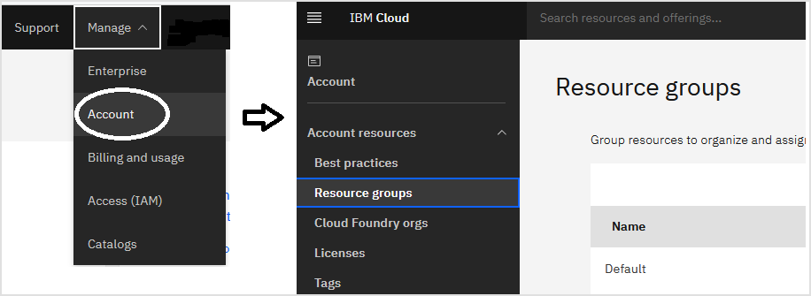

<!--

The pattern to document the resources is like follow:
- Introduce the resource with an example
- List all or the most important input parameters
- If will be used, list the most important output parameters
- Provide instructions to get the value of the input parameters, either using `ibmcloud`, API or the Web console.
- If needed, instructions to execute the code either with Terraform or Schematics

-->

<PageDescription>

Automating Identity and Access Management

</PageDescription>

Identify and Access Management (IAM) is central to IBM Cloud access and resource controls.  Basic information about IAM and different components can be found [in the IAM overview](https://cloud.ibm.com/docs/iam?topic=iam-iamoverview)

In this example, we will look at a terraform script which creates 4 Access Groups, and then creates 2 policies for each of these 4 Access Groups.  In order to use these scripts, you must have proper administrator access.

<AnchorLinks small>
  <AnchorLink>IAM</AnchorLink>
  <AnchorLink>Resource Groups</AnchorLink>
  <AnchorLink>Final Terraform code</AnchorLink>
  <AnchorLink>Clean up</AnchorLink>
</AnchorLinks>

<InlineNotification>

**Requirements**

To be able to execute and complete the instructions in this page, make sure you have an **IBM Cloud account**: if you don't have one yet, you can [create a Lite account](https://cloud.ibm.com/docs/overview?topic=overview-quickstart_lite#prereqs-lite) for free.

Also make sure you have the environment setup as explained in the [Setup Environment](/iac/setup-environment) page to have installed the IBM Cloud CLI, logged in to your account with the IBM Cloud CLI and set the `IC_API_KEY` environment variable to a key which has the ability to manage IAM configuration.

</InlineNotification>

## IAM

Two of the main components of IAM are:
- Access Groups -- contains users & services, whose access can be managed as a group.
- Policies -- Policies for an access group define what access this group has to various resources.  Multiple policies can be set up for each access group, specifying various resources. Policies define role-based access at the platform and service level. There are a standard set of platform and service roles and some IBM Cloud services have special roles as documented in the individual service documentation.

Before you run through this example, make sure your Terraform environment is setup correctly as documented in the [environment setup](/iac/setup-environment).  Specifically make sure you get a list of access groups as documented in the setup document.

To get started, in your IBM Cloud CLI, run the following command and make a list of all the access groups you have in your cloud account.

```bash
ibmcloud iam access-groups
```

The example will create 4 new access groups: access-group-1, access-group-2, access-group-3, access-group-4
The Terraform code will then add different policies to each of the access groups. For the first two access groups, the permissions for a Kubernetes cluster administrator and an application auditor will be assigned based on the [service example use cases](https://cloud.ibm.com/docs/openshift?topic=openshift-users#example-iam). For the third access group, administrative access will be created for the Schematics service. For the fourth access group, administrative access will be created for the Cloud Object Storage service. For granularity, each access group collection of policies is in a single file.

Let's look at some of the code.

Code to define the names for the Access Groups.  Set the variables 'ag1' 'ag2' 'ag3' 'ag4' to the names of the Access Groups we are creating.

```hcl path=accessgroup.tf
variable ag1{
	type = string
    default = "access-group-1"
}

variable ag2{
	type = string
    default = "access-group-2"
}

variable ag3{
	type = string
    default = "access-group-3"
}

variable ag4{
	type = string
    default = "access-group-4"
}
```

Let's look at the policies for `access-group-1`:

```bash path=policy-accessgroup-1.tf
resource "ibm_iam_access_group" "res_ag_1" {
   name  = var.ag1
   description = "Access group for Kubernetes cluster administrators"
}

resource "ibm_iam_access_group_policy" "res_ag_policy1" {

  access_group_id = ibm_iam_access_group.res_ag_1.id
  roles        = ["Administrator", "Manager"]
  resources  {
    service   = "containers-kubernetes"

  }
}

resource "ibm_iam_access_group_policy" "res_ag_policy2" {

  access_group_id = ibm_iam_access_group.res_ag_1.id
  roles        = ["Administrator", "Manager"]
  resources  {
    service   = "container-registry"

  }
}
```

The above script is setting 'access-group-1' with 'Administrator' platform & 'Manager' service role to the 'containers-kubernetes' service, and the same for 'container-registry'.

Users can be added to access groups by their IBMid (email-address). The example code will add a user in the account to access groups 1, 3, and 4. You can list all of the e-mail addresses in the account using:

```bash
ibmcloud iam users
```

Select one of the user email addresses to provide when prompted by the terrraform cli.

You can download the full example code from the GitHub repository https://github.com/IBM/cloud-enterprise-examples/ in the directory [05-iam](https://github.com/IBM/cloud-enterprise-examples/tree/master/iac/05-iam), and then run the following commands in IBM Cloud CLI to create the access groups and policies

```bash
terraform init
terraform apply
```

The script will ask you to validate the creation, and upon successful execution, you should see 12 items added by the script.

Now re-execute the following command to see the newly created access groups

```bash
ibmcloud iam access-groups
```

## Resource Groups

Resource Groups, as the name state, is a collection of cloud resources within an account. With all the resources in a group is easier and quick to assign user access to the resources using IAM access controls.

To manage the Resource Groups with the IBM Cloud web console go to **Manage** > **Account** > **Account resources** > **Resource groups**. There you can create, view and modify them adding resources and manage the access to them. To delete a Resource Group it has to be empty.



Use the IBM Cloud CLI command with the `resources` sub-command to manage the resources groups, like so

```bash
# List resource groups:
ibmcloud resource groups
# Create:
ibmcloud resource group-create group2
# Rename:
ibmcloud resource group-update group2 --name Admin
# View resources:
ibmcloud resource service-instances -g Default
# Delete:
ibmcloud resource group-delete Admin
```

To assign an access to a resource group using the IBM Cloud CLI use the command using the resource group name or id.

```bash
ibmcloud iam user-policy-update USER_NAME POLICY_ID --resource-group-name RESOURCE_GROUP_NAME
ibmcloud iam user-policy-update USER_NAME POLICY_ID --resource-group-id RESOURCE_GROUP_ID
```

Resource Groups are not part of Networking but as it's one of the first resources to create it's included in this pattern.

Create a Resource Group using the `ibm_resource_group` resource with the following code in the `main.tf` file.

```hcl path=main.tf
data "ibm_resource_group" "iac_app_rg" {
  name = var.resource_group_name
}
```

If the `name` parameter, or in this example the variable `resource_group_name` value, cannot be empty, it's a a required parameter. So make sure to have at least a default value in the variables.

```hcl path=variables.tf
variable "resource_group_name" {
  description = "The resource group for all the resources created"
  default     = "IaC-App"
}
```

## Final Terraform code

You can download the code from the GitHub repository https://github.com/IBM/cloud-enterprise-examples/ in the directory [07-compute](https://github.com/IBM/cloud-enterprise-examples/tree/master/iac/07-compute) where the main files are:

First, main.tf which simply specifies the provider, region & the resource group we want to use, which is "Default"  Replace this with the resource group you have in your environment.

```hcl path=main.tf
provider "ibm" {
  generation = 2
  region     = "us-south"
}

data "ibm_resource_group" "group" {
  name = "Default"
}
```

```hcl path=accessgroup.tf
variable ag1 {
	type = string
    default = "access-group-1"
}

variable ag2 {
	type = string
    default = "access-group-2"
}

variable ag3 {
	type = string
    default = "access-group-3"
}

variable ag4 {
	type = string
    default = "access-group-4"
}
```

```hcl path=policy-access-group-1.tf
resource "ibm_iam_access_group" "res_ag_1" {
   name  = var.ag1
   description = "Access group for Kubernetes cluster administrators"
}

resource "ibm_iam_access_group_policy" "res_ag_policy1" {

  access_group_id = ibm_iam_access_group.res_ag_1.id
  roles        = ["Administrator", "Manager"]
  resources  {
    service   = "containers-kubernetes"

  }
}

resource "ibm_iam_access_group_policy" "res_ag_policy2" {

  access_group_id = ibm_iam_access_group.res_ag_1.id
  roles        = ["Administrator", "Manager"]
  resources  {
    service   = "container-registry"

  }
}
```

```hcl path=policy-access-group-2.tf
resource "ibm_iam_access_group" "res_ag_2" {
    name  = var.ag2
    description = "Access group for Kubernetes cluster auditors"
}

resource "ibm_iam_access_group_policy" "res_ag2_policy1" {

  access_group_id = ibm_iam_access_group.res_ag_2.id
  roles        = ["Viewer", "Reader"]
  resources  {
    service   = "containers-kubernetes"

  }
}

resource "ibm_iam_access_group_policy" "res_ag2_policy2" {

  access_group_id = ibm_iam_access_group.res_ag_2.id
  roles        = ["Reader"]
  resources  {
    service   = "container-registry"

  }
}
```

```hcl path=policy-access-group-3.tf
 resource "ibm_iam_access_group" "res_ag_3" {
  name  = var.ag3
  description = "Access group for Schematics workspace managers"
}

resource "ibm_iam_access_group_policy" "res_ag3_policy1" {

  access_group_id = ibm_iam_access_group.res_ag_3.id
  roles        = ["Administrator", "Manager"]
  resources  {
    service   = "schematics"

  }
}
```

```hcl path=policy-access-group-4.tf
resource "ibm_iam_access_group" "res_ag_4" {
    name  = var.ag4
    description = "Access group for Cloud Object Storage administrators"
}

resource "ibm_iam_access_group_policy" "res_ag4_policy1" {
  access_group_id = ibm_iam_access_group.res_ag_4.id
  roles        = ["Administrator", "Manager"]
  resources {
    service = "cloud-object-storage"
  }
}
```

```hcl path=user.tf
variable "user_email" {}

resource "ibm_iam_access_group_members" "ag1_members" {
  access_group_id = ibm_iam_access_group.res_ag_1.id
  ibm_ids         = [ var.user_email ]
}

resource "ibm_iam_access_group_members" "ag3_members" {
  access_group_id = ibm_iam_access_group.res_ag_3.id
  ibm_ids         = [ var.user_email ]
}

resource "ibm_iam_access_group_members" "ag4_members" {
  access_group_id = ibm_iam_access_group.res_ag_4.id
  ibm_ids         = [ var.user_email ]
}
```

```hcl path=output.tf
output "accessGroup1" {
	value = ibm_iam_access_group.res_ag_1
}

output "accessGroup2" {
	value = ibm_iam_access_group.res_ag_2
}

output "accessGroup3" {
	value = ibm_iam_access_group.res_ag_3
}

output "accessGroup4" {
	value = ibm_iam_access_group.res_ag_4
}
```

## Clean up

To cleanup all the resources created by the script, run the following:

```bash
terraform destroy
```
