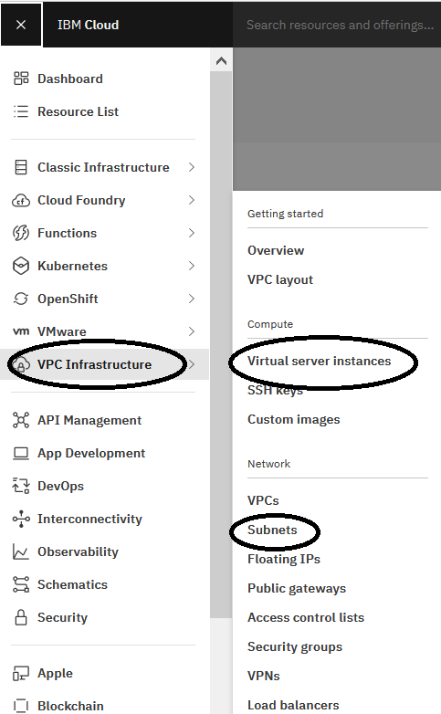

<!--

The pattern to document the resources is like follow:
- Introduce the resource with an example
- List all or the most important input parameters
- If will be used, list the most important output parameters
- Provide instructions to get the value of the input parameters, either using `ibmcloud`, API or the Web console.
- If needed, instructions to execute the code either with Terraform or Schematics

-->

<PageDescription>

Learn the basics of Infrastructure as Code with Terraform on IBM Cloud

</PageDescription>

After you have configured and verified Terraform and the IBM Cloud provider, this section will go through a step-by-step example of creating a resource on IBM Cloud using the provider. It covers how to create a virtual server from scratch. To do this, there is example terraform code to create a vpc and subnet, add a virtual server to the vpc, configure an access list and expose the virtual server on the Internet, and then access it over ssh. If you are an experienced Terraform user, you may skim through this section and simply note the resource types and parameters used in each step.

<AnchorLinks small>
  <AnchorLink>Deploy a single instance</AnchorLink>
  <AnchorLink>“Hello World” from IBM Cloud</AnchorLink>
  <AnchorLink>Terraform State</AnchorLink>
  <AnchorLink>Exposing the service to the world in a secure manner</AnchorLink>
  <AnchorLink>Deploy a configurable server</AnchorLink>
  <AnchorLink>SSH Access</AnchorLink>
  <AnchorLink>Final Terraform code</AnchorLink>
  <AnchorLink>Clean up</AnchorLink>
</AnchorLinks>

## Deploy a single instance

The first step to use Terraform with IBM Cloud is to configure the provider. Lets start creating a directory to store the "Hello World" project.

```bash
mkdir hello_world_terraform_ibm
cd hello_world_terraform_ibm
```

Remember to export in the terminal or console the variable `IC_API_KEY` with the IBM Cloud API key as shown in the <GatsbyLink to="/iac/setup-environment#configure-access-to-ibm-cloud">Environment Setup</GatsbyLink>.

The Terraform code can be done with JSON format or using **HashiCorp Configuration Language** (HCL). During this pattern guide we'll use only HCL and we will call it HCL or Terraform Code.

The Terraform code can be done with JSON format or using **HashiCorp Configuration Language** (HCL). During this pattern guide we'll use only HCL and we will call it HCL or Terraform Code.

Create the file `main.tf` with the `provider` block.

```hcl
provider "ibm" {
  generation         = 2
  region             = "us-south"
}
```

We will be working with VPC Infrastructure Gen 2, the provider accepts the following common input parameters:

| Input parameter | Description |
|---|---|
| `generation` | the generation of IBM Cloud VPC Infrastructure, in this case it'll be `2` |
| `region` | the region where you want to create the VPC resources, examples: `us-south` or `us-east` |
| `ibmcloud_api_key` | the IBM Cloud API key. However we recommend to enter this parameter with the environment variable `IC_API_KEY` |

To find all the available regions with IBM Cloud CLI you can use the `is` sub-command (for more information on installing this plugin refer to [Setup Environment](/iac/setup-environment)):

```bash
ibmcloud is regions
```

Now execute the terraform sub-commands `init` and `plan`:

```bash
terraform init
terraform plan
```

The `init` sub-command downloads all the terraform components needed to execute or apply the terraform code, in this simple example it does not need to download any, the only component we need is the IBM Cloud provider and it is already installed. You'll see there is a new `.terraform` directory, this is where terraform will store all the required components for your terraform project.

The output of `plan` shows the resources that will be created, updated and deleted, in this case terraform won't do anything.

To create a VM or instance we use the resource `ibm_is_instance` but in order to have an instance you first need the networking resources to build the instance on top of it.

On IBM Cloud there is no VPC created by default, you will need to create your VPC using the `ibm_is_vpc` resource. Then we'll need a subnet on that VPC, the subnets are created with the resource `ibm_is_subnet`.

<InlineNotification>

###### Resources naming convention

In case you haven't noticed yet, the IBM Cloud resources begin with `ibm_`, the `is_` stands for Internet Service.

</InlineNotification>

The Terraform code to create the VPC and the Subnet is as follows:

```hcl
resource "ibm_is_vpc" "iac_test_vpc" {
  name = "terraform-test-vpc"
  tags = [ "iac-terraform-test" ]
}

resource "ibm_is_subnet" "iac_test_subnet" {
  name            = "terraform-test-subnet"
  vpc             = ibm_is_vpc.iac_test_vpc.id
  zone            = "us-south-1"
  tags = [ "iac-terraform-test" ]
}
```

The most important input parameters to create the VPC and the Subnet are listed below.

For the `ibm_is_vpc` resource:

| Input parameter | Description |
|---|---|
| `name` | to name the VPC |
| `resource_group` | the ID of the resource group for the VPC, the default resource group is `default` |
| `tags` | tags to associate with your VPC, they will help you to find the VPC more easily. Separate multiple tags with a comma |

For the `ibm_is_subnet` resource:

| Input parameter | Description |
|---|---|
| `name` | to name the Subnet |
| `vpc` | the ID of the VPC, use the resource name with `.id` |
| `zone` | the subnet zone name |
| `resource_group` | the ID of the resource group for the Subnet |
| `tags` | tags to associate with your Subnet, they will help you to find it more easily. Separate multiple tags with a comma |

The IBM Cloud virtual server instance is created with the resource `ibm_is_instance`, a basic terraform code to create an instance would be like so:

```hcl
resource "ibm_is_instance" "iac_test_instance" {
  name    = "terraform-test-instance"
  image   = "r006-14140f94-fcc4-11e9-96e7-a72723715315"
  profile = "cx2-2x4"

  primary_network_interface {
    name   = "eth1"
    subnet = ibm_is_subnet.iac_test_subnet.id
  }

  vpc  = ibm_is_vpc.iac_test_vpc.id
  zone = "us-south-1"
  keys = []

  tags = [ "iac-terraform-test" ]
}
```

Some of the most important input parameters are:

| Input parameter | Description |
|---|---|
| `name` | to name the new instance |
| `image` | the ID of the virtual server image to use for the instance |
| `profile` | name of the profile to use for your instance |
| `vpc`  | the ID of the VPC where you want to create the instance |
| `zone` | name of the VPC zone to create the instance |
| `keys` | a comma separated list of SSH keys that you want to add to your instance |
| `primary_network_interface.subnet` | the ID of the subnet. Only one primary network interface can be specified for an instance |
| `tags` | a list of tags to add to your instance. Tags can help you find your instance |
| `user_data` | user data to transfer to the instance |

<InlineNotification>

###### VPC Networking and Virtual Servers

Check the documentation to know more about [Networking for VPC](https://cloud.ibm.com/docs/vpc?topic=vpc-about-networking-for-vpc) and [Virtual Servers](https://cloud.ibm.com/docs/vpc?topic=vpc-about-advanced-virtual-servers).

</InlineNotification>

To list all the available images and profiles we will use `ibmcloud is`, specify the **Gen 2** platform before running the command:

```bash
ibmcloud is target --gen 2        # this is a one time execution only, unless you swap to gen 1
ibmcloud is instance-profiles
ibmcloud is images
```

That's a lot of images, to narrow our search let's filter the output to get the available images for `Ubuntu 18.4` (`LTS Bionic`) and for `amd64` architecture using regular *nix commands or with `jq`, if you have `jq` installed ([how to install jq](https://github.com/stedolan/jq/wiki/Installation)):

```bash
ibmcloud is images | grep available | grep ubuntu-18 | grep amd64 | cut -f1 -d" "

ibmcloud is images --json | jq -r '.[] | select(.status=="available" and .operating_system.name=="ubuntu-18-04-amd64").id'
```

Repeating for the instance profiles searching just the `amd64` architecture with the minimum CPU and Memory to get the lowest cost.

```bash
ibmcloud is instance-profiles | grep amd64 | sort -k4 -k5 -n | head -1 | cut -f1 -d" "

ibmcloud is instance-profiles --json | jq -r 'map(select(.vcpu_architecture.value=="amd64")) | sort_by(.memory.value)[0].name'
```

Notice that in the terraform code there are no `keys` this is because the instance will be used only to start a web service, and we are not going to ssh to the instance at this time.

You can use `user_data` to run common configuration tasks when your instance starts. For example, you can specify cloud-init directives or shell scripts for Linux images. You will see an example of using the `user_data` parameter in the next session.

Add to the `main.tf` file the terraform code for the vpc, subnet and instance. Now, if you execute `terraform plan` it shows the resources that will be created, updated and deleted. In this case terraform will create 3 resources: the VPC, the subnet and the instance.

Everything is ready now to get that instance in the cloud, just execute the terraform `apply` sub-command and wait about 10 to 60 seconds.

```bash
terraform apply
```

<InlineNotification>

###### Can I make it non-interactive?

Terraform will ask for confirmation before applying the changes in the terraform code. To skip this confirmation and directly apply the changes use the parameter `-auto-approve`.

This parameter can also be used with the `destroy` sub-command explained below.

</InlineNotification>

## "Hello World" from IBM Cloud

There is an instance created but it does nothing and you can't do anything with that instance. Make this instance start a Web server with a "Hello World" page by adding a short script in the `user_data` parameter. Now, the `ibm_is_instance` resource will look like:

```hcl
resource "ibm_is_instance" "iac_test_instance" {
  name    = "terraform-test-instance"
  image   = "r006-14140f94-fcc4-11e9-96e7-a72723715315"
  profile = "cx2-2x4"

  primary_network_interface {
    name   = "eth1"
    subnet = ibm_is_subnet.iac_test_subnet.id
  }

  vpc  = ibm_is_vpc.iac_test_vpc.id
  zone = "us-south-1"
  keys = []

  user_data = <<-EOUD
              #!/bin/bash
              echo "Hello World" > index.html
              nohup busybox httpd -f -p 8080 &
              EOUD

  tags = [ "iac-terraform-test" ]
}
```

When the instance is up and running we need to know the IP address. You could go to the IBM Cloud console and get it from there, however, there is a more effective way to get the IP address with terraform: use the `output` directive.

Add the following code to your `main.tf` file:

```hcl
output "ip_address" {
  value = ibm_is_instance.iac_test_instance.primary_network_interface[0].primary_ipv4_address
}
```

The beauty of Terraform is that you don't have to destroy everything and re-create it for every change, the provider will update all the resources that can be updated and re-create those that don't support an update. In this case, the instance has to be re-created because of the `user_data`, but the VPC and subnet will remain intact, as they were not modified. So, to re-apply the changes just execute `apply` again:

```bash
terraform apply
```

When terraform complete the task, it prints the IP address of the instance. If you need it again, just execute `terraform output ip_address`.

To view what you have created on the IBM Cloud console, go to the **Navigation Menu** (<svg class="btn-inactive" focusable="false" preserveAspectRatio="xMidYMid meet" width="20" height="20" viewBox="0 0 20 20" aria-hidden="true"><path d="M2 14.8H18V16H2zM2 11.2H18V12.399999999999999H2zM2 7.6H18V8.799999999999999H2zM2 4H18V5.2H2z"></path></svg>) >> **VPC Infrastructure**, then select **Network** >> **VPCs**, **Subnets** and **Compute** >> **Virtual server instances** to view all the resources you have created.



## Terraform State

You may have noticed that every time you run `terraform apply` there is a new or updated file named `terraform.tfstate`. This file is the Terraform State file and it store information about the infrastructure created. All the resources and variables are in that file.

This file is in JSON format and it has a private API, it changes (or may change) every time there is a new Terraform version, so you can read it but it's not recommended to use it to get data from it. Instead, use the `output` variables and the `output` Terraform command.

Every time you run Terraform it fetch the latest status of every resource in the code and compare it with the state from the `terraform.tfstate` file to determine what changes need to be applied.

<InlineNotification kind="warning">

**Do not delete the terraform.tfstate file**

If you delete it the next time you want to modify your infrastructure terraform will not know the current state and will complain saying that the resources you want to create already exist.

</InlineNotification>

For a simple and personal project is fine to have the Terraform state in a local file. Sometimes it's stored in a version control system (i.e. GitHub) however this is not recommended because the state file contain sensitive information that should not be exposed.

<InlineNotification kind="warning">

**Do not commit the state file to GitHub**

Do Not store the `terraform.tfstate` in your GitHub repository, it may contain sensitive information such as passwords or ssh keys. Make sure the `terraform.tfstate` and backup `terraform.tfstate.backup` filenames are in the `.gitignore` file.

</InlineNotification>

For enterprise projects or if a team is working with the same Terraform code make it's recommended to use a remote state in a shared storage. The most common options to implement remote state is to use a Terraform Backend or use a service such as Terraform Enterprise, Terraform Cloud or IBM Cloud Schematics.

The setup and use of Terraform backends is explained in the [Setup Terraform Remote State using etcd as backend](/iac/getting-started-terraform/remote-state) section. The use of IBM Cloud Schematics is explained in the next section [IBM Cloud Schematics](/iac/schematics)

## Exposing the service to the world in a secure manner

Now the instance is running and possibly it's serving a web page with Hello World but unfortunately you can't see it. You can't see it because (1) the IP address is private, internal to the IBM Cloud network and (2) there aren't any firewall rules to allow access to the instance. Resolve that by adding a `ibm_is_floating_ip`, a `ibm_is_security_group_rule` and a few `ibm_is_security_group` resources:

```hcl
resource "ibm_is_floating_ip" "iac_test_floating_ip" {
  name   = "terraform-test-ip"
  target = ibm_is_instance.iac_test_instance.primary_network_interface.0.id
  tags   = [ "iac-terraform-test" ]
}

resource "ibm_is_security_group" "iac_test_security_group" {
  name = "terraform-test-sg-public"
  vpc  = ibm_is_vpc.iac_test_vpc.id
}

resource "ibm_is_security_group_rule" "iac_test_security_group_rule_tcp_http" {
  group     = ibm_is_security_group.iac_test_security_group.id
  direction = "inbound"
  tcp {
      port_min = 8080
      port_max = 8080
  }
}
```

Then add the new security group to the `primary_network_interface` of the instance, so it looks like so:

```hcl
resource "ibm_is_instance" "iac_test_instance" {
  ...
  primary_network_interface {
    name   = "eth1"
    subnet = ibm_is_subnet.iac_test_subnet.id
    security_groups = [ ibm_is_security_group.iac_test_security_group.id ]
  }
  ...
}
```

The `ibm_is_floating_ip` resource creates a floating IP address that can be used to access the targeted instance from the public network.

The main input parameters are:

| Input parameter | Description |
|---|---|
| `name` | to name the floating IP address |
| `resource_group` | the ID of the resource group for the floating IP, the default resource group is `default` |
| `tags` | tags to associate with your floating IPs, they will help you to find them more easily. Separate multiple tags with a comma |

The most important output parameter is:

| Output parameter | Description |
|---|---|
| `address` | the floating IP address |

The `ibm_is_security_group` resource allows you to create a virtual firewall with rules to control the inbound and outbound traffic. These rules are created with the resource `ibm_is_security_group_rule`.

The most important input parameters for `ibm_is_security_group` are:

| Input parameter | Description |
|---|---|
| `name` | to name the Security Group |
| `vpc` | the VPC ID for the Security Group. Use the `id` output parameter of the selected `ibm_is_vpc` resource.
| `resource_group` | the ID of the resource group to create the Security Group there |

After it's created you can access all the rules in the security group with the following output parameters:

| Output parameter | Description |
|---|---|
| `id` | the Security Group ID |
| `rules` | a nested block describing the rules of this security group |
| `rules.direction` | the direction of the traffic either `inbound` or `outbound` |
| `rules.protocol` | the type of the protocol `all`, `icmp`, `tcp` or `udp` |
| `rules.port_max` | the inclusive upper bound of TCP/UDP port range |
| `rules.port_min` | the inclusive lower bound of TCP/UDP port range |

The `primary_network_interface` of the instance and each `ibm_is_security_group_rule` will reference the new security group using the `id` output parameter.

Each `ibm_is_security_group_rule` defines a traffic rule either for inbound or outbound direction. The most important input parameters are:

| Input parameter | Description |
|---|---|
| `group` | the Security Group ID |
| `direction` | direction of the traffic either `inbound` or `outbound` |
| `tcp` | a nested block describing the `tcp` protocol of this security group rule |
| `tcp.port_min` | the inclusive lower bound of TCP port range |
| `tcp.port_max` | the inclusive upper bound of TCP port range |
| `udp` | a nested block describing the `udp` protocol of this security group rule |
| `udp.port_min` | the inclusive lower bound of UDP port range |
| `udp.port_max` | the inclusive upper bound of UDP port range |

In addition to the protocols `tcp` and `udp` security group rules recognize `icmp` and `ALL`.

Having now a public IP address and the port 8080 open to inbound traffic to the instance, we can access the Web service. Change the `ip_address` output variable to:

```hcl
output "ip_address" {
  value = ibm_is_floating_ip.iac_test_floating_ip.address
}
```

Apply the changes again and execute the following line to view the output of the published web page:

```bash
$ curl "http://$(terraform output ip_address):8080"
Hello World
```

<InlineNotification>

###### Endpoint output variable

Notice the use of the terraform output command to get the value of the variable `ip_address`. In the same way you can create an output variable named, for example `endpoint`, to contain the address for the Web server.

So, the command to get the web page would be: `curl $(terraform output endpoint)`

</InlineNotification>

## Deploy a configurable server

The web server is serving on port 8080 but this port has to be set in the security group and the user data configuration. If we decide to change the port in the user data it may be possible to forget to change it in the other security group or vice versa.

To make this code more DRY and configurable let's define an input variable for the port, like so:

```hcl
variable "port" {
  default = 8080
}
```

We can provide the value of this variable in the following ways, where the earlier option takes precedence over the later:

1. With the `-var` command line option of `terraform`
2. In variable definitions files (`.tfvars`) such as `terraform.tfvars`
3. As environment variables starting with `TF_VAR_`
4. Default value in the variable definition

So, if we want a port other than `8080` just use the parameter `-var`:

```bash
terraform apply -var="port=8081"
```

To use the variable in the code, just replace the `8080` by `var.port` or, in case we want to interpolate the variable in a string, we use `${var.port}`. So the changes in the code look like this:

```hcl
resource "ibm_is_instance" "iac_test_instance" {
  ...
  user_data = <<-EOUD
              #!/bin/bash
              echo "Hello World" > index.html
              nohup busybox httpd -f -p ${var.port} &
              EOUD
  ...
}

resource "ibm_is_security_group_rule" "iac_test_security_group_rule_tcp_http" {
  ...
  tcp {
      port_min = var.port
      port_max = var.port
  }
}
```

Now, execute `terraform apply` using the port `8081`. Notice that this will re-create the instance and update the other resources.

```bash
terraform apply -var="port=8081"
curl "http://$(terraform output ip_address):8081"
```

Alternatively, using environment variables would look like this:

```bash
export TF_VAR_port=8082
terraform apply
curl "http://$(terraform output ip_address):${TF_VAR_port}"
```

## SSH Access

We accomplished the initial requirements having the Web service running and printing the "Hello World" but what if we want to have SSH access to the instance?

Open the `main.tf` file to add the resources `ibm_is_ssh_key` and `ibm_is_security_group_rule` to open port `22` to allow SSH access to the instance.

```hcl
variable "public_key_file"  { default = "~/.ssh/id_rsa.pub" }
locals {
  public_key    = "${file(pathexpand(var.public_key_file))}"
}

resource "ibm_is_security_group_rule" "iac_test_security_group_rule_tcp_ssh" {
  group = ibm_is_security_group.iac_test_security_group.id
  direction = "inbound"
  tcp {
      port_min = 22
      port_max = 22
  }
}

resource "ibm_is_ssh_key" "iac_test_key" {
  name       = "terraform-test-key"
  public_key = local.public_key
  tags       = [ "iac-terraform-test" ]
}
```

This SSH Key has to be linked to the instance through the `keys` parameter, so replace the `keys = []` parameter in the instance `iac_test_instance` for:

```hcl
  keys = [ ibm_is_ssh_key.iac_test_key.id ]
```

The resource `ibm_is_ssh_key` creates a SSH key to access a Gen 2 instance. It requires the following input parameters:

| Input parameter | Description |
|---|---|
| `name` | the name of the key |
| `public_key` | the content of the public key |
| `resource_group` | an optional ID of the resource group for the key |
| `tags` | optional tags to associate with your key, they will help you to find it more easily. Separate multiple tags with a comma |

Instead of passing to Terraform the content of the public key, this code takes the public key filename in the variable `public_key_file` either as a parameter `-var="public_key_file=FILENAME"` or as an environment variable `TF_VAR_public_key_file=FILENAME` and places the file content into the local variable `public_key` which will be used by the IBM Cloud provider to create a SSH Key resource. If no parameter is given for the public key filename, the default value is set to the well known default filename for RSA public keys: `~/.ssh/id_rsa.pub`.

<InlineNotification>

###### How to create the a key pair?

To have access to the instances you need a private and public key. You can use the `ssh-keygen` command on Linux or Mac OS X to generate them. Just execute the command `ssh-keygen` and follow the instructions. You can read more about SSH Keys in the [IBM Cloud docs](https://cloud.ibm.com/docs/infrastructure/ssh-keys?topic=ssh-keys-getting-started-tutorial).

</InlineNotification>

After applying the changes with `terraform apply` you can access to the instance with SSH either to login or execute remote commands. For example, use the following command to remotely execute `echo 'Hello World'` using the private key `~/.ssh/id_rsa`

```bash
$ ssh -i ~/.ssh/id_rsa ubuntu@$(terraform output ip_address) "echo 'Hello World'"
Hello World
```

## Final Terraform code

All the developed code is in a `main.tf` file, however to have a more organized project, you can split the Terraform code in different files. This project is simple and small but as your Terraform code grows it is a common pattern to split the code into directories and Terraform Modules. This is something you'll see in the next section: Getting started with Schematics

This code is also available in the [Getting Started](https://github.com/IBM/cloud-enterprise-examples/tree/master/iac/01-getting-started) folder of the IaC Pattern Guides GitHub repository.

Here is an example of how to split the terraform code of this "Hello World" example into a logical structure based on the types of resources being managed.

### `main.tf`

This file is the first file that Terraform will access, so include here the provider and the instance.

```hcl path=main.tf
provider "ibm" {
  generation         = 2
  region             = "us-south"
}

resource "ibm_is_ssh_key" "iac_test_key" {
  name       = "terraform-test-key"
  public_key = local.public_key
}

resource "ibm_is_instance" "iac_test_instance" {
  name    = "terraform-test-instance"
  image   = "r006-14140f94-fcc4-11e9-96e7-a72723715315"
  profile = "cx2-2x4"

  primary_network_interface {
    name   = "eth1"
    subnet = ibm_is_subnet.iac_test_subnet.id
    security_groups = [ ibm_is_security_group.iac_test_security_group.id ]
  }

  vpc  = ibm_is_vpc.iac_test_vpc.id
  zone = "us-south-1"
  keys = [ ibm_is_ssh_key.iac_test_key.id ]

  user_data = <<-EOUD
              #!/bin/bash
              echo "Hello World" > index.html
              nohup busybox httpd -f -p ${var.port} &
              EOUD

  tags = [ "iac-terraform-test" ]
}
```

### `variables.tf` and `output.tf`

These 2 files will have all the input and output variables:

```hcl path=variables.tf
variable "public_key_file"  { default = "~/.ssh/id_rsa.pub" }
locals {
  public_key    = "${file(pathexpand(var.public_key_file))}"
}
```

```hcl path=output.tf
output "ip_address" {
  value = ibm_is_floating_ip.iac_test_floating_ip.address
}

output "entrypoint" {
  value = "http://${ibm_is_floating_ip.iac_test_floating_ip.address}:${var.port}/"
}
```

### `network.tf`

All the networking resources will be stored in this file:

```hcl path=network.tf
resource "ibm_is_vpc" "iac_test_vpc" {
  name = "terraform-test-vpc"
}

resource "ibm_is_subnet" "iac_test_subnet" {
  name            = "terraform-test-subnet"
  vpc             = ibm_is_vpc.iac_test_vpc.id
  zone            = "us-south-1"
  ipv4_cidr_block = "10.240.0.0/24"
}

resource "ibm_is_security_group" "iac_test_security_group" {
  name = "terraform-test-sg-public"
  vpc = ibm_is_vpc.iac_test_vpc.id
}

resource "ibm_is_security_group_rule" "iac_test_security_group_rule_all_outbound" {
  group = ibm_is_security_group.iac_test_security_group.id
  direction = "outbound"
}

resource "ibm_is_security_group_rule" "iac_test_security_group_rule_tcp_http" {
  group = ibm_is_security_group.iac_test_security_group.id
  direction = "inbound"
  tcp {
      port_min = var.port
      port_max = var.port
  }
}

resource "ibm_is_security_group_rule" "iac_test_security_group_rule_tcp_ssh" {
  group = ibm_is_security_group.iac_test_security_group.id
  direction = "inbound"
  tcp {
      port_min = 22
      port_max = 22
  }
}

resource "ibm_is_floating_ip" "iac_test_floating_ip" {
  name   = "terraform-test-ip"
  target = ibm_is_instance.iac_test_instance.primary_network_interface.0.id
}
```

### Other files

Besides the Terraform files you will need the following files:

- the SSH keys (default are `~/.ssh/id_rsa` and `~/.ssh/id_rsa.pub`).
- the `terraform_key.json` created to store the IBM Cloud API Key
- the `terraform.tfstate` and `terraform.tfstate.backup` with the Terraform State

Optionally you can also have a `terraform.tfvars` to set values to the input variables, like so:

```hcl path=terraform.tfvars
port = 8081
```

All these files contain or may contain sensitive information and should not be stored in the GitHub repository. Make sure there is a `.gitignore` file with the following content:

```git path=.gitignore
terraform_key*.json
.terraform
*.tfstate*
id_rsa*
*.tfvars*
```

## Clean up

After spending a few minutes admiring your masterpiece and showing it to your friends, you can destroy everything to save money with the command:

```bash
terraform destroy
```

After the command completes, if you check the `terraform.tfstate` file, it's almost empty, showing no information about the resources.

## Reference

- [IBM Cloud / Terraform](https://cloud.ibm.com/docs/terraform?topic=terraform-getting-started) ([Source](https://github.com/ibm-cloud-docs/terraform))
- [Setting up the CLI for Terraform](https://cloud.ibm.com/docs/terraform?topic=terraform-setup_cli)
- [IBM Cloud provider for Terraform](https://cloud.ibm.com/docs/terraform?topic=terraform-quick-links)
- [`provider` block configuration](https://cloud.ibm.com/docs/terraform?topic=terraform-provider-reference#required-parameters)
- [VPC Infrastructure resources (Gen 2)](https://cloud.ibm.com/docs/terraform?topic=terraform-vpc-gen2-resources)
- [User data](https://cloud.ibm.com/docs/vpc-on-classic-vsi?topic=vpc-on-classic-vsi-user-data)
- [Terraform IBM Cloud provider](https://github.com/IBM-Cloud/terraform-provider-ibm)

<!--
- Terraform IBM Cloud provider - [website](https://github.com/IBM-Cloud/terraform-provider-ibm/blob/master/website/docs/index.html.markdown) (possible old source of *IBM Cloud / Terraform*)
- Terraform IBM Cloud provider - [examples](https://github.com/IBM-Cloud/terraform-provider-ibm/tree/master/examples)
- Terraform IBM Cloud provider - [docs](https://ibm-cloud.github.io/tf-ibm-docs/) (old version of *IBM Cloud / Terraform*)
- IBM Cloud - Create a [Virtual Private Cloud](https://cloud.ibm.com/vpc/overview) (VPC)
- IBM Cloud - Docs for [Virtual Private Cloud](https://cloud.ibm.com/docs/vpc?topic=vpc-getting-started) (VPC)
-->
