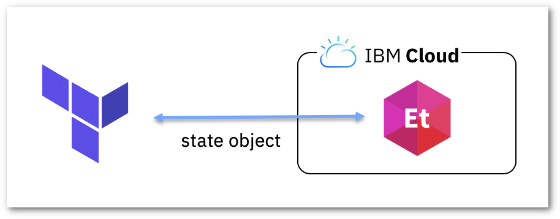

<PageDescription>

Setup Terraform Remote State using etcd as backend

</PageDescription>

<AnchorLinks small>
  <AnchorLink>Introduction to Terraform remote state</AnchorLink>
  <AnchorLink>Create a etcd database using the IBM Cloud Web Console</AnchorLink>
  <AnchorLink>Create a etcd database using the IBM Cloud CLI</AnchorLink>
  <AnchorLink>Create a etcd database using Terraform</AnchorLink>
  <AnchorLink>Backend Configuration</AnchorLink>
  <AnchorLink>Final Terraform code</AnchorLink>
  <AnchorLink>Clean up</AnchorLink>
</AnchorLinks>

This document explains how to create and use a Terraform backend with etcd to store a Terraform remote state, as shown in the following diagram.



The code to build these resources can be downloaded from the GitHub repository https://github.com/IBM/cloud-enterprise-examples/ in the directory [01-getting-started/remote_state](https://github.com/IBM/cloud-enterprise-examples/tree/master/iac/01-getting-started/remote_state).

## Introduction to Terraform remote state

If you are using Terraform for a personal project it's fine to store the state in the local file `terraform.tfstate`. But in a enterprise project or if Terraform is used by a team it's recommended and best practice to setup and use remote state. Terraform and the community give us this feature with the backends. The default backend is `local` but there are is a [collection of backends](https://www.terraform.io/docs/backends/types/index.html) provided that you can use.

Among the benefits of using remote state we have:

- **Team Work**: backends allow us to share the state and use it in a team to update or destroy the existing infrastructure. It's important this backend provide the lock feature, not all of them provide it and it's important to avoid multiple team members write at the same time on the state.
- **Avoid manual errors**: Using a local state file and a shared storage to manually sync the changes could cause someone forget to sync the state file. A backend will always sync the state whenever it changes, automatically.
- **Security**: A local state file save the content in plain text. It's very common to have secrets or sensitive data in the state, so local state files are insecure.
- **Remote operations**: Some backends or services allow to manage the operations remotely. This means you don't need to use terraform on your system to apply the changes. You could either trigger it from a web page, API call or a CLI tool.

Not everything is perfect, there are other problems that you need to solve and choose the right backend to store the state remotely. Problems such as:

- **Locking**: When the state is shared if two team members are running Terraform at the same time, you may run into race conditions, causing conflicts, data loss and state file corruption. Make sure to select a backend or service that supports locking.
- **Isolation**: Using the same infrastructure design in different environments may cause two or more environments use the same state file. It's a best practice to isolate such states. Make sure the backend or service used provide a mechanism to isolate states.
- **Versioning**: Some backends support versioning, so if there is a problem in the execution you can always go back to verify what was done and who did the change. Make sure to select a backend that support versioning, the local backend only have 2 versions but in a remote and shared state more than 2 is a must.

Besides backends you can use other recommended services such as Terraform Cloud or IBM Cloud Schematics. The use of IBM Schematics offers the same benefits of backends but also support remote operations, locking, isolation, versioning and it has many options to make it secure. You can read more about it in the [IBM Cloud Schematics](/iac/schematics) pattern page.

With IBM Cloud you can use some of the existing backend such as the S3 and HTTP backed. To see an example of how to set them up read the blog post ["Store Terraform states in Cloud Object Storage"](https://www.ibm.com/cloud/blog/store-terraform-states-cloud-object-storage). The supporting code examples are in the GitHub repository [l2fprod/serverless-terraform-backend](https://github.com/l2fprod/serverless-terraform-backend).

This page explains how to setup a remote state using the etcd backend which requires less configuration effort compared to the S3 or HTTP backend.

The first step is to create a etcd database to store the terraform state. We can do this using the IBM Cloud Web Console, the CLI or Terraform.

## Create a etcd database using the IBM Cloud Web Console

To create the etcd database with the IBM Cloud Web Console, follow these simple instructions:

1. Go to the [Dashboard](https://cloud.ibm.com) > [Services](https://cloud.ibm.com/resources) > [Create Resource](https://cloud.ibm.com/catalog), search for "etcd" and click on the "[Database for etcd](https://cloud.ibm.com/catalog/services/databases-for-etcd)" tile. Or, just go directly to [Databases for etcd](https://cloud.ibm.com/catalog/services/databases-for-etcd)
2. Select the nearest or desired region (i.e. `Dallas` which is `us-south`), it may be good to have it in the same region where the terraform code is running.
3. Assign a name, something related to your project (i.e. `terraform-remote-state-iac-demo`) and it's optional but recommended to assign tags to identify and find the database later, i.e. `terraform:remote-state`, `app:iac-demo`.
4. Optionally, change the CPU, memory and disk allocation settings. Remember the terraform state is text and not a large one, so it may be safe to choose the smaller and cheapest memory and disk allocation. If the use of the database is not high (usually it's not), you can select the Shared CPU.
5. Leave the default values for Key Protect instance and disk encryption key.
6. It's important to select "**Public network**". Mostly the execution of terraform will be outside of the IBM Cloud network so terraform will need access to the etcd database. Unless you are running terraform in a VPN same as the database or from a bastion host running on the same network, you can select Private network.
7. Click on "Create" button at the bottom-right corner.
8. Wait until the database is created, it may take some time. When it's "Active" click on the database, then launch the Management Console, clicking on "**Launch Now**" button.
9. Before use etcd you have to set the root password. Open the **Settings** tab and set the new root password in the panel **Change Password**.
10. Take note of the following information:
    1.  Export the environment variable `PASSWORD` with the password you set in the previous step.

      ```bash
      export PASSWORD=<here write the root password you set>
      ```

    2.  `Public GRPC endpoint`, you can click on the little clipboard to the right. Export the entpoint in the environment variable `ETCDCTL_ENDPOINTS` with this command:

      ```bash
      export ETCDCTL_ENDPOINTS=<here goes the copied endpoint>
      ```

    3.  The `TLS certificate` Contents. Copy the content and save it to a file named `ca.crt` where the Terraform code is located.
11. Optionally, select the CLI tab and follow these [instructions](https://cloud.ibm.com/docs/databases-for-etcd) to setup the `etcdctl` parameters to access the database for debugging, verifications or view the terraform state.

## Create a etcd database using the IBM Cloud CLI

To use the IBM Cloud CLI no plugin is required, use the command `ibmcloud resource service-instance-create NAME databases-for-etcd PLAN LOCATION` to create the etcd database service (`databases-for-etcd`), with `standard` plan on Dallas (`us-south`) like so.

```bash
ibmcloud resource service-instance-create demo-terraform-remote-state databases-for-etcd standard us-south
```

Check the status until it's `active` with any of the following commands:

```bash
ibmcloud resource service-instance demo-terraform-remote-state
# Or:
ibmcloud resource service-instances --location us-south
# Or:
ibmcloud resource service-instances | grep demo-terraform-remote-state
```

To continue with the next actions it's required to install the Cloud Database plugin. Execute the following command if you haven't done it yet.

```bash
ibmcloud plugin install cloud-databases
```

Before use etcd you have to set the root password, use the Cloud Database plugin to set it up. To choose a good password you could either use the below one-liner with `/dev/urandom` or select your own password.

```bash
export PASSWORD=$(LC_CTYPE=C tr -dc 'a-zA-Z0-9' < /dev/urandom | head -c 32)
ibmcloud cdb user-password demo-terraform-remote-state root $PASSWORD
```

<InlineNotification>

**Password Generator**

There are plenty of guidelines and tools that can help you to generate a good and secure password. If you don't have any, you can use https://www.random.org/passwords/. It's a simple web application to generate random passwords.

</InlineNotification>

Use the following commands to get the entrypoint and certificate, both required to configure the backend.

```bash
export ETCDCTL_ENDPOINTS=$(ibmcloud cdb deployment-connections demo-terraform-remote-state --only app | grep GRPC | awk '{print $2}')
# Or using jq:
export ETCDCTL_ENDPOINTS=$(ibmcloud cdb deployment-connections demo-terraform-remote-state --json | jq -r '.connection.grpc.composed[0]')

ibmcloud cdb deployment-cacert demo-terraform-remote-state --save --certroot cacert && mv cacert/* ca.crt && rmdir cacert
```

Optionally, you can configure the environment with the following command to use `etcdctl` for debugging, validations or read the terraform state.

```bash
export ETCDCTL_API=3
export ETCDCTL_CACERT=${PWD}/ca.crt
export ETCDCTL_ENDPOINTS=$(ibmcloud cdb deployment-connections demo-terraform-remote-state --only cli | grep CLI | sed 's/.*endpoints=\([^ ]*\) .*/\1/')
export ETCDCTL_USER=root:$PASSWORD
```

With the variables `ETCDCTL_API`, `ETCDCTL_CACERT`, `ETCDCTL_ENDPOINTS` and `ETCDCTL_USER` exported and `etcdctl` installed you can run commands like these to verify your connectivity:

```bash
$ etcdctl put foo bar
OK
$ etcdctl get foo
foo
bar
```

## Create a etcd database using Terraform

Terraform can also help you to create the etcd database. Make sure to not have this terraform code to create the backend in a different directory from any other terraform code that will use **etcd** as a backend. This will allow you to create the backend independently and then work with your other code to manage your infrastructure.

Create the `etcd` directory in a different location where your code is. Inside create the file `main.tf` with the following code using the resource `ibm_database` to create the etcd database. In the code we also define the variables for the resources name prefix, the region and the root password.

```hcl path=main.tf
variable "prefix" {}
variable "etcd_admin_password" {
  default = "$uPerSeCre7Pa55w0r"
}

variable "region" {
  default = "us-south"
}

provider "ibm" {
  generation = 2
  region     = var.region
}

data "ibm_resource_group" "group" {
  name = "Default"
}

resource "ibm_database" "etcd_terraform_remote_state" {
  name                         = "${var.prefix}-remote-state"
  plan                         = "standard"
  location                     = var.region
  service                      = "databases-for-etcd"
  resource_group_id            = data.ibm_resource_group.group.id
  adminpassword                = var.etcd_admin_password
  members_memory_allocation_mb = 3072
  members_disk_allocation_mb   = 61440

  tags = ["${var.prefix}", "terraform", "remote state"]
}
```

<InlineNotification kind="warning">

**Keep your Terraform code separated**

In the GitHub repository the `etcd` directory with the etcd database management is stored in the directory where the code is just for educational purposes, do not do this in your project.

</InlineNotification>

<InlineNotification kind="warning">

**Root password**

For simplicity we set a default password for `root` but this is not recommended in a large and enterprise project. Keep your password in a secure location and assign it always (not by default) using `TF_VAR_` environment variables or the `terraform` `-var` parameters.

You can use the one-liner below using `/dev/urandom` to generate a random password, use your own secure password or use a password generation tool like https://www.random.org/passwords/.

</InlineNotification>

Executing `terraform apply` will create the etcd database but in order to get the required parameters to configure the backend lets use some output variables. Add the following code to the `main.tf` file.

```hcl path=main.tf
output "etcd_endpoint" {
  value = ibm_database.etcd_terraform_remote_state.connectionstrings[0].composed
}
output "etcd_certbase64" {
  value = ibm_database.etcd_terraform_remote_state.connectionstrings[0].certbase64
}
```

Now export the variables required by the code and execute the terraform commands to create the database and get the output required to configure the backend, like so:

```bash
export TF_VAR_prefix="terraform-state-$USER"
export TF_VAR_etcd_admin_password=$(LC_CTYPE=C tr -dc 'a-zA-Z0-9' < /dev/urandom | head -c 32)

terraform init
terraform plan
terraform apply
```

When the database is up and running, execute this command to save the CA certificate file and export the following variables to be used to configure the backend and `etcdctl`.

```bash
terraform output etcd_certbase64 | base64 --decode > ../ca.crt    # On MacOS use: base64 -D

export ETCDCTL_ENDPOINTS=$(terraform output etcd_endpoint)

export ETCD_USER=$(terraform output etcd_password)
export ETCD_PASSWD=$(terraform output etcd_password)

# For etcdctl
export ETCDCTL_API=3
export ETCDCTL_USER=$(terraform output etcd_user):$(terraform output etcd_password)
export ETCDCTL_CACERT=$PWD/../ca.crt
```

With the variables `ETCDCTL_API`, `ETCDCTL_CACERT`, `ETCDCTL_ENDPOINTS` and `ETCDCTL_USER` exported and `etcdctl` installed you can run commands like these to verify your connectivity:

```bash
$ etcdctl put foo bar
OK
$ etcdctl get foo
foo
bar
```

## Backend Configuration

The backend configuration can be done with Terraform code or using the parameters `-backend-config="KEY=VALUE"` with the `terraform init` command. Here we will use the terraform code to configure the backend.

Go to the directory where your infrastructure code is and create the file `backend.tf` with the following content:

```hcl path=backend.tf
terraform {
  backend "etcdv3" {
    endpoints   = ["< value of the variable ETCDCTL_ENDPOINTS >"]
    password    = "< value of the variable ETCD_PASSWD >"
    username    = "root"
    prefix      = "terraform-state/"
    lock        = true
    cacert_path = "ca.crt"
    cert_path   = "certificate.pem"
    key_path    = "key.pem"
  }
}
```

Due to the terraform issue [#19185](https://github.com/hashicorp/terraform/issues/19185) the etcd backend requires the `cert_path` and `key_path` with a TLS key pair files. The **etcd** instance does not validate the actual client certificate so you may generate a self-signed certificate with a private key (`certificate.pem` and `key.pem`) with the following `openssl` command.

```bash
openssl req -newkey rsa:2048 -nodes -keyout key.pem -x509 -days 365 -out certificate.pem -subj "/C=US/ST=California/L=San Diego/O=IBM/OU=Terraform Backend"
```

These key pairs may not be required in the future, when this bug is fixed in Terraform or the etcd backend.

Make sure in the same location is the `ca.crt` file and choose the correct `prefix` to avoid collision with other state files from other project or environment.

<InlineNotification kind="warning">

**Keep it secure**

Please, add the `ca.crt` filename in the `.gitignore` file as well as the `certificate.pem` and `key.pem` files, just in case. Note that the `ca.crt` file will differ with the cloud **etcd** instance.

The `backend.tf` file also contains the root password, so it has to be included in the `.gitignore` file too.

</InlineNotification>

The `backend` block does not accept variables, that's why you have to write the `endpoints` and `password` parameter. If you want to automate this process and store the `backend.tf` file (or similar) in the repository create a template like this and execute the following `sed` command to generate the final `backend.tf` with the endpoint and root password.

```hcl path=backend.tf.tmpl
terraform {
  backend "etcdv3" {
    endpoints   = ["{ ETCDCTL_ENDPOINTS }"]
    password    = "{ ETCD_PASSWD }"
    username    = "root"
    prefix      = "terraform-state/"
    lock        = true
    cacert_path = "ca.crt"
    cert_path   = "certificate.pem"
    key_path    = "key.pem"
  }
}
```

```bash
sed -e "s|{ ETCDCTL_ENDPOINTS }|$ETCDCTL_ENDPOINTS|" \
      -e "s|{ ETCD_PASSWD }|$ETCD_PASSWD|" backend.tf.tmpl > backend.tf
```

To enable the backend you need to execute the `terraform init` command which should tell you the remote state is successfully set. Then execute `plan` and `apply`, you should not see the `terraform.tfstate` there.

```bash
terraform init

terraform plan && terraform apply
```

The code used to create the infrastructure is the same used in the [Getting Started](/iac/getting-started-terraform) page. So, to verify everything works execute this `curl` command and you should see the "Hello World" text.

```bash
curl $(terraform output entrypoint)
```

Optionally, you can use `etcdctl` to view the state file, like so:

```bash
etcdctl get --prefix terraform-state
```

## Final Terraform code

The Terraform code to create the infrastrucutre is the same used in the [Getting Started](/iac/getting-started-terraform) page. The only file used here is the `backend.tf.tmpl` used to generate the `backend.tf` file.

```hcl path=backend.tf.tmpl
terraform {
  backend "etcdv3" {
    endpoints   = ["{ ETCDCTL_ENDPOINTS }"]
    password    = "{ ETCD_PASSWD }"
    username    = "root"
    prefix      = "terraform-state/"
    lock        = true
    cacert_path = "ca.crt"
    cert_path   = "certificate.pem"
    key_path    = "key.pem"
  }
}
```

In the `etcd` directory have the `main.tf` file to manage the etcd database to store the remote state. The file is like this:

```hcl path=main.tf
variable "prefix" {}
variable "etcd_admin_password" {
  default = "$uPerSeCre7Pa55w0r"
}

variable "region" {
  default = "us-south"
}

provider "ibm" {
  generation = 2
  region     = var.region
}

data "ibm_resource_group" "group" {
  name = "Default"
}

resource "ibm_database" "etcd_terraform_remote_state" {
  name                         = "${var.prefix}-remote-state"
  plan                         = "standard"
  location                     = var.region
  service                      = "databases-for-etcd"
  resource_group_id            = data.ibm_resource_group.group.id
  adminpassword                = var.etcd_admin_password
  members_memory_allocation_mb = 3072
  members_disk_allocation_mb   = 61440

  tags = ["${var.prefix}", "terraform", "remote state"]
}

output "etcd_endpoint" {
  value = ibm_database.etcd_terraform_remote_state.connectionstrings[0].composed
}
output "etcd_certname" {
  value = ibm_database.etcd_terraform_remote_state.connectionstrings[0].certname
}
output "etcd_certbase64" {
  value = ibm_database.etcd_terraform_remote_state.connectionstrings[0].certbase64
}
output "etcd_user" {
  value = ibm_database.etcd_terraform_remote_state.adminuser
}
output "etcd_password" {
  value = ibm_database.etcd_terraform_remote_state.adminpassword
}
```

## Clean up

When you finish with the demo you can terminate all the created resources using the `terraform destroy` command. However, it is extremely important to not destroy the etcd database used by the backend until the entire infrastructure is destroyed.

The backend storage is the first resource to create and the last one to destroy.

If the etcd database was created using the **IBM Cloud Web Console**, select the 3 dots `...` where the etcd database is in the Resource List page, then select "Delete".

If the database was created using the IBM Cloud CLI, it can be destroyed with the following command:

```bash
ibmcloud resource service-instance-delete demo-terraform-remote-state
```

And finally, if the database was created with Terraform, execute the `destroy` command like so:

```bash
terraform destroy
```

<!--
TODO: Mention it's possible to see the logs from LogDNA
-->
