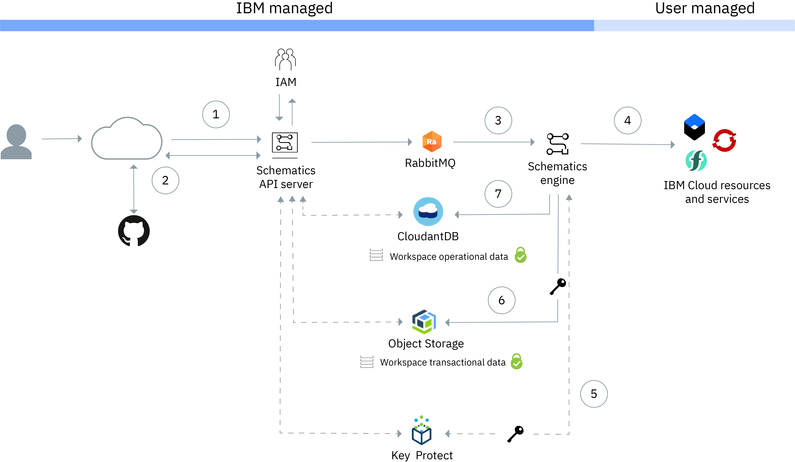
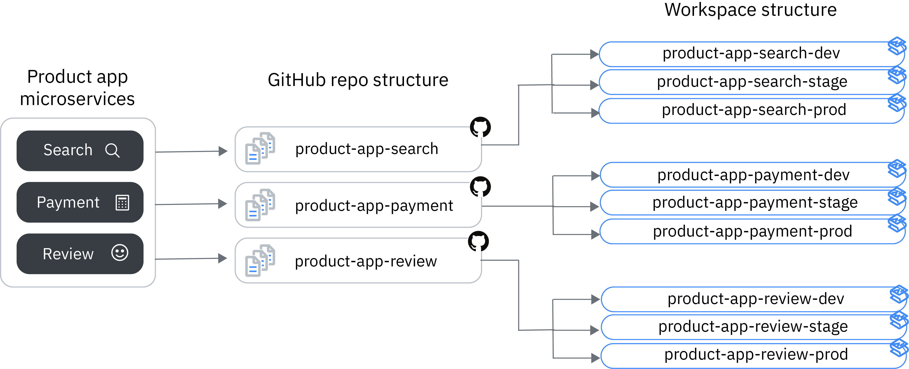
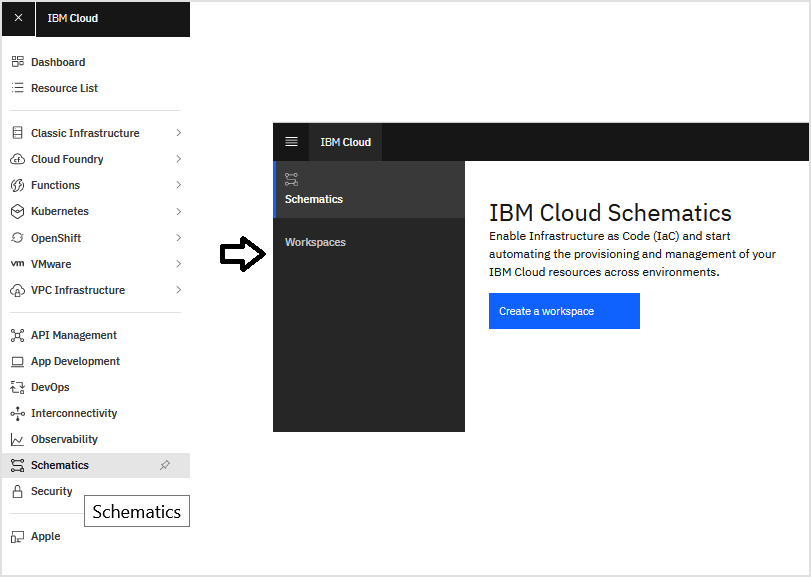
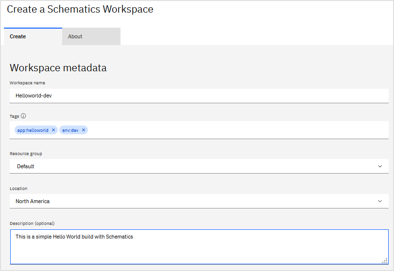

<!--

The pattern to document the resources is like follow:
- Introduce the resource with an example
- List all or the most important input parameters
- If will be used, list the most important output parameters
- Provide instructions to get the value of the input parameters, either using `ibmcloud`, API or the Web console.
- If needed, instructions to execute the code either with Terraform or Schematics

-->

<!-- TODO: Add screenshots for Web Console instructions -->
<!-- TODO: Fix or create links to Getting Started and Setup Environment -->
<!-- TODO: include link to CI/CD pattern -->
<!-- TODO: include the Security section, if it's needed here -->
<!-- The Security section is also related to LogDNA
      - [IBM Cloud Activity Tracker with LogDNA events](https://cloud.ibm.com/docs/schematics?topic=schematics-at_events)
-->

<PageDescription>

Learn how to use IBM Cloud Schematics

</PageDescription>

<AnchorLinks small>
  <AnchorLink>How is IBM Cloud Schematics different from Terraform</AnchorLink>
  <AnchorLink>Code to build a single instance</AnchorLink>
  <AnchorLink>Customize resources with input variables</AnchorLink>
  <AnchorLink>Setup the IBM Cloud Schematics CLI</AnchorLink>
  <AnchorLink>Create a Workspace</AnchorLink>
  <AnchorLink>Planing and Provisioning</AnchorLink>
  <AnchorLink>Schematics output and validation</AnchorLink>
  <AnchorLink>Clean up</AnchorLink>
</AnchorLinks>

IBM Cloud Schematics uses the open source Terraform provisioning engine to do Infrastructure as Code (IaC), of course using the same Terraform language code (HCL). To know more about Terraform check our previous topic [Getting Started with Terraform](/iac/getting-started-terraform).

Some of the key elements of using Schematics are a simplified interface and a collection of [ready-built Terraform templates](https://github.com/IBM-Cloud/terraform-provider-ibm/tree/master/examples).

Before continuing with Schematics make sure you have the IBM Cloud CLI installed and it's also recommended to have Terraform installed with the IBM Cloud Provider configured.

The following image shows the IBM Cloud Schematics architecture, the main components, how they interact with each other, and what type of encryption is applied to your personal information.



1. A user sends a request to create an IBM Cloud Schematics workspace to the Schematics API server.
2. The API server retrieves the Terraform template and input variables from your GitHub or GitLab source repository.
3. All user-initiated actions, such as creating a workspace, generating a Terraform execution plan, or applying a plan are sent to RabbitMQ and added to the internal queue. RabbitMQ forwards requests to the Schematics engine to execute the action.
4. The Schematics engine starts the process for provisioning, modifying, or deleting IBM Cloud resources.
5. To protect customer data in transit, IBM Cloud Schematics integrates with Key Protect. Schematics uses root keys in Key Protect to create data encryption keys (DEK). The DEK is then used to encrypt workspace transactional data, such as logs, or the Terraform `.tfstate` file in transit.
6. Workspace transactional data is stored in an IBM Cloud Object Storage bucket and encrypted by using [Server-Side Encryption with Key Protect](https://cloud.ibm.com/docs/cloud-object-storage?topic=cloud-object-storage-encryption#encryption-kp) at rest.
7. Workspace operational data, such as the workspace variables and Terraform template information, is stored in IBM Cloudant and encrypted at rest by using the default service encryption. For more information, see [Security](https://cloud.ibm.com/docs/Cloudant?topic=Cloudant-security).

## How is IBM Cloud Schematics different from Terraform

To use IBM Cloud Schematics, you don't need to install the Terraform CLI or the IBM Cloud Provider plug-in for Terraform. However, it doesn't hurt to have them installed as well as the IBM Cloud CLI.

The Terraform engine in Schematics means there is no need to learn a new language for IaC, you can use Terraform as usual.

The Terraform code needs to be in a GitHub or GitLab repository and linked to a Schematics Workspace. Schematics workspaces in an account can be re-used by anyone who has access to them through IBM Cloud Identity and Access Management. The Workspaces can be organized to distinguish between your environments or infrastructure layers without affecting resources in other environments or layers.

With Terraform code in a GitHub or GitLab repository you can have all the benefits of source control.

A main differentiator is the management of Terraform State, it's stored in the Workspace so you don't have to worry about how to share it with your team. This can be easily accomplished in a secure manner using IBM Cloud Identity and Access Management.

Last but not least, IBM Cloud Schematics is fully integrated into the IBM Cloud support system. If you run into an issue with using IBM Cloud Schematics, [open an IBM Cloud support case](https://cloud.ibm.com/docs/get-support?topic=get-support-getting-customer-support#getting-customer-support).

With Schematics you still need the IBM Cloud API key but instead of storing it in an environment variable or passing it in the `provider` block it is automatically retrieved for all IAM-enabled resources.

<!-- TODO: Test if Schematics works without having an API key in the account -->

## Code to build a single instance

<!-- TODO: update github link to final publish location when publishing -->

Schematics reads the code from a GitHub or GitLab repository, so to get started, consider the Terraform code developed in the previous section. This code is in the [Getting Started](https://github.com/IBM/cloud-enterprise-examples/tree/master/iac/01-getting-started) folder of the IaC Pattern Guides GitHub repository.

Without modificiation, the example will fail because it tries obtain the SSH public key from a local filesystem path. IBM Cloud Schematics will not have access to your filesystem because it's running on IBM Cloud. You can resolve this by creating the SSH Key pair in advance and adding the public key value as an input variable in Schematics.

<InlineNotification>

###### Where can I see the updated Terraform code?

These next few sections describe changes that need to be made to the basic example from the previous section for practical use in Schematics for a team environment. You can find a final version of the code from the [Schematics](https://github.com/IBM/cloud-enterprise-examples/tree/master/iac/02-schematics) code sample of the IaC Pattern Guides GitHub repository.

</InlineNotification>

To create a SSH Key Pair, use the `ssh-keygen` command, and with the default parameters a SSH Key Pairs will be created in the files `~/.ssh/id_rsa.pub` and `~/.ssh/id_rsa`. Learn more [here](https://cloud.ibm.com/docs/vpc?topic=vpc-ssh-keys).

<InlineNotification>

###### Sharing SSH key between projects

All the examples in IaC pattern creates the SSH key in the Terraform code, however you may already have the key created in advance in the IBM Cloud account or created using Terraform code in a side project.

Having a SSH key shared between projects is sometimes a good practice to follow. The section [Create a SSH key](/iac/schematics/ssh-keys) explains how to create your own SSH key in a different project and what changes are required to the code in the pattern examples to use a pre-existing key.

</InlineNotification>

To provide the public key content as an input variable there are minor changes needed to the Terraform code in the files `variables.tf` and `main.tf`:

```hcl path=variables.tf
variable "public_key" { }

variable "port" {
  default = 8080
}
```

From the previous `variable.tf` file, replace all the local and input variables for one line `variable "public_key" { }`, this variable will receive the SSH public key content.

The previous version of the `variable.tf` file reads the SSH public key file to store the content into the local variable `public_key`. This version of the file will get the content from the user input.

The `main.tf` requires a small change in the `ibm_is_ssh_key` resource. Instead of getting the public key from the local `public_key` variable, it gets it from the input variable `ibm_is_ssh_key`. To accomplish this, the change is just to replace `local` for `var`:

```hcl path=main.tf
provider "ibm" {
  generation         = 2
  region             = "us-south"
}

resource "ibm_is_ssh_key" "iac_test_key" {
  name       = "terraform-test-key"
  public_key = var.public_key
}

resource "ibm_is_instance" "iac_test_instance" {
  ...
}
```

All the parameters/variables have default so they are optional except for the public key, which is **required** on the input variable `public_key`.

To be used by Schematics, the Terraform code has to be in a GitHub or GitLab repository. Create a repository either in GitHub or GitLab and follow the instructions to upload the code, in this chapter we'll use GitHub and the instructions should be something similar to these but replacing `OWNER` and `PROJECT_NAME`:

```bash
echo "# A Simple instance with IBM Cloud Schematics" >> README.md
git init
git add README.md
git commit -m "first commit"
git remote add origin git@github.ibm.com:OWNER/PROJECT_NAME.git
git push -u origin master
```

## Customize resources with input variables

With the change to take a public key as a variable, this HCL code works but it has a limitation. If one team member executes it with Schematics or Terraform, and then another team member tries to use it with another Schematics workspace or with their own Terraform, this second execution will fail. The reason for the failure is because the resources already exist. So, the resources need to be named differently, for example, by adding a prefix to each resource name.

Another reason to do this is to separate the resources by project or environment. Using the same infrastructure as code, we would like to replicate the same infrastructure for multiple environments (i.e. `dev`, `stage` and `production`). We cannot do this with the code as it is now.

Fix this by adding a variable for the project name and the environment, these variables will be used as a prefix to each resource name. The `variable.tf` file now looks like this:

```hcl path=variables.tf
variable "project_name" { }
variable "environment" { }

variable "public_key" { }

variable "port" {
  default = 8080
}
```

To do the change in the name of the resources across all of the Terraform code, use the Linux/gnu `sed` tool:

```bash
sed  -i.bkp 's/terraform-test/${var.project_name}-${var.environment}/g' *.tf
```

If something goes wrong, the original files will have extensions like `.tf.bkp`, you may delete them if you are happy with the results (i.e. `rm *.tf.bkp`)

With this change the instance name and the ssh key name now are `"${var.project_name}-${var.environment}-instance"` and `"${var.project_name}-${var.environment}-key"` respectively.

Even though a workstation installation of `terraform` is not a requirement to work with Schematics, if you have it you can use it to validate the modified code. This is a faster way to test than pushing up to git and running the code in Schematics. So, if you have terraform cli, validate your code:

```bash
terraform init      # Just the first time to download the provisioner and other providers
terraform validate
terraform fmt       # To format the code to the canonical format. This is like a linter.
```

It may be a best practice to execute these commands before commit and to include them in your CI/CD pipeline.

To make this change available to Schematics commit and push it to the repository executing something like this:

```bash
git add *.tf
git commit -m "using project name and environment to name resources"
git push
```

## Setup the IBM Cloud Schematics CLI

This section will cover instructions using the IBM Cloud Web Console and the IBM Cloud CLI. In order to use the IBM Cloud CLI some setup has to be done in advance including installing the schematics plugin. The [Setup Environment](/iac/setup-environment) page explains these steps in detail.

## Create a Workspace

Begin by creating the workspace, this will require an existing GitHub or GitLab repo with the Terraform code. Workspace creation may be performed with the IBM Cloud Web Console and the IBM Cloud CLI. Instructions are provided for each scenario.

An IBM Cloud Schematics workspace connects to one GitHub or GitLab repository and creates input variables based on the Terraform code. Workspaces help to organize resources that belong to one IBM Cloud environment. For example, use workspaces to separate your test, staging, and production environments. With IBM Cloud Identity and Access Management, you can control who has access to your resources and can provision or manage these resources in your IBM Cloud account.

It's recommended to create a Workspace for each microservice, service or application on every environment your project needs. The following image is an example of this. There are 3 application microservices, each one is in a single GitHub repo or in a folder of a monorepo. The project uses 3 environments: `dev`, `stage` and `prod`, so each microservice has to be deployed into the infrastructure for each environment. This project requires 9 (3x3) workspaces.



### Create Workspaces on the IBM Cloud Web Console

To create the Workspace using the Web Console follow these instructions:

1. Login to IBM Cloud web console, go to **Navigation Menu** > **Schematics**
2. Click on **Create workspace**
3. Enter the following parameters
   1. Give it a name, example: `helloworld-dev`
   2. Assign tags to your Workspace, the tags may help you to easily find your workspace. For example: `app:helloworld`, `env:dev`
   3. Assign the resource group where this Workspace will be created, by default is the Default resource group
   4. Enter a description so others can know what is this Workspace about. Something like: `This is a simple Hello World build with Schematics`
4. Click on the **Create** button





<!-- TODO update with publish git repository -->

To Setup the new workspace enter the URL of the GitHub or GitLab repository. This URL can contain a branch, tag or could be a folder inside the repository. For example: `https://github.com/IBM/cloud-enterprise-examples/tree/master/iac/02-schematics`

These are examples of URLs when the code is in ...

- in `master` branch: `https://github.com/owner/project_name`
- in a specific branch: `https://github.com/owner/project_name/tree/mybranch`
- in a specific folder (any branch): `https://github.com/owner/project_name/tree/master/service_name`

If the repository is private, you need to provide an access token. This [page](https://help.github.com/en/github/authenticating-to-github/creating-a-personal-access-token-for-the-command-line) has the instructions to generate a personal access token on GitHub.

The last parameter is the Terraform version. We recommend to use the latest version, however, there will be exsiting sample code that has not yet migrated to the latest Terraform version, in that case choose the version appropriate for your code.

When you save the settings, Schematics loads the code from the repository and display all the input variables with their default values (if any). If the Terraform code is modified and the changes commit/pushed to GitHub or GitLab, the user will need to make Schematics load the latest changes by clicking on the **Pull latest** button.

To avoid manually pulling the latest version of the code, it is possible to enable continuos delivery in the workspace. With this configured, every time a code change is committed, Schematics will know and pull the latest version of the code. This topic is covered in the CI/CD pattern.

<!-- TODO: include link to CI/CD pattern here -->

You can override any input variable value and you must provide a value for those variables without defaults, such as `project_name`, `environment` and `public_key`. If any of the variables contain sensitive information, such as `public_key`, it's recommended to click on the **Sensitive** check box at the right, otherwise this value will be visible in the service logs.

When you are done with the variables values, click on the **Save changes** button.

### Create Workspaces with the IBM Cloud CLI

To create the workspace using the CLI we use the sub-command `workspace` of the `schematics` plugin. Here is an example of using the sub-command:

```bash
ibmcloud schematics workspace new --file workspace_file.json
```

The `workspace_file.json` is a configuration file for the workspace, it may have any filename and must be in JSON format. The content of the file is something like this:

```json
{
  "name": "<workspace_name>",
  "type": [
    "<terraform_version>"
  ],
  "description": "<workspace_description>",
  "tags": [],
  "template_repo": {
    "url": "<github_source_repo_url>"
  },
  "template_data": [
    {
      "folder": ".",
      "type": "<terraform_version>",
      "variablestore": [
        {
          "name": "<variable_name1>",
          "value": "<variable_value1>"
        },
        {
          "name": "<variable_name2>",
          "value": "<variable_value2>"
        }
      ]
    }
  ],
  "githubtoken": "<github_personal_access_token>"
}
```

Where:

| Parameter | Description |
| --- | --- |
| `<workspace_name>` | the name of the workspaces. This parameter is required |
| `<terraform_version>` | Terraform version to use, at this time the available values are `terraform_v0.12` and `terraform_v0.11`, check the list on values in any created Workspace. If no value is set, the oldest version is selected. |
| `<workspace_description>` | Description for the workspace. This parameter is optional. |
| `<github_source_repo_url>` | GitHub or GitLab repository URL. It may have a branch and directory. If no URL is provided the Workspace is created with the **Draft** state. |
| `<variable_name>`, `<variable_value>` | Variable name and value pairs to set in the Workspace. Variables without a default value are required. If the provided variable is not declared in the code, the creation will fail. |
| `<github_personal_access_token>` | If this is a private repository Schematics requires a GitHub Personal Access Token to access the repository. |

The command also accepts the option `--state STATE_FILE` in case you have applied the Terraform code locally and have a state file. This state file will be loaded into the Workspace.

If you create the workspace JSON file as a template like the following example, you can use the `sed` command to replace all the template variables for values. The following example insert the SSH public key in the variable `public_key`.

```json path=workspace.tmpl.json
{
  "name": "iac_schematics_test",
  "type": [
    "terraform_v0.12"
  ],
  "description": "Sample workspace to test IBM Cloud Schematics. Deploys an web server on a VSI with a Hello World response",
  "tags": [
    "app:helloworld",
    "env:dev"
  ],
  "template_repo": {
    "url": "https://github.com/IBM/cloud-enterprise-examples/tree/master/iac/02-schematics"
  },
  "template_data": [{
    "folder": ".",
    "type": "terraform_v0.12",
    "variablestore": [{
        "name": "project_name",
        "value": "iac_schematics_test",
        "type": "string"
      },
      {
        "name": "environment",
        "value": "dev",
        "type": "string"
      },
      {
        "name": "public_key",
        "value": "{ PUBLIC_KEY }",
        "type": "string"
      }
    ]
  }]
}
```

```bash
PUBLIC_KEY="$(cat ~/.ssh/id_rsa.pub)"
sed "s|{ PUBLIC_KEY }|$PUBLIC_KEY|" workspace.tmpl.json > workspace.json
ibmcloud schematics workspace new --file workspace.json
```

After the Workspace is created you can list workspaces with the sub-command `list`:

```bash
ibmcloud schematics workspace list
```

The `list` sub-command gives you the Workspace ID, you can use this ID in other commands such as `get` to retrieve the workspace configuration:

```bash
ibmcloud schematics workspace get --id WORKSPACE_ID
```

If the workspace requires changes use the `update` command:

```bash
ibmcloud schematics workspace update --id WORKSPACE_ID --file workspace_file.json
```

Where `WORKSPACE_ID` is the ID you obtained with the `list` command and `workspace_file.json` is the JSON formatted configuration file for this workspace with the changes.

All these commands use the parameter `--json` to output the results in JSON format. Use the command `jq` to parse, filter or modify the output. For example:

```bash
# List every Workspace and its ID
ibmcloud schematics workspace list --json | jq '[.workspaces[] | {(.name): .id}]'

# Get the ID for the workspace named 'iac-test'
ibmcloud schematics workspace list --json | jq -r '.workspaces[] | select(.name == "iac-test") | .id'
```

## Planning and Provisioning

Creating an execution plan in Schematics is the same result as executing `terraform plan` from the cli. Altough it's optional, it's recommended to know what Terraform or Schematics is going to do. To create the plan click on the **Generate plan** button at the top, after it's executed you can see the summary of the actions and decide to proceed or not with the provisioning of the resources. Click on **View log** link at the right side to view the detailed plan. You can view the logs during and after the execution of the plan generation, they are also updated in real-time if you view them during the generation of the plan.

<InlineNotification kind="warning">

###### Understand the costs

It's very important to review the plan in the logs, and verify that the resources to be created are as intended and associated costs are understood.
Some services may come with a limit and that limit may be reached (for example, **Lite** service plans are limited to one instance per account). If that's the case, increase the service quota or remove unnecessary services.

</InlineNotification>

If the Generate plan button is disabled it may be possible because the code is still being loaded, or that the state for the workspace is frozen. Check the **State**, and confirm it shows as `Unfrozen`. By Freezing the workspace with this toggle, you disable any change, including generating plans and applying them.

Generate plan is also useful to identify drifts between your current environment and the Terraform state stored by the workspace. If someone, using the Terraform code in the GitHub repository, modifies the infrastructure or even manually performs changes to the infrastructure, there will be a drift between the current infrastructure and the terraform state. Generating the plan will help you to identify and reduce or eliminate that deviation.

The Provisioning part of the process is the same as executing `terraform apply` to create, modify or remote the resources according to the plan. The execution of the provisioning will result in setting the infrastructure to the state devined by the Terraform code.

Click on the **Apply plan** button. Optionally, while the plan is applied, view the actions by clicking on the **View log** link. The previous plan or provisioning logs, are available from the **Activity** menu at the left. You can view the logs live while the execution of the plan is happening, or you can see them when the execution ends.

It's recommended to have a README.md in your repository, this will be visible at the **Readme** option of the left side menu in Schematics.

Also on the left side menu there is the **Resources** item, you can see all the resources created or modified from the workspace.

### Planning and Provisioning from the CLI

Plan generation and plan apply are actions that can be done with the IBM Cloud CLI and the Schematics plugin. For this, use the sub-commands `plan` and `apply`:

```bash path=plan
ibmcloud schematics plan --id WORKSPACE_ID
```

The `plan` command is very similar to the `terraform plan` command with the difference that it just starts the plan generation, it does not wait until it's complete. To get the status of the plan use the command `action` passing the `Activity ID` returned by the `plan` command, and use the `logs` command to view the logs, also passing the activity ID. For example:

```bash
$ ibmcloud schematics plan --id iac-test-540325c4-c7d9-48

Activity ID   072bd0a7abf3d22e79e2eeebcb169bff

OK
$ ibmcloud schematics workspace action --id iac-test-540325c4-c7d9-48 --act-id 072bd0a7abf3d22e79e2eeebcb169bff

$ ibmcloud schematics logs --id iac-test-540325c4-c7d9-48 --act-id 072bd0a7abf3d22e79e2eeebcb169bff
```
<!-- TODO: Open defect, the action command is failing -->

To apply the plan once generated is also similar to `terraform apply`:

```bash path=apply
ibmcloud schematics apply --id WORKSPACE_ID
```

Where `WORKSPACE_ID` is the workspace ID that you can obtain with the `list` command explained before.

The `apply` command accepts the following parameters:

- `--target RESOURCE`: is used to target the creation of a specific resource declared in the terraform code. The value is a resource address, for example: `ibm_is_instance.iac_test_instance`, all other resources will remain as they are or not created. To have multiple target resources just add more `--target` parameters, one per resource to target. If the resource is an array, you can specify the entire array or just one element, like so `ibm_is_instance.iac_test_instance[0]`. Notice that if you target one resource that does not mean only that resource will be modified, such resource may be a dependency for other resources and those will also be impacted/modified by this change.
- `--var-file TFVARS_FILE_PATH`: is the path to the `terraform.tfvars` file in your computer. This is useful if there are variables to override or if there are variables with no values or sensitive values.
- `--force`: execute the action (`apply`) without confirmation.

Example:

```bash
echo "port=8081" > terraform.tfvars
ibmcloud schematics apply --id iac-test-540325c4-c7d9-48 --json --target ibm_is_instance.iac_test_instance --var-file ./terraform.tfvars --force
```
<!-- TODO: Open defect, the --var-file parameter is failing -->

Same as with `plan` the return value of this command is an Activity ID that you can use with the `action` and the `logs` command to view the status and the logs of the recent apply command. For example:

```bash
ibmcloud schematics workspace action --id iac-test-540325c4-c7d9-48 --act-id 736b8af9fea80a73f2765c89a30496d5

ibmcloud schematics logs --id iac-test-540325c4-c7d9-48 --act-id 736b8af9fea80a73f2765c89a30496d5
```

To refresh the Terraform state in the Web Console you have to re-apply the plan, with the CLI the `refresh` command is used:

```bash
ibmcloud schematics refresh --id WORKSPACE_ID
```

For example:

```bash
$ ibmcloud schematics refresh --id iac-test-540325c4-c7d9-48
Activity ID   e523a779db9d7e5162bf44786c86590c
OK
$ ibmcloud schematics workspace action --id iac-test-540325c4-c7d9-48 --act-id e523a779db9d7e5162bf44786c86590c

$ ibmcloud schematics logs --id iac-test-540325c4-c7d9-48 --act-id e523a779db9d7e5162bf44786c86590c
```

Other useful commands related to state are `list` and `pull` to list all the resources documented in the state and to retrieve a state respectively. For example:

```bash
$ ibmcloud schematics state list --id iac-test-540325c4-c7d9-48
iac_test_floating_ip
iac_test_instance
iac_test_security_group
iac_test_security_group_rule_all_outbound
iac_test_security_group_rule_tcp_http
iac_test_key
iac_test_subnet
iac_test_vpc
OK

$ TEMPLATE_ID=$(ibmcloud schematics workspace get --id iac-test-540325c4-c7d9-48 --json | jq -r '.template_data[].id')
$ ibmcloud schematics state pull --id iac-test-540325c4-c7d9-48 --template $TEMPLATE_ID

<Terraform state file>
```

As you can see the `pull` command requires the template ID which can be obtained with the `get` command. Use the `jq` query in the example to filter the output and return the ID.

## Schematics output and validation

A Workspace has input variables and output variables, such output variables could be input variables for other Workspace, resources or programs, and could be used to validate the results of the IaC. To have access to these output variables we use the `ibm_schematics_output` data source or the IBM Cloud CLI.

### Getting the outputs and performing validations with Terraform

Our code in the workspace has two output variables `entrypoint` and `ip_address`, let's create this simple terraform code to get the output values from the workspace.

Create a directory and inside of it create the following `main.tf` file:

```hcl path=main.tf
variable "schematics_workspace_id" {}

data "ibm_schematics_workspace" "iac-test" {
  workspace_id = var.schematics_workspace_id
}

data "ibm_schematics_output" "iac-test-output" {
  workspace_id = var.schematics_workspace_id
  template_id  = data.ibm_schematics_workspace.iac-test.template_id.0
}

output "output_vars" {
  value = data.ibm_schematics_output.iac-test-output.output_values
}

output "entrypoint" {
  value = data.ibm_schematics_output.iac-test-output.output_values.entrypoint
}

output "ip_address" {
  value = data.ibm_schematics_output.iac-test-output.output_values.ip_address
}
```

To get the values we use the `ibm_schematics_output` data source, it requires two input parameters: `workspace_id` and `template_id`. These need to be set before executing the above Terraform code. Here are examples showing how to get the `template_id` using the `ibm_schematics_workspace` data source and the `workspace_id` with the IBM Cloud CLI.

To get the `workspace_id` use the `ibmcloud schematics workspace list` command, where `NAME` is a variable with the name of the workspace:

```bash
NAME=iac-test
export TF_VAR_schematics_workspace_id=$(ibmcloud schematics workspace list --json | jq -r '.workspaces[] | select(.name == "'$NAME'") | .id')
```

The workspace ID is then stored in the `TF_VAR_schematics_workspace_id` variable so terraform can use it for the value of the input variable `schematics_workspace_id`.

To get the Template ID, declare the `ibm_schematics_workspace` data source passing the `workspace_id` parameter from the already populated input variable. This data source stores the Template ID in the output parameter `template_id`.

Outside of terraform, it's also possible to retreive the Template ID using `ibmcloud` with the following command:

```bash
TEMPLATE_ID=$(ibmcloud schematics workspace get --id $ID --json | jq -r '.template_data[].id')
```

With the `workspace_id` and `template_id` the `ibm_schematics_output` resource can be created and used to list the output variables of the workspace using the parameter `output_values`. Or, access individual state values with the name of the output variable like this: `data.ibm_schematics_output.iac-test-output.output_values.entrypoint`

Execute the following terraform command to get the output variables:

```bash
terraform init
terraform apply -auto-approve
terraform output entrypoint
terraform output ip_address
```

You can also use these output values like so:

```bash
$ curl $(terraform output entrypoint)
Hello World
```

You can also create a new workspace pointing to this code in a GitHub/GitLab repository but in order to see the output variables you need to view the logs of the apply.

### Getting the outputs and do validations with the IBM Cloud CLI

The workspace output variables are not just available through the `ibm_schematics_output` data source, you can use `ibmcloud` to list the output variables and their values with the Schematics plugin and its command `output` like this:

```bash
ibmcloud schematics workspace output --id WORKSPACE_ID --json
```

Where `WORKSPACE_ID` is the ID you obtained with the `list` command. You can use the `jq` command to parse or filter the output of this command:

```bash
# List all the output variables and values for workspace with ID 'iac-test-540325c4-c7d9-48':
ibmcloud schematics workspace output --id iac-test-540325c4-c7d9-48 --json | jq '.[].output_values[]'

# Get the value of the output variable 'entrypoint' from the same workspace:
ibmcloud schematics workspace output --id iac-test-540325c4-c7d9-48 --json | jq -r '.[].output_values[].entrypoint.value'
```

With the Hello World example, we can view the results or test our code:

```bash
$ NAME=iac-test
$ ID=$(ibmcloud schematics workspace list --json | jq -r '.workspaces[] | select(.name == "'$NAME'") | .id')

$ curl $(ibmcloud schematics workspace output --id $ID --json | jq -r '.[].output_values[].entrypoint.value')
Hello World

$ IP=$(ibmcloud schematics workspace output --id $ID --json | jq -r '.[].output_values[].ip_address.value')
$ ssh -i ~/.ssh/id_rsa ubuntu@$IP "echo 'Hello World'"
Hello World

$ ssh -i ~/.ssh/id_rsa ubuntu@$IP
> exit
```

<!-- ## Security
    Here is where Security could be.
    Source: https://cloud.ibm.com/docs/schematics?topic=schematics-access
-->

## Clean up

To destroy all the created resources click on the **Actions...** button at the top right corner and select **Delete**. This gives you the option to delete or destroy all the resources, the workspace, or both. Destroying the resources is similar to `terraform destroy`.

If you retain the workspace, after delete or destroy all the resources you can see the logs in the same way you see the logs for the planning or execution of the plan.

Is it possible to delete specific resources? Yes, using the same approach that would be used with the Terraform cli. Open the terraform code and delete or comment out the resource to delete, you can comment out adding `#` at the beginning of each line. Commit the change and load the latest changes in the Workspace, go to **Settings** then **Pull latest**. When you generate the plan and apply it, the eliminated resource will be removed as well from the infrastructure. Check the logs and the resources in the **Resources** section of the menu to verify. Notice that deleting a resource may require to delete in cascade the resources that depend of it. Terraform/Schematics will alert you if there are orphan resources in your code.

### Clean up with the IBM Cloud CLI

Deletion is not limited to the Web Console, you can do it also with the IBM Cloud CLI.

To destroy the resources, just like `terraform destroy` you can use the `destroy` command of the Schematics plugin:

```bash
ibmcloud schematics destroy --id WORKSPACE_ID [--target RESOURCE] [--force] [--json]
```

As with `apply` there is the `--target` parameter if you want to destroy only one or multiple but not all the resources. Also use the `--force` or `-f` parameter to skip the user validation.

The following example will destroy only the security group rule to allow access to port 22 for SSH login. After removing this rule we won't be able to SSH into the server but the HTTP service will still be working:

```bash
ibmcloud schematics destroy --id iac-test-540325c4-c7d9-48 --target ibm_is_security_group_rule.iac_test_security_group_rule_tcp_ssh
```

Check the status and the logs of destroying this resource with the command `action` and `logs`, for example:

```bash
ibmcloud schematics workspace action --id iac-test-540325c4-c7d9-48 --act-id ed5d355d0b3957387d2c49eeda80f0cb

ibmcloud schematics logs --id iac-test-540325c4-c7d9-48 --act-id ed5d355d0b3957387d2c49eeda80f0cb
```

The validation also show the change was successfully done:

```bash
$ NAME=iac-test
$ ID=$(ibmcloud schematics workspace list --json | jq -r '.workspaces[] | select(.name == "'$NAME'") | .id')

$ curl $(ibmcloud schematics workspace output --id $ID --json | jq -r '.[].output_values[].entrypoint.value')
Hello World

$ IP=$(ibmcloud schematics workspace output --id $ID --json | jq -r '.[].output_values[].ip_address.value')
$ ssh -i ~/.ssh/id_rsa ubuntu@$IP "echo 'Hello World'"
        ... (a few seconds later) ...
ssh: connect to host 52.116.128.87 port 22: Operation timed out
```

To delete the Workspace, **not the resources**, use the command `delete`, like so:

```bash
ibmcloud schematics workspace delete --id WORKSPACE_ID --force
```

The `--force` or `-f` parameter is optional and the `WORKSPACE_ID` is the ID obtained from the `get` command explained above.
