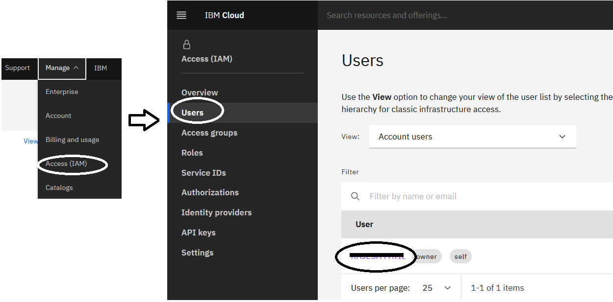

<PageDescription>

Instructions to setup your environment to use Terraform for IBM Cloud

</PageDescription>

The first step before you start working with Infrastructure as Code or Terraform is to setup your environment. We will install terraform, then set it up for IBM Cloud and make sure it works with IBM Cloud.

<AnchorLinks small>
  <AnchorLink>Install IBM Cloud CLI</AnchorLink>
  <AnchorLink>Install Terraform</AnchorLink>
  <AnchorLink>Configure access to IBM Cloud</AnchorLink>
  <AnchorLink>Testing access to IBM Cloud</AnchorLink>
</AnchorLinks>

<InlineNotification>

###### Requirements

To be able to execute and complete the instructions in this page, make sure you have an **IBM Cloud account**: if you don't have one yet, you can [create a Lite account](https://cloud.ibm.com/docs/overview?topic=overview-quickstart_lite#prereqs-lite) for free.

</InlineNotification>

## Install IBM Cloud CLI

If you already have installed and setup the IBM Cloud CLI you may skip this section and go straight to install infrastructure [IBM Cloud CLI Plugins](#ibm-cloud-cli-plugins).

In this pattern you will see `ibmcloud` CLI in most of the examples and instructions. This table provides simplified instructions to install `ibmcloud` CLI on different platforms, for more details, see the [cli installation instructions](https://cloud.ibm.com/docs/cli?topic=cloud-cli-install-ibmcloud-cli).

<Tabs>
<Tab label="Linux">

The following one-liner script works on Linux to install the latest version of `ibmcloud`:

```bash
curl -fsSL https://clis.cloud.ibm.com/install/linux | sh
```

Or, you can download the latest version of the Installer for Linux from the [IBM Cloud CLI Releases](https://github.com/IBM-Cloud/ibm-cloud-cli-release/releases/) page, extract the package and run the `install` script.

</Tab>

<Tab label="Mac OS X">

If you have [brew](https://brew.sh) installed, you can install terraform executing the following command.

```bash
brew cask install ibm-cloud-cli
```

Then add one of the following lines to `~/.zshrc` or `~/.bashrc` respectively (more about autocomplete [here](https://cloud.ibm.com/docs/cli?topic=cloud-cli-shell-autocomplete)):

```bash
source /usr/local/ibmcloud/autocomplete/zsh_autocomplete
source /usr/local/ibmcloud/autocomplete/bash_autocomplete
```

If `brew` is not installed then execute the following command:

```bash
curl -fsSL https://clis.cloud.ibm.com/install/osx | sh
```

Or, download the latest version of the Installer for Mac OS X from the [IBM Cloud CLI Releases](https://github.com/IBM-Cloud/ibm-cloud-cli-release/releases/) page, execute it and follow the instructions.

</Tab>

<Tab label="Windows">

Download the latest version of the Installer for Windows from the [IBM Cloud CLI Releases](https://github.com/IBM-Cloud/ibm-cloud-cli-release/releases/) page, execute it and follow the instructions.

Or, if you prefer to install with PowerShell, execute the following command:

```powershell
iex(New-Object Net.WebClient).DownloadString('https://clis.cloud.ibm.com/install/powershell')
```

</Tab>
</Tabs>

Verify `ibmcloud` was correctly installed by executing: `ibmcloud version`, you should see something like this:

```bash
$ ibmcloud version
ibmcloud version 1.0.0+908f90a-2020-03-30T10:19:41+00:00
```

### IBM Cloud CLI Plugins

The next steps is to install all the required plugins, for Infrastructure as Code you'll need the `vpc-infrastructure` (aka `infrastructure-service`) and the `schematics` plugins, to install them execute the following command:

```bash
ibmcloud plugin install -f -r "IBM Cloud" infrastructure-service
ibmcloud plugin install -f -r "IBM Cloud" schematics
```

To list all the available plugins use the command:

```bash
ibmcloud plugin repo-plugins
```

When a plugin version is out-of-date, you will see a reminder the first time you use that plugin in a cli session. To update plugins, you can use the following command to list available updates and select the ones to install:

```bash
ibmcloud plugin update
```

### Login to IBM Cloud

Log in to IBM Cloud with the `login` sub-command. You may need to use the parameter `-r` to select a region (i.e. `us-south` or `eu-gb`), `-g` to select a resource group (i.e. `Default`), `-c` to select an account ID and `--sso` to request a one-time password if your IBMid is federated with another identity provider. When not using `--sso`, the command will interactively prompt for user name and password. Although these can be specified with the `-u` or `-p` parameters, for security reasons, it's not recommended to do so.

```bash
ibmcloud login -r us-south -g Default --sso
```

You don't have to select the region or the resource group at login, these can be set at any time in the cli. After login (with or without resource group), to list all the available resource groups use the `resource groups` sub-command then use the `target` sub-command to select it.

```bash
ibmcloud resource groups
ibmcloud target -g RESOURCE_GROUP_NAME
```

The `target` sub-command can be used also to select a new account ID or region.

<InlineNotification>

###### `ibmcloud` cheatsheet

To know more about the IBM Cloud CLI download this [quick reference](https://github.com/ibm-cloud-docs/cli/raw/master/IBM%20Cloud%20CLI%20quick%20reference.pdf) sheet. Also check the [IBM Cloud CLI documentation](https://cloud.ibm.com/docs/cli?topic=cloud-cli-getting-started).

</InlineNotification>

## Install Terraform

[Terraform](http://terraform.io/) is Open Source software developed by [HashiCorp](https://www.hashicorp.com/) to describe infrastructure as a code. Terraform allows you to build, change, and do versioning of the infrastructure safely and efficiently on multiple platforms and clouds. You can use Terraform to automate your IBM Cloud resource provisioning, rapidly build complex, multi-tier cloud environments, and implement Infrastructure as Code (IaC).

Terraform is distributed as a single binary for different platforms and architectures. To install Terraform follow the instructions below to install it from Terraform downloads or from the command prompt from your platform.

<Tabs>
<Tab label="Manual installation">

Download the latest version for your operative system from the [Download Terraform](https://www.terraform.io/downloads.html) page, then unzip it and move it to a directory included in your system's PATH environment variable.
</Tab>
<Tab label="Linux">

The following one-liner script works on Linux and Mac OS X to install Terraform **v0.12.24** for **amd64** architecture.

Update the version number to the latest one and move the downloaded `terraform` binary to one of the directories listed in the `$PATH` environment variable.

```bash
curl -SL "https://releases.hashicorp.com/terraform/0.12.24/terraform_0.12.24_$(uname | tr '[:upper:]' '[:lower:]')_amd64.zip" | \
tar -xf - && \
chmod +x terraform
```

</Tab>

<Tab label="Mac OS X">

If you have [brew](https://brew.sh) installed, you can install terraform executing the following command.

```bash
brew install terraform
```

If not, you can follow the same instructions for Linux.

</Tab>

<Tab label="Windows">

If you have [Chocolatey](https://chocolatey.org/) installed, you can install terraform executing the following command.

```bash
choco install terraform
```

If not, download from the Terraform downloads page and install manually.

</Tab>
</Tabs>

Verify terraform is correctly installed by executing: `terraform version`, you should see something like this:

```bash
$ terraform version
Terraform v0.12.24
```

## Configure access to IBM Cloud

With Terraform you can create, manage and update almost any infrastructure resource such as virtual servers, virtual routers, load balancers, containers, kubernetes clusters, and more. All these infrastructure components are represented as a **resource** in Terraform. All these resources are defined in a **Terraform provider** which is responsible to interact and expose the resources using the cloud service API.

<InlineNotification>

###### Where can I find an overview of available resources?

To find a full list of IBM Cloud resources that you can provision with the IBM Cloud Provider plug-in, see the [IBM Cloud Provider reference](https://cloud.ibm.com/docs/terraform?topic=terraform-index-of-terraform-resources-and-data-sources).

</InlineNotification>

In order for Terraform to interact with IBM Cloud, it requires the IBM Cloud Provider. To install the IBM Cloud Provider just download the binary to the directory `~/.terraform.d/plugins`. Download the latest version from [https://github.com/IBM-Cloud/terraform-provider-ibm/releases](https://github.com/IBM-Cloud/terraform-provider-ibm/releases), or execute the following simple script on Linux or Mac OS X, make sure to update the version number (i.e. `v1.3.0`) to the latest one.

```bash
mkdir -p ~/.terraform.d/plugins
curl -SL "https://github.com/IBM-Cloud/terraform-provider-ibm/releases/download/v1.3.0/$(uname | tr '[:upper:]' '[:lower:]')_amd64.zip" | \
tar -xf - -C ~/.terraform.d/plugins
chmod +x ~/.terraform.d/plugins/terraform-provider-ibm_*
```

Now we need to setup the IBM Cloud credentials on the system to let the IBM Cloud provider to talk the IBM Cloud REST API.

<InlineNotification>

###### What credentials do I need?

The credentials that you need depend on the type of resource that you want to provision. For example, to provision classic infrastructure resources, you must provide your IBM Cloud classic infrastructure user name and API key. To provision VPC infrastructure generation 2, you need an IBM Cloud API key. For more information about what credentials you need for a specific IBM Cloud resource, see [Retrieving required credentials for your resources](https://github.com/IBM-Cloud/terraform-provider-ibm/releases).

In this documentation we are going to use Gen 2 resources so we'll only work with the IBM Cloud API key.

</InlineNotification>

<InlineNotification>

###### Using Classic Infrastructure?

To use the Classic Infrastructure or the VPC Infrastructure Gen 1 you'll need to include in the credentials the IAAS Classic username and API key. These can be obtained at the IBM Cloud web console. Go to **Manage** > **Access (IAM)** > **Users**, find and click on your user. 
<br /> 

 

<br />
Under the section **API keys** you'll find your key(s) or generate them by clicking on `Create classic infrastructure key` button. The **username** is the email address you use to login to the IBM Cloud console.

<br /> 


<br /> 

When you have the IAAS Classic username and API key, export them with the environment variables `IAAS_CLASSIC_USERNAME` and `IAAS_CLASSIC_API_KEY` respectively.
<br /> 

</InlineNotification>

If you haven't logged in yet, follow the steps from [login](#login-to-ibm-cloud) to IBM Cloud or just execute `ibmcloud login` and target a resource group.

```bash
ibmcloud login --sso
ibmcloud resource groups
ibmcloud target -g RESOURCE_GROUP_NAME
```

Create an API Key on the IBM Cloud web console following these [instructions](https://cloud.ibm.com/docs/iam?topic=iam-userapikey#create_user_key) or simply using the `ibmcloud` command, like this:

```bash
ibmcloud iam api-key-create TerraformKey -d "API Key for Terraform" --file terraform_key.json
```

If you are in a GitHub repository directory, make sure the file is not pushed or ignore it adding the filename to `.gitignore`, executing:

```bash
echo "terraform_key.json" >> .gitignore
```

To give Terraform and the IBM Cloud provider access to the IBM Cloud credentials, store the API key as the environment variable `IC_API_KEY`.

```bash
export IC_API_KEY=$(grep '"apikey":' terraform_key.json | sed 's/.*: "\(.*\)".*/\1/')
```

Or by using jq:

```bash
export IC_API_KEY=$(jq -r .apikey terraform_key.json)
```

<InlineNotification kind="warning">

###### Important

The IBM Cloud credentials can also be set in Terraform input variables.

There are different ways to set Terraform input variables, for security reasons we recommend to use environment variables (`TF_VAR_<variable name>`) but you can also store them in a variable definition (`.tfvar`) files or pass them with the `-var` command line option.

If you store the credentials in a variable definition file, i.e. `terraform.tfvar` make sure to not push the file to your github repository. Add the filename into the `.gitignore` file.

The same applies for the Key file previously created, so make sure it is also in the `.gitignore` file.

</InlineNotification>

## Testing access to IBM Cloud

The Terraform code can be done with JSON format or using **HashiCorp Configuration Language** (HCL). During this pattern guide we'll use only HCL and we will call it HCL or Terraform Code.

A simple terraform code to verify your access could be something like the following:

```hcl
provider "ibm" {
  generation         = 2
  region             = "us-south"
}

data "ibm_iam_access_group" "accgroup" {
}

output "accgroups" {
  value = data.ibm_iam_access_group.accgroup.groups[*].name
}
```

Create a file `main.tf` with the above terraform code in a temporary directory, then execute:

```bash
terraform init
terraform apply
```

The output of `terraform apply` should print any Access Groups that are visible to you in the account associated with your API key. The output should be similar to the execution of:

```bash
ibmcloud iam access-groups
```

In the following section we'll see more examples.
