In this document, We will show you how to stream log events from LogDNA to [Splunk](https://www.splunk.com/). In order to achieve this, we will use the below two capabilities:
- the streaming feature of logDNA that can be used to stream events to IBM Event Streams.
- the Kafka Splunk connect to stream events from IBM Event Streams to Splunk.
- Configure a Kafka Splunk Connect custom dashboard.


### Create an instance of IBM Event Streams

Click [here](https://cloud.ibm.com/catalog/services/event-streams) to create an instance of IBM Event Streams. Choose a `Standard` plan.

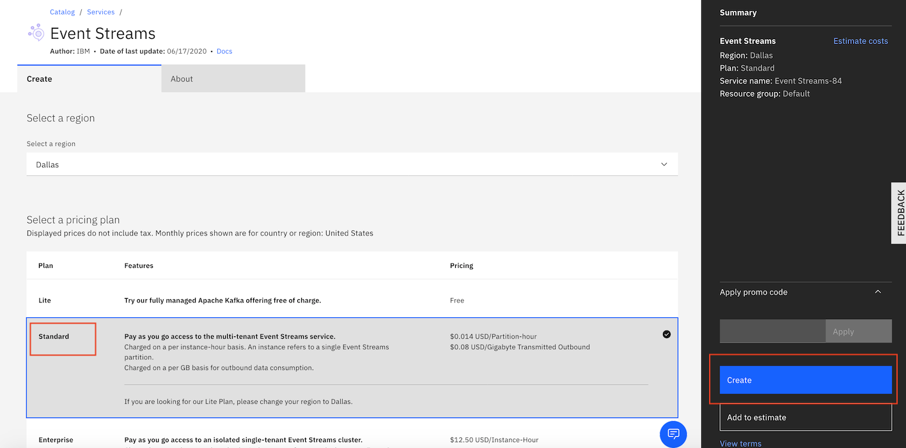   

### Create a topic on Event Streams

On the `Event Streams` console, click on `Manage` and then `Topics`.

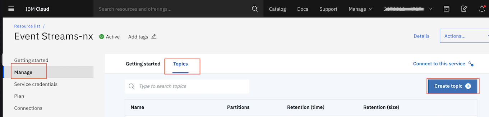 

Enter a topic name `logdnatopic` and click `Next`.

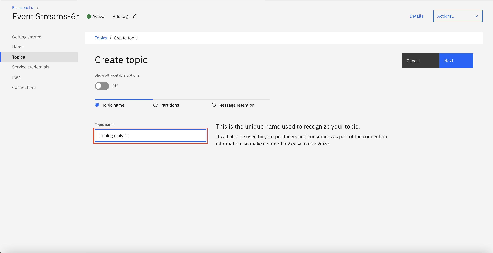 

Enter the number of partitions and click `Next`.

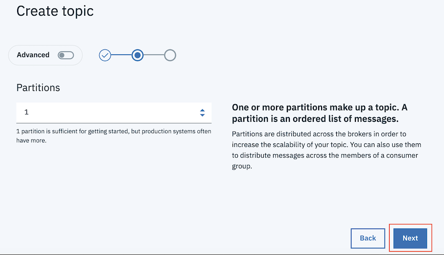

Select message retention time and click `Create Topic`.


### Note down credentials on Event Streams

Click on `Service credentials`. Note down the `apikey` and `broker urls`.
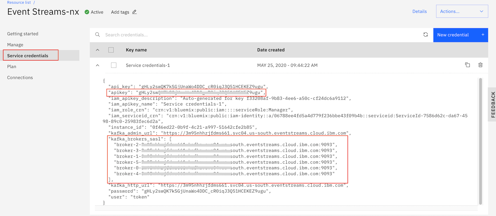

### Configure streaming on LogDNA

On the LogDNA Dashboard,navigate to the navigate to the gear icon (settings) > Streaming to enter the credentials gathered in the previous step as follows:

a.	Username = user   //always “token”

b.	Password = api_key // apikey from Event Streams credentials.
c.	Kafka URLs = kafka_brokers_sasl // Entered in on individual lines.

d.	Enter the name of a topic that we created earlier in event streams instance and hit 
“Save”.  

e. Streaming may take up to 15 minutes to begin.


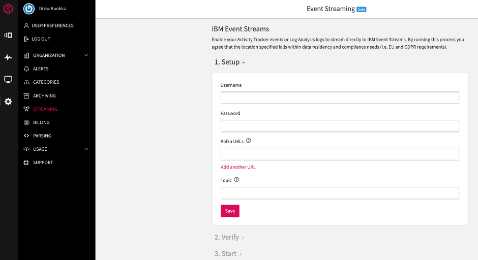

### Set up Kafka Splunk Connect

#### Download Apache Kafka

Download Apache Kafka [here](https://www.apache.org/dyn/closer.cgi?path=/kafka/2.5.0/kafka_2.13-2.5.0.tgz).

Create a folder `kafka_splunk_integration`. 

Extract the contents into the directory `kafka_splunk_integration`. 

#### Build Kafka Splunk jars

1. Clone the repo from https://github.com/splunk/kafka-connect-splunk
2. Verify that Java8 JRE or JDK is installed.
3. Run mvn package. This will build the jar in the /target directory. The name will be splunk-kafka-connect-[VERSION].jar.

Create a folder `connector` in the directory `kafka_splunk_integration`. Copy the jar file to the `connector` folder.

#### Modify connect-distributed.properties for Kafka connect

Download the `connect-distributed.properties` [here](https://github.com/IBM/cloud-enterprise-examples/blob/master/artifacts/logdna-splunk-integration/connect-distributed.propertes).
- Edit connect-distributed.properties replacing the [BOOTSTRAP_SERVERS] and [APIKEY] placeholders with your Event Streams credentials.
- Modify the `plugin.path` in the file contents to point to the directory `connector` we created in the previous step.
- Now copy the file `connect-distributed.properties` to the `config` folder under the `kafka_2.13-2.5.0` folder.

### Run Kafka connect

Open a terminal. Run the below commands. The [base dir] is the directory under which we created the folder `kafka_splunk_integration`.

```
$ export KAFKA_HOME=[base dir]/kafka_splunk_integration/kafka_2.13-2.5.0
$ $KAFKA_HOME/bin/connect-distributed.sh $KAFKA_HOME/config/connect-distributed.properties
```

### Install Splunk

We will install Splunk inside a container here. 
Open a new terminal. Run the below commands.
```
$docker pull splunk/splunk:latest
$docker run -d -p 8000:8000 -p 8088:8088 -e 'SPLUNK_START_ARGS=--accept-license' -e 'SPLUNK_PASSWORD=Test1234' splunk/splunk:latest
```
Please check if the container is running successfully before moving to the next step.

### Configure Splunk

Open the url - `http://localhost:8000` on a browser. The username is `admin` and password is `Test1234`.
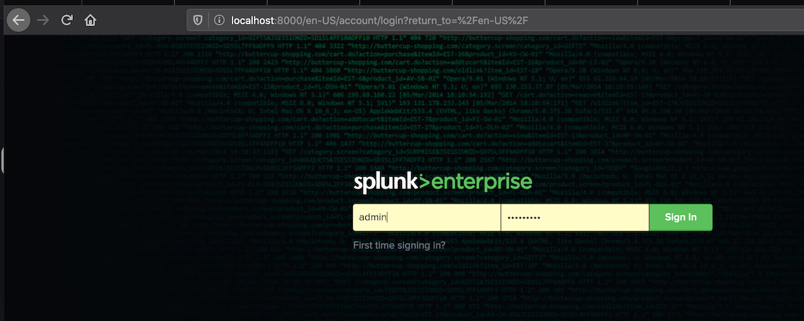

#### Create an index

Click on `Settings` and then select `Indexes`.

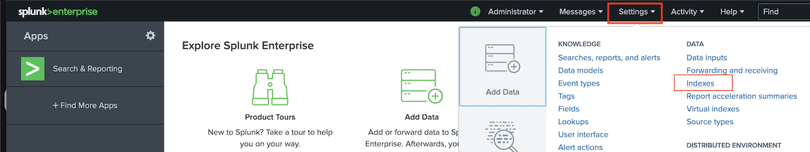 

Click on `New Index`.
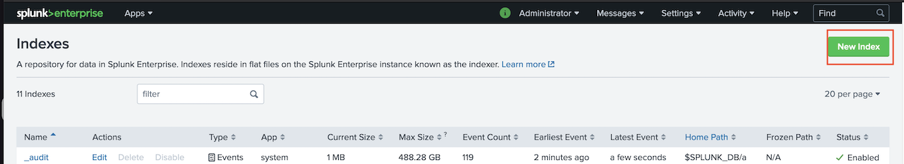  

Enter a name say `logdnaindex` and click on `Save`.

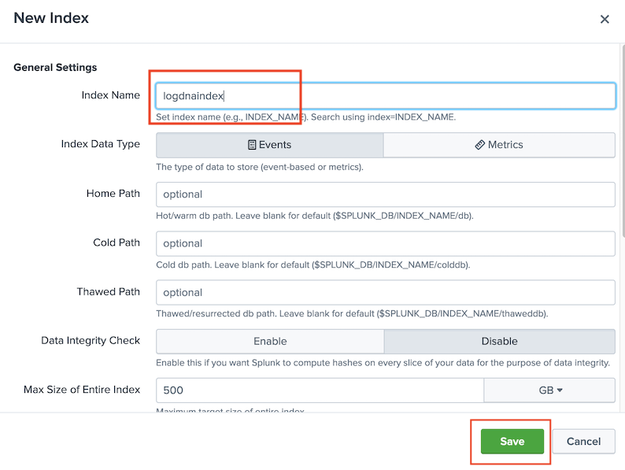  


The index is now created. Make a note of the index name. We will need it to instantiate the connector.
Next go to `General Settings` on HTTP Event Collector page and un-select the `Enable SSL` option.

#### Create a token

Click on `Settings` and then select `Data Input`.

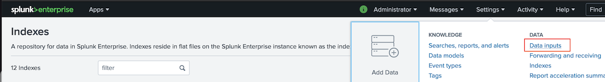  

Click on `Add New` to create a new `Http Event Collector`.

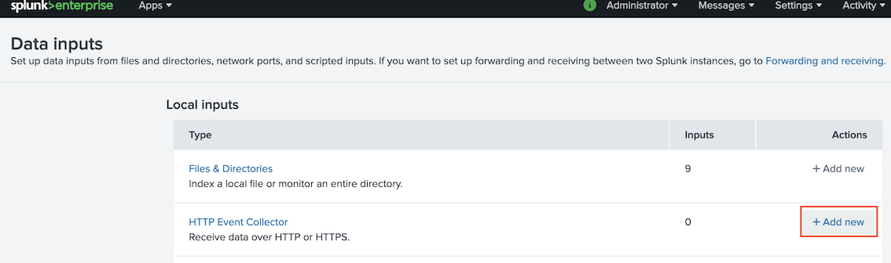

Enter a name say `logdnatoken` and select `Enable Indexer`. Click on `Next`.

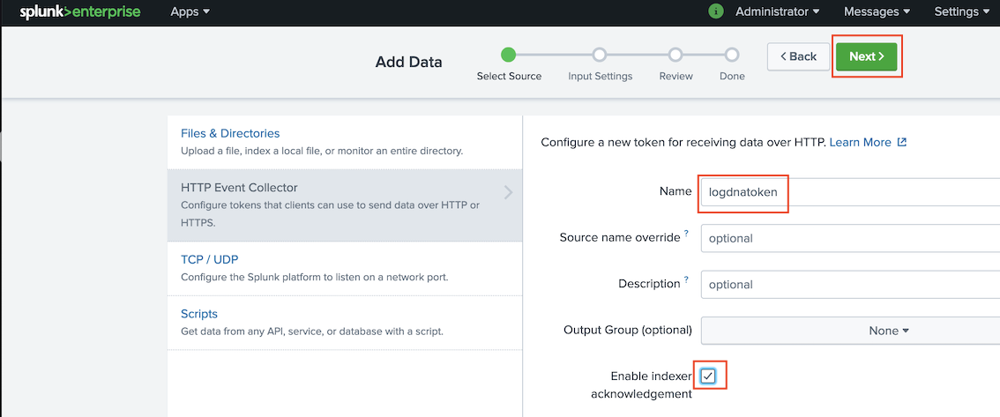  

Select the index we created earlier and click `Review`.

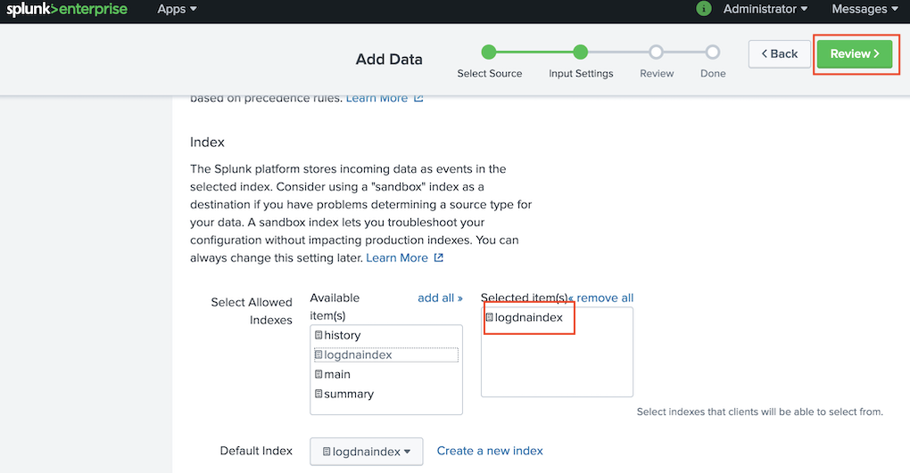

Click `Submit`.

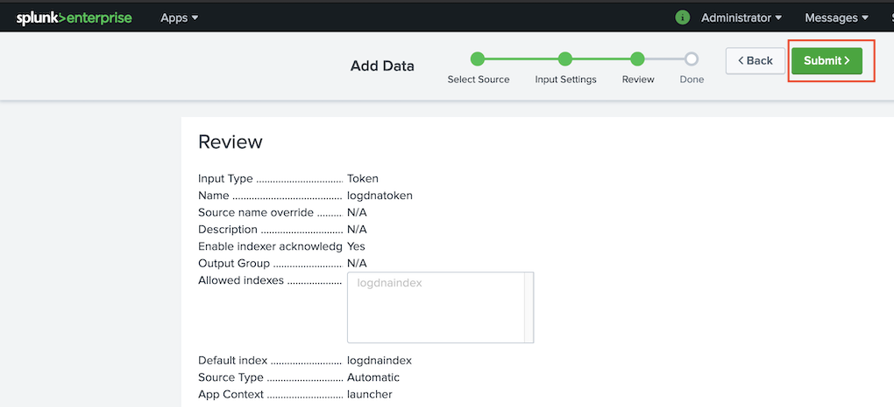

Copy the created token. We will need it to instantiate the connector.

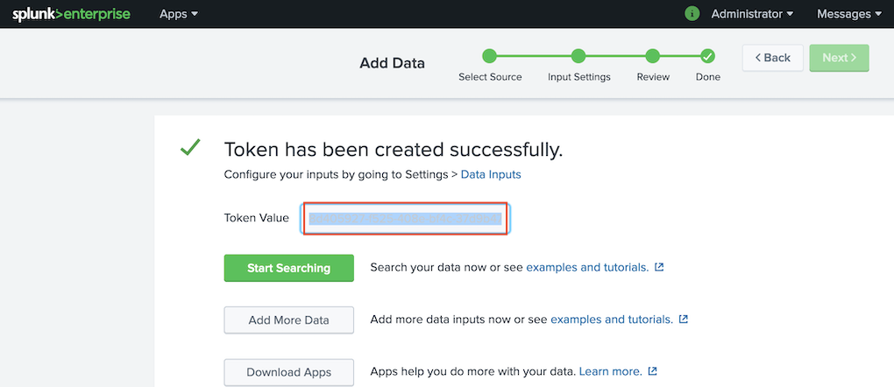  

### Create an instance of Kafka Splunk connector

Open a new terminal. Run the below command after specifying token. Also note that `topics` field is `logdnatopic` that we created earlier in `Event Streams`, and `splunk.indexes` is `logdnaindex` that we created on Splunk.

```
$curl localhost:8083/connectors -X POST -H "Content-Type: application/json" -d '{
   "name": "kafka-connect-splunk",
   "config": {
     "connector.class": "com.splunk.kafka.connect.SplunkSinkConnector",
     "tasks.max": "3",
     "splunk.indexes": "logdnaindex",
     "topics":"logdnatopic",
     "splunk.hec.uri": "http://localhost:8088",
     "splunk.hec.token": "[token]"
   }
 }'
 ```
 
 ### View the log data
 
 #### Create report
 
 Click `Settings` and select `Searches, Reports, and Alerts`.
 
 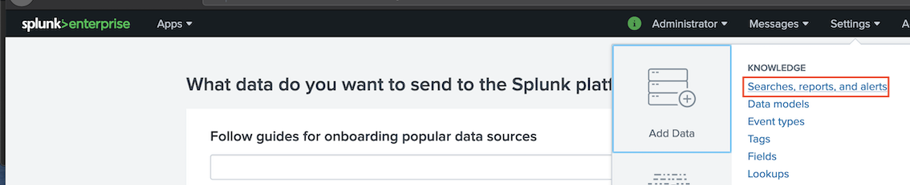 
 
 Click `New Report`.
 
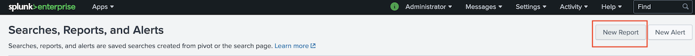 

Enter `Title`, `Search` criteria and click on `Save`.

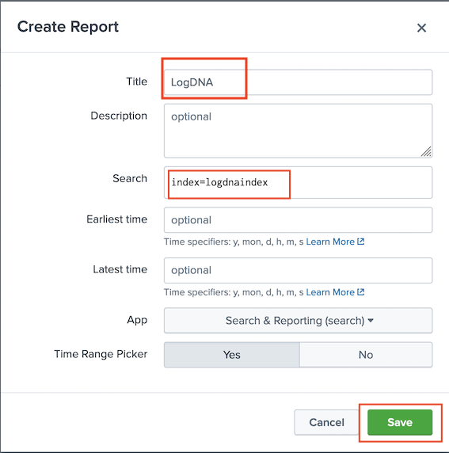

#### Run the report and view data

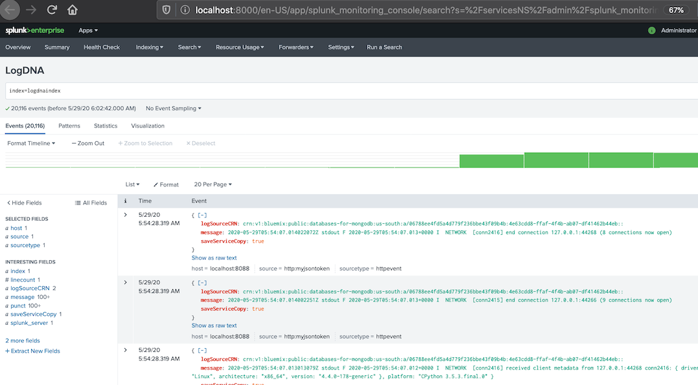  
 
### Configure a Kafka Splunk Connect custom dashboard
Go to `Settings` and choose `Searches, reports, and alerts`.

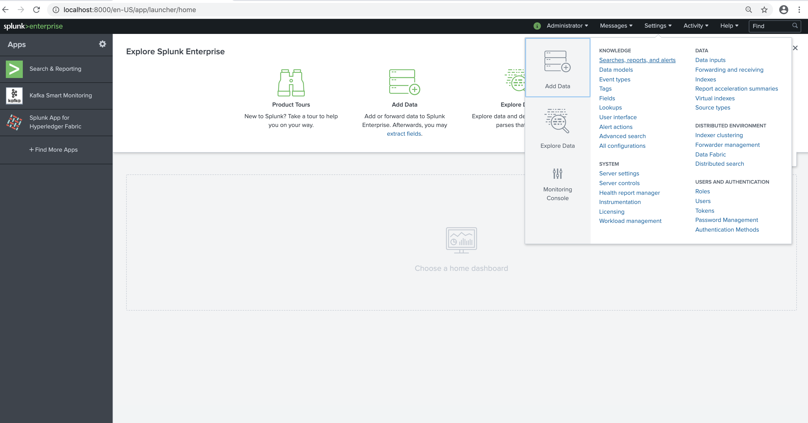  

Choose the report you wish to run, similar to the screen below.  The `Gsi Logdna` report is used in this screenshot

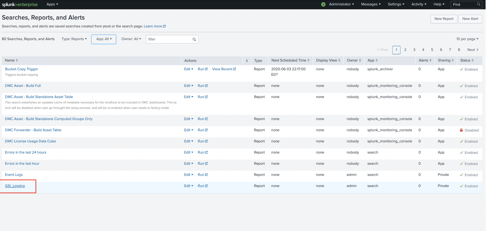 

Click on the `Dashboards` icon, similar to the screen shown below. 

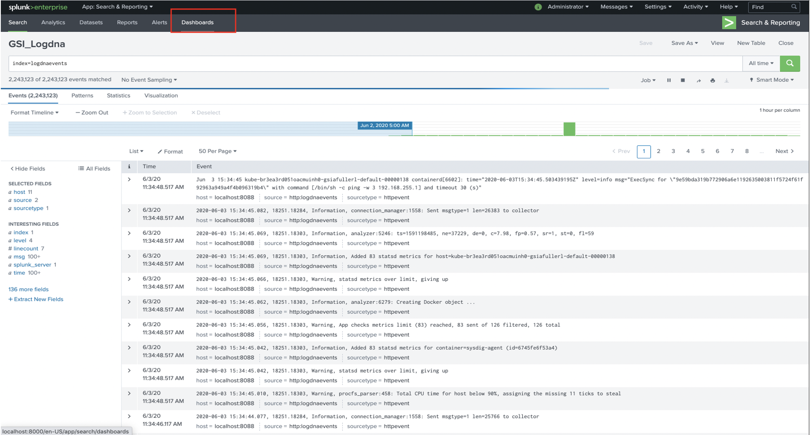 

Click on the `Create New Dashboard` icon, similar to the screen shown below. 

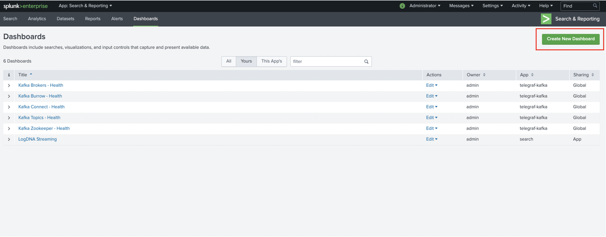

Provide a `Title` for your dashboard and set `Permissions`, similar to the screen shown below. 

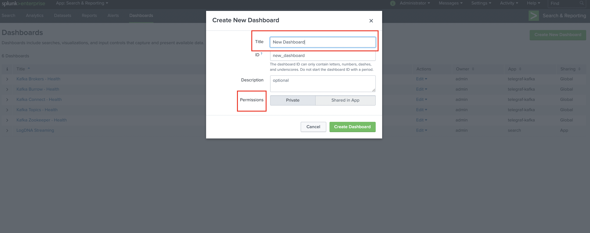

Click the `+ Add Panel` button, then choose from the `Add Panel` menu,`Messages by minute last 3 hours`, shown below. 

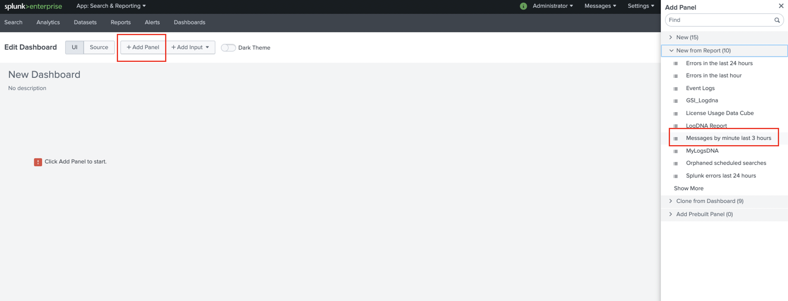

Next `Select Visualization` and click on the `Edit Drilldown` icon and choose `Trellis`. 

You can also add a name to the `No title` section, **similar to the screen shown below**. 

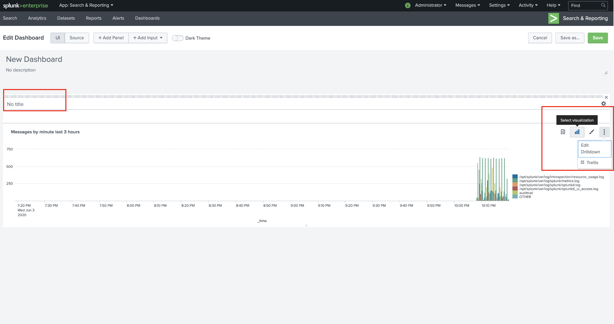

Select `Use Trellis Layout`, choose `Size`, `Scale`, and select `Independent`.

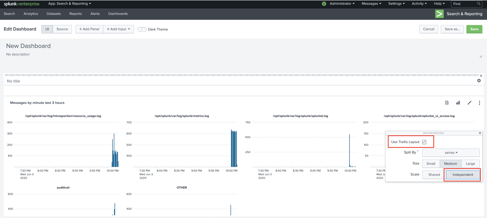

The `Select Visualization` `Pie Chart` is shown below for the **Messages by minute last 3 hours** Report.

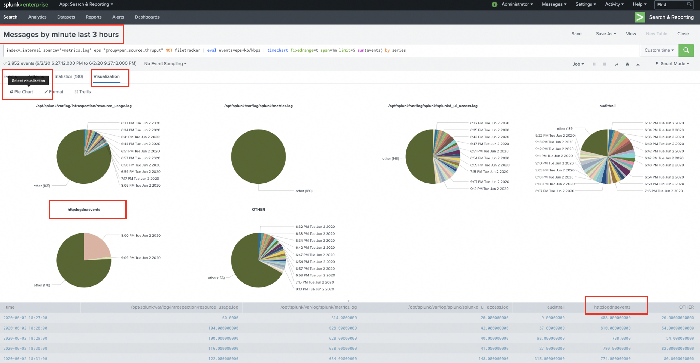

Shown below is the `Select Visualization` `Line Chart` for the **Messages by minute last 3 hours** Report.

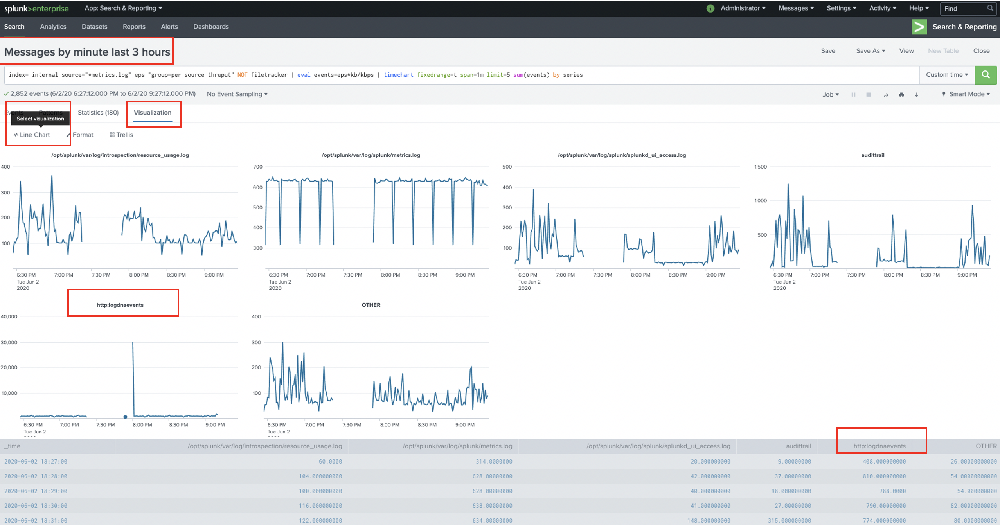

You can configure a Splunk dashboard with multiple event data types, similar to the screen shown below. 

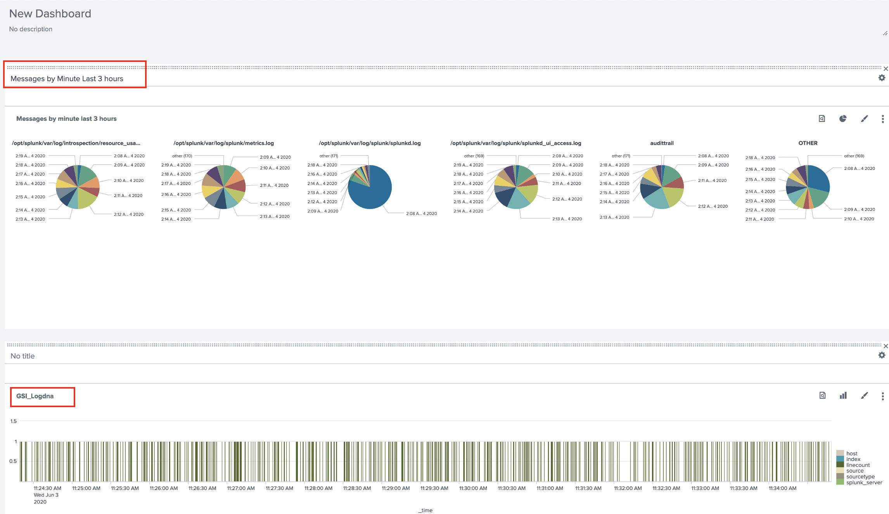

After configuring the desired dashboard, click `Save`. Your dashboard should show up saved, similar to the screen shown below. 

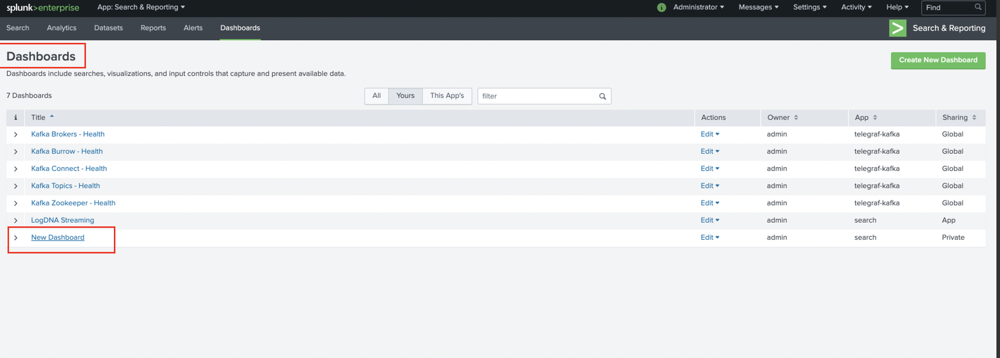

<InlineNotification>

**For more information on configuring Splunk Dashboards**, **see** [Dashboards and Visualizations](https://docs.splunk.com/Documentation/Splunk/8.0.4/Viz/DashboardEditor), [Create dashboards & panels](https://docs.splunk.com/Documentation/Splunk/8.0.4/SearchTutorial/Createnewdashboard) **and** [Splunk application for Kafka Smart Monitoring](https://telegraf-kafka.readthedocs.io/en/latest/)

</InlineNotification>


