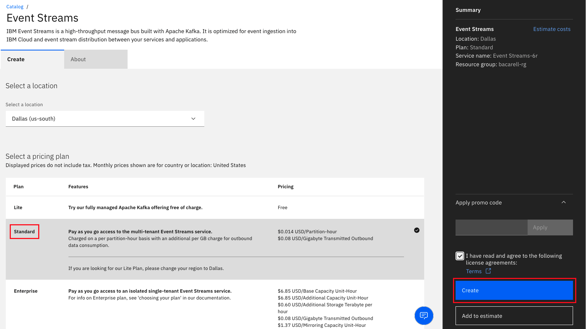
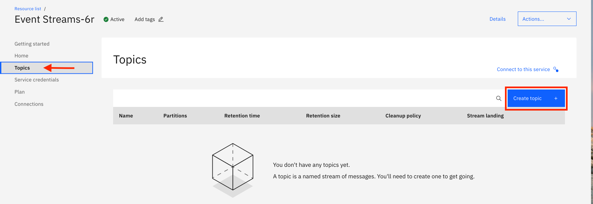
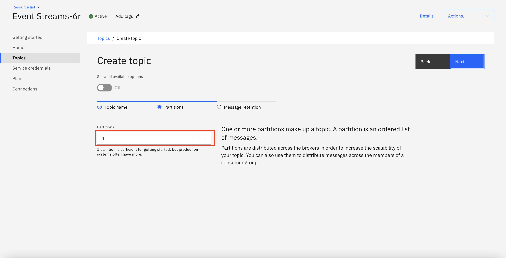
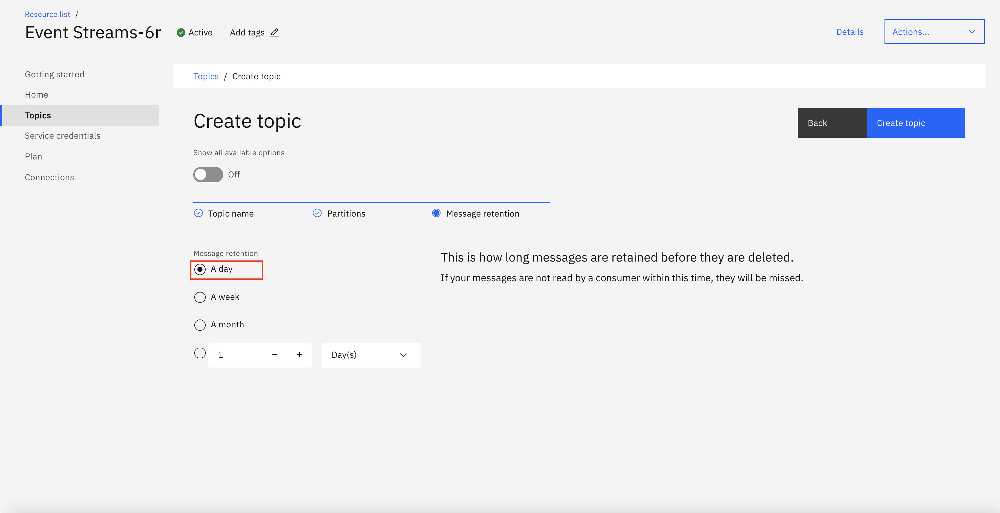
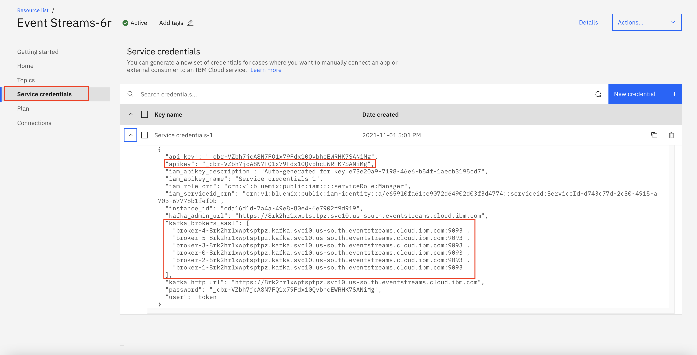
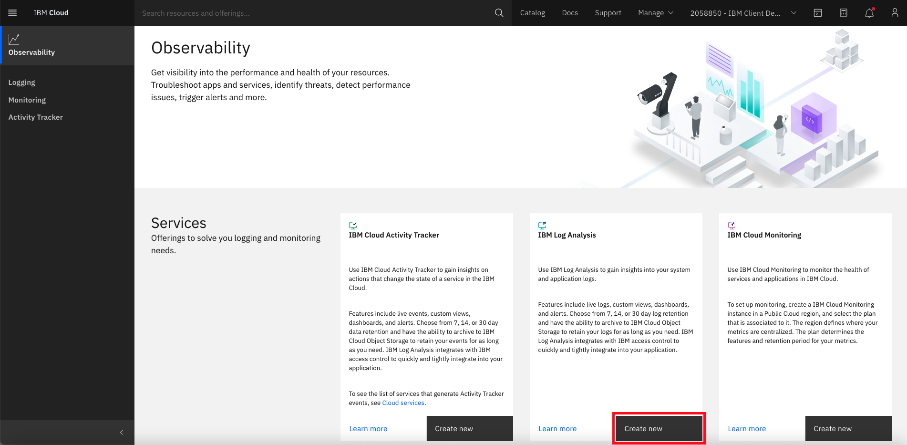
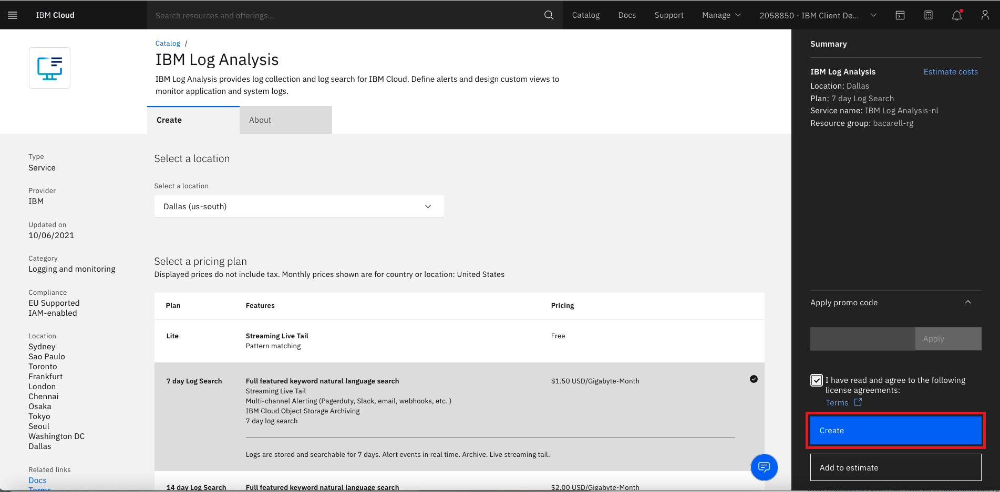
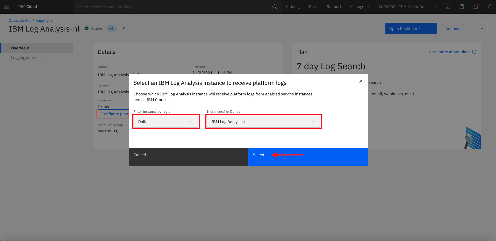
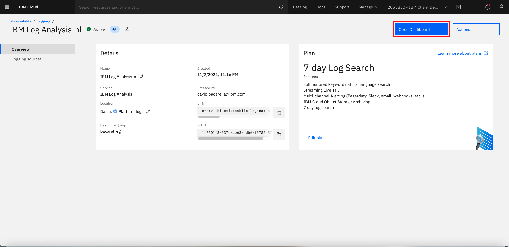

In this document, we will show you how to stream log events from IBM Log Analysis to [Splunk](https://www.splunk.com/). In order to achieve this, we will use the below two capabilities:
- the streaming feature of IBM Log Analysis that can be used to stream events to IBM Event Streams.
- the Kafka Splunk connect to stream events from IBM Event Streams to Splunk.
- Configure a Kafka Splunk Connect custom dashboard.


### Create an instance of IBM Event Streams

The IBM Event Streams is a messaging service that provides the communication channel between the IBM Log Analysis and the Splunk Connector. 

The individual machines must be configured to send their logs to IBM Log Analysis.  For IKS and/or ROKS, a resource controller plug-in configuration is required. 

Click [here](https://cloud.ibm.com/catalog/services/event-streams) to create an instance of IBM Event Streams. Choose a `Standard` plan.

   

### Create a topic on Event Streams

On the `Event Streams` console, click on `Topics` and then click on the `Create topic` option.

 

Enter a topic name `ibmloganalysistopic` and click `Next`.

 

Enter the number of partitions and click `Next`.



Select message retention time and click `Create Topic`.



### Note down credentials on Event Streams

Click on `Service credentials` and then the `New credential`. Copy off the `apikey` and `broker urls` for later use.


### Configure streaming on IBM Log Analysis

The IBM Log Analysis service is a centralized collection of logs with a blazing fast log search capability. 

To create an IBM Log Analysis instance go to the Observability menu option form the Dashboard and select 'Create New' as indicated.



Select the desired plan and specify the service name, resource group, and optionally, specify tags.  Then check the box to indicate that you accepted the terms of the license agreement and click on the 'Create' button.



Once the IBM Log Analysis service instance is created, configure the platform logs by clicking on the 'Configure platform' button. 



Navigate to the Dashboard by clicking the blue button at the top right of the screen.



On the IBM Log Analysis Dashboard, navigate to the 'settings' using the gear icon > Streaming > Configuration to enter the credentials gathered in the previous step as follows:

a.	Username = user   //always “token”

b.	Password = api_key // apikey from Event Streams credentials.

c.	Kafka URLs = kafka_brokers_sasl // Entered in on individual lines.

d.	Enter the name of a topic that we created earlier in event streams instance and hit 
“Save”.  

e. Streaming may take up to 15 minutes to begin.

Once the system is configured, click on the hexagonal icon that contains what looks like a DNA strand and watch for the logs to stream across the screen.


### Set up Kafka Splunk Connect

#### Download Apache Kafka

The Kafka Splunk Connect provides a communication channel between the IBM Event Streams messaging service and the remote machine that streams the logs into the Splunk SEIM. 

The Kafka Splunk Connect runs outside of Splunk itself and must also be configured to connect to the  Splunk instance to complete the integration. 

The following instructions depict how to connect to a Splunk instance running as a local container.  Typically, companies have Splunk deployed on their internal network and the instructions will have to be adapted for a particular environment.  Nonetheless, these instructions are applicable for a variety of situations. 

Download Apache Kafka [here](https://www.apache.org/dyn/closer.cgi?path=/kafka/2.5.0/kafka_2.13-2.5.0.tgz).

Create a folder `kafka_splunk_integration`. 

Extract the contents into the directory `kafka_splunk_integration`. 

#### Build Kafka Splunk jars

1. Create a directory called `kafka_connect_splunk`.
2. Clone the repo from https://github.com/splunk/kafka-connect-splunk
3. Unzip the download into the `kafka_connect_splunk` directory.
4. Verify that Java8 JRE or JDK is installed.
5. Move to the `kafka_connect_splunk` directory
6. Run 'mvn package' command. This will build the jar in the `/target` directory. The name will be `splunk-kafka-connect-[VERSION].jar`.

Create a folder called `connector` in the directory `kafka_splunk_integration`. Copy the jar file to the `connector` folder.

#### Modify connect-distributed.properties for Kafka connect

Download the `connect-distributed.properties` [here](https://github.com/IBM/cloud-enterprise-examples/blob/master/artifacts/logdna-splunk-integration/connect-distrubuted.properties).
- Edit connect-distributed.properties replacing the [BOOTSTRAP_SERVERS] and [APIKEY] placeholders with your Event Streams credentials.
- Modify the `plugin.path` in the file contents to point to the directory `connector` we created in the previous step.
- Now copy the file `connect-distributed.properties` to the `config` folder under the `kafka_2.13-2.5.0` folder.

### Run Kafka connect

This completes the connection between the remote machine and the IBM Event Streams service.  

Open a terminal. Run the below commands. The [base dir] is the directory under which we created the folder `kafka_splunk_integration`.

```
$ export KAFKA_HOME=[base dir]/kafka_splunk_integration/kafka_2.13-2.5.0
$ $KAFKA_HOME/bin/connect-distributed.sh $KAFKA_HOME/config/connect-distributed.properties
```

### Install Splunk

We will install Splunk inside a container here. 
Open a new terminal. Run the below commands.
```
$docker pull splunk/splunk:latest
$docker run -d -p 8000:8000 -p 8088:8088 -e 'SPLUNK_START_ARGS=--accept-license' -e 'SPLUNK_PASSWORD=Test1234' splunk/splunk:latest
```
Please check if the container is running successfully before moving to the next step.

### Configure Splunk

Open the url - `http://localhost:8000` on a browser. The username is `admin` and password is `Test1234`.


#### Create an index

Click on `Settings` and then select `Indexes`.

 

Click on `New Index`.
  

Enter a name say `ibmindex` and click on `Save`.

  


The index is now created. Make a note of the index name. We will need it to instantiate the connector.
Next, click on `Settings`-`Data Input`-`HTTP Event Collector` to go to `HTTP Event Collector` page. Click on `Global Settings` on HTTP Event Collector page and un-select the `Enable SSL` option.

#### Create a token

Click on `Settings` and then select `Data Input`.

  

Click on `Add New` to create a new `Http Event Collector`.


Enter a name say `ibmloganalysistoken` and select `Enable Indexer`. Click on `Next`.

  

Select the index we created earlier and click `Review`.


Click `Submit`.


Copy the created token. We will need it to instantiate the connector.

  

### Create an instance of Kafka Splunk connector

Open a new terminal. Run the below command after specifying token. Also note that `topics` field is `ibmloganalysistopic` that we created earlier in `Event Streams`, and `splunk.indexes` is `ibmloganalysisindex` that we created on Splunk.

```
$curl localhost:8083/connectors -X POST -H "Content-Type: application/json" -d '{
   "name": "kafka-connect-splunk",
   "config": {
     "connector.class": "com.splunk.kafka.connect.SplunkSinkConnector",
     "tasks.max": "3",
     "splunk.indexes": "ibmloganalysisindex",
     "topics":"ibmloganalysistopic",
     "splunk.hec.uri": "http://localhost:8088",
     "splunk.hec.token": "[token]"
   }
 }'
 ```
 
 ### View the log data
 
 #### Create report
 
 Click `Settings` and select `Searches, Reports, and Alerts`.
 
  
 
 Click `New Report`.
 
 

Enter `Title`, `Search` criteria and click on `Save`.


#### Run the report and view data

  
 
### Configure a Kafka Splunk Connect custom dashboard
Go to `Settings` and choose `Searches, reports, and alerts`.

  

Choose the report you wish to run, similar to the screen below.  The `Gsi IBM Log Analysis` report is used in this screenshot

 

Click on the `Dashboards` icon, similar to the screen shown below. 

 

Click on the `Create New Dashboard` icon, similar to the screen shown below. 


Provide a `Title` for your dashboard and set `Permissions`, similar to the screen shown below. 


Click the `+ Add Panel` button, then choose from the `Add Panel` menu,`Messages by minute last 3 hours`, shown below. 


Next `Select Visualization` and click on the `Edit Drilldown` icon and choose `Trellis`. 

You can also add a name to the `No title` section, **similar to the screen shown below**. 


Select `Use Trellis Layout`, choose `Size`, `Scale`, and select `Independent`.


The `Select Visualization` `Pie Chart` is shown below for the **Messages by minute last 3 hours** Report.


Shown below is the `Select Visualization` `Line Chart` for the **Messages by minute last 3 hours** Report.


You can configure a Splunk dashboard with multiple event data types, similar to the screen shown below. 


After configuring the desired dashboard, click `Save`. Your dashboard should show up saved, similar to the screen shown below. 


<InlineNotification>

**For more information on configuring Splunk Dashboards**, **see** [Dashboards and Visualizations](https://docs.splunk.com/Documentation/Splunk/8.0.4/Viz/DashboardEditor), [Create dashboards & panels](https://docs.splunk.com/Documentation/Splunk/8.0.4/SearchTutorial/Createnewdashboard) **and** [Splunk application for Kafka Smart Monitoring](https://telegraf-kafka.readthedocs.io/en/latest/)

</InlineNotification>


