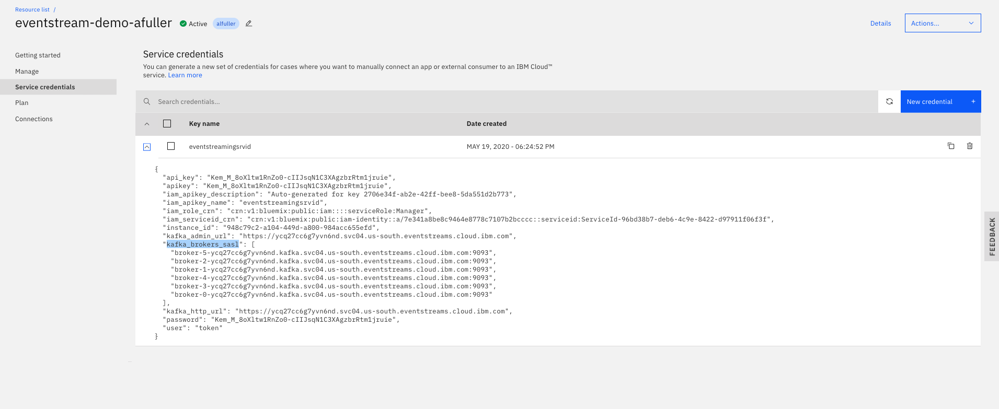
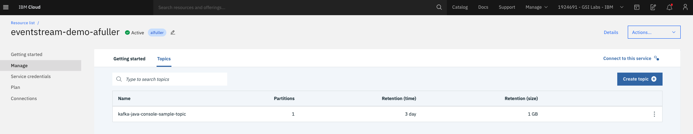
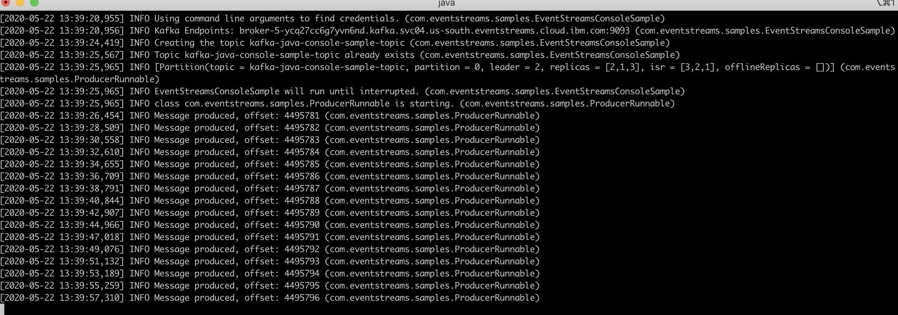
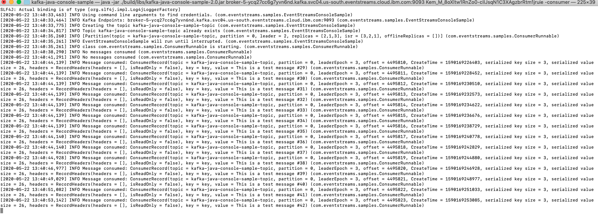
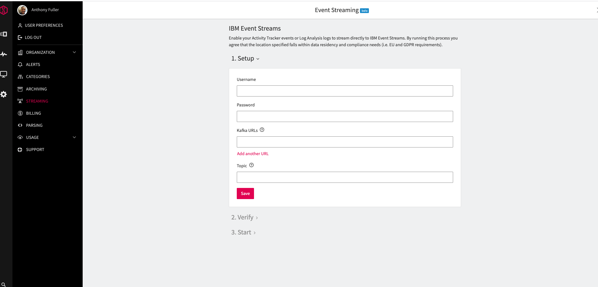
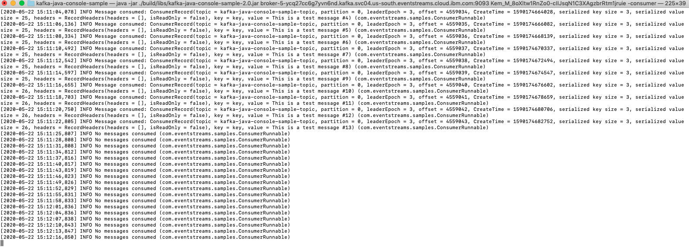
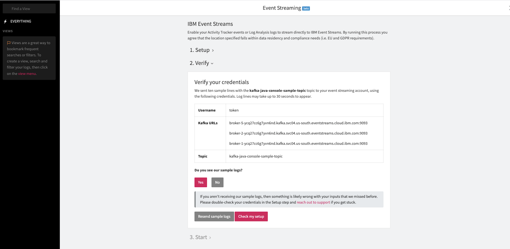
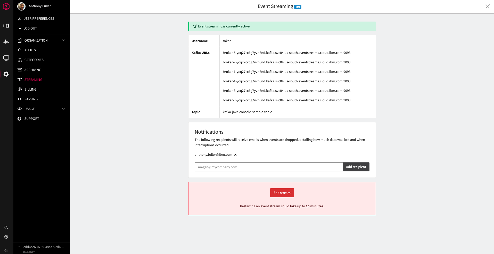
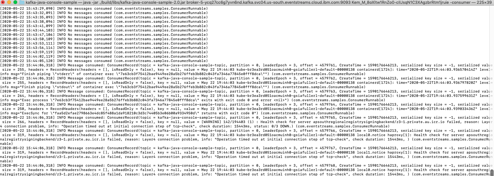
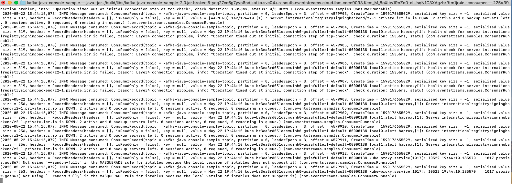

<PageDescription>

What is Log Streaming?

</PageDescription>

Streaming enables IBM Log Analysis to produce content to a message bus queue and Topic. IBM Log Analysis streaming helps you to connect third party consumers of topics to ingest into dashboards for visualization of event log data. 

Third party horizonal technologies such as Splunk, used in organizations for application management, security and compliance are able to leverage IBM Cloud Log Analysis with Log Streaming.

The content in this pattern, we will walk through setting up a sample event stream by utilizing IBM Cloud Event Streams and Log Streaming, to produce events to a topic for a simple consumer application to ingest.

IBM Cloud Event Streams is a high-through put message bus built with Kafka, see [What is Event Streams](https://cloud.ibm.com/docs/EventStreams?topic=EventStreams-about) and [Choosing Your Plan](https://cloud.ibm.com/docs/EventStreams?topic=EventStreams-plan_choose)

<AnchorLinks small>
  <AnchorLink>Create IBM Event Streams Instance</AnchorLink> 
  <AnchorLink>Setup Event Streams Demo</AnchorLink> 
  <AnchorLink>Configure Log Streaming</AnchorLink> 
  <AnchorLink>Start Log Streaming to Consumer</AnchorLink> 
</AnchorLinks>

## Create IBM Event Streams Instance

You can use an existing IBM Log Analysis instance or create a new one, refer [Provisioning an Instance](https://cloud.ibm.com/docs/activity-tracker?topic=activity-tracker-provision)

For the demo, an IBM Cloud Event Streams instance is required. Log into IBM Cloud > services and create your Event Streams instance, see [Provision Event Streams Instance](https://cloud.ibm.com/docs/EventStreams?topic=EventStreams-connecting#provision_instance)

Once your IBM Event Stream instance is setup, create a **Service Credential** account and then expand it to show the username, password (apikey) and kafka_brokers_sasl, similar to the screen shown below.

** Make a copy of the Service Credential username, password and Kafka_brokers_sasl URL**. 

## Setup Event Streams Demo

You'll need to setup a sample **Topic**, **Producer** and **Consumer**, see [Getting Started Tutorial](https://cloud.ibm.com/docs/EventStreams?topic=EventStreams-getting_started).

For this demo, choose the **kafka-java-console-sample** from the Git Hub repo, [event-streams-samples](https://github.com/ibm-messaging/event-streams-samples).

Make sure to create the sample topic "**kafka-java-console-sample-topic**" in your IBM Cloud Event Streams instance, similar to the screen shown below.

Once your **Producer** is up and running with the **kafka-java-console-sample-topic**, you should see a screen similar to the one shown below.

After you've completed the **Getting started Tutorial**, you should now have a **Consumer** running as well, similar to the screen shown below. 

## Configure Log Streaming

**Note:** You'll need an instance of IBM Log Analysis, see [Provisioning an Instance](https://cloud.ibm.com/docs/activity-tracker?topic=activity-tracker-provision)

Lets get started by following the steps below:

1. Login to IBM Cloud, then go to > Observability > logging, and choose your instance of IBM Log Analysis. 
2. Select **View Log Analysis Name* 
3. Click on the **Settings** gear icon and choose Streaming.

<InlineNotification>

**Note:** You may need to contact IBM Cloud support to have your IBM Log Analysis instance whitelisted, for Streaming to show up in the **Settings** menu selection.

</InlineNotification>

If your Log Streaming has been whitelisted, you should see a screen similar to the one shown below. 

** To configure IBM Log Streaming Streaming, follow the instructions below:**

1. Obtain the IBM Cloud Event Streams Service Credential, **username**, **password** and **Kafka_brokers_sasl** URL.
2. Configure the Event Streams **Service Credential** information in the **Log Streaming** fields.
3. Click Save.
4. Next, you'll need to stop the **Producer** from producing events. 
5. Stop the **Producer** by typing in the command **Cntrl**+**C**.
6. Now bring up the **Consumer** terminal window, notice the constant, **INFO No messages consumed** text, similar to the screen shown below.

## Start Log Streaming to Consumer

Let's go a head and start Log Streaming, you may see a notice from Log Streaming asking if you've received the sample messages similar to the screen shown below, click yes.

Add in an email recipient and then click start streaming, similar to the screen shown below. 

IBM Log Analysis should now have been successfully configured. If you have a **Kubernetes cluster**,**VSI** or any other services configured with Log enabled, you should see activity in the **Consumer** terminal, similar to the screen shown below. 

LogDNA **Streaming** is active, similar to the screen shown below. 

<InlineNotification>

**The Consumer is now consuming an event log topic, that LogDNA Streaming is sending to the IBM Cloud Event Streams message bus**. 

</InlineNotification>

