<PageDescription>

Archive event Logs using IBM Cloud Object Storage (COS).

</PageDescription>
This section covers how to configure an IBM COS with a storage bucket. The pattern provides how to configure long-term archiving of event logs with a retention policy for data protection and immutable COS storage. 

<AnchorLinks small>
  <AnchorLink>Provisioning an instance of IBM Cloud COS</AnchorLink>
  <AnchorLink>Configure a Storage Bucket</AnchorLink>
  <AnchorLink>Create a Service ID</AnchorLink>
  <AnchorLink>Configure The Retention Policy</AnchorLink>
  <AnchorLink>Configuring Archiving for Activity Tracker</AnchorLink>
  <AnchorLink>Configure Activity Tracker with LogDNA</AnchorLink>
</AnchorLinks>

## Provisioning an instance of IBM Cloud COS

To provision an instance of IBM Cloud Object Storage, see [IBM COS Documentation](https://cloud.ibm.com/docs/Activity-Tracker-with-LogDNA?topic=logdnaat-archiving).

To store event logs to IBM Cloud Object Storage you’ll need to perform the following procedures. 

##### Note: You must be an editor, or administrator of the IBM Cloud Object Storage (COS) service on the IBM Cloud.

## Configure a Storage Bucket 

Next you’ll need to create a storage bucket, which is used to organize your data in an IBM COS instance. There are five storage classes for buckets to choose from. Once the storage class and bucket has been created, you’ll need to grant permissions to manage the storage bucket. A user must be granted permissions to work with storage buckets, see [Storage Classes](https://cloud.ibm.com/docs/services/cloud-object-storage?topic=cloud-object-storage-classes) and,[Getting Started with IAM](https://cloud.ibm.com/docs/services/cloud-object-storage?topic=cloud-object-storage-iam)

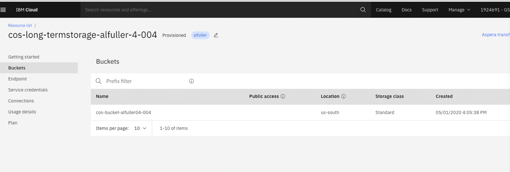     

## Create a Service ID
A Service ID (service credentials) will need to be created. A Service IDs is similar to how a user ID identifies a user. Service IDs are not tied to a specific user. If the user that creates the service ID leaves your organization and is deleted from the account, the service ID remains. You must create a service ID for your IBM Cloud Object Storage instance. This service ID is used by the IBM Cloud Activity Tracker instance to authenticate with your IBM Cloud Object Storage instance.
See, [creating a Service ID](https://cloud.ibm.com/docs/Activity-Tracker-with-LogDNA?topic=logdnaat-archiving).

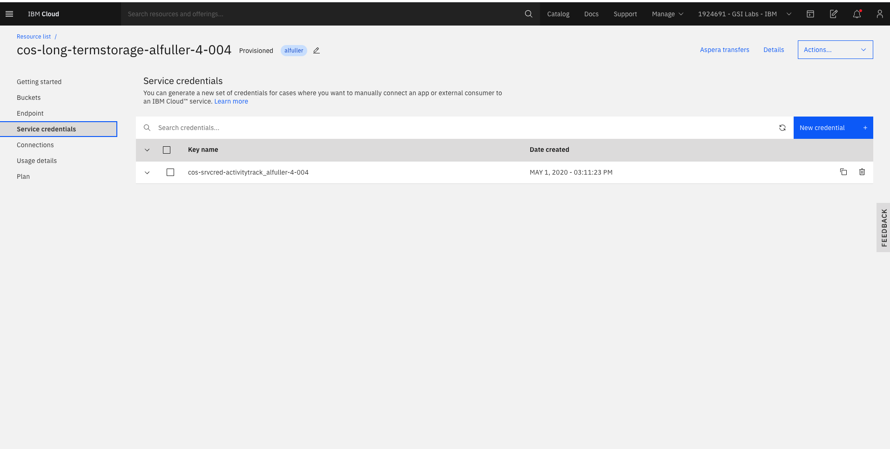   
Be sure to restrict your service ID (service credentials) to have only writer permissions, shown below. 

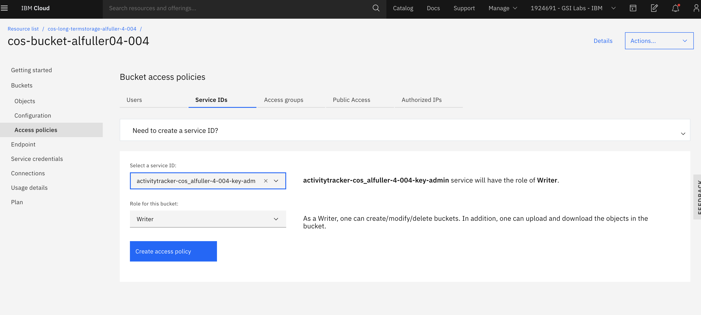 

## Configure The Retention Policy

Next, configure your COS archive policy, expiration rule and a retention period, see [IBM Immutable Object Storage](https://cloud.ibm.com/docs/services/cloud-object-storage?topic=cloud-object-storage-immutableh)

## Configuring Archiving for Activity Tracker

After configuring your IBM COS instance, you’ll need to:
1. Gather information from the Service ID (service credential) created earlier, in order to configure Activity Tracker event log archiving later.
See [Activity Tracker Getting Started](https://cloud.ibm.com/docs/services/Activity-Tracker-with-LogDNA?topic=logdnaat-getting-started).
2. Make a copy of the Service ID (service credentials) configurations shown in below screenshot. (you'll need the **apikey** and **resource_instance_id**). 
3. LogDNA Archiving will require the storage bucket name, and endpoint (private or public) as well to complete the configurations.

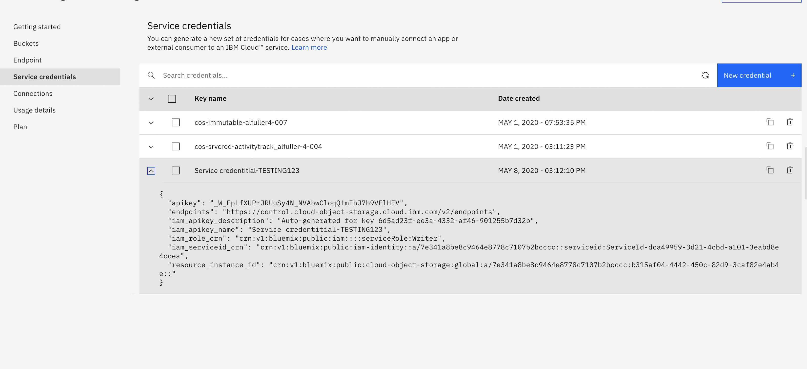

**Note:** You can obtain the endpoint (private or public) information from your storage bucket, by clicking on the bucket view and then click the highlighted blue “View configurations” to see the end points, shown below.
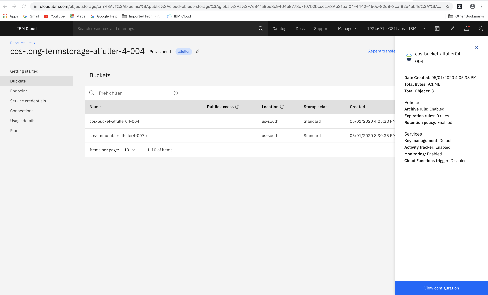 
The private and public endpoints are shown below. Make a copy for later configurations with LogDNA Archiving. 
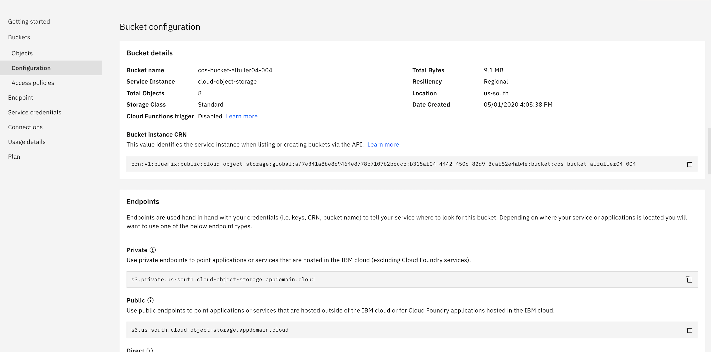

Now lets go configure Activity Tracker to send event logs for archiving to the IBM COS instance created. 

Go to the IBM Cloud catalogue (hamburger drop down menu button, upper Left hand corner) and scroll down to select Observability.
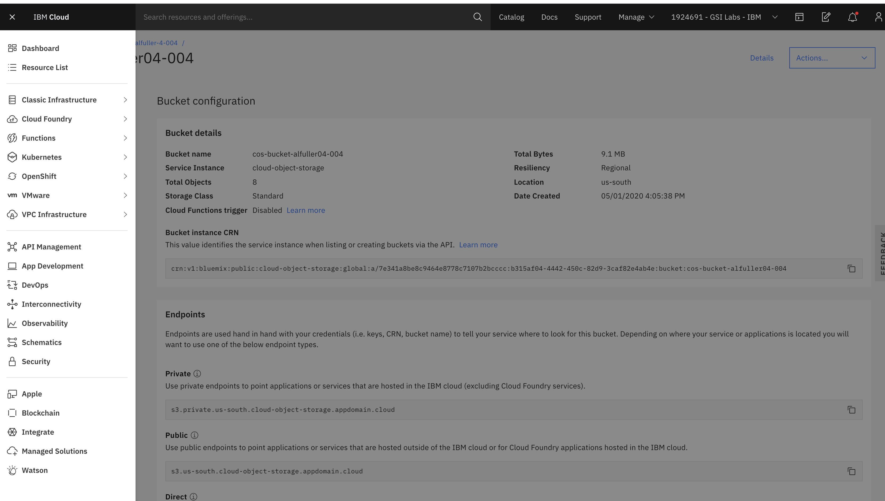

## Configure Activity Tracker with LogDNA

You'll need to create an instance of Activity Tracker if you haven't done so already, see [Provisioning Instance Activity Tracker](https://cloud.ibm.com/docs/Activity-Tracker-with-LogDNA?topic=logdnaat-getting-started#gs_step1), Now choose your instance of Activity Tracker and click on the "View LogDNA" dashboard link shown below.
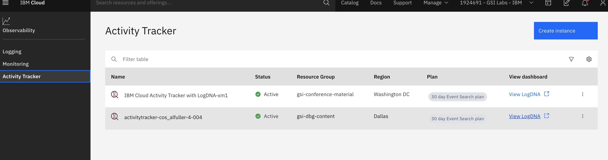
 
 Now, select the gear icon, midway to the left and choose Archiving. You’ll need to enable archiving for Activity Tracker shown in the screenshot below and then choose from the drop down, IBM Cloud Object Storage for the provider. 
 After, move down to settings and configure Activity Tracker with the Service ID (service credentials) key name information as shown in previous screenshots above. 

 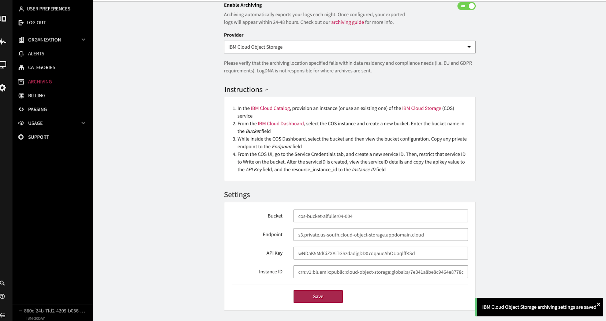
 
 If you’ve configured everything correctly after clicking save, a notice appears, "IBM Cloud Object Storage archiving settings are saved". 
 
 That's it, you have now successfully configured Activity Tracker to send event logs to IBM COS storage bucket. 
 Archiving will take around 24 hours to show up in the storage bucket. 
 
 After, you should see event logs in your storage bucket as jason.gz files. Depending on how you’ve configured your storage bucket policies, the event logs should be protected from tampering, and deletion.

 See the screenshot below of an attempted deletion of archived event log.
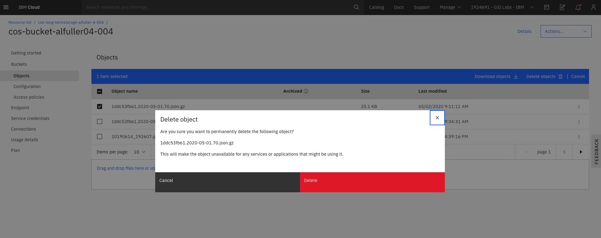

Notice, the deletion attempt failed, due to the IBM COS policy configured earlier. 
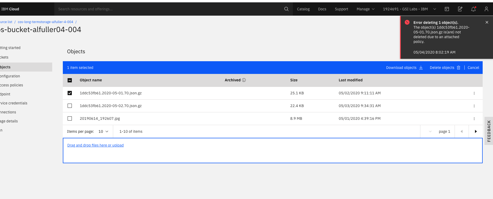

The IBM Cloud Activity Tracker even captures the IBM COS event logs and store them as well to the storage bucket, see the screenshot below. 
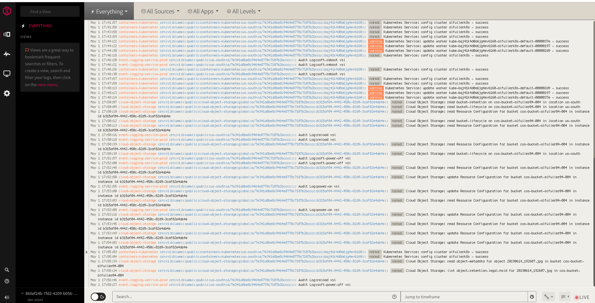

For more information on IBM Cloud Activity Tracker and LogDNA see, [Getting Started Tutorial](https://cloud.ibm.com/docs/services/Activity-Tracker-with-LogDNA?topic=logdnaat-getting-started)

