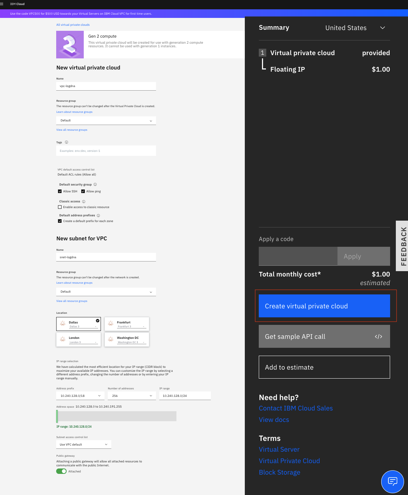
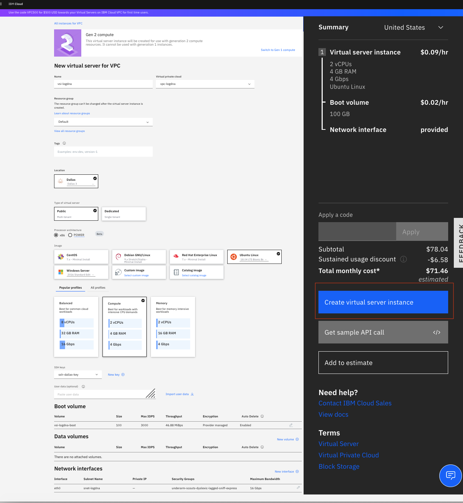
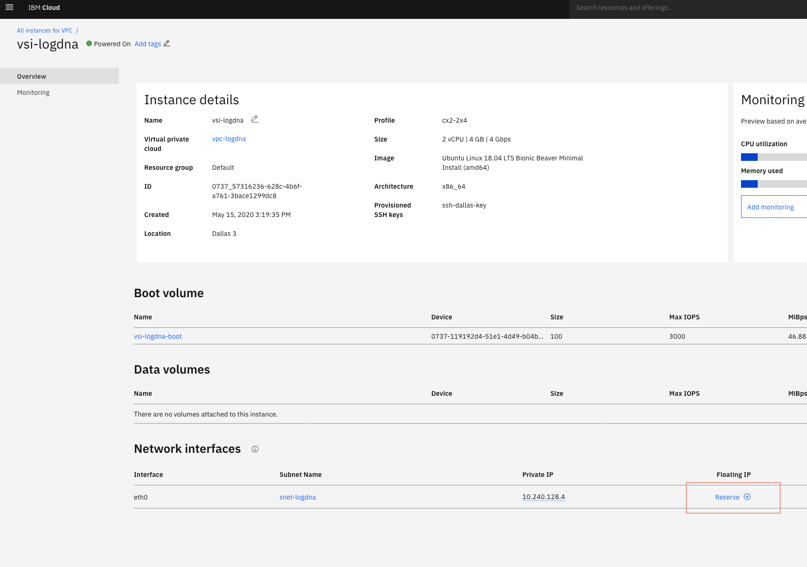
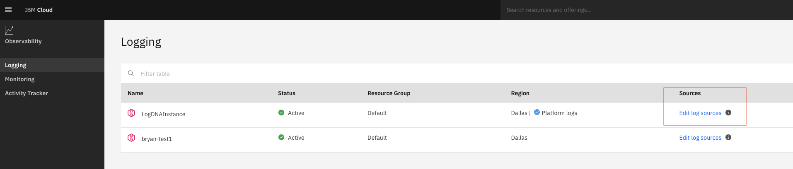
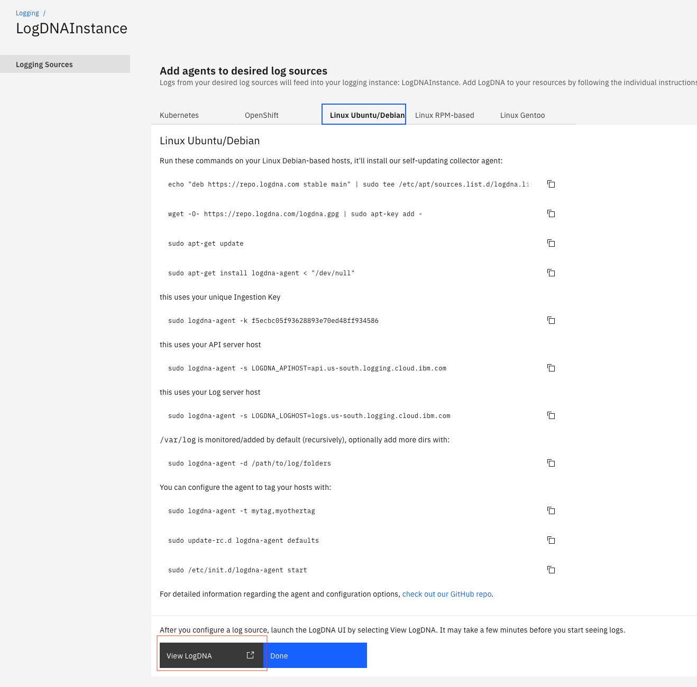
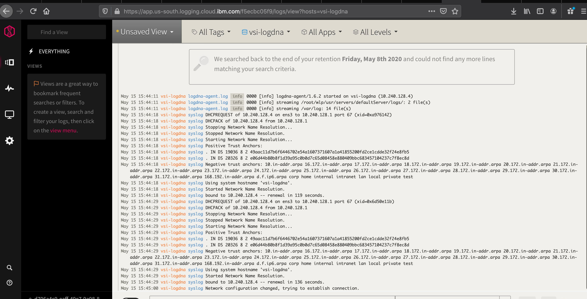

## Provision IBM Log Analysis with LogDNA for Virtual Server Instance(VSI)

In this section, we will see how to send application logs on VSIs to LogDNA for analysis. In order to demonstrate the feature, we will do the following: 
- Create an instance VSI with Ubuntu image on VPC
- Deploy a WAS liberty server and deploy a sample J2EE application
- Install and configure LogDNA agent
- Visualize the logs on LogDNA Dashboard on IBM Cloud

We will also cover some aspect of auto-scaling and how you can setup for proper filtering of logs from each of the instance. 

<AnchorLinks small>
  <AnchorLink>Create VSI Instance</AnchorLink>
  <AnchorLink>Deploy an application</AnchorLink>
  <AnchorLink>Install and Configure LogDNA</AnchorLink>
  <AnchorLink>Visualize Logs</AnchorLink>
</AnchorLinks>


## Create VSI Instance

Click [here](https://cloud.ibm.com/vpc-ext/provision/vpc) to create an instance of Virtual Private Cloud.
Please configure as shown below, and click `Create Virtual Private Cloud`



Click [here](https://cloud.ibm.com/vpc-ext/provision/vs) to create an instance of Virtual Server.
Please configure as shown below, and click `Create Virtual Server Instance`.

  ##### Note: 
  Please refer the [link](https://cloud.ibm.com/docs/vpc?topic=vpc-ssh-keys) to create SSH keys.




Reserve IP:

Click on `Reserve IP` to bind to a Floating IP.


## Deploy an application

Login to VSI using SSH and deploy the application as shown below.

```
ssh -i [path to private key file] root@[Floating IP address]
wget https://raw.githubusercontent.com/IBM/cloud-enterprise-examples/master/artifacts/autoscale/scripts/install-script
chmod +x install-script
./install-script
```

## Install and configure LogDNA

On the LogDNA Dashboard, click on `Edit log sources`.


On the `Add agents to desired log sources` page, select the `Linux Ubuntu/Debian` tab.
Run the commands displayed with the below changes.
- For "/var/log is monitored/added by default (recursively), optionally add more dirs with", run the below command
```
sudo logdna-agent -d /root/wlp/usr/servers/defaultServer/logs/
```
- For "You can configure the agent to tag your hosts with", run the below command:
```
sudo logdna-agent -t $HOSTNAME
```
<InlineNotification>
  
###### Tagging of logs

In the above command the parameter after -t is the tag you want to provide for the log created by this instance. If you have only 1 instance of this Virtual Server, a static tag can be specified, and then you can filter the log based on that tag.  But when you make use of auto-scaling functionality, you may end up with more than 1 instance of the server, and having a unique tag for each instance helps you filter logs for a specific instance.  $HOSTNAME is one such argument which will be unique for each instance. The logs of VSI instances that have been removed during a scale down can also be analyzed.

</InlineNotification>


The script below needs to be included in the "User Data" section of the "Instance Template" for auto scale configuration.  This will ensure the new VSI instance is attached to the same logDNA instance.




## Visualize Logs

Click on `View LogDNA` after all the commands run fine.

The logs can then be viewed on the LogDNA Dashboard:

