<PageDescription>


Configuring for Containers

</PageDescription>
Logging and Monitoring have always been important but in a distributed microservices architecture on a Kubernetes cluster it is even more important. IBM Cloud with LogDNA can be used with a Kubernetes Cluster. This pattern will show you how to create a Kubenetes cluster and use IBM Cloud with LogDNA for tracking events logs in containers. 

<AnchorLinks small>
  <AnchorLink>Creating a Kubernetes Cluster</AnchorLink>
  <AnchorLink>Getting the ingestion key</AnchorLink>
  <AnchorLink>Configuring Kubernetes to Send logs</AnchorLink>
  <AnchorLink>Deploying the LogDNA agent on Kubernetes</AnchorLink>
  <AnchorLink>Customizing LogDNA Views</AnchorLink>
</AnchorLinks>

## Creating a Kubernetes Cluster

First create a Kubernetes Cluster using this information, See, 
[Getting Started Kubernetes](https://cloud.ibm.com/docs/containers?topic=containers-getting-started)


After you create a Kubernetes Cluster, use the IBM Cloud menu->Kubernetes->Cluster, and then select the cluster which you want information for. It will show the dashboard similar to the one below.

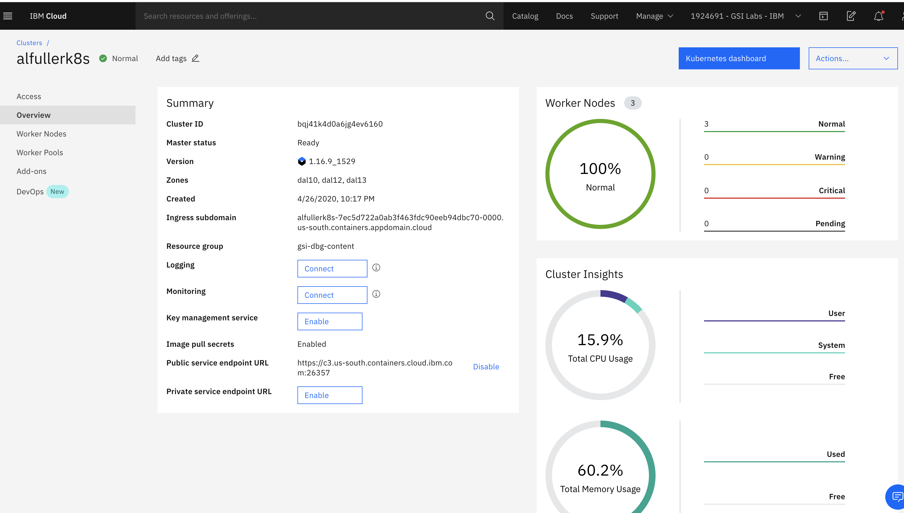
#### Note: Kubernetes event logs can be sent in the same region or in a different region.

You’ll need to provision an instance of the IBM Log Analysis with LogDNA service. This allows for a configured centralized log management system where log data is hosted on IBM Cloud. You can use either an existing Kubernetes cluster or configure Kubernetes on the IBM Cloud.
Use an existing or provision a new instance of IBM Log Analysis with LogDNA through the IBM Cloud console, see [Getting Started LogDNA](https://cloud.ibm.com/docs/Log-Analysis-with-LogDNA?topic=LogDNA-getting-started)

Make sure to choose your supported region, see [Supported Regions](https://cloud.ibm.com/docs/Log-Analysis-with-LogDNA?topic=LogDNA-regions). 


## Getting the ingestion key
For more information on setting up LogDNA, see [Getting Started](https://cloud.ibm.com/docs/Log-Analysis-with-LogDNA?topic=LogDNA-getting-started#getting-started_prereqs)

Complete the following steps to get the ingestion key:
1.	Log in to your IBM Cloud account  .
After you log in, the IBM Cloud UI opens.
2.	Click the Menu icon Observability to access the Observability dashboard.
3.	Select Logging. The IBM Log Analysis with LogDNA dashboard opens. You can see the list of logging instances that are available on IBM Cloud.
4.	Identify the instance for which you want to get the ingestion key, and click View key.
5.	A window opens where you can click Show to view the ingestion key.

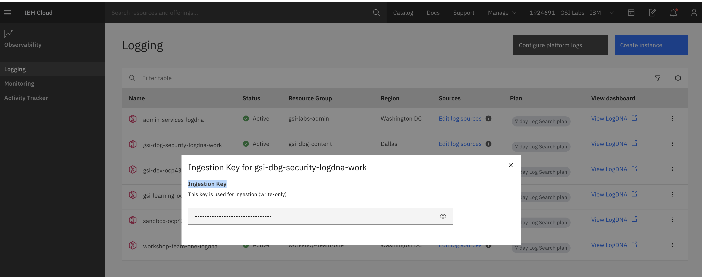

## Configuring Kubernetes to Send logs

Now, let's configure our Kubernetes cluster to send logs to the IBM LogDNA instance configured earlier. We can configure our Kubernetes cluster to send event log traffic to the us-south region, you'll need to complete the following procedures below.

#### Open a terminal to login into your IBM Cloud account.
```bash
$ ibmcloud login -a cloud.ibm.com
```

#### Set the cluster where you want to configure logging as the context for this session.
```bash
$ ibmcloud ks cluster-config cluster_name_or_ID
```
<InlineNotification>

Note: Every time you log in to the IBM Cloud Kubernetes Service CLI to work with your cluster, you must run this setup to set the path to the cluster's configuration file as a session variable. IBM Cloud Kubernetes Service uses this variable to find a local configuration file and certificates that are necessary to connect with your cluster.

See [Getting Started IBM Cloud CLI](https://cloud.ibm.com/docs/cli?topic=cloud-cli-getting-started), and [CLI for Kubernetes](https://cloud.ibm.com/docs/containers?topic=containers-cs_cli_install)

</InlineNotification>

## Deploying the LogDNA agent on Kubernetes

#### Let's now create a Kubernetes secret to store your logDNA ingestion key for your service instance. 
* Note: us-south region is shown below, choose the region according to your requirements. 

```bash
$ kubectl create -f https://assets.us-south.logging.cloud.ibm.com/clients/logdna-agent-ds.yaml
```
The LogDNA ingestion key will be used to open a secure web socket to the logDNA ingestion server and to authenticate the logging agent with the IBM Log Analysis with LogDNA service.

#### Now, let's verify our LogDNA agent was deployed successfully by running the following command. 
```bash
$ kubectl get pods
```
#### If the deployment was successful you should see one or more LogDNA pods running. 

<InlineNotification>

Note: You can use the IBM Cloud terminal under Kubernetes cluster and the Action tab to the left to open a terminal.  

</InlineNotification>

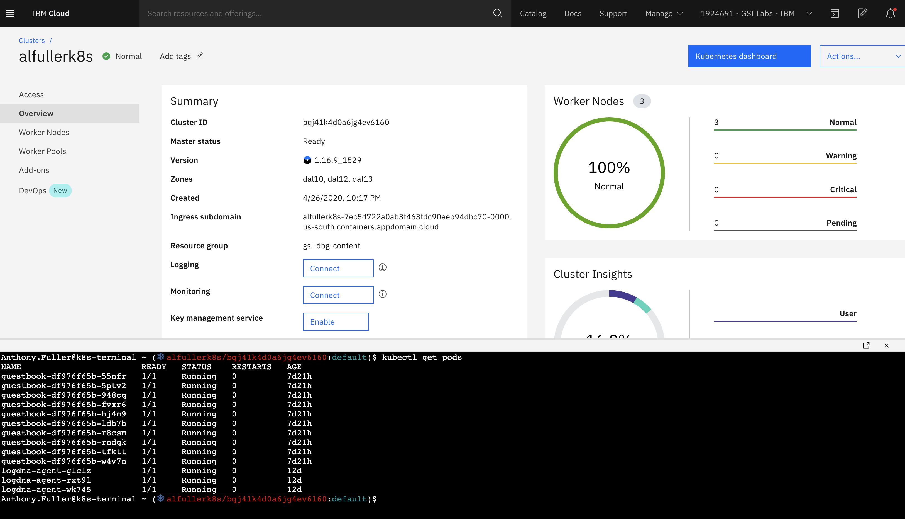

You'll notice the number of LogDNA pods is equal to the number of worker nodes in your cluster. All pods should be in a Running state.

Now let's take a look at the logs captured by IBM Log Analysis with LogDNA, by viewing the dashboard. Launch the LogDNA dashboard and view logs.
You can do so by going through the IBM Cloud console, following the steps below:

1. Log in to your IBM Cloud account External link icon.

2. From the Menu icon, select Observability.

3. Select Logging. The list of IBM Log Analysis with LogDNA service instances that are available on IBM Cloud is displayed.

4. Select one instance and click View LogDNA. The LogDNA dashboard opens.

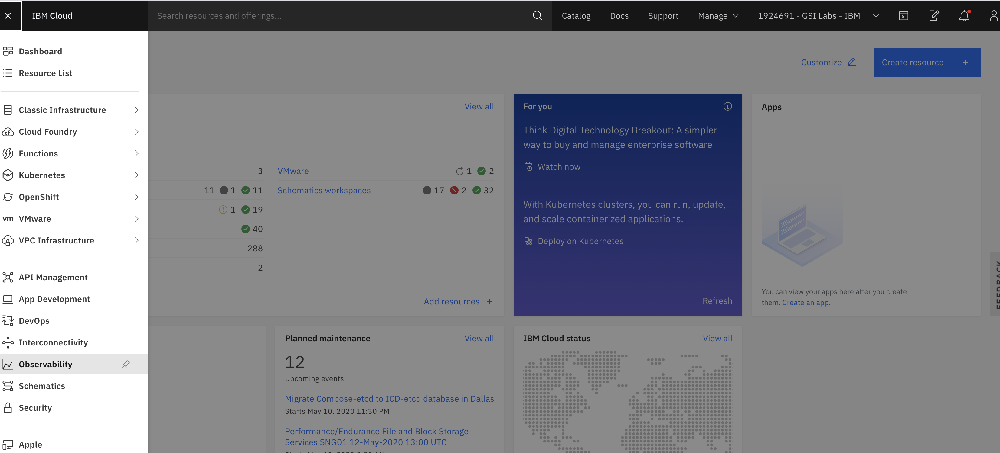


<InlineNotification> 

Note: With the Free service plan, you can tail your latest logs only. For more information, see [Viewing Logs](https://cloud.ibm.com/docs/Log-Analysis-with-LogDNA?topic=LogDNA-view_logs#view_logs)

</InlineNotification>

## Customizing LogDNA Views

Now let's customize your default view.
In the USER PREFERENCES section, you can modify the order of the data fields that are displayed per line.

Complete the following steps to modify the format of a log line:
Select the Configuration icon. 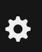

Select USER PREFERENCES. A new window opens.
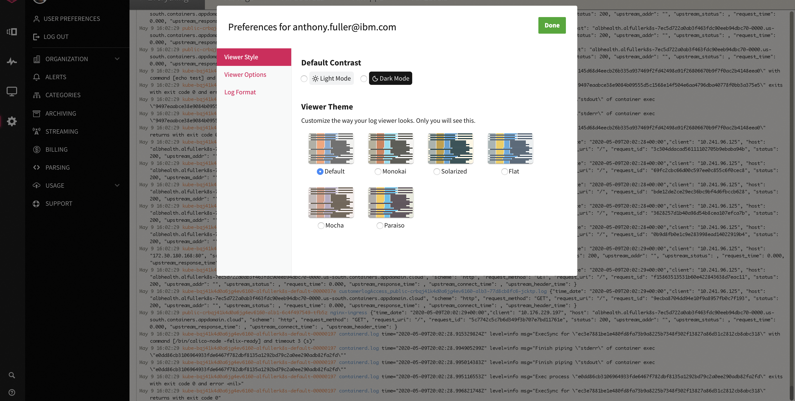


Choose something different from the default Viewer Theme, let's select Monokai.
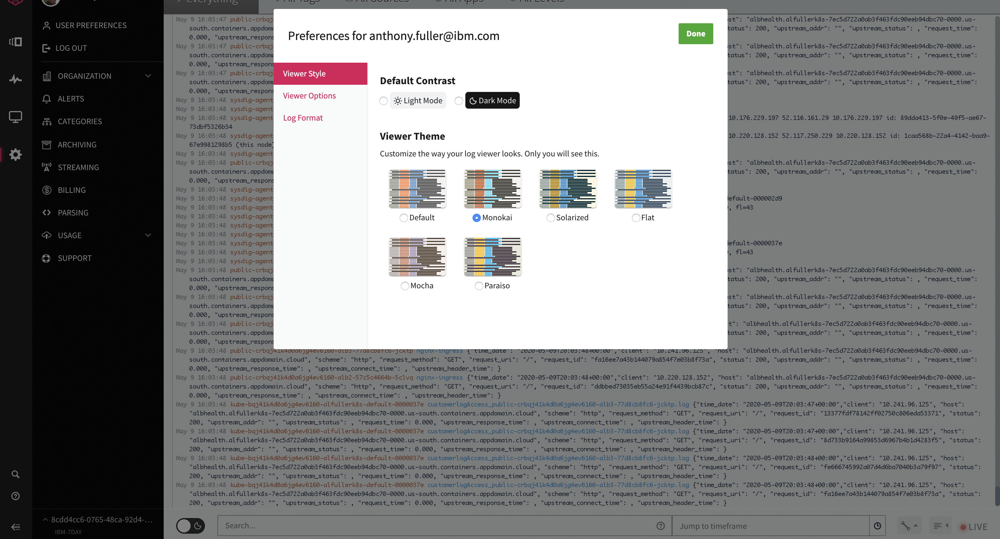

Select Log Format, modify the Line Format section to match your requirements.
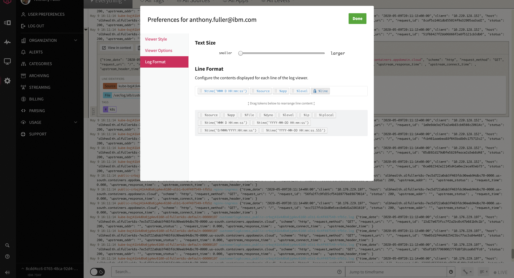

Let's look into a log line, at anytime you can view each event log line in context. 
Complete the following steps:
1. Click the Views icon Configuration icon. 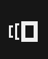
2. Select Everything or a view.
3. Identify a line in the log that you want to explore.
4. Expand the log line.

Information about line identifiers, tags, and labels is displayed.
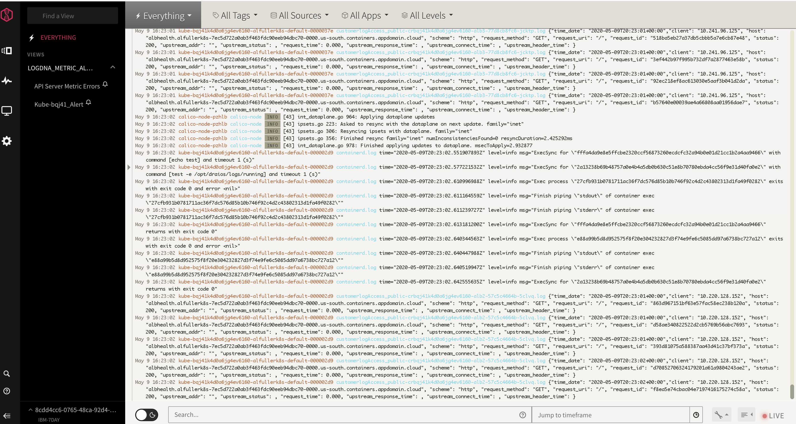

Expanded view of the log line, from step 4 above. 
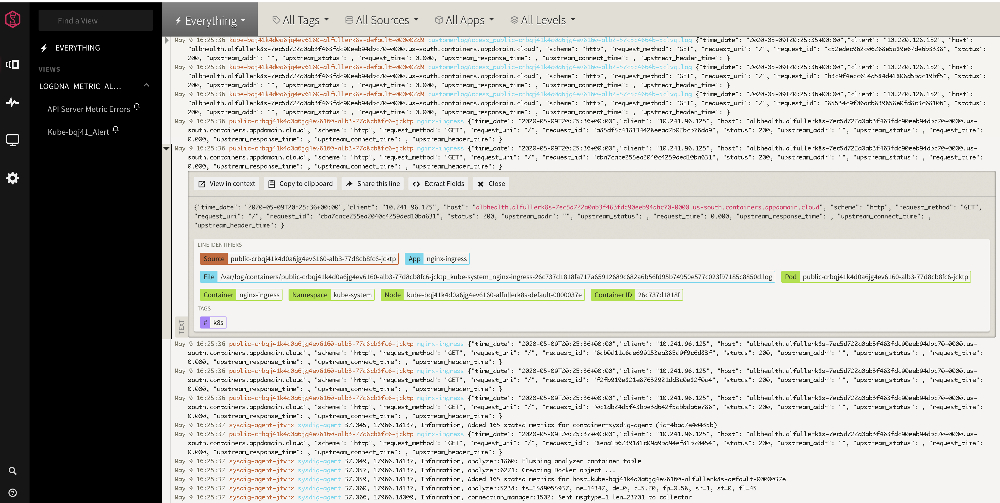

5. Click View in Context to see the log line in context of other log lines.
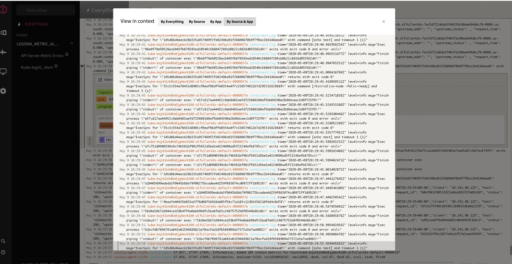

6. Click Copy to clipboard to copy the message field to the clipboard. When you are finished, close the line. 
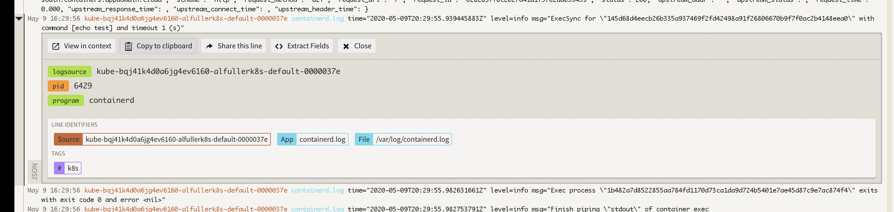

With IBM Log Analysis with LogDNA, you can filter logs by log source, application and even log level. Sources of event log searches or filters can be a host, computer, virtual machine or Heroku app. Next, let's try out filtering logs.

1. Click on the Views icon


2. Select Everything or a view.
3. Expand All Tags to see the list of tags that are identified in the logs. Then, choose the ones that you want.
4. Expand All Sources to see the list of log sources that are identified in the logs. Then, choose the ones that you want.
5. Expand All Apps to see the list of apps that are identified in the logs. Then, choose the ones that you want.
6. Expand All Levels to see the list of log levels that are identified in the logs. Then, choose the ones that you want.
<InlineNotification>
Note: In each section, you can group multiple options into a group. Group tags, log sources, apps, and log levels to reuse these groupings when you filter log data in other custom views.
</InlineNotification>

Notice, the All Apps expanded view below.
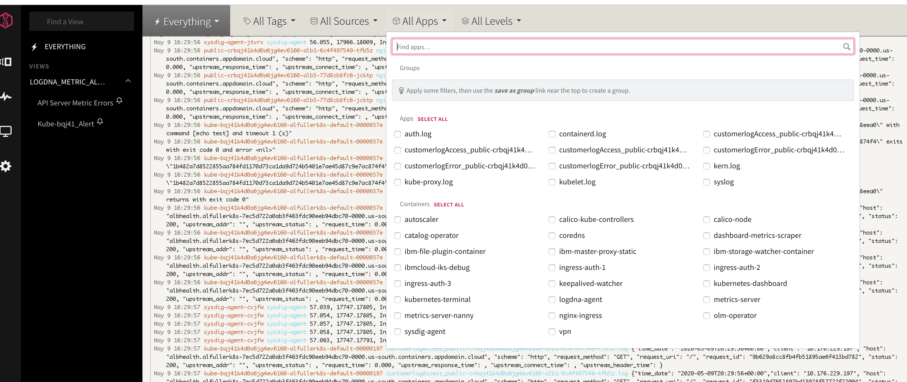

For our last activity, lets create a view. Follow the steps below. 

1. Click the Views icon Configuration icon. 
2. Select Everything or a view.
3. Filter log data then click Save as new view / alert.
 The Create new view page opens.

4. Enter a name for the view in the Name field.

5. Optionally, attach an alert. A new section is displayed for you to configure the alert.

6. Click Save View

Shown below is a saved view, notice the error logs displayed.
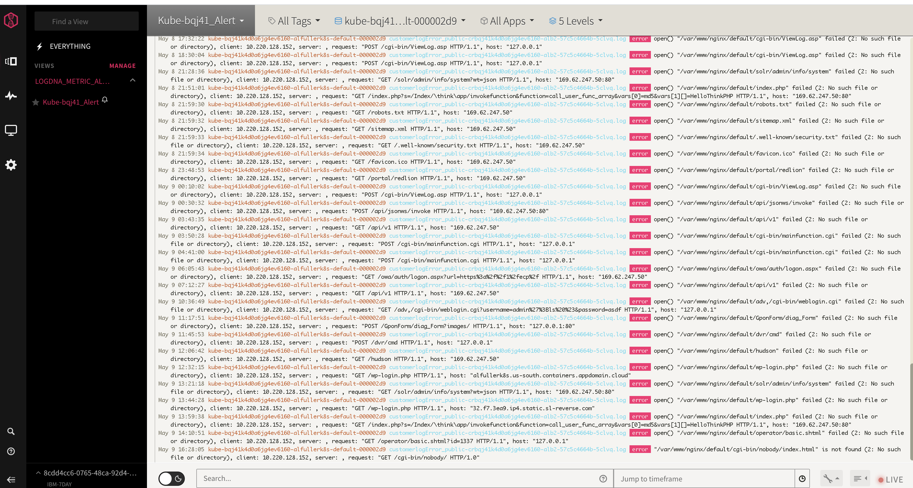

You can manage your Views by Categories.

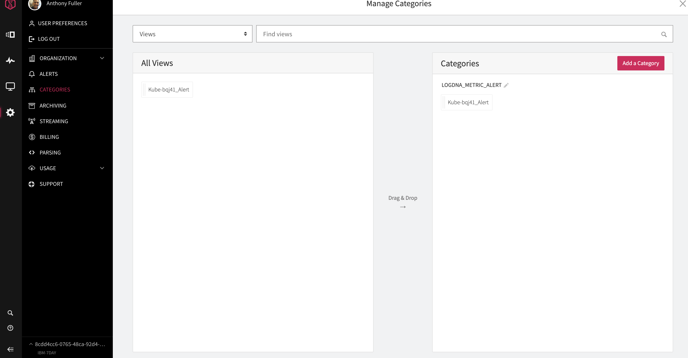

#### For more information on IBM Cloud Log Analysis with LogDNA, visit [Getting Started](https://cloud.ibm.com/docs/Log-Analysis-with-LogDNA?topic=LogDNA-getting-started)