<PageDescription>

Controlling Access with IBM Cloud IAM, Configuring users, groups and applications permissions for Event Logs

</PageDescription>

#### Granting Access
The IBM Cloud Identity and Access Management (IAM) provides the ability to securely provide access control to authenticated users for all IBM Cloud resources. IBM® Cloud Identity and Access Management (IAM) enables you to securely authenticate users and control access to all cloud resources consistently in the IBM Cloud. 

Maintaing an audit trail of event log activity can help with identifying configuration errors, provide analysis of compromises that may have occured. Event logs may disclose sensitive information or be susceptible to tampering if the proper permissions are not applied. Access control of event log data is critical in protecting evidence of breaches or compromises. 

<AnchorLinks small>
  <AnchorLink>How to create and Access Group</AnchorLink>
  <AnchorLink>Creating an Access Group using CLI</AnchorLink>
  <AnchorLink>Setting up Access Group Permissions</AnchorLink>
  <AnchorLink>Adding users to the access group</AnchorLink>
  <AnchorLink>Adding a Service Account to the access group</AnchorLink>
  <AnchorLink>Granting permissions for event logs</AnchorLink>
</AnchorLinks>


<InlineNotification>


Note: Your IBM Cloud account ID needs administrator platform permissions to manage IBM Cloud's Activity Tracker with LogDNA service. To find out more, see [Controlling Access through IAM](https://cloud.ibm.com/docs/Monitoring-with-Sysdig?topic=Sysdig-iam#iam) and [Platform Management](https://cloud.ibm.com/docs/iam?topic=iam-userroles#platformroles)

</InlineNotification>

## How to create and Access Group

The first step is to create an access group. Perform the following steps below to complete this task:
1. Navigate on the IBM Cloud dashboard to the manage link at the top and choose  Access (IAM), and select Access Groups, shown below

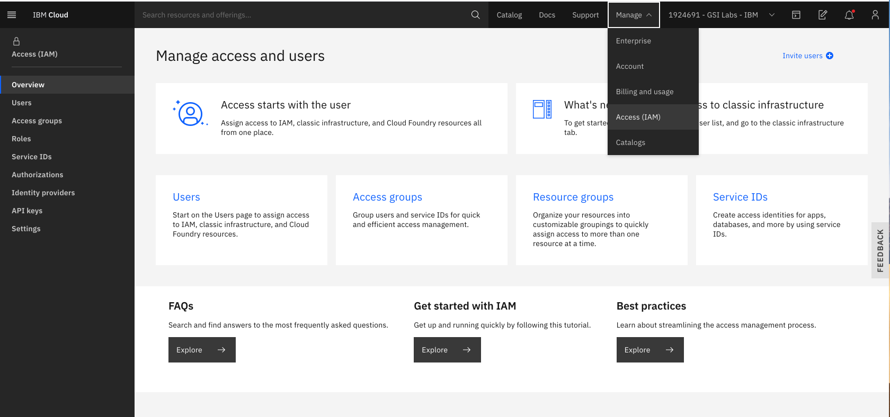

2. Click Create
3. Enter a name and optional description for your group, and click Create.

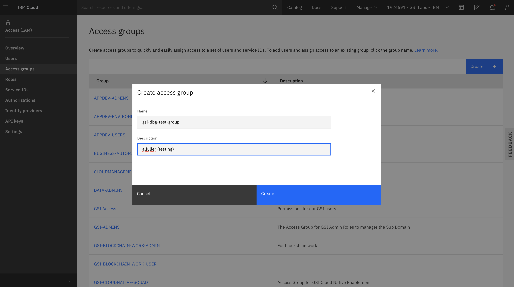

The new IAM access group has now been created, similar to the view below
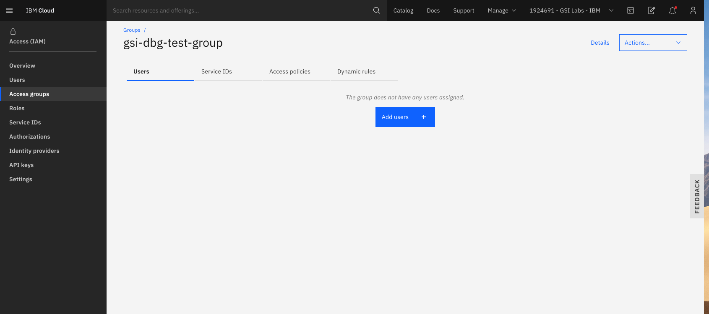


<InlineNotification>

##### Note: 
You can delete a group by selecting the Remove group option. When you remove a group from the account, you are removing all users and service IDs from the group and all access that is assigned to the group.

</InlineNotification>

## Creating an Access Group using CLI

you can use the ibmcloud iam access-group-create command.
```bash
ibmcloud iam access-group-create GROUP_NAME [-d, --description DESCRIPTION]
```


To create an access group policy by using the CLI, you can use the ibmcloud iam access-group-policy-create command.

```bash
ibmcloud iam access-group-policy-create GROUP_NAME {-f, --file @JSON_FILE | --roles ROLE_NAME1,ROLE_NAME2... [--service-name SERVICE_NAME] [--service-instance SERVICE_INSTANCE] [--region REGION] [--resource-type RESOURCE_TYPE] [--resource RESOURCE] [--resource-group-name RESOURCE_GROUP_NAME] [--resource-group-id RESOURCE_GROUP_ID]}
```
## Setting up Access Group Permissions
So now that we have setup a new access group, let's go and add permissions for viewing event logs. 
You can assign the policy by using the UI or through the command line.

When you define the policy, you need to select a platform role and a service role:

<li> Platform management roles cover a range of actions, including the ability to create and delete instances, manage aliases, bindings, and credentials, and manage access. The platform roles are administrator, editor, operator, viewer. Platform management roles also apply to account management services that enable users to invite users, manage service IDs, access policies, catalog entries, and track billing and usage depending on their assigned role on an account management service.</li>

<li> Service access roles define a user or service’s ability to perform actions on a service instance. The service access roles are manager, writer, and reader.</li>

For users to manage Activity Tracker with LogDNA, the following roles must be assigned, Platform role: **Viewer** and Service role: **Reader**.
For more on managing access for IBM Cloud Activity Tracker with LogDNA, visit [Learn More](https://cloud.ibm.com/docs/services/Activity-Tracker-with-LogDNA?topic=logdnaat-iam#iam)

To assign a policy to an access group through the UI, complete the following:
<li> From the menu bar, click Manage > Access (IAM), and select Access Groups.</li>

<li>Select the name of the group that you want to assign access to.</li>

#### The Access groups selected shown below
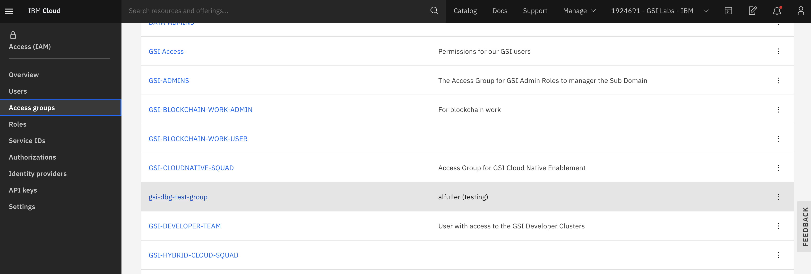
#### Click the Assign access tab shown in the screenshot below
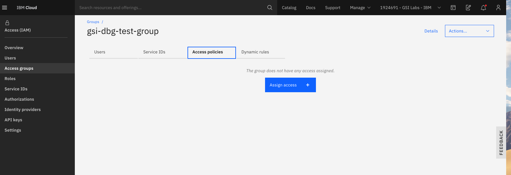
#### Assign your Access group additional permissions page, seen in the screenshot below
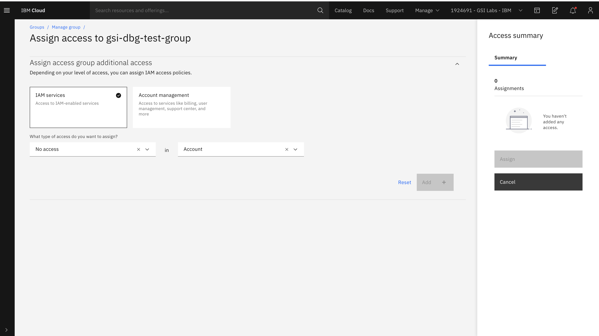
Grant permissions (We need to provide permissions to our Access group).

#### Option one, grant permission on the service
1. Select Assign access to resources.
2. Select IBM Cloud Activity Tracker with LogDNA.
3. Select Resource Group
4. Select All current regions.
5. Select All current service instances.
6. Select the platform role Viewer.
7. Select the service role Reader.
#### Screenshot shown below of assigning permissions to the Access group below
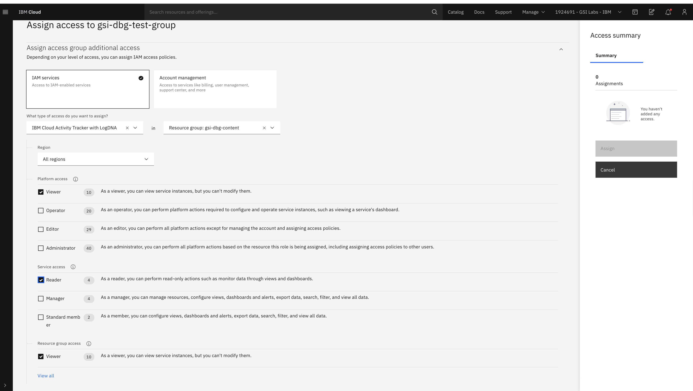

#### Review your Access summary choices, shown to the right in the screenshot below.
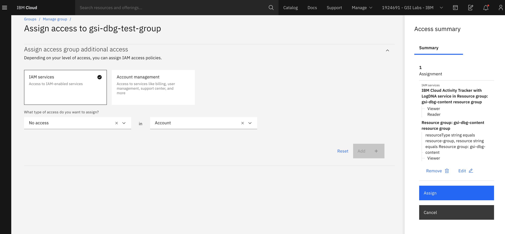
Click Assign.

#### Screenshot below shows the assigned roles granted.
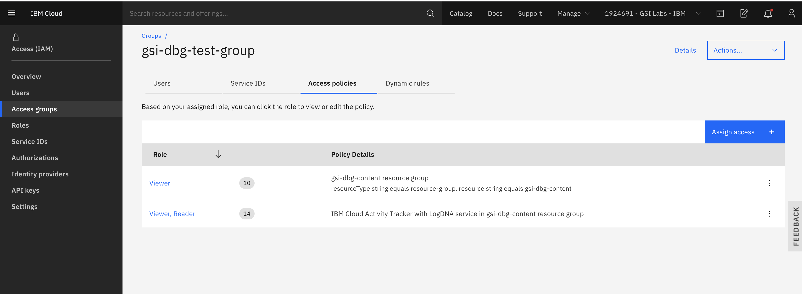

## Adding users to the access group
1. Perform the following actions: 
2. From the menu bar, click Manage > Access (IAM), and select Access Groups.
3. Choose Access Groups
4. Select the name of the group that you want to assign access to.
5. Click Add users on the Users tab.

#### Select the Add users tab shown below
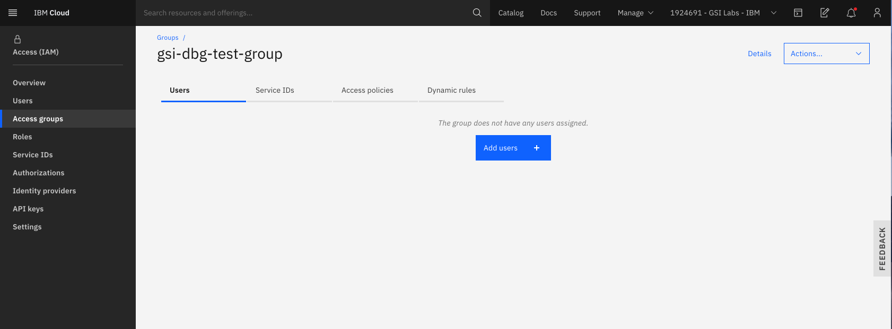

A list of users will show up, select the user(s) that you want to add from the list, and click Add users.

The user was successfully added to the Access group shown below
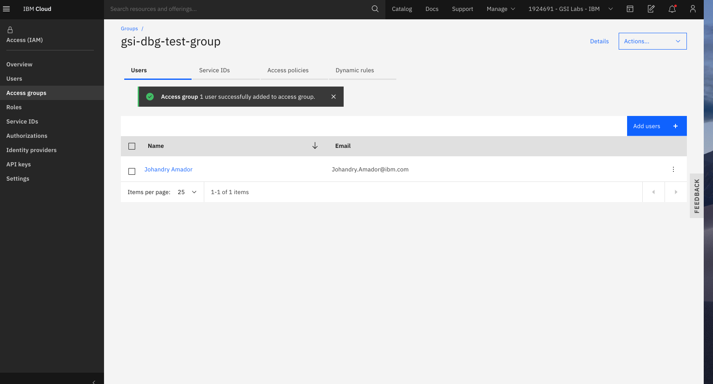

## Adding a Service Account to the access group

Follow the steps below.
1. From the menu bar, click Manage > Access (IAM), and select Access Groups.
2. Select the name of the group that you want to assign access to.
3. Click the Service IDs tab, and click Add service ID.

#### Service ID tab, shown in the screenshot below
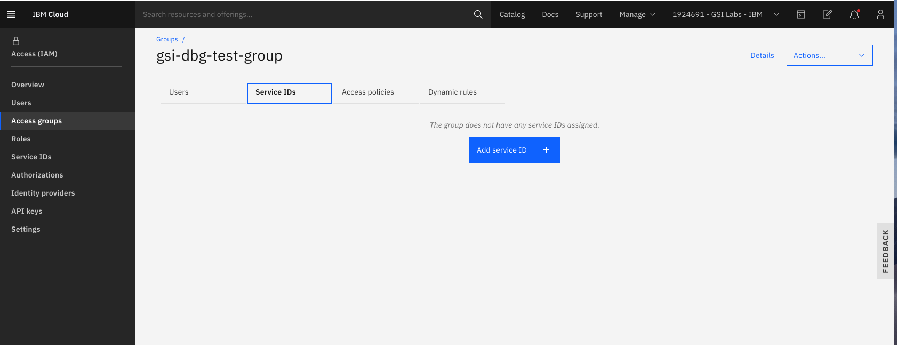

A list of Servie IDs will show, select the IDs you want to add and click Add service ID.

#### Screenshot below, showing a Service ID successfully added to the Access group
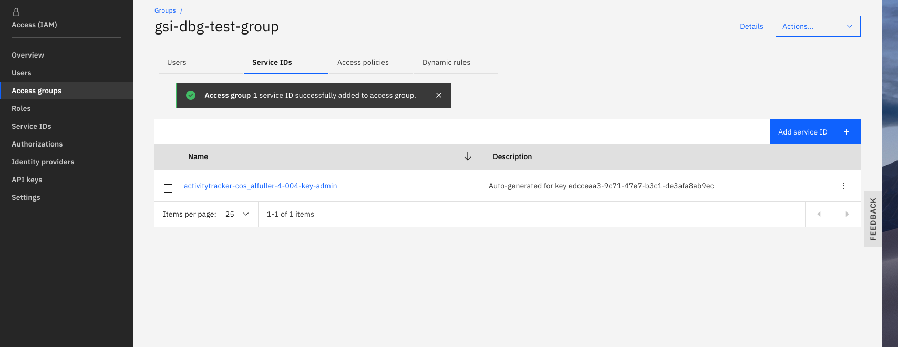

<InlineNotification>

For more information on controlling event log access, see [Managing Access](https://cloud.ibm.com/docs/Activity-Tracker-with-LogDNA?topic=logdnaat-iam) and [Granting Permissions](https://cloud.ibm.com/docs/Activity-Tracker-with-LogDNA?topic=logdnaat-iam_view_events).

</InlineNotification>

## Granting permissions for event logs

#### Granting permissions to manage logs and configure alerts

As an admin user in LogDNA, you must have permissions to run the following actions:

* Add LogDNA log sources
* View logs
* Search logs
* Filter logs
* Configure alerts

**For more information, see ** [Granting permissions to manage logs and configure alerts](https://cloud.ibm.com/docs/Log-Analysis-with-LogDNA?topic=LogDNA-work_iam#admin_user_logdna)

From the IBM Cloud menu bar, click Manage > Access (IAM), and then select Users and click on the user account you wish to manage, similar to the screen shown below. 

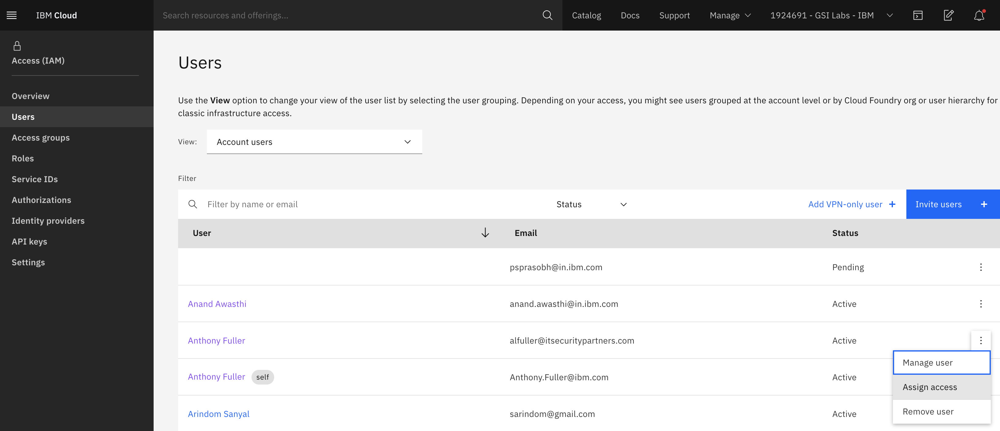

Next, choose the **Access polices** tab, similar to the screenshot below. 


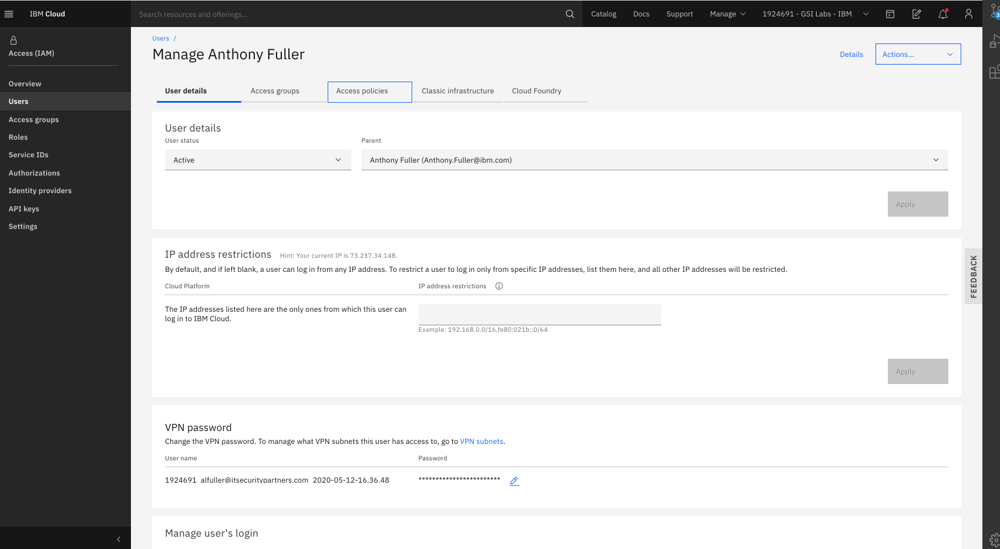

Click on the Assign access button, similar to the page shown below. 

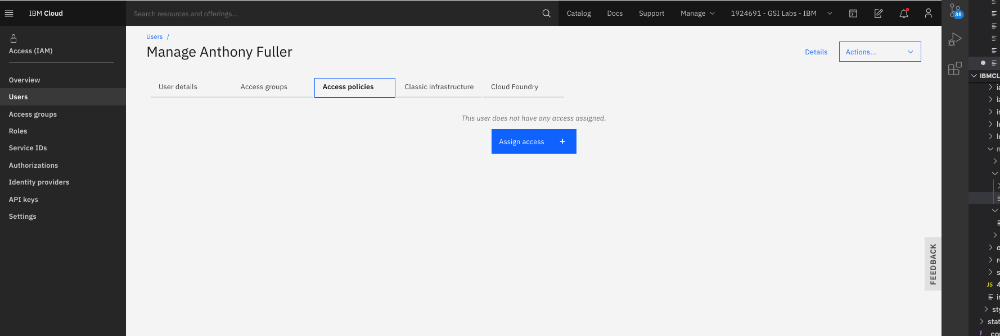

You're then taken to the **Assign access** page for the user, similar to the screen shown below. 


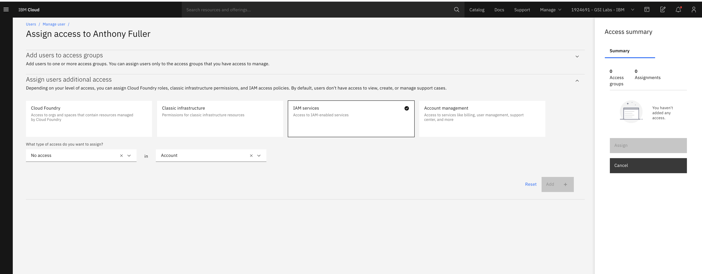

On the drop down menu for:  **What type of access do you want to assign**, choose IBM Log Analysis with LogDNA. Next, chose your resource group or All resoure groups (depending on your requirements). Select the platform role ** Editor**, Select the service role ** Manager** and click ** Add**, similar to the screen shown below. 

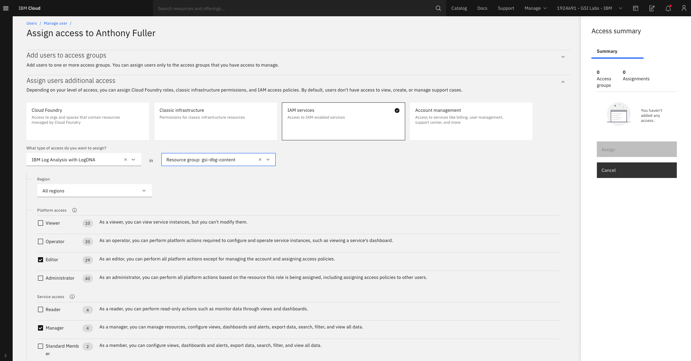

Notice to the right an **Access Summary**, when you're satisfied with the access configured click **Assign**, similar to the screen shown below. 

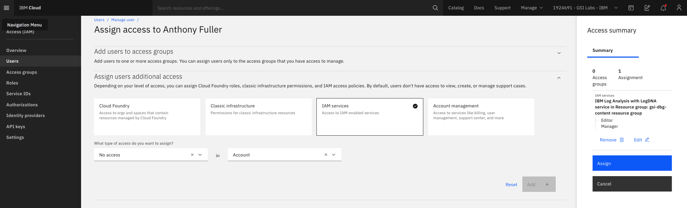

The user now has been granted the **Editor** and **Manager** role for IBM Cloud Log Analysis with LogDNA, similar to the screen shown below. 

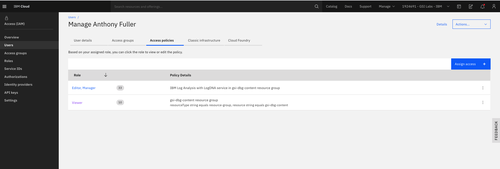


Repeat the steps above to assign other roles for IBM Cloud Log Analysis with LogDNA to have access to Event logs. 

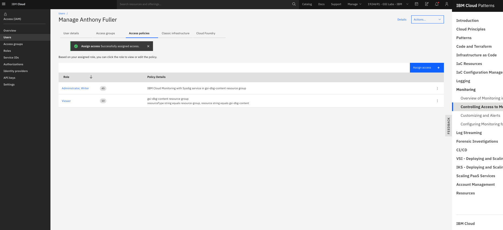


 <InlineNotification>

 For more information on Identity Access Management (IAM) and granting permissions to a user or service, see [Managing user access in the IBM Cloud](https://cloud.ibm.com/docs/Monitoring-with-Sysdig?topic=Sysdig-iam#iam), [Assigning Access to Groups](https://cloud.ibm.com/docs/iam?topic=iam-groups#access_ag), [Managing Access by using Groups](https://cloud.ibm.com/docs/Monitoring-with-Sysdig?topic=Sysdig-iam#iam_groups) and [Adding Permissions to Veiw Event Logs](https://cloud.ibm.com/docs/services/Activity-Tracker-with-LogDNA?topic=logdnaat-iam_view_events#iam_view_events_step2).

</InlineNotification>


