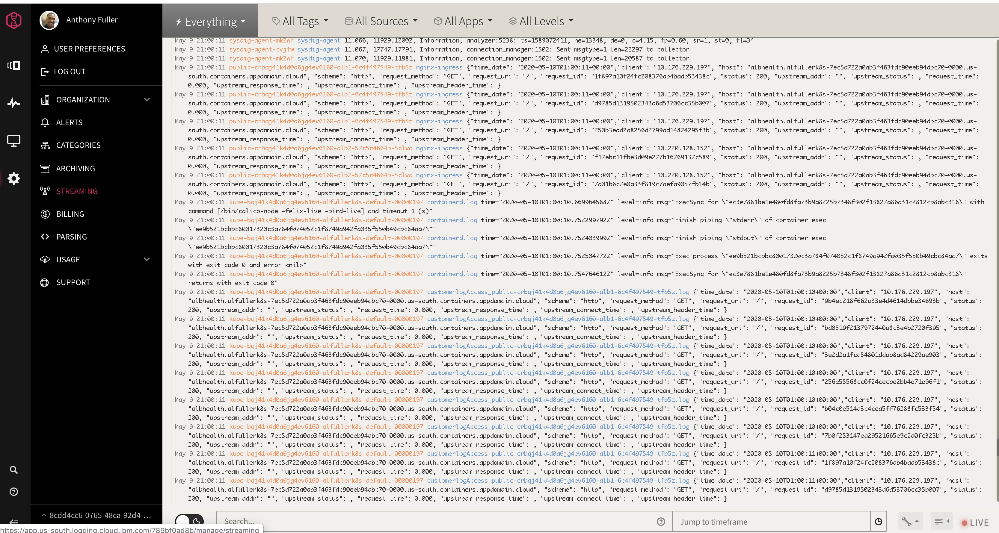
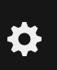
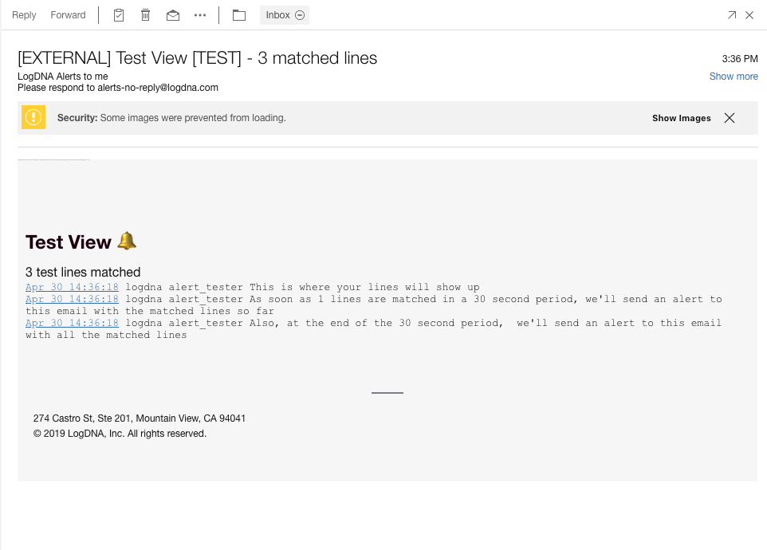
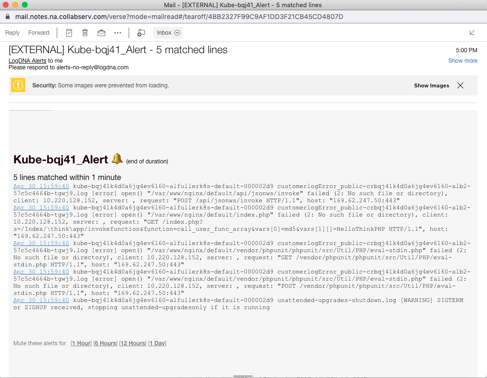

<PageDescription>

Customizing Event Log Views, Configuring Alert Notifications, configuring preset and alerts 

</PageDescription>

IBM Cloud Log Analysis with LogDNA, you can attach one or more alerts to a view. You can also define multiple notification channels for an alert. Alerts can be muted or you can detach alerts. For example, you can configure an alert that is triggered after 30 seconds, or when a 100 log lines that match the view's filtering and search criteria are collected.

To find out more, see [Working with Alerts](https://cloud.ibm.com/docs/Log-Analysis-with-LogDNA?topic=LogDNA-alerts)

<AnchorLinks small>
  <AnchorLink>Configuring Event Log Alerts Notifications</AnchorLink>
  <AnchorLink>Testing Alerts</AnchorLink>
  <AnchorLink>Configure a view-specific alert</AnchorLink>
  <AnchorLink>Delete a preset (alert template)</AnchorLink>
  <AnchorLink>Detach a view-specific alert from a view</AnchorLink>
</AnchorLinks>

## Configuring Event Log Alerts Notifications

Alerts can be configured for multiple notification channels. The following valid channels are supported: email, Slack, PagerDuty, Webhook
You can also define a preset. A preset is an alert template that you can attach to any number of views.

Lets get started in configuring an alert preset (alert template). 

Log in to your IBM Cloud account External link icon.
From the Menu icon, select Observability.
Select Logging. The list of IBM Log Analysis with LogDNA service instances that are available on IBM Cloud is displayed.
Select one instance and click View LogDNA.

The LogDNA dashboard opens, shown below.

#### Complete the following steps to configure a preset:

1. Select the Settings icon. 
2. Select Alerts.
3. Select Add a preset alert.
4. Choose a notification channel.
5. Define the threshold conditions.

 a. Select a time frequency. For example, 12 hours.

 b. Enter the number of log lines after which you want the alert to trigger.

 c. Select whether you want both conditions to be checked or just one.

Add the details for the notification channel that you have chosen.

For example, for the email notification channel, add one or more recipients, and optionally a time zone.

## Testing Alerts

Perform a test to see if the alert notification is successful. 
If so, click Save alert.

Now, let's adjust the alert notification time from 12 hours (as configured above) to one minute to see if any alerts notications come through. 

The screenshot below was captured to show the number of event logs matching the preset view alerts.

## Configure a view-specific alert

1. Click the Views icon Configuration icon. 
   Create a view.

2. Apply a time frame, filters and search criteria to filter the log lines that are displayed through the view.

3. For more information, see [Creating Views](https://cloud.ibm.com/docs/Log-Analysis-with-LogDNA?topic=LogDNA-view_logs#view_logs_step7)

4. Click the view name. Then, select Attach an alert.

5. Choose view-specific alert.

6. Choose a notification channel.

7. Define the threshold conditions.

8. Select a time frequency. For example, 12 hours.

9. Enter the number of log lines after which you want the alert to trigger.

9. Select whether you want both conditions to be checked or just one.

10. Add the details for the notification channel that you have chosen.

For example, for the email notification channel, add one or more recipients, and optionally a time zone.

Click Save alert.

For more information on configuring alerts see, [Creating Views](https://cloud.ibm.com/docs/Log-Analysis-with-LogDNA?topic=LogDNA-view_logs#view_logs_step7)

## Delete a preset (alert template)
Complete the following steps to delete a preset:

1. Select the Configuration icon.

Select Alerts.
2. Hover the mouse over the edit button of the preset that you want to delete. The delete option shows.
3. Select Delete.
5. Confirm that you want to delete the preset. Click Delete.

## Detach a view-specific alert from a view
Complete the following steps to detach a preset:

1. Select the Configuration icon Configuration icon.

Select Alerts.
2. over the mouse over the edit button of the alert that you want to delete. The delete option shows.
3. Select Detach.
4. Confirm that you want to delete the alert. Click Detach.

<InlineNotification>

For more information on configuring event log alerts using **IBM Cloud Log Analysis with LogDNA**, see [Working with Alerts](https://cloud.ibm.com/docs/Log-Analysis-with-LogDNA?topic=LogDNA-alerts).

</InlineNotification>

 