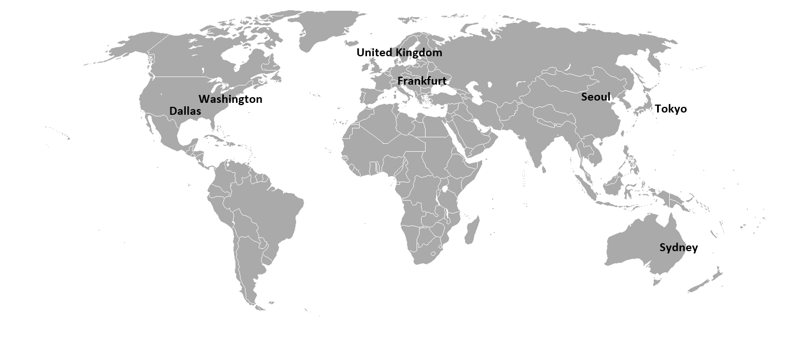
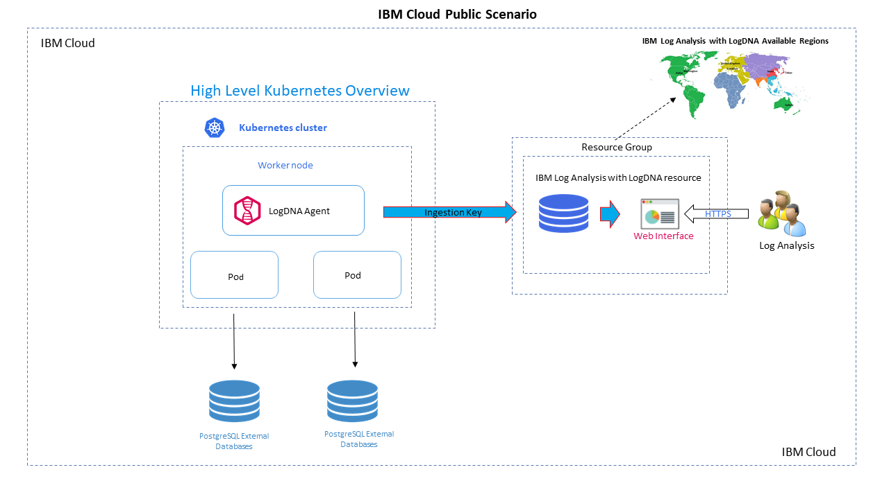
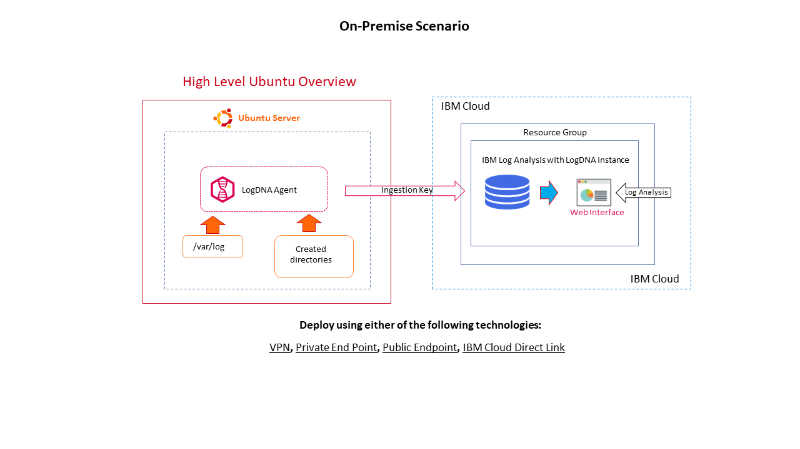
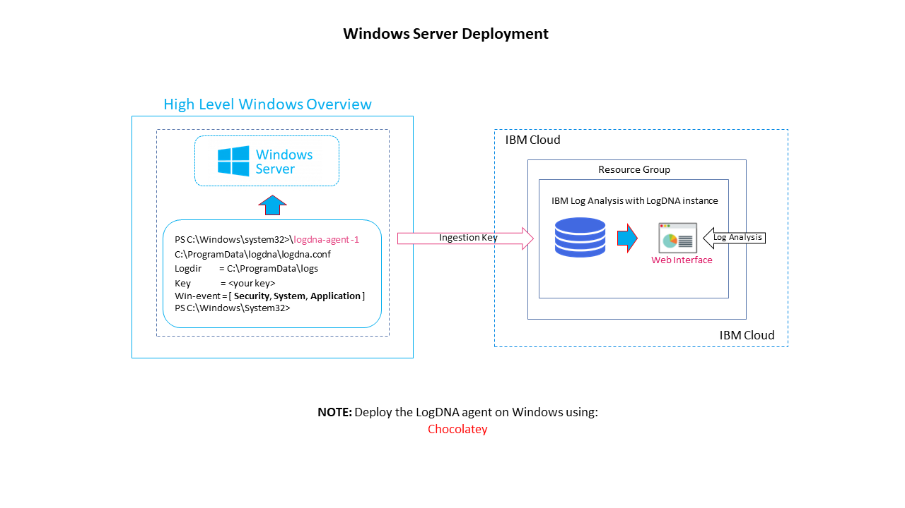

<PageDescription>

IBM Log Analysis with LogDNA is available in the following locations:

</PageDescription>
Washington DC, Dallas, United Kingdom, Frankfurt, Seoul, Tokyo, Sydney. 

 

You provision an IBM Log Analysis with LogDNA instance within the context of a resource group. You organize your services for access control and billing purposes by using resource groups. You can provision the instance in the default resource group or in a custom resource group.
<InlineNotification>

###### IBM Cloud Log Analysis with LogDNA Following Locations

Check the documentation to know more about [Log Analysis with LogDNA](https://cloud.ibm.com/docs/Log-Analysis-with-LogDNA?topic=LogDNA-regions)

</InlineNotification>

Below are a few high level architecture overviews that shows IBM Log Analysis with LogDNA service deployment scenarios:

       
### IBM Cloud Public Deployment
<InlineNotification>

###### IBM Cloud Log Analysis with LogDNA for Kubernets

Check the documentation to know more about [Managing Kubernetes Logs](https://cloud.ibm.com/docs/Log-Analysis-with-LogDNA?topic=LogDNA-kube#kube)

</InlineNotification>

      

### On-Premise Deployment

<InlineNotification>

###### IBM Cloud Log Analysis with LogDNA for Ubuntu

Check the documentation to know more about [Managing Ubuntu Logs](https://cloud.ibm.com/docs/Log-Analysis-with-LogDNA?topic=LogDNA-ubuntu#ubuntu)

</InlineNotification>

      

### On-Premise Deployment

<InlineNotification>

###### IBM Cloud Log Analysis with LogDNA for Windows

Check the documentation to know more about [Managing Windows Logs](https://docs.logdna.com/docs/windows-logging) and using Chocolatey[Chocolatey for Windows](https://github.com/chocolatey/choco/wiki#requirements) 
</InlineNotification>

