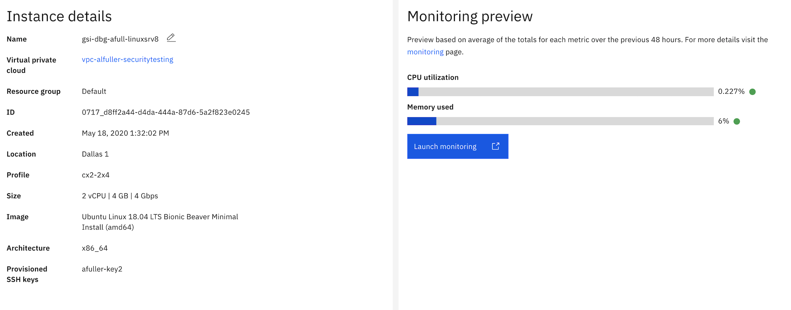
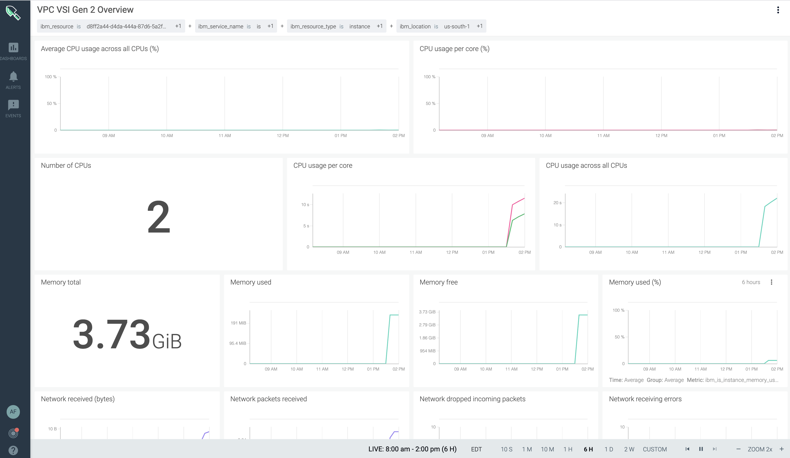
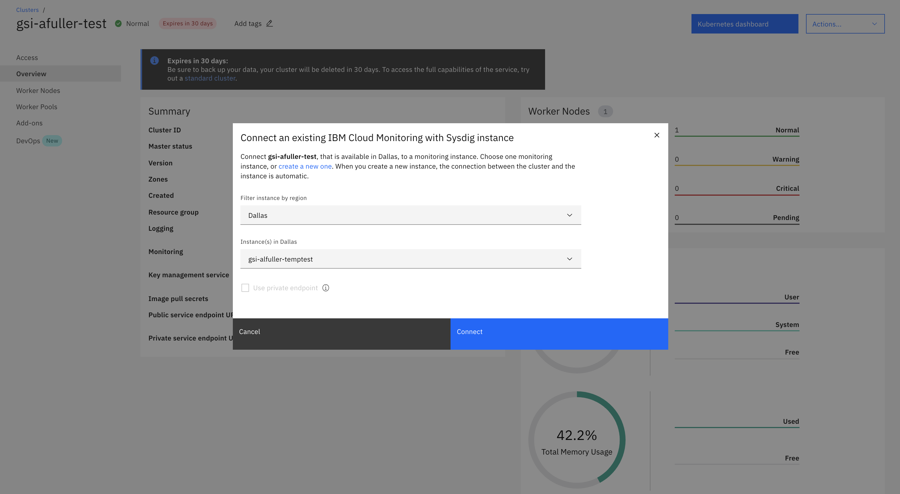
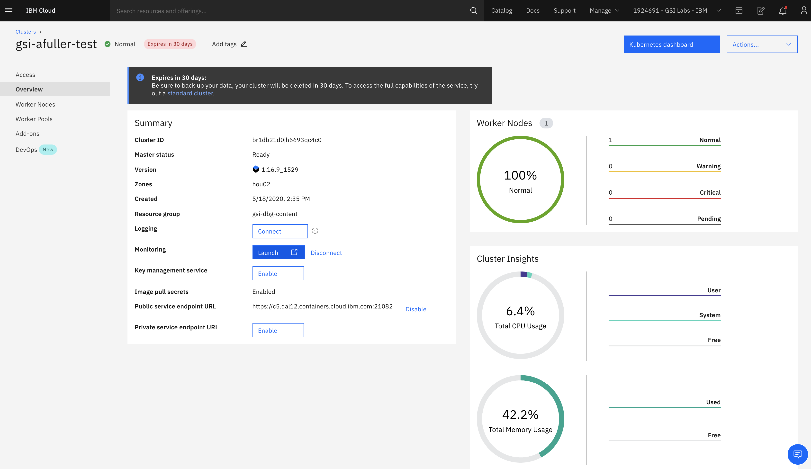
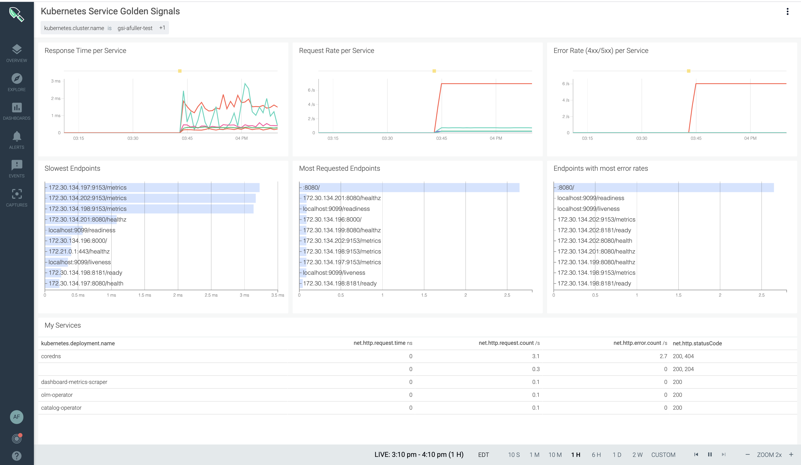
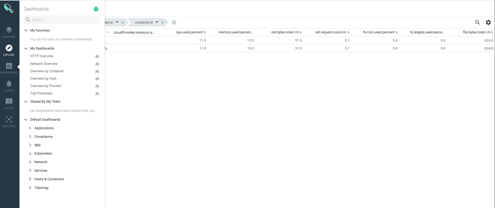
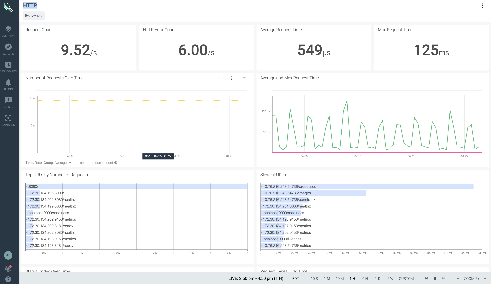
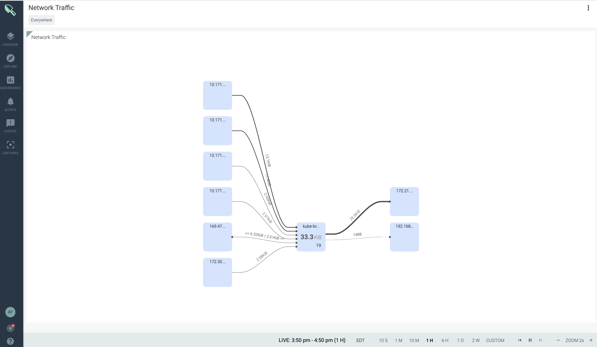
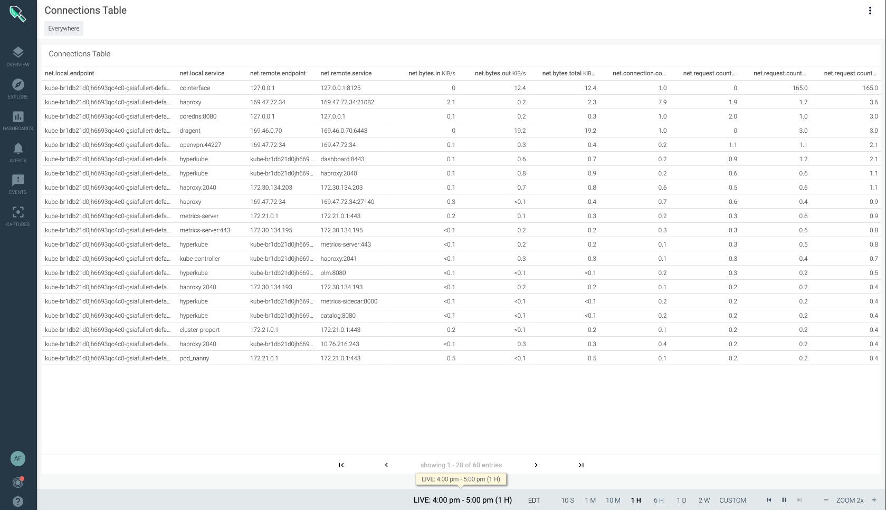
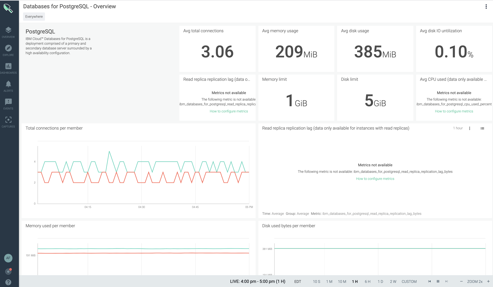

<PageDescription>

Configuring Monitoring for Resources

</PageDescription>

<AnchorLinks small>
  <AnchorLink>Configuring Monitoring for Virtual Server Instances</AnchorLink>
  <AnchorLink>Configuring Sysdig for Kubernetes</AnchorLink>
  <AnchorLink>Configuring Platform Metrics</AnchorLink>
  <AnchorLink>Dashboard Views for Other IBM Cloud Resources</AnchorLink>
</AnchorLinks>

## Configuring Monitoring for Virtual Server Instances
 
To configure monitoring for your Virtual Server Instances (VSI),Linux or Windows follow the steps below:
1. Go to the IBM Cloud menu icon > VPC Infrastructure >  Virtual Service Instances. 
2. Choose the virtual server instance (VSI) you wish to monitor. 
3. Click on **Launch monitoring**, similar to the screen shown below. 

**Your IBM Cloud Monitor with Sysdig will show an overview of your VSI resource utilization, similar as the screen shown below.**

## Configuring Sysdig for Kubernetes

To configure monitoring for your Kubernetes cluster follow the steps below:
1. Go to the IBM Cloud menu icon > Kubernetes >  Clusters. 
2. Choose your Kubernetes cluster instance 
3. For Monitoring, click on Connect
4. Choose the **Filter instance by region** and the **Instance(s) in** your region drop down box. 

<InlineNotification>

** Note:** You must configure an instance of Sysdig before you can monitor your Kubernetes cluster, see [Provisioning an Instance](https://cloud.ibm.com/docs/Monitoring-with-Sysdig?topic=Sysdig-provision)

</InlineNotification>

After connecting your Kubernetes cluster to IBM Cloud Monitor with Sysdig instance, on the monitoring section choose **Launch**, similar to the screenshown below.

After clicking on **launch**, your IBM Cloud Monitoring with Sysdig instance dashboard should open, displaying **Response Time per Service**, **Request Rate per Service**, **Error Rate per Service**, **Slowest Endpoints** and a wealth of other information, similar to the screen shown below.

## Configuring Platform Metrics
** Note:** You’ll need to provision an instance of Sysdig before viewing metrics, see [Provisioning an instance](https://cloud.ibm.com/docs/Monitoring-with-Sysdig?topic=Sysdig-provision)

Go to the IBM Cloud dashboard > menu icon > Observability, and follow the steps below: 

1. Select **Monitoring** > **Configure platform metrics**.

2. Select a region.

3. Choose the Sysdig instance that will collect metrics from enabled services on that location.

4. Click Save.

<InlineNotification>

**For more information, see** [Enabling Plarform Metrics](https://cloud.ibm.com/docs/Monitoring-with-Sysdig?topic=Sysdig-platform_metrics_enabling), [Working with Metrics](https://cloud.ibm.com/docs/Monitoring-with-Sysdig?topic=Sysdig-metrics), [Metric Labels](https://cloud.ibm.com/docs/Monitoring-with-Sysdig?topic=Sysdig-metrics#metrics_labels), and [Custom Metrics](https://cloud.ibm.com/docs/Monitoring-with-Sysdig?topic=Sysdig-metrics#metrics_custom).

</InlineNotification>

## Dashboard Views for Other IBM Cloud Resources 

To see default dashboard views of other IBM Cloud Resources:
1. Go to IBM Cloud dashboard > menu icon > Observability > Monitoring
2. Select your instance of Sysdig and click **View Sysdig** (dashboard icon)
3. Choose **Dashboards** from the menu and select one of the **Default Dashboard** menu's, similar to the screen shown below. 

Let's select from the **Default Dashboards** menu > **Application** > **HTTP**, notice the Default Dashboard view for HTTP, similar to the screen shown below.

While still in your instance of Sysdig, click on the **Default Dashboards** > **Applications** > **Topology** > **Network Traffic**. 

Notice the Default Dashboard view for **Network Topology** is displayed, similar to the screen shown below.

While still in your instance of Sysdig, click on the **Default Dashboards** > **Network** > **Topology** > **Connections Table**.
The Default Dashboard for **Connections Table** is shown, similar to the screenshot below. 

While still in your instance of Sysdig, click on the **Default Dashboards** > **IBM** > **Databases for PostgreSQL - Overview**. 

The Default Dashboard for PostsgreSQL is displayed, similar to the screen shown below. 

For more information on configuring dashboard views using **IBM Cloud Monitoring with Sysdig**, see [Dashboards](https://docs.sysdig.com/en/dashboards.html)