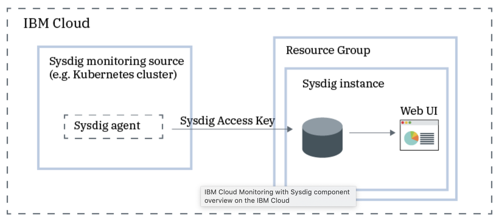

<PageDescription>

IBM Cloud Monitoring Overview

</PageDescription>

#### Monitoring is key to making sure your applications perform well and are secure in IBM Cloud. 

IBM Cloud Monitoring combined partnership with Sysdig and Activity Tracker with LogDNA, provide operational visibility into the performance and health of your applications, services, and platforms. IBM Monitoring offers administrators, DevOps teams and developers full stack telemetry with advanced features to monitor and troubleshoot, define alerts, and design custom dashboards. 

#### IBM Cloud with Sysdig component overview

<InlineNotification>

** For more information on IBM Cloud Monitoring with Sysdig, see** [Getting Started](https://cloud.ibm.com/docs/Monitoring-with-Sysdig?topic=Sysdig-getting-started)

</InlineNotification>

Use IBM Cloud Activity Tracker to monitor and track how users and applications interact, while recording user-initiated activities that change the state of a service in IBM Cloud. 
You can use this service to investigate abnormal activity and critical actions and to comply with regulatory audit requirements. In addition, you can be alerted about actions as they happen. The events that are collected comply with the Cloud Auditing Data Federation (CADF) standard.

#### IBM Cloud with Activity Tracker high level architecture overview

<InlineNotification>

** For more information on IBM Cloud Activity Tracker with LogDNA, see ** [Getting Started](https://cloud.ibm.com/docs/Activity-Tracker-with-LogDNA?topic=logdnaat-getting-started#getting-started).

</InlineNotification>

