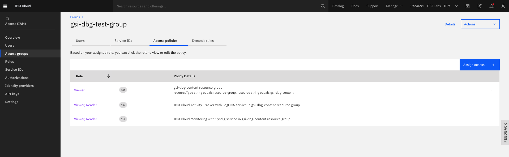
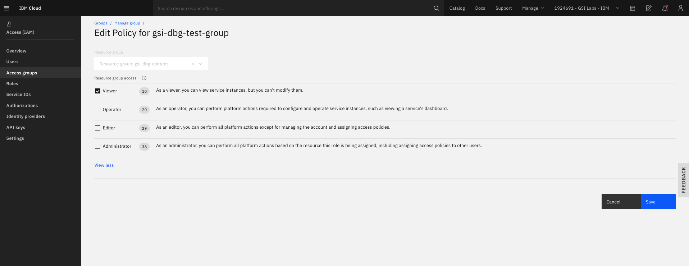
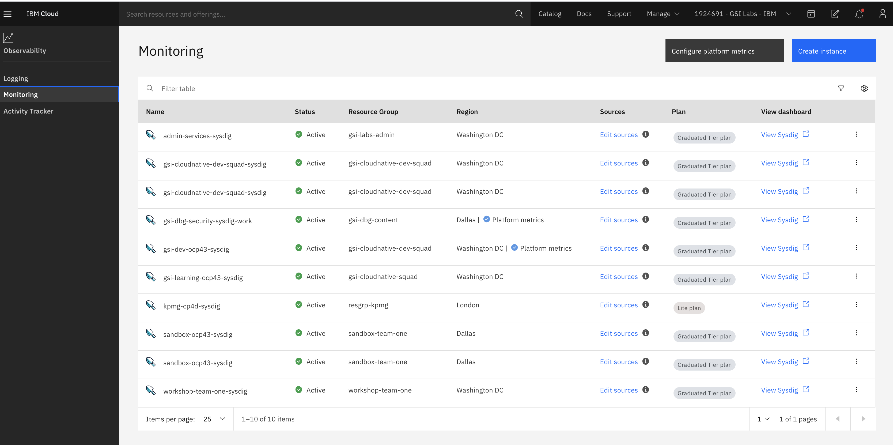
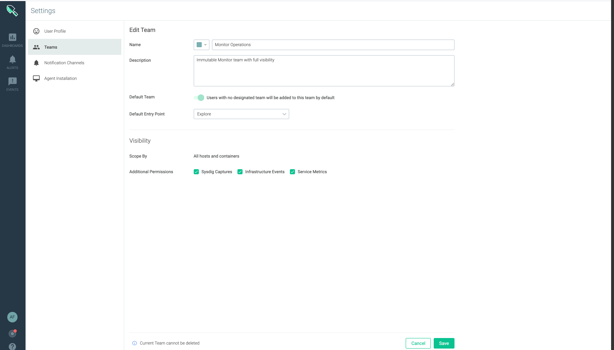

<PageDescription>

Controlling Access to Monitoring Metrics and Event Data

</PageDescription>

 Every user in your account that accesses the IBM Cloud Monitoring with Sysdig service, must be assigned an access policy with an IAM user role defined. The policy determines what actions the user can perform within the context of the service or instance you select. 
 
 
 Working with IBM Cloud Teams you can add in anothother level of data control that is available through a Sysdig instance of top of the platform services access controls. A user with the Manager service access role of an IBM Cloud Monitoring with Sysdig instance can create, delete, add members, and change the scope of teams in that instance. Once a team is created, an admin can add a user to it through IBM® Cloud Identity and Access Management (IAM).

 <AnchorLinks small>
  <AnchorLink>Granting the Administrative Role</AnchorLink>
  <AnchorLink>Working With Teams</AnchorLink>
  <AnchorLink>Granting Permissions to work in a Team</AnchorLink>
  <AnchorLink>Creating a team</AnchorLink>
  <AnchorLink>Changing the scope of a Team</AnchorLink>
  <AnchorLink>Deleting a Team</AnchorLink>
</AnchorLinks>

 <InlineNotification>

 For more information on Identity Access Management (IAM), see [Managing user access in the IBM Cloud](https://cloud.ibm.com/docs/Monitoring-with-Sysdig?topic=Sysdig-iam#iam), [Assigning Access to Groups](https://cloud.ibm.com/docs/iam?topic=iam-groups#access_ag), [Managing Access by using Groups](https://cloud.ibm.com/docs/Monitoring-with-Sysdig?topic=Sysdig-iam#iam_groups) and [Working with Teams](https://cloud.ibm.com/docs/Monitoring-with-Sysdig?topic=Sysdig-teams)

</InlineNotification>

## Granting the Administrative Role
To grant a user administrator role for the service and to manage instances within a resource group in the account, the user must have an IAM policy for the IBM Cloud Monitoring with Sysdig service and Activity Tracker with LogDNA and the platform role Administrator within the context of the resource group.

The screenshot below, shows the `Access   policies` tab for the `Access group` **gsi-dbg-test-group**. 

 

By clicking on the `View` role, the **Edit Policy** page is shown below for the `Access group` **gsi-dbg-test-group** and the different roles assigned, which can be changed by adding or removing `Resource group access`, similar to the screen shown below. 

Users that are members of the `Access group` **gsi-dbg-test-group** would also inherit the `Role` (permission) changes made. 
 

## Working with Teams

In the world of microservices, it is becoming harder to track down valuable metrics and ensure that no sensitive data is exposed. By using teams, administrators can apply a fine grain control on resources. Consider the following information when you work with teams:

<InlineNotification>

 **Note:** These instructions assume that you have provisioned a Sysdig service instance on IBM Cloud.

</InlineNotification>

**To assign a user to a Team, see ** [Assigning a user to a team](https://cloud.ibm.com/docs/Monitoring-with-Sysdig?topic=Sysdig-teams#teams_assign)

You'll need to launch the web UI through the IBM Cloud UI
You launch the Web UI within the context of an IBM Cloud Monitoring with Sysdig instance, from the IBM Cloud UI.

**For more information on launching the web UI, see** [Navigating to the Web UI](https://cloud.ibm.com/docs/Monitoring-with-Sysdig?topic=Sysdig-launch#launch)

Complete the following steps to launch the web UI:

1. Log in to your IBM Cloud account.

2. Click IBM Cloud dashboard External link icon to launch the IBM Cloud dashboard.

3. After you log in with your user ID and password, the IBM Cloud Dashboard opens.

4. In the navigation menu, select Observability.

5. Select Monitoring.

**Note:** The list of instances that are available on IBM Cloud is displayed. Similar to the screenshown below. 

Select one instance. Then, click View Sysdig.

## Granting Permissions to work in a Team
**Note:** Your user ID needs administrator platform permissions to manage the IBM Cloud Monitoring with Sysdig service. Contact the account administrator. The account owner can grant another user access to the account for the purposes of managing user access, and managing account resources.

An access group will need creating, see [Create an Access Group](https://cloud.ibm.com/docs/Monitoring-with-Sysdig?topic=Sysdig-iam_grant_team#ime_step1)

## Creating a Team
**Note:** An administrator or a manager of an IBM Cloud Monitoring with Sysdig instance must switch to the Monitor Operations team before he can create teams and manage existing teams.

1. Launch the web UI for your instance of Sysdig
From the Selector button in the navigation bar, select Monitor Operations. Then, choose Settings.

2. Select Teams. The list of existing teams is displayed.

3. Click Add Team. The team configuration page is displayed.

4. Configure the team details.

    * Choose a color.

    * Enter the name of the team

    * [Optional] Enter a description for this team.

    * [Optional] Set the Default team parameter if you want this team to become the default team for new users.

    * Set the Default Entry Point to specify the view in the web UI that opens every time a user logs in. Valid entrypoints are: Explore view, Dashboards view, Events view, Alerts view, and Settings view. By default, the Explore view is set.

For more information, see [Creating a Team](https://cloud.ibm.com/docs/Monitoring-with-Sysdig?topic=Sysdig-teams#teams_create)

## Changing the scope of a Team
**Note:** You must have manager role to change the scope of a team in a Sysdig instance.

To change the scope of the data that is visible to members of a team, complete the following steps:

1. Launch the web UI.

2. From the Selector button in the navigation bar, select Monitor Operations. Then, choose Settings.

3. Select Teams. The list of existing teams is displayed.

4. Identify the team and select it. The details of the team are displayed.

5. Change configuration details in the Visibility section.

6. Click Save.

## Deleting a Team
**Note:** The default team, Monitor Operations, cannot be deleted.

1. Launch the web UI. 

2. From the Selector button in the navigation bar, select Monitor Operations. Then, choose Settings.

3. Select Teams. The list of existing teams is displayed.

4. Identify the team that you want to delete and select it. The details of the team are displayed.

5. Click Delete team.

**Note:** When you delete a team, users that only belong to this team will be moved to the default team.

The **Default Team**, is similar to the screen shown below.

 <InlineNotification>

 For more information on **Teams**, see [Working with Teams](https://cloud.ibm.com/docs/Monitoring-with-Sysdig?topic=Sysdig-teams)

</InlineNotification>
