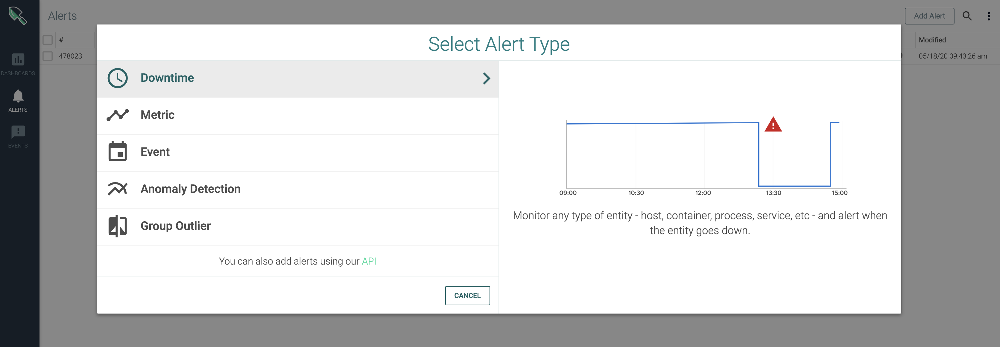
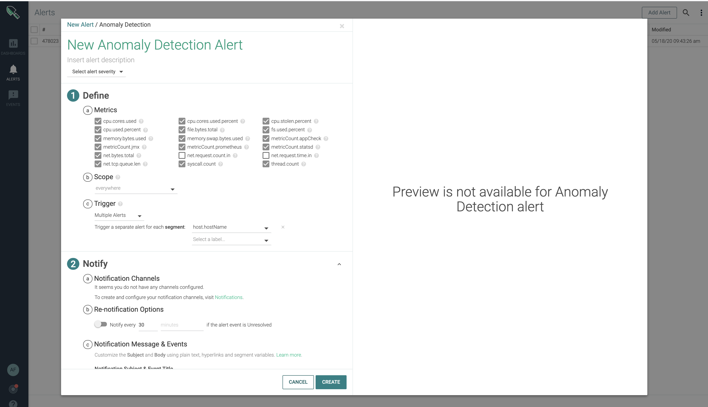
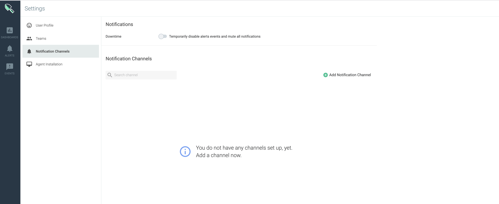
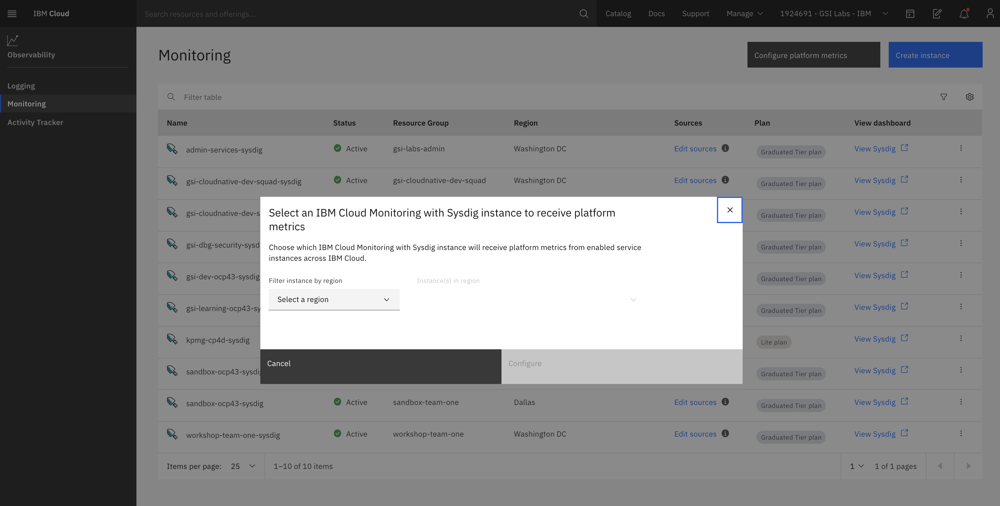
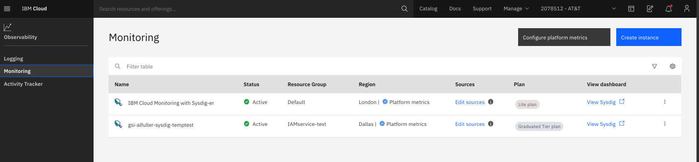

<PageDescription>

Customize Monitoring and Alerts for 

</PageDescription>

In IBM Cloud Monitoring with Sysdig, you can customize the Sysdig agent configuration to set a log level, block ports, include or exclude metric data, add or remove events, and filter out containers. 
IBM Cloud Monitoring with Sysdig enables the configuration of alert notification of events that you can use to warn about situations that require attention. Each alert has a severity status. This status informs you about the criticality of the information it reports on.

<AnchorLinks small>
  <AnchorLink>Working With Alerts</AnchorLink>
  <AnchorLink>Configuring Notification Channels</AnchorLink>
  <AnchorLink>Enabling Platform Metrics</AnchorLink>
</AnchorLinks>

## Working with Alerts
To setup alerts you'll need to configure a notification channel, see [Configuring a notification channel](https://cloud.ibm.com/docs/Monitoring-with-Sysdig?topic=Sysdig-notifications#notifications_create)

Sysdig Monitor can generate notifications based on certain conditions or events you configure. In Sysdig Monitor, metrics serve as the central configuration artifact for alerts. A metric ties one or more conditions or events to the measures to take when the condition is met, or an event happens. Alerts work across Sysdig modules including Explore, Dashboard, Events, and Overview.
For more information, see [Configure Alerts](https://docs.sysdig.com/en/alerts.html).

You can configure alerts using IBM Cloud monitoring with Sysdig Alert Wizard, similar to the screen shown below. 

1. Go to the IBM Cloud dashboard, go to the menu icon menu icon > Observability to access the Observability dashboard.
2. Choose the **Alerts** bell icon and then click on  **Add Alert** (located upper right hand corner)
Notice the **Select Alert** Type wizard opensd, you have the option to choose from multiple alert types.
* Downtime
* Metrics
* Event
* Anomaly Detection
* Group Outlier

Choose Anomaly Detection, notice the alerts that can be defined, similar to the screen shown below.

## Configuring Notification Channels 

With IBM Cloud Monitoring with Sydig, you can configure alerts and notification channels, similar to the screen shown below.

**For more information, see** [Configuring Notifications](https://cloud.ibm.com/docs/Monitoring-with-Sysdig?topic=Sysdig-notifications#notifications_create)

**There is an option for adding alerts using an API, for more information, see** [Alerts](https://sysdig.gitbooks.io/sysdig-cloud-api/content/rest_api/alerts.html#)

## Enabling Platform Metrics

**Note:** You'll need to provision an instance of Sysdig before viewing metrics.

From the web UI, click on Configure platform metrics similar to the screenshot shown below. 

Go to the IBM Cloud dashboard, go to the menu icon menu icon > Observability to access the Observability dashboard.

1. Select Monitoring > Configure platform metrics.

2. Select a region.

3. Choose the Sysdig instance that will collect metrics from enabled services on that location.

4. Click Save.

Sysdig is now set to monitor platform metrics, similar to the screen shown below. 

**For more information, see** [Enabling Plarform Metrics](https://cloud.ibm.com/docs/Monitoring-with-Sysdig?topic=Sysdig-platform_metrics_enabling), [Working with Metrics](https://cloud.ibm.com/docs/Monitoring-with-Sysdig?topic=Sysdig-metrics), [Metric Labels](https://cloud.ibm.com/docs/Monitoring-with-Sysdig?topic=Sysdig-metrics#metrics_labels), and [Custom Metrics](https://cloud.ibm.com/docs/Monitoring-with-Sysdig?topic=Sysdig-metrics#metrics_custom).

<InlineNotification>

To enable metric alerts for the **IBM Cloud Platform**, see [Working with Notification Channels](https://cloud.ibm.com/docs/Monitoring-with-Sysdig?topic=Sysdig-notifications)

</InlineNotification>